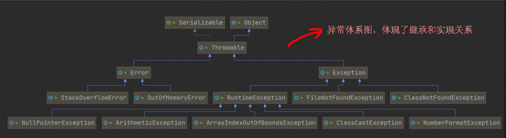
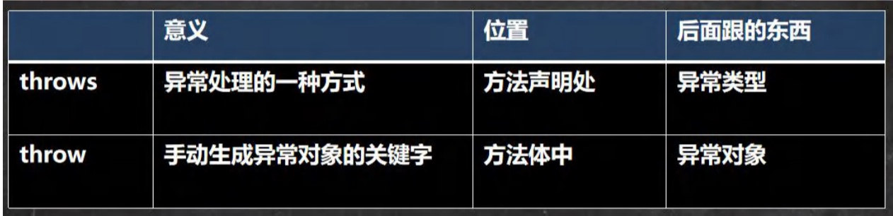
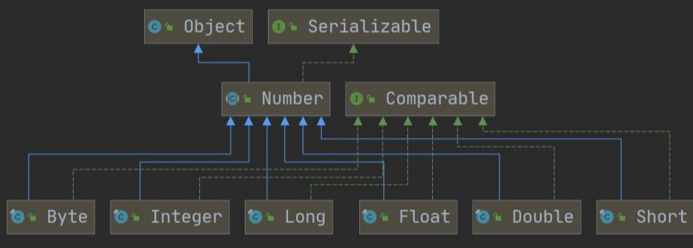
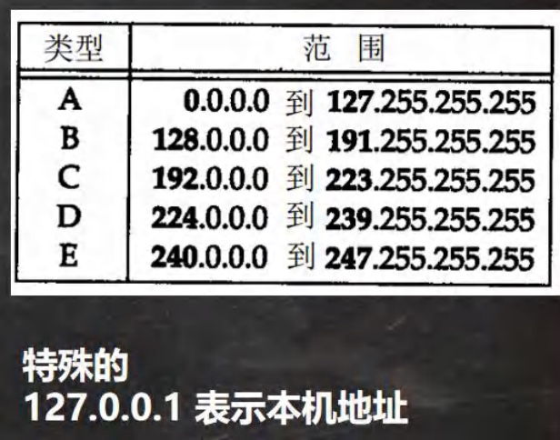

# Java核心笔记


[TOC]

# 0.导论

## 标柱注释：

- **单独重点加粗**
- <u>单独背诵下划线</u>
- ⭐️重点
- ⭐️⭐️重点的重点

## 学习方法：

- 需求——>知识点——>基本原理语法——>快速入门(基本程序)——>技术细节

# 1 java概述

## 1.1转义字符

- \t  一个制表位，实现对齐功能
- \n  换行
- \\\  一个\
- \\"  一个" 
- \r  回车

## 1.2注释

- 单行注释:  //注释文字

- 多行注释:  /\*注释文字\*/

- 文档注释:  

  ```java
  /**
  * @author
  * @version
  */
  ```


## 1.3代码规范⭐️

- 类、方法的注释，要以 javadoc 的方式来写
- 注释详细，着重告述读者为什么这样写，如何修改，注意什么问题等
- 使用tab、shift + tab
- 运算符和 = 两边习惯性各加一个空格
- 源文件使用utf-8编码
- 行宽度不要超过80字符
- 代码编写次行风格和行尾风格

## 1.4  JDK  JRE⭐️

- JDK(java开发工具包)
- JDK = JRE + java开发工具
- JRE = JVM + Java的核心类库
- JVM(java虚拟机)

# 2 变量

## 2.1 变量

- #### 基本介绍

  变量相当于内存中一个数据存储空间的表示，你可以把变量看做是一个房间的门牌号，通过门牌号我们可以找到房间，而通过变量名可以访问到变量(值)

  ```java
  int age = 20;
  double score = 88;
  char gender = '男'；
  String name = "jack";
  ```

- #### 注意事项和细节：

  1. 变量表示内存中的一个存储区域[不同的变量，类型不同，占用的空间大小不同]
  2. 该区域有自己的名称[变量名]和类型[数据类型]
  3. 变量必须先声明，后使用，即有顺序
  4. 该区域的数据可以在同一类型范围内不断变化
  5. **变量在同一个作用域内不能重名**
  6. 变量=变量名＋值+数据类型

## 2.2 基本数据类型⭐️


### 2.2.1 数值型

- #### 整数类型  (byte [1]  short[2]  int[4]  long [8])

  1. Java的整型常量(具体值)**默认为 int 型**，声明long型常量须后加‘l’或‘L’
  2. java程序中变量常声明为int型，除非不足以表示大数，才使用long
  3. bit: 计算机中的最小存储单位，byte:t算机中基本存储单元，1byte = 8 bit

- #### 浮点(小数)类型 (float [4]  double [8])

  1. 浮点数=符号位+指数位+尾数位
  2. 尾部可能丢失，造成精度损失
  3. Java 的浮点型常量(具体值)默认为double型，声明float型常量，须后加'f'或'F'
  4. 十进制数形式：5.12    512.0f    .512(必须有小数点)
     科学计数法形式：5.12e2    5.12E-2 
  5. **通常情况默认使用double**

- #### 字符型(Char[2])

  1. 使用单引号表示
  2. Java中还允许使用转义字符来将其后的字符转变为特殊字符型常量
  3. char的**本质是一个整数**，输出时是unicode码对应字符
  4. char类可以进行运算

- #### 布尔型(boolean[1])

  1. boolean类型数据只允许取值true和false，无null
  2. boolean类型占1个字节
  3. **不可以用0或非0的整数代替false和true，与C语言不同**

## 2.3 基本数据类型转化

### 2.3.1 自动类型转换

- #### 基本介绍：

  java程序在进行赋值或者运算时，精度小的类型自动转换为精度大的数据类型

  ```java
  int = 'c';
  double d = 80
  ```

- #### 转换规则：

  **<u>char<int<long<float<double</u>**

  <u>**byte<short<int<long<float<double**</u>

- #### 注意事项和细节

1. 有多种类型的数据混合运算时，系统首先自动将所有数据转换成容量最大的那种数据类型，再进行计算
2. 我们把精度(容量)大的数据类型赋值给精度(容量)小 的数据类型时，就会报错，反之就会进行自动类型转换。
3. **byte    short    char    之间不会相互转换**
4. **byte    short    char    计算是首先转换为int类型**
5. boolean不参与转换
6. 自动提升原则：表达式结果的类型自动提升为操作数中最大的类型

### 2.3.2 强制类型转换

- #### 基本介绍：

  自动类型转换的逆过程，将容量大的数据类型转换为容量小的数据类型。使用时要加上强制转换符()，但可能造成精度降低或溢出，格外要注意

  ```java
  int i = (int)8.8;
  System.out.println(i);
  ```

- #### 注意事项和细节

1. 当数据从精度  大——＞小，就需要使用到强制转换

2. 强转符号只针对于最近的操作数有效，往往会使用小括号提升优先级

   ```java
   int y = int(10*3.5+6*1.5)
   ```

3. char类型可以保存 int的常量值，但不能保存int的变量值，需要强转

   ```java
   int m = 100;
   char c2 = m;//false
   char c3 = (char)m;//ture
   ```

4. **byte    short    char    类型在进行运算时，当做int类型处理**

## 2.4 基本数据类型和String类型转换

- #### 基本类型转String类型

  语法：将基本类型的值  +” “

  ```java
  int n1 = 1
  float n2 = 1.1f;
  double n3 = 3.4;
  boolean b1 = true;
  String s1 = n1 + "";
  String s2 = n2 + "";
  String s3 = n3 + "";
  String s4 = b1 + "";
  ```

- #### String类型转基本数据类型

  语法：通过基本类型的包装类调用parseXX方法

  ```java
  String s5 = "123";
  int num1 = InterInt.parseInt(s5);
  int num2 = InterInt.parseDouble(s5);
  int num3 = InterInt.parseFloat(s5);
  ```

# 3 运算符

## 3.1 算数运算符

- #### 基本介绍：

  算术运算符是对数值类型的变量进行运算的


### 3.1.1+号使用

1. 当左右两边都是数值型时，则做加法运算

2. 当左右两边有一方为**字符串，则做拼接运算**

   ```java
   System.out，println(100 + 98): //198
   System.out.println("100" + 98);//10098
   System.out.println(100 + 3 +"hello");//103hello
   System.out.println("hello"+ 100 +3);//hello1003
   ```

### 3.1.2 ++号使用

- 前＋＋和后＋+都完全等价子 i=i+1;作为表达式使用

  前++：++先自增后赋值

  后++：i++先赋值后自增

### 3.1.3 %号使用

- a % b 当a是小数时，公式 = a - (int)a / b * b

## 3.2 关系运算符

- 关系运算符的结果都是 boolean 型


## 3.3 逻辑运算符

- #### 基本介绍：

  用于连接多个条件(多个关系表达式)，结果是boolean


### 3.3.1  &&和&基本规则

- #### && 短路与:

  如果第一个条件为 false ，后面的条件不再判断

- #### & 逻辑与:

  如果第一个条件为 false ，后面的条件仍然判断

### 3.3.2  ||和|基本规则

- #### || 短路或:

  如果第一个条件为 true，则第二个条件不会判断，结果为true

- #### |  逻辑或:

  不管第一个条件是否为true，第二个条件都要判断

### 3.3.3  ^逻辑异或

- 当a和b不同时，则结果为true，否则为false

## 3.4 赋值运算符

- #### 基本介绍：

  赋值运算符就是将某个运算后的值，赋给指定的变量

- #### 注意事项和细节：

  1. 运算顺序从右往左

  2. 赋值运算符的左边只能是变量，右边可以是变量、表达式、常量值

  3. 复合赋值： a  x=  b  等于  a  =  a  x  b

  4. **复合赋值运算符会进行类型转换**

     ```java
     byte b = 3;
     b += 2;  //等价于 b = (byte)(b + 2)
     b++;  //等价于 b = (byte)(b + 1)
     ```

## 3.5 三元运算符

- #### 基本语法：

  ```java
条件表达式？表达式1：表达式2;
  
  int a = 10;
  int b = 99;
  int result = a>b ? a++:b--;
  ```

- #### 运算规则：

  1. 如果条件表达式为true，运算后的结果是表达式1;
  2. 如果条件表达式为false，运算后的结果是表达式2;

- #### 注意事项和细节：

  1. 表达式1和表达式2要为可以赋给接收变量的类型(或可以自动转换)<!--三元运算符是一个整体，精度保持一致-->

     ```java
     int c = a > b ? int(1.1) : int(3.4);  
     ```

  2. 三元运算符可以转成  if--else语句

## 3.5 运算符优先级

- #### 优先级：

  1. ()  {} , 等
  2. 单目运算符 ++ --
  3. 算术运算符
  4. 位移运算符
  5. 比较运算符
  6. 逻辑运算符
  7. 三元运算符
  8. 赋值运算符


## 3.6 标识符的命名规则和规范

- #### 规则：

  1. 由26个英文字母大小写，0~9，或＄组成
  2. 数字不可开头
  3. 不司以使用关键字和保留宇，但能包含关键字和保留字
  4. Java中严格区分大小写，长度无限制
  5. 标识符不能包含空格

- #### 规范：

  1. 包名：多单词组成时所有字母都小写：aaa.bbb.ccc
  2. 类名、接口名：多单词组成时，所有单词的首字母大写：XxxYyyZzz
  3. 变量名、方法名：多单词组成时，第一个单词首字母小写，第二个单河开始每个单词首字母大写：xxxYyyzzz
  4. 常量名：所有字母都大写，多单词时每个单词用下划线连接：XXX_YYY_ZZZ

## 3.7 关键字、保留字

- #### 关键字基本介绍：

  被Java语言赋子了特殊含义，用做专门用途的字符串(单词)

  特点：关键字中所有字母都为小写


- #### 保留字基本介绍：

  现有Java版本尚未使用，但以后版本可能会作为关键字使用。自己命名标识符时要避免使用这些保留宇

  byValue、cast、future、 generic、 inner、 operator、outer、rest、var、goto、const

## 3.8 键盘输入

- #### 基本介绍：

  在编程中，需要接收用户输入的数据，就可以使用键盘输入语句来获取
  lnput.java，需要一个扫描器(对象)，就是 Scanner

- #### 步骤：

  1. 导入该类的包，java.util.*

  2. 创建该类的对象(声明变量)

  3. 调用里面的功能

     ```java
     import java.util.Scanner;
     public class hello {
         public static void main(String []args) {
             Scanner myScanner = new Scanner(System.in);//System.in 代表使用键盘输入
             System.out.println("请输入名字");
             String name = myScanner.next();
             System.out.println("请输入年龄");
             int age = myScanner.nextInt();
             System.out.println("名字="+name+ "\t" +"年龄="+age);
         }
     }
     ```

## 3.9 进制⭐️

- 二进制：0.1，满2进1，以0b或0B开头
- 十进制：0-9，满10进1
- 八进制：0-7，满8进1，以数字0开头表示
- 十六进制：0-9及A(10)-F(15)，满16进1.以Ox或0x开头表示，此处的A-F不区分大小写

### 3.9.1 其他转十进制

- 从最低位开始，将每个位上的数提取出来，乘以(几进制)的(位数-1)次方

  例：0b01011 = 1 * 2^(1-1) + 1 * 2^(2-1) + 0 * 2^(3-1) + 1 * 2^(4-1) = 1 + 2 + 0 + 8 =11

### 3.9.2 十进制转其他

- 将该数不断除(几进制)，直到商为0，每步余数倒写

### 3.9.3 二进制转八/十六

- 从低位开始，每三位一组，转成对应八进制
- 从低位开始，每四位一组，转成对应十六进制

### 3.9.4 八/十六进制转二

- 将八进制的每一位，转成对应的一个三位的二进制数
- 将十六进制的每一位，转成对应的一个四位的二进制数

## 3.10 原码  反码 补码⭐️⭐️

- #### 运算规则：

  1. 二进制的最高位是符号位：**0表示正数，1表示负数**
  2. **正数的原码，反码，补码都一样(三码合一)**
  3. **负数的反码=它的原码符号位不变，其它位取反**
  4. **负数的补码=它的反码＋1，负数的反码=负数的补码- 1**
  5. 0的反码，补码都是0
  6. java中的数都是有符号的
  7. 计算机运算的时候，都是以补码的方式来运算的
  8. 看运算结果的时候，要看他的原码

## 3.11 位运算符⭐️

- #### 位运算符

  - 按位与  &
  - 按位或  | 
  - 按位异或  ^  
  - 按位取反  ~ 
  - 算数右移  <<  低位溢出，符号位不变，并用符号位补溢出的高位(本质/2)
  - 算数左移  >>  符号位不变，低位补0(本质*2)
  - 逻辑右移  >>>  低位溢出，高位补0

- #### 位运算过程：

  1. 用原码得到补码
  2. 用补码进行相关逻辑运算
  3. 运算完毕将补码转换成原码


# 4 控制结构

## 4.1顺序

- #### 基本介绍：

  程序从上到下逐行地执行，中间没有任何判断和跳转

- #### 注意事项和细节：

  Java中定义成员变量时采用合法的前向引用(先定义再引用)

  ```java
  int num1 = 12;
  int num2 = num1 + 2;
  ```

## 4.2 分支控制(if  else  switch)

### 4.2.1 单分支

- #### 基本语法：

  ```java
  if(条件表达式){
    执行代码块;
  }
  ```

- #### 注意事项和细节：

  1. 当条件表达式为ture 时，就会执行{}的代码。如果为false，就不执行
  1. 如果{}中只有一条语句，则可以不用{}，建议写上{}
### 4.2.2 双分支

- #### 基本语法：

  ```java
  if(条件表达式){
    执行代码块;
  }else{
    执行代码块2;
  }
  ```

- #### 注意事项和细节：

  1. 当条件表达式成立，即执行代码块1，否则执行代码块2
  1. 如果执行代码块有一条语句，则{}可以省略，否则，不能省略
### 4.2.3 多分支

- #### 基本语法：

  ```java
  if(条件表达式){
    执行代码块;
  }else if(条件表达式2){
    执行代码块2;
  }
  ...
  else{
    执行代码块n;
  }
  ```

- #### 注意事项和细节：

  1. 当条件表达式1成立时，即执行代码块1
  2. 如果表达式1不成立，才去判断表达式2是否成立
  3. 如果表达式2成立，就执行代码块2
  4. 以此类推，如果所有的表达式都不成立则执行else的代码块
  5. 多分支可以没有else

### 4.2.4 嵌套分支

- #### 基本介绍：

  在一个分支结构中又完整的嵌套了另个完整的分支结构，里面的分支的结构称为内层分支外面的分支结构称为外层分支

- #### 基本语法：

  ```java
  if(){
    if(){
      //if-else
    }else{
      //if-else
    }
  }
  ```

### 4.2.5 switch分支结构

- #### 基本语法

  ```java
  switch(表达式){
      case 常量1:
        语句块1;
        break;
      
      case 常量2:
        语句块2;
        break;
      
      default:
        语句块;
        break;
  }
  ```

- #### 说明：

  1. switch 关键字，表示swtich分支
  2. 表达式对应一个值
  3. case 常量1:当表达式的值等于常量1，就执行语句块1
  4. break ：表示退出swtich
  5. 如果和 case 常量1匹配，就执行语句块1，如果没有匹配，就继续匹配 case 常量2
  6. **如果一个都没有匹配上，执行default**

- #### 注意事项和细节：

  1. 表达式数据类型，应和case 后的常量类型一致，或者是可以自动转成可以相互比较的类型，比如输入的是字符，而常量是 int
  2. **switch(表达式)中表达式的返回值必须是：(byte,short.int,char,enum,String)**
  3. case子句中的值必须是常量,而不能是变量
  4. **default子句是可选的，当没有匹配的case时，执行default**
  5. break语句跳出switch语句块，如果没有break，程序会执行到结尾

## 4.3 循环控制(for  while  do while)⭐️

### 4.3.1  for循环控制

- #### 基本语法：

  ```java
  for(循环变量初始化;循环条件;循环变量迭代){
    循环操作语句;
  }
  ```

- #### 说明：

  1. 四要素：(1)循环变量初始化(2)循环条件(3)循环操作(4)循环变量迭代
  2. 循环操作，这里可以有多条语句，也就是我们要循环执行的代码
  3. 如果 循环操作(语句) 只有一条语句，可以省路{}，建议不要省略

- #### 注意事项和细节：

  1. 循环条件是返回一个布尔值的表达式
  2. **for(;循环判断条件;)中的初始化和变量迭代可以写到其它地方，但是两边的分号不能省略**
  3. 循环初始值可以有多条初始化语句，但要求类型一样，井且中间用逗号隔开
  4. 循环变量迭代也司以有名条变量迭代语句，中间用逗号隔开

### 4.3.2  while循环控制

- #### 基本语法

  ```java
  循环变量初始化;
  while(循环条件){
    循环体;
    循环变量迭代;
  }
  ```

- #### 说明：

  1. 四要素：(1)循环变量初始化(2)循环条件(3)循环操作(4)循环变量迭代
  2. 四要素位置不同

- #### 注意事项和细节：

  1. 循环条件是返回一个布尔值的表达式
  2. while循环是先判断在执行语句

### 4.3.3  do while循环控制

- #### 基本语法

  ```java
  循环变量初始化;
  do{
    循环体;
    循环变量迭代;
  }while(循环条件);
  ```

- #### 说明：

  1. 四要素：(1)循环变量初始化(2)循环条件(3)循环操作(4)循环变量迭代
  2. 四要素位置不同
  3. 先执行在判断，至少执行一次
  4. 最后有一个;

- #### 注意事项和细节：

  1. 循环条件是返回一个布尔值的表达式
  2. **先执行在判断，至少执行一次**

### 4.3.4 多重循环控制

- #### 介绍：

  1. 将一个循环放在另一个循环体内，就形成了嵌套循环。其中，for,while,do.while均可以作为外层循环和内层循环
  2. 嵌套循环就是把内层循环当成外层循环的循环体。当只有内层循环的循环条件为false时，才会完全跳出内层盾环，才可结束外层的当次循环，开始下一次的循环
  3. 设外层循环次数为m次，内层为n次，则内层循环体实际上需要执行m*n次

## 4.4 跳转控制break

- #### 基本介绍：

  break语句用于终止某个语句块的执行，一般使用在switch或者循环[for,while,do while]
  
- #### 注意事项和细节：

  1.  break语句出现在多层嵌套的语句块中时，可以通过标签指明要终止的是哪一层语句块
  
  2. 标签的基本使用
  
     ```java
     label1:{......
       label2:{
       	break label1;
       }  
     }
     ```

## 4.5 跳转控制continue

- #### 基本介绍：

  - continue语句用于结束本次循环，继续执行下一次循环

  - continue语句出现在多层嵌套的福环语句体中时，可以通过标签指明要跳过的是哪一层循环

- #### 注意事项和细节：

  1.  continue语句出现在多层嵌套的语句块中时，可以通过标签指明要终止的是哪一层语句块

  2. 标签的基本使用

     ```java
     label1:{......
       label2:{
       	continue label1;
       }  
     }
     ```

## 4.6 跳转控制return

- #### 基本介绍：

  return使用在方法，表示跳出所在的方法

# 5 数组、排序、查找

## 5.1 数组⭐️

### 5.1.1 使用方式

#### 1-动态初始化

- #### 语法：

  数据类型 数组名 [] = new 数据类型[大小]

```java
int[] a = new int[5];//创建一个数字名字为a，存放了五个int
```

- #### 数组的引用：

  数组名[下标/索引]，下标从0开始

#### 2-动态初始化

- #### 先声明数组：

  数据类型 数组名[]；也可以 数据类型[] 数组名；

  例：int a[];或者int[] a;

- #### 再创建数组：

  数组名 = new 数据类型[大小];

  例：a = new int [10];

#### 3-静态初始化

- #### 语法：

  数据类型 数组名[] = {元素值，元素值......}

- #### 注意事项和细节


1. 数组是多个相同类型数据的组合
2. 数组中的元素可以是任何数据类型，包括基本类型和引用类型，但是不能混用
3. 数组创建后如果没有赋值，有默认值:
   int0,short 0, byte 0, long 0, float 0.0,double 0.0
   char \u0000,boolean false, String null
4. 使用数组的步骤 1. 声明数组并开辟空间 2给数组各个元素赋值 3 使用数组
5. 数组的下标是从0开始的
6. 数组下标必须在指定范围内使用，否则报：下标越界异常
7. 数组属引用类型，数组型数据是对象(object)

### 5.1.2 数组赋值机制

- 数组在默认情況下是引用传递，赋的值是地址

  ```java
  int arr1 = {1,2,3};
  int arr2 = arr1;
  arr2[0] = 10;  //arr1[0]=10
  ```

  

### 5.1.3 数组拷贝

- ```java
  int[] arr1 = {1,2,3};
  int[] arr2 = new int[arr1.length];
  for (int i = 0;i < arr1.length;i++){
    arr2[i] = arr1[i];
  }
  ```

  

### 5.1.4 数组反转

- #### 规律反转

  ```java
  public class ArrayReverse01 {
      public static void main(String[] args) {
          int[] arr = {11,22,33,44,55,66};
          int temp = 0,len = arr.length;
          for (int i = 0;i < len/2;i++){
              temp = arr[len-1-i];
              arr[len-1-i] = arr[i];
              arr[i] = temp;
          }
          for(int i = 0;i < arr.length;i++){
              System.out.print(arr[i]+"\t");
          }
      }
  }
  ```

- #### 逆序赋值

  ```java
  public class ArrayReverse02 {
      public static void main(String[] args) {
          int[] arr1 = {11,22,33,44,55,66};
          int[] arr2 = new int[arr1.length];
          int len = arr1.length;
          for(int i = len-1;i >= 0;i--){
              arr2[len-i-1] = arr1[i];
          }
          arr1 = arr2;//arr1指向arr2数据空间，此时arr原来的数据空间没有变量引用，会被当作垃圾销毁
          for(int i = 0;i < arr1.length;i++) {
              System.out.print(arr1[i] + "\t");
          }
      }
  }
  ```

### 5.1.6 数组添加

- #### 静态添加

  ```java
  public class ArrayAdd01 {
      public static void main(String[] args) {
          int[] arr = {1,2,3};
          int[] arr2 = new int[arr.length+1];
          for (int i = 0;i < arr.length;i++){
              arr2[i] = arr[i];
          }
          arr2[arr2.length-1] = 4;
          arr = arr2;
          for(int i = 0;i < arr.length;i++) {
              System.out.print(arr[i] + "\t");
          }
      }
  }
  ```

- #### 动态添加

  ```java
  import java.util.Scanner;
  
  public class ArrayAdd02 {
      public static void main(String[] args) {
          Scanner myScanner = new Scanner(System.in);
          double[] arr = {1,2,3};
          do{
              double[] arr2 = new double[arr.length+1];
              for (int i = 0;i < arr.length;i++) {
                  arr2[i] = arr[i];
              }
              System.out.println("请输入添加的元素");
              double addNum = myScanner.nextInt();
              arr2[arr2.length-1] = addNum;
              arr = arr2;
              for(int i = 0;i < arr.length;i++) {
                  System.out.print(arr[i] + "\t");
              }
              System.out.println("是否继续添加 y/n");
              char key = myScanner.next().charAt(0);
              if(key == 'n'){
                  break;
              }
          }while (true);
      }
  }
  
  ```

- #### 动态删减

  ```java
  import java.util.Scanner;
  
  public class ArrayReduce01 {
      public static void main(String[] args) {
          Scanner myScanner = new Scanner(System.in);
          int[] arr = {1,2,3,4,5};
          while (true){
              int[] arr2 = new int[arr.length-1];
              for (int i = 0;i < arr2.length;i++){
                  arr2[i] = arr[i];
              }
              arr = arr2;
              for(int i = 0;i < arr.length;i++) {
                  System.out.print(arr[i] + "\t");
              }
              System.out.println("请输入是否删除最后一个数字 yes/no");
              char key = myScanner.next().charAt(0);
              if(key == 'n'){
                  break;
              }
          }
      }
  }
  ```

## 5.2 二维数组

- #### 基本介绍：

  一维数组构成了二维数组

- #### 二维数组遍历

  ```java
  public class TwoDimensionalArrary {
      public static void main(String[] args) {
          int[][] arr = {{1,2,3},{4,5,6},{7,8,9}};
          for (int i = 0;i < arr.length;i++){
              for (int j = 0;j < arr[i].length;j++){
                  System.out.print(arr[i][j]+"\t");
              }System.out.println();
          }
      }
  }
  ```

- #### 二维数组内存图

  

- #### 注意事项和细节：

  1. 二维数组元素个数：arr.length
  2. 取出一维元素需要遍历两次
  3. 访问第(i+1)个一维数组的第(j+1)个值  arr [i] [j]

### 5.2.1 使用方式

#### 1-动态初始化

- #### 语法：

  类型 数组名[] [] = new 类型 [大小] [大小]

  ```java
  public class TwoDimensionalArrary02 {
      public static void main(String[] args) {
          int arr[][] = new int[2][3];
          arr[1][1] = 8;
          for(int i = 0;i < arr.length;i++){
              for(int j = 0;j < arr[i].length;j++){
                  System.out.print(arr[i][j]+" ");
              }
              System.out.println();
          }
      }
  }
  ```

#### 2-动态初始化2

- #### 先声明数组：

  数据类型 数组名[] [];

  例：int a[] [];

- #### 再创建数组：

  数组名 = new 数据类型[大小] [大小];

  例：a = new int [2] [3];

#### 3-动态初始化-列数不确定

- ```java
  public class TwoDimensionalArrary03 {
      public static void main(String[] args) {
          int[][] arr = new int[3][];//创建二维数组，只确定一维数组的个数，一维数组开没有开数据空间
          for(int i = 0;i < arr.length;i++){
              arr[i] = new int[i+1];//给一维数组开空间
              for (int j = 0; j < arr[i].length;j++){
                  arr[i][j] = i+1;//给每一个一维数组元素赋值
              }
          }
          for(int i = 0;i < arr.length;i++){
              for (int j = 0; j < arr[i].length;j++){
                  System.out.print(arr[i][j]+" ");
              }
              System.out.println(" ");
          }
      }
  }
  //输出结果：1 22 333
  ```

#### 4-静态初始化

- #### 语法：

  类型 数组名[] [] = {{值1,值2},{值1,值2},{值1,值2}}

- #### 注意事项和细节：


1. 一维数组声明方式：int [] x 或者 int x []
2. 二维数组声明方式：int [] [] y 或者 int[] y [] 或者 int y [] []
3. 二维数组实际上是由多个一维数组组成的，**它的各个一维数组的长度可以相同，也可以不相同**

## 5.3 排序(基础)

### 5.3.1 排序分类

1. 想需要处理的所有数据都加载到内部存储器中进行排序。包括(交换式排序法、选择式排序法和插入式排序法)
2. 数据量过大，无法全部加载到内存中，需要借助外部存储进行排序。包括(合并排序法和直接合并排序法)

### 5.3.2 冒泡排序

- #### 定义：

  冒泡排序 (Bubble Sorting)的基本思想是：通过对待排序序列从后向前(从下标较大的元素开始)，依次比较相邻元素的值，若发现逆序则交换，使值较大的元素逐渐从前移向后部，就象水底下的气泡一样逐渐向上冒

- #### 冒泡排序特点

  1. 一共有n个元素
  2. 一共进行了n-1轮排序，可以看成是外层循
  3. 每1轮排序可以确定一个数的位置，比如第1轮排序确定最大数,第2轮排序，确定第2大的数位置，依次类推
  4. 当进行比较时，如果前面的数大于后面的数，就交换

- ```java
  public class BubbleSort {
      public static void main(String[] args) {
          int temp = 0;
          int[] arr = {24,69,80,57,13,321,34,56,7,-4};
          for (int i = 0;i < arr.length-1;i++){
              for(int j = 0;j < arr.length-1-i;j++){
                  if(arr[j] > arr[j + 1]){
                      temp = arr[j];
                      arr[j] = arr[j+1];
                      arr[j+1] = temp;
                  }
              }
          }
          System.out.println("==排序结果==");
          for(int i = 0;i < arr.length;i++) {
              System.out.print(arr[i] + "\t");
          }
      }
  }
  ```

## 5.4 查找(基础)

### 5.4.1 顺序查找

- ```java
  import java.util.Scanner;
  
  public class SeqSearch {
      public static void main(String[] args) {
          String[] names = {"白眉鹰王","金毛狮王","紫衫龙王","青翼蝠王"};
          Scanner myScanner = new Scanner(System.in);
          System.out.println("请输入名字");
          String findName = myScanner.next();
  
          int index = -1;
          for(int i = 0;i < names.length;i++){
              if(findName.equals(names[i])){
                  System.out.println("恭喜找到"+findName);
                  System.out.println("序号为"+(i+1));
                  index = 1;
                  break;
              }
          }
          if(index == -1){
              System.out.println("sorry,没有找到"+findName);
          }
      }
  }
  ```

### 5.4.2 二分查找

# 6 面向对象(基础)

## 6.1 类与对象

- #### 基本介绍：

  - 类是抽象的，概念的，代表一类事物,比如人类, 猫类…即它是数据类型
  - 对象是具体的，实际的，代表一个具体事物，即是实例
  - 类是对象的模板，对象是类的一个个体，对应一个实例

- #### 对象存在形式⭐️

  

### 6.1.1属性/成员变量

- #### 基本介绍：

  - 从概念或叫法上看：**成员变量 = 属性 =field(字段)**
  
  - 属性是类的一个组成部分，一般是基本数据类型,也可是引用类型(对象，数组)，比如定义猫类 的 int age 就是属性

- #### 注意事项和细节：

  1. 属性的定义语法同变量，示例：访问修饰符 属性类型 属性名

  2. 访问修饰符：控制属性和访问范围，有四种访问修饰符 public,proctected,defaul,private

  3. 属性的定义类型可以为任意类型，包含基本类型或引用类型

  4. **属性如果不赋值，有默认值，规则和数组一致:**

     int0,short 0, byte 0, long 0, float 0.0,double 0.0
     char \u0000,boolean false, String null

### 6.1.2如何创建对象

- #### 先声明在创建

  ```java
  Cat cat;
  cat = new Cat();
  ```

- #### 直接创建

  ```java
  Cat = new Cat();
  ```

- #### 对象创建流程分析⭐️⭐️

  1. 加载Person类信息(就是Person.class 且只加载一次)

  2. 在堆中分配空间(地址)

  3. **完成对象初始化**

     **(3.1默认初始化 age = 0 name =null  **

     **3.2显示初始化 age = 90 name = null **

     **3.3构造器初始化 age = 20 name = 小倩)**

  4. 在对象在堆中的地址返回给P(P是对象名，是对象的引用)

  

### 6.1.3对象分配机制

- ```java
  Person p1 = new Person();
  p1.age = 10;
  p1.name = "小明";
  Person p2 = p1//把p1赋给了p2，或让p2指向p1
  System.out.println(p2.age);
  ```

  

- #### Java内存结构分析：

  1. 栈：一般存放基本数据类型(局部变量)
  2. 堆：存放对象(Cat cat，数组等)
  3. 方法区：常量池(常量，比如字符串)，类加载信息

- #### Java创建对象流程

  1. 先加载Person类信息(属性和方法信息，只会加载一次)

  2. 在堆中分配空间，进行默认初始化(看规则)

  3. 把地址赋给 p，p就指向对象

  4. 行指定初始化，比如 p.name =" jack"  p.age = 10

     ```java
     Person p = new Person();
     p.name = "jack";
     p.age = 10;
     ```

## 6.2 成员方法⭐️

- #### 方法定义：

  1. 访问修饰符 返回数据类型 方法名(形参列表)  {//方法体

     ​            语句;

     ​            return 返回值;

     }

     1. 形参列表：表示成员方法输入 callint n)
     2. 数据类型(返回类型)：表示成员方法输出，void 表示没有返回值
     3. 方法主体：表示为了实现某一功能代码块
     4. return 语句不是必须的

### 6.2.1 调用方法：

1. public 表示方法是公开

2. void：表示方法没有返回值

3. speak() ：speak是方法名，()形参列表

4. {}方法体，可以写我们要执行的代码

5. System.out.println(”我是一个好人”)；表示我们的方法就是输出一句话

6. p1.speak()为调用

   ```java
   public class Method01 {
       public static void main(String[] args) {
           Person p1 = new Person();
           p1.speak();
           p1.cal01();
           p1.cal02(10);
           int returnRes = p1.getSum(1,2);
           System.out.println(returnRes);
       }
   }
   
   class Person{
       String name;
       int age;
   
       public void speak(){
           System.out.println("你是一个呆猪");
       }
       public void cal01(){
           int res = 0;
           for (int i = 1;i <= 1000;i++){
               res += i;
           }
           System.out.println(res);
       }
       public void cal02(int n){
           int res = 0;
           for (int i = 1;i <= n;i++){
               res += i;
           }
           System.out.println(res);
       }
       public int getSum(int num1,int num2){
           int res = num1 + num2;
           return res;
       }
   }
   ```

### 6.2.2 调用的内存机制：

- #### 调用的内存机制：

1. public 表示方法是公开的

2. int :表示方法执行后，返回一个 int 值

3. getsum 方法名

4. (int num1， int num2) 形参列表，2个形参，可以接收用户传入的两个数

5. return res；表示把res 的值，返回

   ```java
   public int getSum(int num1,int num2){
           int res = num1 + num2;
           return res;
   ```

   

### 6.2.3 注意事项和细节

  - #### 访问修饰符：

    1. 作用是控制方法使用的适用范围，若果不写则默认访问

  - #### 返回类型：

    1. 一个方法最多有一个返回值
    2. 返回类型可以为任意类型，包含基本类型或引用类型(数组，对象)
    3. **方法要求有返回数据类型，则方法体中最后的执行语句必须为 return 值;要求返回值类型必须和return的值类型一致或兼容**
    4. 如果方法是void，则方法体中可以没有return语句，或者 只写 return

  - #### 方法名：

    1. 方法名遵循驼峰法则

  - #### 参数列表：

    1. 一个方法可以有0个参数，也可以有多个参数，中间用逗号隔开，比如 getSum(int n1,int n2)

    2. 参数类型可以为任意类型，包含基本类型或引用类型，比如 printArr(intlIl map)

    3. 调用参数的方法时，一定对应着参数列表传入相同类型或莱容类型 的参数

    4. 方法定义时的参数称为形式参数，简称形参；方法调用时的参数称为实际参数，简称实参，实参和形参的类型要一致或兼容、个数、顺序必须一致

  - #### 方法体：

    1. 里面写完成功能的具体的语句，可以为输入、输出、变量、运算、分支、循环、方法调用
    1. 里面不能再定义方法！即：**方法不能嵌套定义**

  - ####  方法调用细节：

    1. 同一个类中的方法调用：直接调用即可
    2. 跨类中的方法A类调用B类方法：需要通过对象名调用
    3. 跨类的方法调用和方法的访问修饰符相关

## 6.3 成员方传法参机制⭐️⭐️

### 6.3.1 基本数据类型的传参数机制

- 传递的是值(拷贝)，形参的认何改变不影响实参

  

### 6.3.2 引用数据类型的传参数机制

- 引用类型传递的是地址(传递也是值，但是值是地址)，可以通过形参影响实参

  

  

## 6.4 递归

- #### 基本介绍：

  递归就是方法自己调用自己,每次调用时传入不同的变量

- #### 递归调用内存机制

- ```java
  public class Recursion01 {
      public static void main(String[] args) {
          T t1 = new T();
          t1.test(5);
          int res = t1.factorial(5);
          System.out.println("res = "+ res);
  
      }
  }
  
  class  T{
      public void test(int n){
          if(n > 2){
              test(n - 1);
          }
          System.out.println(n);
      }
  
      public int factorial(int n){
          if(n == 1){
              return 1;
          }else {
              return factorial(n - 1)*n;
          }
      }
  }
  ```

  

- #### 注意事项和细节：

  1. 执行一个方法时，就创建一个新的受保护的独立空间(栈空间)
  2. **方法的局部变量是独立的，不会相互影响，比如n变量**
  3. **如果方法中使用的是引用类型变量(比如数组、对象)，就会共享该引用类型的数据**
  4. 递归必须向退出递归的条件逼近，否则就是无限递归
  5. 当一个方法执行完毕，或者遇到return，就会返回，遵守谁调用，将结果返回给谁，同时当方法执行完毕或者返回时，该方法也就执行完毕，栈空间回收

## 6.5 方法重载 (overload)

- #### 基本介绍：

  java中允许同一个类中，多个同名方法的存在，但要求**形参列表不一致**

- #### 注意事项和细节

  1. 方法名：必须相同
  2. 形参列表：必须不同(参数类型、个数、顺序)
  3. 返回类型：无要求

## 6.6 可变参数

- #### 基本概念：

  java允许将同一个类中多个同名同功能**但参数个数不同**的方法，封装成一个方法，通过可变参数实现

- #### 基本语法：

  ```java
  访问修饰符 返回类型 方法名(**数据类型...** 形参名){}
  ```

- #### 注意事项和细节：

  1. 可变参数的实参可以为0个或任意多个
  2. 可变参数的实参可以为数组
  3. 可变参数的本质就是数组
  4. 可变参数可以和普通类型的参数一起放在形参列表，但必须保证可变参数在最后
  5. 一个形参列表中只能出现一个可变参数

## 6.7 变量作用域⭐️

- #### 全局变量和局部变量：

  1. 主要的变量就是属性(成员变量)和局部变量
  2. 局部变量一般是指在成员方法中定义的变量
  3. 全局变量：也就是属性，作用域为整个类体
  4. 局部变量：也就是除了属性之外的其他变量，作用域为定义它的代码块中
  5. 全局变量(属性)可以不赋值，直接使用，因为有默认值，局部变量必须赋值后，才能使用，因为没有默认值

- #### 注意事项和细节：

  1. 全局变量和局部变量可以重名，访问时遵循就近原则
  2. 在同一个作用域中，两个局部变量，不能重名
  3. 全局变量生命周期长，伴随着对象的创建而创建，伴随着对象的销毁而销毁
  4. 局部变量生命周期短，伴随着它的代码块的执行而创建，伴随着代码块的结束而结束：即在一次方法调用过程中
  5. 作用域范围不同
     全局变量/属性：可以被本类使用，或其他类使用(通过对象调用)
     局部变量：只能在本类中对应的方法中使用
  6. 修饰符不同
     全局变量/属性可以加修饰符
     局部变量不可以加修饰符

- #### 两种调用方式

  ```java
  public class VarScopeDetail {
      public static void main(String[] args) {
          E e1 = new E();
          e1.test();
  
          Per p1 = new Per();
          e1.test2(p1);
      }
  }
  
  class E{
      public void test(){
          Per p1 = new Per();
          System.out.println(p1.name);
      }
      public void test2(Per p){//接收一个类
          System.out.println(p.name);
      }
  }
  
  class Per{
      String name = "jack";
  }
  ```

## 6.8 构造器⭐️

- #### 基本介绍：

  构造方法又叫构造器(constructor)，是类的一种特殊的方法，它的主要作用是完成对**新对象的初始化**

- #### 基本语法：

  ```java
  [修饰符] 方法名 (行参列表){
    方法体;
  }
  ```

- #### 注意事项和细节：

  1. 修饰符可以默认
  
  2. 一个类可以定义多个不同的构造器，即构造器重载
  
  3. 构造器名和类名要相同
  
  4. 构造器没有返回值
  
  5. 构造器是完成对象的初始化，井不是创建对象
  
  6. 在创建对象时,系统自动的调用该类的构造方法
  
  7. **如果没有定义构造器，系统会自动给类生成一个默认无参构造器(默认构造器)**
  
  8. **定义了自己的构造器,默认的构造器就覆盖了，就不能再使用默认的无参构造器，除非显式的定义一下**
  
     ```java
     public class Constructor01 {
         public static void main(String[] args) {
             Pers p1 = new Pers();
             Pers p2 = new Pers("jack",80);
             System.out.println(p1.name+p1.age);
             System.out.println(p2.name+p2.age);
         }
     }
     
     class Pers{
         String name;
         int age;
     
         public Pers(){
             System.out.println("构造器1被调用");
             age = 18;
         }
         public Pers(String pName,int pAge){
             System.out.println("构造器2被调用");
             name = pName;
             age = pAge;
         }
     }
     ```

## 6.9  this

- #### 基本介绍：

  java虚拟机会给每个对象分配this，代表当前对象

- #### 内存分析：

  

- #### 注意事项和细节：

  1. this关键字可以用来访问本类的属性、方法、构造器
  2. this用于区分当前类的属性和局部变量
  3. 访问成员方法的语法：this.方法名(参数列表);
  4. **访问构造器语法：this(参数列表)：注意只能在构造器中使用(在构造器中访问另外一个构造器，必须放在第一条语句)**
  5. this不能在类定义的外部使用，只能在类定义的方法中使用

  ```java
  public class ThisExercise01 {
      public static void main(String[] args) {
          person p1 = new person("marry",20);
          person p2 = new person("marry",20);
          System.out.println(p1.compareTo(p2));
      }
  }
  
  class person{
      String name;
      int age;
  
      public person(String name,int age){
          this.name = name;
          this.age = age;
      }
  
      public boolean compareTo(person p){
          return this.name.equals(p.name) && this.age == p.age;
      }
  }
  ```

# 7 面向对象(中级)

## 7.0  IDEA

- #### 常用快捷键：

  1. command + d  删除当前行
  2. command + option + 向下光标  向下复制当前行
  3. option + /  补全代码
  4. command + /  注释
  5. option + enter  导入该行的类
  6. command + option + L  格式化代码
  7. control + R  运行
  8. optio + A  构造器
  9. control + H 查看继承关系
  10. command + B  定位方法
  11. .var  自动变量名
  12. Command + option + T 环绕方式

- #### 常用模版快捷键

  1. fori  遍历
  2. itar  遍历数组
  3. iter  增强遍历
  4. sout  打印换行

## 7.1 包

- #### 基本语法：

  Package 包名

- #### 包的命名：

  - 只能包含数字、字母、下划线、小圆点，但不能用数字开头，不能是关键字或保留字

- #### 命名规范：

  - 小写字母＋小圆点一般是  com.公司名.项目名.业务模块名

- #### 引入包：

  1. import java.uti Scanner；就只是引入一个类Scanner
  2. import java.util*：1/ 表示将java.util 包所有都引入

- #### 注意事项和细节：

  1. package 的作用是声明当前类所在的包，需要放在类的最上面，一个类中最多只有一个package
  2. import指令 位置放在package的下面，在类定义前面,可以有多句目没有顺序要求

## 7.2 访问修饰符

- #### 基本介绍：

  java提供四种访问控制修饰符号，用于控制方法和属性(成员变量)的访问权限(范围)

- #### 访问权限⭐️⭐️：

  1. 公开级别：用public修饰,对外公开

  2. 受保护级别：用protected修饰，对子类和同一个包中的类公开

  3. 默认级别：没有修饰符号，向同一个包的类公开

  4. 私有级别：用private修饰,只有类本身可以访问，不对外公开

     | 访问级别 | 访问修饰符 | 同类 | 同包 | 子类 | 不同包 |
     | -------- | ---------- | ---- | ---- | ---- | ------ |
     | 公开     | public     | ✅    | ✅    | ✅    | ✅      |
     | 受保护   | protected  | ✅    | ✅    | ✅    | ❌      |
     | 默认     | 无         | ✅    | ✅    | ❌    | ❌      |
     | 私有     | private    | ✅    | ❌    | ❌    | ❌      |
  
- #### 注意事项和细节：

  1. 修饰符可以用来修饰类中的属性，成员方法以及类
  2. **只有默认的和public才能修饰类**，并目遵循上述访问权限的特点
  3. 子类待定
  4. 成员方法的访问规则和属性完全样

## 7.3 封装⭐️

- #### 基本介绍：

  封装(encapsulation)就是把抽象出的数据[属性]和对数据的操作方法封装在一起数据被保护在内部，程序的其它部分只有通过被授权的操作（方法），才能对数据进行操作

- #### 封装步骤：

  1. 将属性进行私有化private【不能直接修改属性】
  2. 提供一个公共的(public)set方法，用于对属性判断井赋值
     public void setxxx(类型 参数名){
         加入数据验证的业务逻辑;
             属性 = 参数名;}
  3. 提供个公共的(public)get方法，用于获取属性的值
         public 数据类型 getXxxx0{
             return XX;}

## 7.4 继承⭐️

- #### 基本介绍：

  继承可以解决代码复用，当多个类存在相同的属性(变量)和方法时,可以以这些类中抽象出交类，在父类中定义这些相同的属性和方法，所有的子类不需要重新定义这些属性和方法，只需要通过extends来声明继承父类即可

- #### 基本语法：

  ```java
class 子类 extends 父类{}
  ```

  

- #### 注意事项和细节：

  1. 子类继承了所有的属性和方法，非私有的属性和方法可以在子类直接访问，但是私有属性和方法不能在子类直接访问，要通过父类提供公共的方法去访问

  2. 子类必须调用父类的构造器，完成父类的初始化

  3. 当创建子类对象时，不管使用子类的哪个构造器，默认情况下总会去调用父类的无参构造器，如果父类没有提供无参构造器，则必须在子类的构造器中用 super 去指定使用父类的哪个构造器完成对父类的初始化工作，否则，编译不会通过

  4. 指定去调用父类的某个构造器，则显式的调用一下：super(参数列表)

  5. super在使用时，必须放在构造器第一行(super只能在构造器中使用)

  6. super()和this()都只能放在构造器第一行，因此这两个方法不能共存在一个构造器

  7. java所有类都是Object类的子类

  8. 父类构造器的调用不限于直接父类！将一直往上追潮直到Object类

  9. 子类最多只能继承一个父类(指直接继承)，即java中是单继承机制

  10. 不能滥用继承，子类和父类之间必须满足 is-a 的逻辑关系

      ```java
      public class TopBase { //父类是Object
      
          public TopBase() {
              //super(); Object的无参构造器
              System.out.println("构造器TopBase() 被调用...");//1
          }
      }
      
      ```

      ```java
      public class Base extends TopBase { //父类
          //4个属性
          public int n1 = 100;
          protected int n2 = 200;
          int n3 = 300;
          private int n4 = 400;
      
          public Base() { //无参构造器
              System.out.println("父类Base()构造器被调用....");
          }
          public Base(String name, int age) {//有参构造器
              //默认super()
              System.out.println("父类Base(String name, int age)构造器被调用....");
          }
          public Base(String name) {//有参构造器
              System.out.println("父类Base(String name)构造器被调用....");
          }
          //父类提供一个public的方法,返回了n4
          public int getN4() {
              return n4;
          }
          public void test100() {
              System.out.println("test100");
          }
          protected void test200() {
              System.out.println("test200");
          }
          void test300() {
              System.out.println("test300");
          }
          private void test400() {
              System.out.println("test400");
          }
          //call
          public void callTest400() {
              test400();
          }
      }
      ```

      ```java
      /输入ctrl + H 可以看到类的继承关系
      public class Sub extends Base { //子类
      
          public Sub(String name, int age) {
              //1. 调用父类的无参构造器, 如下或者 什么都不写,默认就是调用super()
              //super();//父类的无参构造器
              //2. 调用父类的 Base(String name) 构造器
              //super("hsp");
              //3. 调用父类的 Base(String name, int age) 构造器
              super("king", 20);
      
              //细节：super在使用时，必须放在构造器第一行
              //细节: super() 和 this() 都只能放在构造器第一行，因此这两个方法不能共存在一个构造器
              //this() 不能再使用了
              System.out.println("子类Sub(String name, int age)构造器被调用....");
          }
      
          public Sub() {//无参构造器
              //super(); //默认调用父类的无参构造器
              super("smith", 10);
              System.out.println("子类Sub()构造器被调用....");
          }
          //当创建子类对象时，不管使用子类的哪个构造器，默认情况下总会去调用父类的无参构造器
          public Sub(String name) {
              super("tom", 30);
              //do nothing...
              System.out.println("子类Sub(String name)构造器被调用....");
          }
      
          public void sayOk() {//子类方法
              //非私有的属性和方法可以在子类直接访问
              //但是私有属性和方法不能在子类直接访问
              System.out.println(n1 + " " + n2 + " " + n3);
              test100();
              test200();
              test300();
              //test400();错误
              //要通过父类提供公共的方法去访问
              System.out.println("n4=" + getN4());
              callTest400();//
          }
      }
      
      ```

- #### 继承本质：

  子对象创建完成，建立查找关系

- #### 继承内存图：

  

## 7.5 多态⭐️⭐️

### 7.5.1多态

- #### 基本介绍：

  方法或对象具有多种形态，是面向对象的第三大特征，多态是建立在封装和继承基础之上的

- #### 多态具体体现

  - 方法的多态
    1. 重写和重载就是体现多态
  - **对象的多态**
    1. 一个对象的编译类型和运行类型可以不一致
    2. 编译类型在定义对象时，就确定了，不能改变
    3. 运行类型是可以变化的
    4. **编译类型看定义时 = 号 的左边，运行类型看 = 号的 右边**

- #### 注意事项和细节：

  - 向上转型
    1. 本质：父类的引用指向了子类的对象
    2. 语法：父类类型 引用名 = new 子类类型();
    3. 特点：编译类型看左边，运行类型看右边
    4. 可以调用父类中的所有成员(需遵守访问权限)
    5. 不能调用子类特有成员
    6. 最终运行效果看子类的具体实现
    
  - 向下转型
    1. 本质：把指向子类对象的父类引用，转成子类对象的子类引用
    2. 语法：子类类型 引用名 = (子类类型) 父类引用;
    3. 只能强转父类引用，不能强转父类对象
    4. 父类的引用必须指向的是当前目标类型的对象
    5. 当向下转型后，可以调用子类类型中所有的成员
    
  - 属性
    1. 属性没有重写，属性的值看编译类型
    
    2. **instance of 比较较操作符，用于判断对象的运行类型是否为XX类型或XX类型的子类型**
    
       ```java
       public class PolyDetail {
           public static void main(String[] args) {
       
               //向上转型: 父类的引用指向了子类的对象
               //语法：父类类型引用名 = new 子类类型();
               Animal animal = new Cat();
               Object obj = new Cat();//可以吗? 可以 Object 也是 Cat的父类
       
               //向上转型调用方法的规则如下:
               //(1)可以调用父类中的所有成员(需遵守访问权限)
               //(2)但是不能调用子类的特有的成员
               //(#)因为在编译阶段，能调用哪些成员,是由编译类型来决定的
               //animal.catchMouse();错误
               //(4)最终运行效果看子类(运行类型)的具体实现, 即调用方法时，按照从子类(运行类型)开始查找方法
               //，然后调用，规则我前面我们讲的方法调用规则一致。
               animal.eat();//猫吃鱼..
               animal.run();//跑
               animal.show();//hello,你好
               animal.sleep();//睡
       
               //老师希望，可以调用Cat的 catchMouse方法
               //多态的向下转型
               //(1)语法：子类类型 引用名 =（子类类型）父类引用;
               //问一个问题? cat 的编译类型 Cat,运行类型是 Cat
               Cat cat = (Cat) animal;
               cat.catchMouse();//猫抓老鼠
               //(2)要求父类的引用必须指向的是当前目标类型的对象
               Dog dog = (Dog) animal; //可以吗？
       
               System.out.println("ok~~");
           }
       }
       ```
    
       ```java
       public class PolyDetail02 {
           public static void main(String[] args) {
               //属性没有重写之说！属性的值看编译类型
               Base base = new Sub();//向上转型
               System.out.println(base.count);// ？ 看编译类型 10
               Sub sub = new Sub();
               System.out.println(sub.count);//?  20
           }
       }
       
       class Base { //父类
           int count = 10;//属性
       }
       class Sub extends Base {//子类
           int count = 20;//属性
       }
       ```
    
       ```java
       public class PolyDetail03 {
           public static void main(String[] args) {
               BB bb = new BB();
               System.out.println(bb instanceof  BB);// true
               System.out.println(bb instanceof  AA);// true
       
               //aa 编译类型 AA, 运行类型是BB
               //BB是AA子类
               AA aa = new BB();
               System.out.println(aa instanceof AA);
               System.out.println(aa instanceof BB);
       
               Object obj = new Object();
               System.out.println(obj instanceof AA);//false
               String str = "hello";
               //System.out.println(str instanceof AA);
               System.out.println(str instanceof Object);//true
           }
       }
       
       class AA {} //父类
       class BB extends AA {}//子类
       ```

### 7.5.2 动态绑定机制⭐️⭐️

- 当调用对象方法的时候，该方法会和该对象的内存地址/**运行类型**绑定

- 当调用对象属性时，没有动态綁定机制，哪里声明，那里使用()

  ```java
  public class DynamicBinding {
      public static void main(String[] args) {
          A a = new B();
          System.out.println(a.sum());
          System.out.println(a.sum1());
      }
  }
  
  class A {
      public int i = 10;
  
      public int sum() {
          return getI() + 10;//当子类不存在sum方法时，会从父类找到sum方法，但动态绑定机制会找到子类的getI返回i值
      }
  
      public int sum1() {
          return i + 10;
      }
  
      public int getI() {
          return i;
      }
  }
  
  class B extends A {
      public int i = 20;
  
      public int sum() {
          return i + 20;
      }
  
      public int sum1() {
          return i + 10;
      }
  
      public int getI() {
          return i;
      }
  }
  ```

### 7.5.3 多态的应用

- #### 多态数组

  1. 多态数组：定义类型为父类类型，里面保存的实际元素类型为子类类型
  2. 多态参数：方法定义的形参类型为父类类型，实参类型允许为子类类型

## 7.6  Super

- #### 基本介绍：

  super代表父类的引用，用于访问父类的属性、方法、构造器

- #### 基本语法：

  1. 访问父类的属性，但不能访问父类的private属性
     super.属性名;
  2. 访问父类的方法，不能访问父类的private方法
     super.方法名(参数列表);
  3. 访问父类的构造器(只能放在构造器的第一句，只能出现一句)
     super(参数列表);

- #### 注意事项和细节：

  1. 调用父类的构造器的好处 (分工明确，父类属性由父类初始化，子类的属性由子类初始化)
  2. 当子类中有和父类中的成员(属性和方法) 重名时，为了访问父类的成员，必须通过super，如果没有重名，使用super、this、 直接访问效果相同
  3. super的访问不限于直接父类，如果爷爷类和本类中有同名的成员，也可以使用super去访问爷爷类的成员；如果多个基类(上级类)中都有同名的成员，使用super访问遵循就近原则

- #### super和this

  

- #### 实例：

  ```java
  public class Base { //父类是Object
  
      public int n1 = 999;
      public int age = 111;
      public void cal() {
          System.out.println("Base类的cal() 方法...");
      }
      public void eat() {
          System.out.println("Base类的eat().....");
      }
  }
  ```

  ```java
  public class A extends Base{
      //4个属性
      //public int n1 = 100;
      protected int n2 = 200;
      int n3 = 300;
      private int n4 = 400;
  
      public A() {}
      public A(String name) {}
      public A(String name, int age) {}
  
  //    public void cal() {
  //        System.out.println("A类的cal() 方法...");
  //    }
  
      public void test100() {
      }
  
      protected void test200() {
      }
  
      void test300() {
      }
  
      private void test400() {
      }
  }
  ```

  ```java
  public class B extends A {
  
      public int n1 = 888;
  
      //编写测试方法
      public void test() {
          //super的访问不限于直接父类，如果爷爷类和本类中有同名的成员，也可以使用super去访问爷爷类的成员；
          // 如果多个基类(上级类)中都有同名的成员，使用super访问遵循就近原则。A->B->C
  
          System.out.println("super.n1=" + super.n1);
          super.cal();
      }
  
      //访问父类的属性 , 但不能访问父类的private属性 [案例]super.属性名
      public void hi() {
          System.out.println(super.n1 + " " + super.n2 + " " + super.n3 );
      }
      public void cal() {
          System.out.println("B类的cal() 方法...");
      }
      public void sum() {
          System.out.println("B类的sum()");
          //希望调用父类-A 的cal方法
          //这时，因为子类B没有cal方法，因此我可以使用下面三种方式
  
          //找cal方法时(cal() 和 this.cal())，顺序是:
          // (1)先找本类，如果有，则调用
          // (2)如果没有，则找父类(如果有，并可以调用，则调用)
          // (3)如果父类没有，则继续找父类的父类,整个规则，就是一样的,直到 Object类
          // 提示：如果查找方法的过程中，找到了，但是不能访问， 则报错, cannot access
          //      如果查找方法的过程中，没有找到，则提示方法不存在
          //cal();
          this.cal(); //等价 cal
  
          //找cal方法(super.call()) 的顺序是直接查找父类，其他的规则一样
          //super.cal();
  
          //演示访问属性的规则
          //n1 和 this.n1 查找的规则是
          //(1) 先找本类，如果有，则调用
          //(2) 如果没有，则找父类(如果有，并可以调用，则调用)
          //(3) 如果父类没有，则继续找父类的父类,整个规则，就是一样的,直到 Object类
          // 提示：如果查找属性的过程中，找到了，但是不能访问， 则报错, cannot access
          //      如果查找属性的过程中，没有找到，则提示属性不存在
          System.out.println(n1);
          System.out.println(this.n1);
  
          //找n1 (super.n1) 的顺序是直接查找父类属性，其他的规则一样
          System.out.println(super.n1);
  
      }
      //访问父类的方法，不能访问父类的private方法 super.方法名(参数列表);
      public void ok() {
          super.test100();
          super.test200();
          super.test300();
          //super.test400();//不能访问父类private方法
      }
      //访问父类的构造器(这点前面用过)：super(参数列表);只能放在构造器的第一句，只能出现一句！
      public  B() {
          //super();
          //super("jack", 10);
          super("jack");
      }
  }
  ```

## 7.7方法重写(overwrite)

- #### 基本介绍：

  子类的方法和父类方法一致，那么子类的方法覆盖了父类的方法

- #### 注意事项和细节：

  1. 子类的方法的形参列表,方法名称，要和父类方法的形参列表,方法名称完全一样
  2. 子类方法的返回类型和父类方法返回类型一样，或者是父类返回类型的子类
  3. 子类方法大于等于父类方法的访问权限

## 7.8  Object类

- #### ==

  1. 既可以判断基本类型，又可以判断引用类型

  2. 如果判断基本类型，判断的是值是否相等

  3. 如果判断引用类型，判断的是地址是否相等，即判定是不是同一个对象

     ```java
     public class Equals01 {
         public static void main(String[] args) {
             A a = new A();
             A b = a;
             A c = b;
             System.out.println(a == c);
             B bObj = a;
             System.out.println(bObj == c);
         }
     }
     
     class A extends B{}
     class B{}
     ```

- #### equals

  1. equals:是Object类中的方法，只能判断引用类型
  2. 默认判断的是地址是否相等，子类中往往重写该方法，用于判断**内容**是否相等

- #### hashCode

  1. 提高具有哈希结构的容器的效率
  2. 两个引用，如果指向的是同一个对象，则哈希值肯定是一样的
  3. 两个引用，如果指向的是不同对象，则哈希值是不一样的
  4. 哈希值主要根据地址号来的，不能完全将哈希值等价子地址
  5. 后面在集合中hashCode 如果需要的话，也会重写

- #### toString

  1. 默认返回：全类名＋@+哈希值的十六进制
  2. 子类往往重写to String方法，用于返回对象的属性信息
  3. 重写toString方法，打印对象或拼接对象时，都会自动调用该对象的toString形式
  4. 当直接输出一个对象时，toString 方法会被默认的调用

- #### finalize

  1. 当对象被回收时，系统自动调用该对象的finalize方法。子类可以重写该方法，做一些释放资源的操作
  2. 什么时候被回收：当某个对象没有任何引用时，则jvm就认为这个对象是一个垃圾对象，就会使用垃圾回收机制来销毁该对象，在销毁该对象前，会先调用finalize方法
  3. 垃圾回收机制的调用，是由系统来決定(即有自己的GC算法)，也可以通过System.gc() 主动触发垃圾回收机制

## 7.9断点调试

- #### 基本介绍：

  断点调试是指在程序的某一行设置一个断点，调试时，程序运行到这一行就会停住，然后你可以一步一步往下调试，调试过程中可以看各个变量当前的值，出错的话，调试到出错的代码行即显示错误，停下。进行分析从而找到这个Bug

- #### 注意事项和细节：

  1. 在断点调试 过程中，是运行状态，是以对象的运行类型来执行的
  2. F7：跳入方法内
  3. F8：逐行执行代码
     shift+F8:跳出方法
  4. F9：resume，执行到下一个断点

# 8 面向对象(高级)

## 8.1类变量和类方法⭐️

### 8.1.1类变量

- #### 基本介绍：

  类变量也叫静态变量/静态属性，是该类的所有对象共享的变量,任何一个该类的对象去访问它时,取到的都是相同的值,同样任何一个该类的对象去修改它时,修改的也是同一个变量

- #### 基本语法：

  ```java
  访问修饰符 static 数据类型 变量名;
  static 访问修饰符 数据类型 变量名;
  ```

- #### 如何访问类变量：

  1. 类名.类变量名
  2. 对象名.类变量名
  3. 静态变量的访问修饰符的访问权限和范围和普通属性是一样的

- #### 内存布局：

  

- #### 注意事项和细节：

  1. 需要让某个类的所有对象都共享一个变量时，就可以考虑使用类变量(静态变量)
  2. 类变量是该类的所有对象共享的，而实例变量是每个对象独享的
  3. 加上static称为类变量或静态变量，否则称为实例变量/普通变量/非静态变量
  4. 类变量可以通过 类名.类变量名 或者 对象名.类变量名 来访问
  5. 实例变量不能通过 类名.类变量名 方式访问
  6. 类变量是在类加载时就初始化
  7. 类变量的生命周期是随类的加载开始，随着类消亡而销毁

### 8.1.2类方法

- #### 基本介绍：

  类方法也叫静态方法

- #### 基本语法：

  ```java
  访问修饰符 static 数据返回类型 方法名(){};
  static 访问修饰符 数据返回类型 方法名(){};
  ```

- #### 类方法调用：

  1. 类名.类方法名
  2. 对象名.类方法名
  3.  满足访问修饰符的访向权限和范围

- #### 使用场景：

  1. 当方法中不涉及到任何和对象相关的成员，则可以将方法设计成静态方法,提高开发效率
  2. 程序员实际开发，往往会将一些通用的方法，设计成静态方法，这样我们不需要创建对象就可以使用

- #### 注意事项和细节：

  1. 类方法和普通方法都是随着类的加载而加载，将结构信息存储在方法区：
     类方法中无this的参数，普通方法中隐含着this的参数
  2. 类方法可以通过类名调用，也可以通过对象名调用
  3. 音通方法和对象有关，需要通过对象名调用，比如对象名.方法名(参数)，不能通过类名调用
  4. 类方法中不允许使用和对象有关的关键字，比如this和super
  5. **静态方法，只能访问静态的成员，非静态的方法，可以访问静态成员和非静态成员**

## 8.2  main方法

- #### 深入理解main方法：

  1. java虛拟机需要调用类的main0方法，所以该方法的访问权限化须是public
  2. java虚拟机在执行main0方法时不必创建对象，所以该方法心须是static
  3. 该方法接收String类型的数组参数，该数组中保存执行java命令时传递给所运行的类的参数
  4. java 执行的程序 参数1 参数2 参数3


- #### 注意事项和细节：

  1. 在main()方法中，我们可以直接调用main方法所在类的静态方法或静态属性
  2. 但是，不能直接访问该类中的非静态成员，必须创建该类的一个实例对象后，才能通过这个对象去访问类中的目静态成员

## 8.3代码块

- #### 基本介绍：

  代码化块又称为初始化块,属于类中的成员，类似于方法，将逻辑语句封装在方法体中，通过{}包围起来。但和方法不同，没有方法名，没有返回，没有参数，只有方法体，而且不用通过对象或类显式调用，而是加载类时，或创建对象时隐式调用

- #### 基本语法：

  ```java
  [修饰符]{
    代码;
  }
  ```

- #### 注释：

  1. 修饰符 可选，要写的话，也只能写 static
  2. 代码块分为两类，使用static 修饰的叫静态代码块，没有static修饰的，叫普通代码块
  3. 逻辑语句可以为任何逻辑语句
  4. ：号可以写上，也可以省略

- #### 注意事项和细节：

  1. static代码块是类加载时执行，且只会执行一次
  2. 普通代码块是在创建对象的调用的，创建一次，调用一次
  3. 类什么时候被加载⭐️⭐️：
     - 创建对象实例时
     - 创建子类对象实例时，父类也会被加载
     - 使用类的静态成员时
  4. 创建一个**对象**时，在一个类的调用**顺序**：
     - 调用静态代码块和静态属性初始化(注意：静态代码块和静态属性初始化调用的优先级样，如果有多个静态代码块和多个静
       态变量初始化，则按他们定义的顺序调
     - 调用普通代码块和普通属性的初始化(注意：普通代码块和普通属性初始化调用的优先级一样，若果有多个普通代码块和stat多个普通属性初始化，则按定义顺序调用)
     - 调用构造器
  5. 构造方法(构造器)的最前面其实隐含了 super()和调用普通代码块
  6. **创建子类时顺序**⭐️⭐️：
     - 父类的静态代码块和静态属性(优先级一样，按定义顺序执行)
     - 子类的静态代码块和静态属性(优先级一样，按定义顺序执行)
     - 父类的普通代码块和普通属性初始化(优先级一样，按定义顺序执行)
     - 父类构造方法
     - 子类的普通代码块和普通属性初始化(优先级一样，按定义顺序执行)
     - 子类构造方法
  7. 静态代码块只能直接调用静态成员(静态属性和静态方法)，普通代码块可以调用任意成员

## 8.4单例设计模式

- #### 基本介绍：

  就是采取一定的方法保证在整个的软件系统中，对某个类只能存在一个对象实例，并且该类只提供一个取得其对象实例的方法

  单例模式有两种方式：1. 饿汉式  2.懒汉式

- #### 饿汉式：

  1. 构造器私有化

  2. 类的内部创建静态对象

  3. 向外暴露一个静态公共方法

  4. 特点：在类加载的时候就创建对象实例，可能存在资源浪费

     ```java
     class GirlFriend{
         private String name;
     
         private static GirlFriend gf = new GirlFriend("小花");
     
         private GirlFriend(String name) {
             this.name = name;
         }
     
         public static GirlFriend Instance() {
             return gf;
         }
     }
     ```

- #### 懒汉式：

  1. 构造器私有化

  2. 定义一个static静态属性对象

  3. 提供一个public的static方法，返回一个对象

  4. 只有当使用(3)的方法时，才返回对象，再次调用时，返回上次创建的对象

  5. 特点：线程安全问题

     ```java
     class Cat{
         private String name;
         private static Cat cat;
     
         private Cat(String name) {
             this.name = name;
         }
     
         public static Cat getInstance(){
             if(cat == null){
                 cat = new Cat("小花");
             }
             return cat;
         }
     }
     ```

- #### 对比：

  1. 最主要的区别在于创建对象的时机不同：饿汉式是在类加载就创建了对象实例，而懒汉式是在使用时才创建
  2. 饿汉式不存在线程安全问题，徽汉式存在线程安全问题
  3. 饿汉式存在浪费姿源的可能，对象实例都没有使用，那么饿汉式创建的对象就浪费，懒汉式是使用时才创建，就不存在这个问题

## 8.5  final

- #### 基本介绍：

  - final可以修饰类、属性、方法、局部变量

  - final 类，类不能被继承

  - final 方法，子类无法重写方法

  - final 属性，属性无法被修改

  - final 局部变量，局部变量无法被修改

- #### 注意事项和细节：

  1. final修饰的属性又叫常量，一般用XX_XX_XX 来命名
  2. final**修饰的属性在定义时**,必须赋初值,并且以后不能再修改，赋值可以在如下位置：
     **定义时、构造器、代码块**
  3. final修饰的属性是静态的，则初始化的位置只能是 定义时、静态代码块
  4. final类不能继承，但可以实例化对象
  5. 如果类不是final类，但是含有final方法，则该方法虽然不能重写，但是可以被继承
  6. 如果一个类已经是final类了，就没有必要再将方法修饰成final方法
  7. final不能修饰构造器本身
  8. final 和static 往往搭配使用，效率更高，不会导致类加载-底层编译器做了优化处理
  9. 包装类(Integer, Double,Float,Boolean等都是final)，String也是final类

## 8.6抽象类

- #### 基本介绍：

  - 用abstract 关键字来修饰一个类时,这个类就叫抽象类

  - 用abstract 关键字来修饰一个方法时,这个方法就是抽象方法，没有方法体

  - 抽象类的价值更多作用是在于设计，是设计者设计好后，让子类继承并实现抽象类

- #### 注意事项和细节：

  1. 抽象类不能被实例化
  2. 抽象类不一定要包含abstract方法。也就是说,抽象类可以没有abstract方法
  3. 一旦类包含了abstract方法,则这个类必须声明为abstract
  4. abstract 只能修饰类和方法
  5. 抽象类可以有任意成员，抽象类本质还是类
  6. 抽象方法不能有主体
  7. 如果一个类继承了抽象类，则它必须实现抽象类的所有的抽象方法，除非它自己也声明为abstract类
  8. 抽象方法不能使用private、final 和static来修饰，因为这些关键字都是和重写相违背的

- #### 抽象类模版设计模式

  1. 编写方法cal()，可以计算某段代码的耗时时间
  2. 编写抽象方法job()
  3. 编写一个子类A,继承抽象类Template，井实现job方法
  4. 编写一个测试类TestTemplate,看看是否好用

  ```java
  public class TextTemplate {
      public static void main(String[] args) {
          A a = new A();
          a.cal();
  
          B b = new B();
          b.cal();
      }
  }
  
  abstract public class Template {
  
      public abstract void job();
  
      public void cal() {
              long start = System.currentTimeMillis();
              job();
              long end = System.currentTimeMillis();
              System.out.println("时间" + (end - start));
      }
  }
  
  
  class A extends Template{
  
      public void job() {
          long num = 0;
          for (long i = 0; i <= 10000000; i++) {
              num += i;
          }
      }
  }
  
  class B extends Template{
  
      public void job() {
          long num = 0;
          for (long i = 0; i <= 10000000; i++) {
              num *= i;
          }
      }
  }
  ```

## 8.7接口⭐️

- #### 基本介绍：

  接口就是给出一些没有实现的方法,封装到一起,到某个类要使用的时候,再根据具体情况把这些方法写出来

- #### 基本语法：

  ```java
  interface 接口名{
    //属性
    //方法
  }
  
  class 类名 implements 接口 {
    自己属性;
    自己方法;
    //必须实现接口的抽象方法
  }
  ```

  1. Jdk7.0前 接口里的所有方法都没有方法体(只能**抽象方法**)
  2. Jdk8.0后接口类可以有**静态方法，defaut实现方法**，也就是说接口中可以有方法的具体实现

- #### 注意事项和细节：

  1. 接口不能被实例化
  2. 接口中所有的方法是 public 和 abstrac 方法，接口中抽象方法，可以不用 abstract 修饰
  3. 普通类实现接口，就必须将该接口的所有方法实现
  4. **抽象类实现接口，可以不用实现接口的方法**
  5. 一个类同时可以实现多个接口
  6. 接口中的属性,只能是 final 的，而且是 public static final 修饰符
  7. 接口中属性的访问形式：接口名.属性名
  8. 一个接口不能继承其它的类,但是可以继承多个别的接口
  9. 接口的修饰符 只能是 public 和默认，这点和类的修饰符是一样的

- #### 实现接口VS继承类：

  1. 继承的价值主要在于：解决代码的复用性和可维护性
  2. 接口的价值主要在于：设计，设计好各种规范(方法)，让其它类去实现这些方法
  3. 接口比继承更加灵活，继承是满足 is -a的关系，而接口只需满足 like-a的关系
  4. 接口在一定程度上实现代码解耦

- #### 接口类型数组：

  ```java
  public class InterfacePolyArr {
      public static void main(String[] args) {
  
          //多态数组 -> 接口类型数组
          Usb[] usbs = new Usb[2];
          usbs[0] = new Phone_();
          usbs[1] = new Camera_();
          /*
          给Usb数组中，存放 Phone 和 相机对象，Phone类还有一个特有的方法call（），
          请遍历Usb数组，如果是Phone对象，除了调用Usb 接口定义的方法外，
          还需要调用Phone 特有方法 call
           */
          for(int i = 0; i < usbs.length; i++) {
              usbs[i].work();//动态绑定..
              //和前面一样，我们仍然需要进行类型的向下转型
              if(usbs[i] instanceof Phone_) {//判断他的运行类型是 Phone_
                  ((Phone_) usbs[i]).call();
              }
          }
      }
  }
  
  interface Usb{
      void work();
  }
  class Phone_ implements Usb {
      public void call() {
          System.out.println("手机可以打电话...");
      }
  
      @Override
      public void work() {
          System.out.println("手机工作中...");
      }
  }
  class Camera_ implements Usb {
  
      @Override
      public void work() {
          System.out.println("相机工作中...");
      }
  }
  
  ```

## 8.8内部类⭐️

- #### 基本介绍：

  - 一个类的内部又完整的嵌套了另一个类结构，被嵌套的类称为内部类(inner class)，嵌套其他类的类称为外部类(outer class)
  - 内部类最大的特点就是可以直接访问私有属性，井且可以体现类与类之间的包含关系

- #### 基本语法：

  ```java
  class Outer{//外部类
    class Inner{//内部类
      
    }
  }
  class Other{//外部其他类
    
  }
  ```

- #### 内部类分类：

  1. 定义在外部类局部位置上：1局部类内部(有类名) 2.匿名局部类(没有类名⭐️)
  2. 定义在外部类的成员位置上：1.成员内部类(无static修饰) 2.静态内部类(static修饰)

### 8.8.1局部内部类

- #### 基本介绍：

  局部内部类是定义在外部类的局部位置，在方法中、代码块中，并且有类名

- #### 注意事项和细节：

  1. 可以直接访问外部类的所有成员，包含私有的
  
  2. 不能添加访问修饰符,但是可以使用final修饰
  
  3. 作用域：仅仅在定义它的方法或代码块中
  
  4. 内部类访问外部类：直接访问
  
  5. 外部类访问内部类：创建对象再访问
  
  6. 外部其他类访问局部内部类：不能访问
  
  7. 如果外部类和局部内部类的成员重名时，默认遵循就近原则，如果访问外部类的成员使用"外部类名.this.成员"去访问
  
     ```java
     public class LocalInnerClass {//
     
         public static void main(String[] args) {
             //演示一遍
             Outer02 outer02 = new Outer02();
             outer02.m1();
             System.out.println("outer02的hashcode=" + outer02);
         }
     }
     
     
     class Outer02 {//外部类
         private int n1 = 100;
     
         private void m2() {
             System.out.println("Outer02 m2()");
         }//私有方法
     
         public void m1() {//方法
             //1.局部内部类是定义在外部类的局部位置,通常在方法
             //3.不能添加访问修饰符,但是可以使用final 修饰
             //4.作用域 : 仅仅在定义它的方法或代码块中
             final class Inner02 {//局部内部类(本质仍然是一个类)
                 //2.可以直接访问外部类的所有成员，包含私有的
                 private int n1 = 800;
     
                 public void f1() {
                     //5. 局部内部类可以直接访问外部类的成员，比如下面 外部类n1 和 m2()
                     //7. 如果外部类和局部内部类的成员重名时，默认遵循就近原则，如果想访问外部类的成员，
                     //   使用 外部类名.this.成员)去访问
                     //    Outer02.this 本质就是外部类的对象, 即哪个对象调用了m1, Outer02.this就是哪个对象
                     System.out.println("n1=" + n1 + " 外部类的n1=" + Outer02.this.n1);
                     System.out.println("Outer02.this hashcode=" + Outer02.this);
                     m2();
                 }
             }
             //6. 外部类在方法中，可以创建Inner02对象，然后调用方法即可
             Inner02 inner02 = new Inner02();
             inner02.f1();
         }
     }
     ```

### 8.8.2匿名内部类⭐️⭐️

- #### 基本介绍：

  匿名内部类是定义在外部类的局部位置，比如方法中，并目没有类名，同时还是一个对象

- #### 基本语法：

  ```java
  new 类或接口(参数列表){
    类体;
  };
  ```

- #### 底层：

  1. 本质： **IA tiger** = class Xxxx$1      class Xxxx$1 = **new IA** 
  2. 接口的底层：class Xxxx$1 **implement** IA{@Overide}
  3. 本质： **Father father** = class Xxxx$2      class Xxxx$2 = **new Father** 
  4. 类的底层：class Xxxx$2 **extends** Father{@Overide}

- #### 注意事项和细节：

  1. 匿名内部类既是一个类的定义同时本身也是一个对象,因此从语法上看，它既有定义类的特征，也有创建对象的特征

  2. 可以直接访问外部类的所有成员，包含私有的

  3. 不能添加访问修饰符,因为它的地位就是一个局部变量

  4. 作用域：仅仅在定义它的方法或代码块中

  5. 匿名内部类方位外部类成员：直接访问

  6. 外部其他类访问匿名内部类：不能访问

  7. 如果外部类和匿名内部类的成员重名时，匿名内部类访问的话，默认遵循就近原则，如果想访问外部类的成员，则可以使用 (外部类名.this.成员)去访问

     ```java
     public class AnonymousInnerClass {
         public static void main(String[] args) {
             Outer04 outer04 = new Outer04();
             outer04.method();
         }
     }
     
     class Outer04 { //外部类
         private int n1 = 10;//属性
         public void method() {//方法
             //基于接口的匿名内部类
             //
             //1.需求： 想使用IA接口,并创建对象
             //2.传统方式，是写一个类，实现该接口，并创建对象
             //3.需求是 Tiger/Dog 类只是使用一次，后面再不使用
             //4. 可以使用匿名内部类来简化开发
             //5. tiger的编译类型 ? IA
             //6. tiger的运行类型 ? 就是匿名内部类  Outer04$1
             /*
                 我们看底层 会分配 类名 Outer04$1
                 class Outer04$1 implements IA {
                     @Override
                     public void cry() {
                         System.out.println("老虎叫唤...");
                     }
                 }
              */
             //7. jdk底层在创建匿名内部类 Outer04$1,立即马上就创建了 Outer04$1实例，并且把地址
             //   返回给 tiger
             //8. 匿名内部类使用一次，就不能再使用
             IA tiger = new IA() {
                 @Override
                 public void cry() {
                     System.out.println("老虎叫唤...");
                 }
             };
             System.out.println("tiger的运行类型=" + tiger.getClass());
             tiger.cry();
     
     //        IA tiger = new Tiger();
     //        tiger.cry();
     
             //演示基于类的匿名内部类
             //分析
             //1. father编译类型 Father
             //2. father运行类型 Outer04$2
             //3. 底层会创建匿名内部类
             /*
                 class Outer04$2 extends Father{
                     @Override
                     public void test() {
                         System.out.println("匿名内部类重写了test方法");
                     }
                 }
              */
             //4. 同时也直接返回了 匿名内部类 Outer04$2的对象
             //5. 注意("jack") 参数列表会传递给 构造器
             Father father = new Father("jack"){
     
                 @Override
                 public void test() {
                     System.out.println("匿名内部类重写了test方法");
                 }
             };
             System.out.println("father对象的运行类型=" + father.getClass());//Outer04$2
             father.test();
     
             //基于抽象类的匿名内部类
             Animal animal = new Animal(){
                 @Override
                 void eat() {
                     System.out.println("小狗吃骨头...");
                 }
             };
             animal.eat();
         }
     }
     
     interface IA {//接口
         public void cry();
     }
     //class Tiger implements IA {
     //
     //    @Override
     //    public void cry() {
     //        System.out.println("老虎叫唤...");
     //    }
     //}
     //class Dog implements  IA{
     //    @Override
     //    public void cry() {
     //        System.out.println("小狗汪汪...");
     //    }
     //}
     
     class Father {//类
         public Father(String name) {//构造器
             System.out.println("接收到name=" + name);
         }
         public void test() {//方法
         }
     }
     
     abstract class Animal { //抽象类
         abstract void eat();
     }
     ```
     
     ```java
     public class LocalInnerClassDetail {
         public static void main(String[] args) {
             Outer03 outer03 = new Outer03();
             outer03.f1();
         }
     }
     
     class Outer03{
         private int n1 = 99;
         public void f1(){
             Person person = new Person(){
                 @Override
                 public void hi() {
                     System.out.println("匿名内部类重写hi方法");
                 }
             };
             person.hi();
     
             new Person(){
                 @Override
                 public void hi() {
                     System.out.println("匿名内部类重写ok方法");
                 }
     
                 @Override
                 public void ok(String str) {
                     super.ok(str);
                 }
             }.ok("jack");
         }
     }
     
     class Person{
         public void hi(){
             System.out.println("Person hi()");
         }
     
         public void ok(String str){
             System.out.println("Person ok()"+str);
         }
     }
     ```
     
     ```java
     public class InnerClassExercise02 {
         public static void main(String[] args) {
             CellPhone cellPhone = new CellPhone();
             cellPhone.alarmclock(new Bell(){
                 public void ring(){
                     @Override
                     System.out.println("懒猪起床");
                 }
             });
         }
     }
     
     interface Bell{
         void ring();
     }
     
     class CellPhone{
         public void alarmClock(Bell bell){
             bell.ring();
         }
     }
     ```

### 8.8.3成员内部类

- #### 基本介绍：

  成员内部类是定义在外部类的成员位置，并且没有static修饰

- #### 注意事项和细节：

  1. 可以直接访问外部类的所有成员，包含私有的

  2. 可以添加任意访问修饰符

  3. 作用域：为整个外部类类体

  4. 成员内部类访问外部类：直接访问

  5. 外部类访问成员内部类；创建对象，再访问

  6. 外部其他类访问成员内部类：

     - 外部类.内部类  引用名 = 外部对象.new 内部类();

     - 外部类.内部类  引用名 = **外部对象**.get();

       <!--需要创建外部类对象实例，get()为内部类返回对象的方法-->

  7. 如果外部类和成员内部类的成员重名时，成员内部类访问的话，默认遵循就近原则，如果想访问外部类的成员，则可以使用 (外部类名.this.成员)去访问
  
     ```java
     public class MemberInnerClass01 {
         public static void main(String[] args) {
             Outer08 outer08 = new Outer08();
             outer08.t1();
     
             //外部其他类，使用成员内部类的三种方式
             //
             // 第一种方式
             // outer08.new Inner08(); 相当于把 new Inner08()当做是outer08成员
             // 这就是一个语法，不要特别的纠结.
             Outer08.Inner08 inner08 = outer08.new Inner08();
             inner08.say();
             // 第二方式 在外部类中，编写一个方法，可以返回 Inner08对象
             Outer08.Inner08 inner08Instance = outer08.getInner08Instance();
             inner08Instance.say();
         }
     }
     
     class Outer08 { //外部类
         private int n1 = 10;
         public String name = "张三";
     
         private void hi() {
             System.out.println("hi()方法...");
         }
     
         //1.注意: 成员内部类，是定义在外部内的成员位置上
         //2.可以添加任意访问修饰符(public、protected 、默认、private),因为它的地位就是一个成员
         public class Inner08 {//成员内部类
             private double sal = 99.8;
             private int n1 = 66;
     
             public void say() {
                 //可以直接访问外部类的所有成员，包含私有的
                 //如果成员内部类的成员和外部类的成员重名，会遵守就近原则.
                 //，可以通过  外部类名.this.属性 来访问外部类的成员
                 System.out.println("n1 = " + n1 + " name = " + name + " 外部类的n1=" + Outer08.this.n1);
                 hi();
             }
         }
     
         //方法，返回一个Inner08实例
         public Inner08 getInner08Instance() {
             return new Inner08();
         }
         
         //写方法
         public void t1() {
             //使用成员内部类
             //创建成员内部类的对象，然后使用相关的方法
             Inner08 inner08 = new Inner08();
             inner08.say();
             System.out.println(inner08.sal);
         }
     }
     ```

### 8.8.4静态内部类

- #### 基本介绍：

  静态内部类是定义在外部类的成员位置，并且有static修饰

- #### 注意事项和细节：

  1. 可以直接访问外部类的所有静态成员，包含私有的，但不能直接访问非静态成员
  
  2. 可以添加任意访问修饰符
  
  3. 作用域：整个外部类类体
  
  4. 静态内部类访问外部类：直接访问
  
  5. 外部类访问静态内部类：创建对象，再访问
  
  6. 外部其他类访问静态内部类：
  
     - 外部类.内部类  引用名 = new 外部类.内部类();
  
     - 外部类.内部类  引用名 = **外部对象**.get();
  
       <!--需要创建外部类对象实例，get()为内部类返回对象的方法-->
  
     - 外部类.内部类  引用名 = **外部类**.get();
  
       <!--不需要创建外部类对象实例-->
  
  7. 如果外部类和静态内部类的成员重名时，静态内部类访问的话，默认遵循就近原则，如果想访问外部类的成员，则可以使用 (外部类名.this.成员)去访问
  
     ```java
     public class StaticInnerClass01 {
         public static void main(String[] args) {
             Outer10 outer10 = new Outer10();
             outer10.m1();
     
             //外部其他类 使用静态内部类
             //方式1
             //因为静态内部类，是可以通过类名直接访问(前提是满足访问权限)
             Outer10.Inner10 inner10 = new Outer10.Inner10();
             inner10.say();
             //方式2
             //编写一个方法，可以返回静态内部类的对象实例.
             Outer10.Inner10 inner101 = outer10.getInner10();
             System.out.println("============");
             inner101.say();
     
             Outer10.Inner10 inner10_ = Outer10.getInner10_();
             System.out.println("************");
             inner10_.say();
         }
     }
     
     class Outer10 { //外部类
         private int n1 = 10;
         private static String name = "张三";
         private static void cry() {}
         //Inner10就是静态内部类
         //1. 放在外部类的成员位置
         //2. 使用static 修饰
         //3. 可以直接访问外部类的所有静态成员，包含私有的，但不能直接访问非静态成员
         //4. 可以添加任意访问修饰符(public、protected 、默认、private),因为它的地位就是一个成员
         //5. 作用域 ：同其他的成员，为整个类体
         static class Inner10 {
             private static String name = "韩顺平教育";
             public void say() {
                 //如果外部类和静态内部类的成员重名时，静态内部类访问的时，
                 //默认遵循就近原则，如果想访问外部类的成员，则可以使用 (外部类名.成员)
                 System.out.println(name + " 外部类name= " + Outer10.name);
                 cry();
             }
         }
     
         public void m1() { //外部类---访问------>静态内部类 访问方式：创建对象，再访问
             Inner10 inner10 = new Inner10();
             inner10.say();
         }
     
         public Inner10 getInner10() {
             return new Inner10();
         }
     
         public static Inner10 getInner10_() {
             return new Inner10();
         }
     }
     ```
  

## 8.9类加载顺序⭐️⭐️

- #### 类什么时候被加载：

  - 创建对象实例时
  - 创建子类对象实例时，父类也会被加载
  - 使用类的静态成员时

- #### 创建一个对象时，在一个类的调用**顺序**：

  1. 调用静态代码块和静态属性初始化(注意：静态代码块和静态属性初始化调用的优先级样，如果有多个静态代码块和多个静

     态变量初始化，则按他们定义的顺序调

  2. 调用普通代码块和普通属性的初始化(注意：普通代码块和普通属性初始化调用的优先级一样，若果有多个普通代码块和多个普通属性初始化，则按定义顺序调用)

  3. 调用构造方法

- #### 创建子类时顺序：

  1. 父类的静态代码块和静态属性(优先级一样，按定义顺序执行)
  2. 子类的静态代码块和静态属性(优先级一样，按定义顺序执行)
  3. 父类的普通代码块和普通属性初始化(优先级一样，按定义顺序执行)
  4. 父类构造方法
  5. 子类的普通代码块和普通属性初始化(优先级一样，按定义顺序执行)
  6. 子类构造方法

# 9 枚举和注解

- #### 基本介绍：

  枚举是一组常量的集合，属于一种特殊的类，里面只包含一组有限的特定的对象

## 9.1自定义类实现枚举

- #### 实现步骤：

  1. 构造器私有化
  2. 本类内部创建一组对象
  3. 对外暴露对象(通过为对象添加public final static修饰符)
  4. 提供get方法，但是不提供set方法

- #### 注意事项和细节：

  1. 不需要提供setxxx 方法，因为枚举对象值通常为只读
  2. 枚举对象/属性使用 final + static 共同修饰，实现底层优化
  3. 枚举对象名通常使用全部大写，常量的命名规范
  4. 枚举对象根据需要，也可以有多个属性

## 9.2enum关键字实现枚举

- #### 实现步骤：

  1. 关键字 enum 代替 class

  2. 行首：常量名(实参列表)

     ```java
     enum Season {
         SPRING("春天","温暖"),WINTER("冬天","寒冷");
       
         private String name;
         private String desc;
     
         private Season(String name, String desc) {
             this.name = name;
             this.desc = desc;
         }
     ```

- #### 注意事项和细节：

  1. 使用enum 关键字开发一个枚举类时，默认会继承Enum类

  2. 传统的 public static final Season SPRING = new Season("春天”"温暖")；

     简化成 SPRING("春天”，"温暖”)，我们必须知道它调用的是哪个构造器

  3. 如果使用无参构造器 创建 枚举对象，则实参列表和小括号都可以省略

  4. 多个枚举对象，使用,间隔，最后;结尾

  5. 枚举对象必须放在枚举类行首

- #### 常用方法：

  - toString：Enum类己经重写过了，返回的是当前对象名子类可以重写该方法，用于返回对象的属性信息

  - name：返回当前对象名(常量名)，子类中不能重写

  - ordinal：返回当前对象的位置号，默认从0开始

  - values：返回当前枚举类中所有的常量

  - valueof：将字符串转换成枚举对象，要求字符串必须为已有的常量名，否则报异常

  - compareTo：比较两个枚举常量的编号，做差


  ```java
  public class EnumMethod {
      public static void main(String[] args) {
          //使用Season2 枚举类，来演示各种方法
          Season2 autumn = Season2.AUTUMN;
  
          //输出枚举对象的名字
          System.out.println(autumn.name());
          //ordinal() 输出的是该枚举对象的次序/编号，从0开始编号
          //AUTUMN 枚举对象是第三个，因此输出 2
          System.out.println(autumn.ordinal());
          //从反编译可以看出 values方法，返回 Season2[]
          //含有定义的所有枚举对象
          Season2[] values = Season2.values();
          System.out.println("===遍历取出枚举对象(增强for)====");
          for (Season2 season: values) {//增强for循环
              System.out.println(season);
          }
  
          //valueOf：将字符串转换成枚举对象，要求字符串必须为已有的常量名，否则报异常
          //执行流程
          //1. 根据你输入的 "AUTUMN" 到 Season2的枚举对象去查找
          //2. 如果找到了，就返回，如果没有找到，就报错
          Season2 autumn1 = Season2.valueOf("AUTUMN");
          System.out.println("autumn1=" + autumn1);
          System.out.println(autumn == autumn1);
  
          //compareTo：比较两个枚举常量，比较的就是编号
          //
          //1. 就是把 Season2.AUTUMN 枚举对象的编号 和 Season2.SUMMER枚举对象的编号比较
          //2. 看看结果
          /*
          public final int compareTo(E o) {
  
              return self.ordinal - other.ordinal;
          }
          Season2.AUTUMN的编号[2] - Season2.SUMMER的编号[3]
           */
          System.out.println(Season2.AUTUMN.compareTo(Season2.SUMMER));
  
          //补充了一个增强for
  //        int[] nums = {1, 2, 9};
  //        //普通的for循环
  //        System.out.println("=====普通的for=====");
  //        for (int i = 0; i < nums.length; i++) {
  //            System.out.println(nums[i]);
  //        }
  //        System.out.println("=====增强的for=====");
  //        //执行流程是 依次从nums数组中取出数据，赋给i, 如果取出完毕，则退出for
  //        for(int i : nums) {
  //            System.out.println("i=" + i);
  //        }
      }
  }
  ```

- #### 实现接口：

  1. 使用enum关键字后，就不能再继承其它类了，因为enum会隐式继承Enum，而Java是单继承机制
  2. 枚举类和普通类一样，可以实现接口：enum 类名 implements 接口1，接口2{}

## 9.3JDk内置的基本注解类型

- #### 基本介绍：

  - 注解(Annotation)也被称为元数据(Metadata)，用于修饰解释包,类、方法、属性、构造器、局部变量等数据信息

  - 和注释一样，注解不影响程序逻辑，但注解可以被编译或运行，相当于嵌入在代码中的补充信息

  - 在JavaSE中，注解的使用目的比较简单，例如标记过时的功能，忽略警告等。在JavaEE中注解占据了更重要的角色，例如用来配置应用程序的任何切面，代替java EE旧版本中所有遗留的繁冗代码和XML配置

- #### 基本Annotation介绍：

  - @Override： 限定某个方法，是重写父类方法，该注解只能用于方法
  
  - @Deprecated：用于表示某个程序元素(类，方法等)己过时
  
  - @SuppressWarnings：抑制编译器警告

### 9.3.1@Override

- #### 基本介绍：

  - @Override 表示指定重写父类的方法(从编译层面验证)，如果父类没有方法，则会报错
  
  - 如果没写 @Override 还是会重写父类
  
  - @Override 只能修饰方法，不能修饰其它类，包，属性等等
  
  - 如果写了@Override 注解，编译器就会去检查该方法是否真的重写了父类的方法，若果没有构成重写则编译错误
  
  - 查看@Override注解源码@Target(ElementType.MRTHOD)，说明只能修饰方法
  
  - @Target 是修饰注解的注解，称为元注解

### 9.3.2@Deprecated

- #### 基本介绍：

  - 用于表示某个程序元素(类，方法等)己过时
  
  - 可以修饰方法，类，字段，包，参数 等等
  
  - @Target (value=(CONSTRUCTOR,FIELD,LOCAL_ VARIABLE, METHOD,PACKAGE, PARAMETER, TYPE})
  
  - @Deprecated 的作用可以做到新旧版本的兼容和过渡

### 9.3.3@SuppressWarnings

- #### 基本介绍：

  - 抑制编译器警告信息
  
  - unchecked 是忽略没有检查的警告
  
  - rawtypes 是忽略没有指定泛型的警告
  
  - unused 是忽略没有使用某个变量的警告错误
  
  - @SuppressWarnings可以修饰的程序元素为，查看@Target
  
  - 生成@SupperssWarnings 时，不用背，直接点击左侧的黄色提示，就可以选择(注意可以指定生成的位置)

## 9.4元注解：对注解进行注解

- #### 基本介绍：

  JDK 的元 Annotation 用于修饰其他 Annotation

- #### 四种元注解：

  1. Retention：指定注解的作用范围，三种 SOURCE,CLASS,RUNTIME
  2. Target：指定注解可以在哪些地方使用
  3. Documented：指定该注解是否会在javadoc体现
  4. lnherited：子类会继承父类注解

# 10 异常

- #### 基本介绍：

  Java语言中，将程序执行中发生的不正常情况称为 “异常”

- #### 执行中异常事件分类：

  1. Error(错误)：Java虚拟机无法解决的严重问题。如：JVM系统内部错误、资源耗尽等严重情況。比如：StackoverflowError[栈溢出]和OOM(out ofmemory)，Error 是严重错误，程序会崩溃
  2. Exception：其它因编程错误或偶然的外在因素导致的一般性问题，可以使用针对性的代码进行处理。，例如空指针访问，
     试图读取不存在的文件，网络连接中断等等，Exception 分为两大类：运行时异常口和编译时异常口。

## 10.1异常体系图⭐️

- #### 异常体系图：

  

- #### 注意事项和细节：

  1. 异常分为两大类，运行时异常和编译时异常
  2. 运行时异常，编译器不要求强制处置的异常。一般是指编程时的逻辑错误，是程序员应该避免其出现的异常。java.lang.RuntimeException类及它的子类都是运行时异常
  3. 运行时异常，可以不作处理，因为这类异常很普遍，若全处理可能会对程序的可读性和运行效率产生影响
  4. 编译时异常，是编译器要求必须处置的异常

## 10.2常见的异常

- #### 运行时异常：

  - NullPointerException：空指针异常

  - ArithmeticException：数学运算异常

  - ArrayIndexOutOfBoundsException：数组下标越界异常

  - ClassCastException：类型转换异常

  - NumberFormatException：数字格式不正确异常

- #### 编译时异常：

  - SQLException：操作数据库时，查询表可能发生异常
  
  - lOException：操作文供时，发生的异常
  
  - FileNotFoundException：当操作一个不存在的文件时，发生异常
  
  - ClassNotFoundException：加载类，而该类不存在时异常
  
  - EOFException：操作文件，到文件末尾，发生异常
  
  - illegalArguementException：参数异常

## 10.3异常处理⭐️

- #### 基本介绍：

  异常处理就是当异常发生时，对异常处理的方式

### 10.3.1  try-catch-finally

- #### 基本介绍：

  程序员在代码中捕获发生的异常，自行处理

- #### 流程图：

  

- #### 注意事项和细节：

  1. 如果异常发生了，则异常发生后面的代码不会执行，直接进入到catch块
  2. 如果异常没有发生，则顺序执行try的代码块，不会进入到catch块
  3. 如果希望不管是否发生异常，都执行某段代码(比如关闭连接，释放资源等)，则使用如下代码-finally{}
  4. 可以有多个catch语句，捕获不同的异常(进行不同的业务处理)，要求父类异常在后，子类异常在前，比如(Exception 在后，NullPointer Exception 在前)，如果发生异常，只会匹配一个catch
  5. try-finally配合，相当于没有捕获异常，程序直接崩溃但执行finally

### 10.3.2  throws

- #### 基本介绍：

  将发生的异常抛出，交给调用者(方法)来处理，最顶级的处理者就是JVM，默认抛出运行异常

- #### 流程图：

  

- #### 注意事项和细节：

  1. 对于编译异常，程序中必须处理，比如try-catch 或者 throws
  2. 对于运行时异常，程序中如果没有处理，默认就是throws的方式处理
  3. 子类重写父类的方法时，对抛出异常的规定：子类重与的方法，所抛出的异常类型要么和父类抛出的异常一致，要么为父类拋出的异常的类型的子类型
  4. 在throws 过程中，如果有方法 try-catch，就相当于处理异常，就可以不必throws
  5. 在方法声明中用throws语句可以声明抛出异常的列表，throws后面的异常类型可以是方法中产生的异常类型，也可以是它的父类

## 10.4自定义异常

- #### 基本介绍：

  当程序中出现了某些 “错误〞，但该错误信息并没有在Throwable子类中描述处理，这时可以设计异常类，用于描达该错误信息

- #### 自定义异常步骤：

  1. 定义类：自定义异常类名(程序员自己写)继承Exception或Runtime Exception
  2. 如果继承Exception，属于编译异常
  3. 如果继承RuntimeException，属子运行异常(一般来说，继承RuntimeException)

## 10.5  throw和throws

- #### 对比：

  

# 11 常用类

## 11.0包装类(Integer例)

- #### 基本介绍：

  八种基本数据类型相应的引用类型——包装类

  

  

  

  

- #### 装箱和拆箱：

  ```java
  public class Integer01 {
      public static void main(String[] args) {
          //演示int <--> Integer 的装箱和拆箱
          //jdk5前是手动装箱和拆箱
          //手动装箱 int->Integer
          int n1 = 100;
          Integer integer = new Integer(n1);
          Integer integer1 = Integer.valueOf(n1);
  
          //手动拆箱
          //Integer -> int
          int i = integer.intValue();
  
          //jdk5后，就可以自动装箱和自动拆箱
          int n2 = 200;
          //自动装箱 int->Integer
          Integer integer2 = n2; //底层使用的是 Integer.valueOf(n2)
          //自动拆箱 Integer->int
          int n3 = integer2; //底层仍然使用的是 intValue()方法
      }
  }
  ```

- #### 包装类方法：

  ```java
  public class WrapperVSString {
      public static void main(String[] args) {
          //包装类(Integer)->String
          Integer i = 100;//自动装箱
          //方式1
          String str1 = i + "";
          //方式2
          String str2 = i.toString();
          //方式3
          String str3 = String.valueOf(i);
  
          //String -> 包装类(Integer)
          String str4 = "12345";
          Integer i2 = Integer.parseInt(str4);//使用到自动装箱
          Integer i3 = new Integer(str4);//构造器
  
          System.out.println("ok~~");
      }
  }
  ```

- #### Integer创建机制：

  ```java
  public class WrapperExercise03 {
      public static void main(String[] args) {
          //示例一
          Integer i1 = new Integer(127);
          Integer i2 = new Integer(127);
          System.out.println(i1 == i2);//F
  //示例二
          Integer i3 = new Integer(128);
          Integer i4 = new Integer(128);
          System.out.println(i3 == i4);//F
  
  //示例三
          Integer i5 = 127;//底层Integer.valueOf(127)
          Integer i6 = 127;//-128~127
          System.out.println(i5 == i6); //T
  //示例四
          Integer i7 = 128;
          Integer i8 = 128;
          System.out.println(i7 == i8);//F
  //示例五
          Integer i9 = 127; //Integer.valueOf(127)
          Integer i10 = new Integer(127);
          System.out.println(i9 == i10);//F
  
          //示例六
          Integer i11=127;
          int i12=127;
  //只有有基本数据类型，判断的是
  //值是否相同
          System.out.println(i11==i12); //T
  //示例七
          Integer i13=128;
          int i14=128;
          System.out.println(i13==i14);//T
      }
  }
  ```

## 11.1  String⭐️

- #### 基本介绍：

  - String 对象用于保存字符串，也就是一组字符序列

  - 字符串常量对象是用双引号括起的字符序列

  - 宇符串的宇符使用Unicode宇符编码，一个字符(不区分字母还是汉字)占两个字节


  

- #### 创建String对象方式：

  1. 直接赋值 String s = "hsp";
  2. 调用构造器 String s2 = new String("hsp");

- #### 两种方式对比：

  - 方式一：先从常量池查看是否有”hsp”数据空间，如果有，直接指向；

    如果沒有则重新创建，然后植自。s最终指向的是常量池的空间地址

  - 方式二：先在堆中创建空间，里面维护了value属性，指向常量池的hsp空间。如果常量池没有"hsp’，重新创建，如果有，直接通过value指向，最终指向的是堆中的空间地址

  

- #### 常用构造方法：

  - String s1 = new String();

  - String s2 = new String (String original);

  - String s3 = new String (char[] a);

  - String s4 = new String (char[] a,int startIndex,int count);

- #### 注意事项和细节：

  1. String 是 final类，不能被继承
  2. string 有属性 private final char valve []; 用于存放字符串内容
  3. **value 是一个final类型，不可以修改(值可以修改，地址不可修改)**
  4. intern方法：返回常量池的地址对象

- #### 特性：

  ```java
  public class StringExercise05 {
      public static void main(String[] args) {
          Person p1 = new Person();
          p1.name = "hspedu";
          Person p2 = new Person();
          p2.name = "hspedu";
  
          System.out.println(p1.name.equals(p2.name));//比较内容: True
          System.out.println(p1.name == p2.name);  //T
          System.out.println(p1.name == "hspedu");   //T
  
          String s1 = new String("bcde");
          String s2 = new String("bcde");
          System.out.println(s1==s2); //False
      }
  }
  class Person {
      public String name;
  }
  ```

  

  ```java
  String s1 = "hello";
  s1 = "haha";
  //创建了两个对象，s1指向“hello”，
  //再在常量池中创建“haha”，s1指向"haha“
  ```

  ```java
  String a = "hello" + "abc";
  //等价于 String a = "helloabc"
  //判断创建的常量池对象，是否有引用指向
  ```

  ```java
  String a = "hello"; //创建 a对象
  String b = "abc";//创建 b对象
  //1. 先 创建一个 StringBuilder sb = StringBuilder()
  //2. 执行  sb.append("hello");
  //3. sb.append("abc");
  //4. String c= sb.toString()
  //最后其实是 c 指向堆中的对象(String) value[] -> 池中 "helloabc"
  String c = a + b;
  String d = "helloabc";
  System.out.println(c == d);//真还是假? 是false
  String e = "hello" + "abc";//直接看池， e指向常量池
  System.out.println(d == e);//真还是假? 是true
  
  /*底层：String Builder sb = new String Builder();
  sb.append(a);sb.append(b);
  sb是在堆中，井且append是在原来字符串的基础上追加的、
  
  重要规则：String c1 =“ab”+"cd”;常量在池中相加
          String c1 = a + b;变量在堆中相加
  */
  ```

  

  ```java
  class Test1 {
      String str = new String("hsp");
      final char[] ch = {'j', 'a', 'v', 'a'};
  
      public void change(String str, char ch[]) {
          str = "java";
          ch[0] = 'h';
      }
  
      public static void main(String[] args) {
          Test1 ex = new Test1();
          ex.change(ex.str, ex.ch);
          System.out.print(ex.str + " and ");
          System.out.println(ex.ch);
      }
  }
  ```

  

- #### 常用方法：

  - equals：区分大小写，判断内容是否相等
  
  - equalslgnoreCase：忽略大小写的判断内容是否相等
  
  - length：获取字符的个数，字符串的长度
  
  - indexOf：获取字符在字符串中第1次出现的索引,索引从0开始，如果找不到,返回-1
  
  - lastlndexOf：获取宇符在字符串中最后1次出现的索引,索引从0开始，如找不到,返回-1
  
  - substring： 截取指定范围的子串
  
  - trim：去前后空格
  
  - charAt：获取某索引处的字符，注意不能使用Str[index]这种方式
  
  - toUpperCase：大写字母
  
  - toLowerCase：小写字母
  
  - concat：拼接
  
  - replace：替换字符串中的字符
  
  - split：分割字符串
  
  - compareTo：比较两个字符串的大小
  
  - toCharArray：转换成字符数组
  
  - format：格式字符串
  
    ```java
    //1. equals 前面已经讲过了. 比较内容是否相同，区分大小写
            String str1 = "hello";
            String str2 = "Hello";
            System.out.println(str1.equals(str2));//
    
            // 2.equalsIgnoreCase 忽略大小写的判断内容是否相等
            String username = "johN";
            if ("john".equalsIgnoreCase(username)) {
                System.out.println("Success!");
            } else {
                System.out.println("Failure!");
            }
    
            // 3.length 获取字符的个数，字符串的长度
            System.out.println("韩顺平".length());
    
            // 4.indexOf 获取字符在字符串对象中第一次出现的索引，索引从0开始，如果找不到，返回-1
            String s1 = "wer@terwe@g";
            int index = s1.indexOf('@');
            System.out.println(index);// 3
            System.out.println("weIndex=" + s1.indexOf("we"));//0
    
            // 5.lastIndexOf 获取字符在字符串中最后一次出现的索引，索引从0开始，如果找不到，返回-1
            s1 = "wer@terwe@g@";
            index = s1.lastIndexOf('@');
            System.out.println(index);//11
            System.out.println("ter的位置=" + s1.lastIndexOf("ter"));//4
    
            // 6.substring 截取指定范围的子串
            String name = "hello,张三";
            //下面name.substring(6) 从索引6开始截取后面所有的内容
            System.out.println(name.substring(6));//截取后面的字符
            //name.substring(0,5)表示从索引0开始截取，截取到索引 5-1=4位置
            System.out.println(name.substring(2,5));//llo
    ```
  
    ```java
    // 1.toUpperCase转换成大写
            String s = "heLLo";
            System.out.println(s.toUpperCase());//HELLO
    
            // 2.toLowerCase
            System.out.println(s.toLowerCase());//hello
    
            // 3.concat拼接字符串
    
            String s1 = "宝玉";
            s1 = s1.concat("林黛玉").concat("薛宝钗").concat("together");
            System.out.println(s1);//宝玉林黛玉薛宝钗together
    
            // 4.replace 替换字符串中的字符
            s1 = "宝玉 and 林黛玉 林黛玉 林黛玉";
            //在s1中，将 所有的 林黛玉 替换成薛宝钗
            // : s1.replace() 方法执行后，返回的结果才是替换过的.
            // 注意对 s1没有任何影响
            String s11 = s1.replace("宝玉", "jack");
            System.out.println(s1);//宝玉 and 林黛玉 林黛玉 林黛玉
            System.out.println(s11);//jack and 林黛玉 林黛玉 林黛玉
    
            // 5.split 分割字符串, 对于某些分割字符，我们需要 转义比如 | \\等
            String poem = "锄禾日当午,汗滴禾下土,谁知盘中餐,粒粒皆辛苦";
    
            //：
            // 1. 以 , 为标准对 poem 进行分割 , 返回一个数组
            // 2. 在对字符串进行分割时，如果有特殊字符，需要加入 转义符 \
            String[] split = poem.split(",");
            poem = "E:\\aaa\\bbb";
            split = poem.split("\\\\");
            System.out.println("==分割后内容===");
            for (int i = 0; i < split.length; i++) {
                System.out.println(split[i]);
            }
    
            // 6.toCharArray 转换成字符数组
            s = "happy";
            char[] chs = s.toCharArray();
            for (int i = 0; i < chs.length; i++) {
                System.out.println(chs[i]);
            }
    
            // 7.compareTo 比较两个字符串的大小，如果前者大，
            // 则返回正数，后者大，则返回负数，如果相等，返回0
            // 
            // (1) 如果长度相同，并且每个字符也相同，就返回 0
            // (2) 如果长度相同或者不相同，但是在进行比较时，可以区分大小
            //     就返回 if (c1 != c2) {
            //                return c1 - c2;
            //            }
            // (3) 如果前面的部分都相同，就返回 str1.len - str2.len
            String a = "jcck";// len = 3
            String b = "jack";// len = 4
            System.out.println(a.compareTo(b)); // 返回值是 'c' - 'a' = 2的值
    
            // 8.format 格式字符串
            /* 占位符有:
             * %s 字符串 %c 字符 %d 整型 %.2f 浮点型
             *
             */
            String name = "john";
            int age = 10;
            double score = 56.857;
            char gender = '男';
            //将所有的信息都拼接在一个字符串.
            String info =
                    "我的姓名是" + name + "年龄是" + age + ",成绩是" + score + 
                    "性别是" + gender + "。希望大家喜欢我！";
    
            System.out.println(info);
    
            //1. %s , %d , %.2f %c 称为占位符,这些占位符由后面变量来替换
            //2. %s 由 字符串来替换
            //3. %d 由 整数来替换
            //4. %.2f 表示使用小数来替换，替换后，只会保留小数点两位, 并且进行四舍五入的处理
            //5. %c 使用char 类型来替换
            String formatStr = "我的姓名是%s 年龄是%d，成绩是%.2f 性别是%c.希望大家喜欢我！";
    
            String info2 = String.format(formatStr, name, age, score, gender);
    
            System.out.println("info2=" + info2);
    ```

## 11.2  StringBuffer⭐️

- #### 基本介绍：

  - java.lang.StringBuffer代表可变的字符序列，可以对字符串内容进行增删。
  - 很多方法与String相同，但StringBuffer是可变长度的。
  - String Buffer是一个容器。

- #### 注意事项和细节：

  1. StringBuffer 的直接父类是 AbstractstringBuilder
  2. StringBuffer 实现了 Serializable，即StringBuffer的对象可以串行化
  3. 在父类中 AbstractstringBuilder 有属性 char[] valve,不是final，该 valve 数组存放字符串内容，引出存放在堆中的
  4. StringBuffer 是一个final类，不能被继承
  5. StringBuffer 字符内容存在 char[] value，所以在变化〔增加/删除)不用每次都更换地址(即不是每次创建新对象)

- #### String和StringBuffer对比：

  1. String保存的是宇符串常量，里面的值不能更改，每次String类的更新实际上就是更改地址
  2. StringBuffer保存的是字符串变量，里面的值可以更改，不用更新地址，效率高

- #### 构造器：

  ```java
  //1. 创建一个 大小为 16的 char[] ,用于存放字符内容
  StringBuffer stringBuffer = new StringBuffer();
  
  //2 通过构造器指定 char[] 大小
  StringBuffer stringBuffer1 = new StringBuffer(100);
  
  //3. 通过 给一个String 创建 StringBuffer, char[] 大小就是 str.length() + 16
  StringBuffer hello = new StringBuffer("hello");
  ```

- #### String和StringBuffer转换：

  ```java
  // String——>StringBuffer
  String str = "hello tom";
  
  //方式1 使用构造器
  //注意： 返回的才是StringBuffer对象，对str 本身没有影响
  StringBuffer stringBuffer = new StringBuffer(str);
  //方式2 使用的是append方法
  StringBuffer stringBuffer1 = new StringBuffer();
  stringBuffer1 = stringBuffer1.append(str);
  
  // StringBuffer ->String
  StringBuffer stringBuffer3 = new StringBuffer("韩顺平教育");
  //方式1 使用StringBuffer提供的 toString方法
  String s = stringBuffer3.toString();
  //方式2: 使用构造器来搞定
  String s1 = new String(stringBuffer3);
  ```


- #### 常用方法：

  - 增：append

  - 删：delete(start,end)

  - 改：replace (start,end,string)

  - 查：indexOf

  - 插：insert

  - 获取长度：length

    ```java
    StringBuffer s = new StringBuffer("hello");
    
    //增
    s.append(',');// "hello,"
    s.append("张三丰");//"hello,张三丰"
    s.append("赵敏").append(100).append(true).append(10.5);//"hello,张三丰赵敏100true10.5"
    System.out.println(s);//"hello,张三丰赵敏100true10.5"
    
    //删
    /*
    * 删除索引为>=start && <end 处的字符
    * : 删除 11~14的字符 [11, 14)
    */
    s.delete(11, 14);
    System.out.println(s);//"hello,张三丰赵敏true10.5"
    
    //改
    //，使用 周芷若 替换 索引9-11的字符 [9,11)
    s.replace(9, 11, "周芷若");
    System.out.println(s);//"hello,张三丰周芷若true10.5"
    //查找指定的子串在字符串第一次出现的索引，如果找不到返回-1
    int indexOf = s.indexOf("张三丰");
    System.out.println(indexOf);//6
    
    //插
    //，在索引为9的位置插入 "赵敏",原来索引为9的内容自动后移
    s.insert(9, "赵敏");
    System.out.println(s);//"hello,张三丰赵敏周芷若true10.5"
    
    //长度
    System.out.println(s.length());//22
    System.out.println(s);
    ```

## 11.3  StringBulider⭐️

- #### 基本介绍：

  - 一个可变的字符序列。此类提供一个与 StringBuffer 兼容的 API，但不保证同步，
  - 该类被设计用作 String Buffer 的个简易替换，用在字符串缓冲区被单个线程使用的时候
  - 如果可能，建议优先采用该类，因为在大多数实现中，它比StringBuffer 快
  - 在 StringBuilder 上的主要操作是 append 和 insert 方法，可重载这些方法，以接受任意类型的数据

- #### 注意事项和细节：

  1. StringBuilder 继承 AbstractstringBuilder 类
  2. 实现了 Serializable，说明StringBuilder对象是可以串行化(对象可以网络传输，可以保存到文件)
  3. StringBuilder 是final类，不能被继承
  4. StringBuitder对象字符序列仍然足存放在其父类 AbstractstringBuilder的 char [I valve;因此，字符序列是堆中
  5. StringBoilder 的方法，没有做互斥的处理，即没有synchronized 关键字，网此在单线程的情況下使用

- #### 常用方法：

  - 和StringBuffer相同

- #### 三类对比：

  1. String：不可变字符序列，效率低,但是复用率高
  2. StringBuffer：可变字符序列，效率较高(增删)，线程安全
  3. String Builder：可变字符序列、效率最高、线程不安全
  4. StringBuilder 和  StringBuffer 非常类似，均代表可变的字符序列，且方法相同
  5. String使用注意说明：string s="a”;//创建了一个字符串s+="b";1/实际上原来的"a"字符串对象已经丢奔了，现在又产生了一个字符串S+"b”(也就是”ab")。如果多次执行这些改变串内容的操作，会导致大量副本字符串对象存留在内存中，降低效率。如果这样的操作放到循环中，会极大影响程序的性能

- #### 三类选择：

  1. 如果宇符串存在大量的修改操作，一般使用 StringBuffer 或StringBuilder
  2. 如果字符串存在大量的修改操作，并在单线程的情況，使用 StringBuilder
  3. 如果字符串存在大量的修改操作，并在多线程的情况，使用 String Buffer
  4. 如果我们字符串很少修改，被多个对象引用，使用String

## 11.4  Math

- #### 基本介绍：

  Math 类包含用于执行基本数学运算的方法，如初等指数、对数、平方根和三角函数，均为静态方法

- #### 常用方法：

  - abs：绝对值
  - pow：求幂
  - ceil：向上取整
  - floor：向下取整
  - round：四舍五入
  - sqrt：求开方
  - random：求随机数
  - max：求两个数的最大值
  - min：求两个数的最小值

## 11.5  Date、Calenda、LocalDate

### 11.5.1  Date

- #### 常用方法：

  - Date：精确到毫秒，代表特定时间

  - Simple Date Format：格式和解析日期的类SimpleDateFormat 格式化和解析日期的具体类

    它允许进行格式化（日期一＞文本）解析（文本-＞日期）和规范化

### 11.5.2  Calenda

- #### 基本介绍：

  是一个抽象类，并且构造器是private，可以通过 getInstance()来获得实例，提供大量的方法和字段

- #### 常用方法：

  - getInstance()：获取实例
  - get.XXXX：获取字段

### 11.5.3  LocalDate

- #### 常用方法：

  - LocalDateTime ldt = LocalDateTime.now()：获取时间

  - get.Xxxx()：获取字段

  - DateTimeFormatter.format()：格式化

  - DateTimeFormatter.ofPattern()：定制格式化

  - Date date = Date.from(instant);：Instant转换Date

  - Instant instant = date.tolnstant();：Date转换Instant

    ```java
    //1. 使用now() 返回表示当前日期时间的 对象
    LocalDateTime ldt = LocalDateTime.now(); //LocalDate.now();//LocalTime.now()
    System.out.println(ldt);
    
    //2. 使用DateTimeFormatter 对象来进行格式化
    // 创建 DateTimeFormatter对象
    DateTimeFormatter dateTimeFormatter = DateTimeFormatter.ofPattern("yyyy-MM-dd HH:mm:ss");
    String format = dateTimeFormatter.format(ldt);
    System.out.println("格式化的日期=" + format);
    
    System.out.println("年=" + ldt.getYear());
    System.out.println("月=" + ldt.getMonth());
    System.out.println("月=" + ldt.getMonthValue());
    System.out.println("日=" + ldt.getDayOfMonth());
    System.out.println("时=" + ldt.getHour());
    System.out.println("分=" + ldt.getMinute());
    System.out.println("秒=" + ldt.getSecond());
    
    LocalDate now = LocalDate.now(); //可以获取年月日
    LocalTime now2 = LocalTime.now();//获取到时分秒
    
    
    //提供 plus 和 minus方法可以对当前时间进行加或者减
    //看看890天后，是什么时候 把 年月日-时分秒
    LocalDateTime localDateTime = ldt.plusDays(890);
    System.out.println("890天后=" + dateTimeFormatter.format(localDateTime));
    
    //看看在 3456分钟前是什么时候，把 年月日-时分秒输出
    LocalDateTime localDateTime2 = ldt.minusMinutes(3456);
    System.out.println("3456分钟前 日期=" + dateTimeFormatter.format(localDateTime2));
    ```

## 11.6  System

- #### 常用方法：

  - exit：退出当前程序
  - arraycopy：复制数组元素，比较适合底层调用，一般使用Arrays.copyOf完成复制数组
    int[] src={1,2.3}:
    int[] dest = new int[3];
    System.arraycopy (src, 0, dest, 0, 3);
  - currentTimeMillens：返回当前时间距离1970-1-1的毫秒数
  - gc()：运行垃圾回收机制

## 11.7  Arrays

- #### 基本介绍：

  Arrays里面包含了一系列静态方法，用于管理或操作数组(比如排序和搜索)

- #### 常用方法：

  - toString：返回数组的字符串形式：

    Arrays.toString (arr)

  - sort：排序(自然排序和定制排序)：

    Arrays.sout(arr)

  - binarySearch：通过二分搜索法进行查找，必须是有排序的数组：

    int index = Arrays.binarySearch (arr, 需要查找的数)

  - copyOf：数组元素的复制：

    Integer[] newArr = Arrays.copyOf(arr, arr.length)

  - fill：数组元素的填充
    Integer[] num = new Integer[]{9,3,2}
    Arrays.fill (num, 99);

  - equals：比较两个数组元素内容是否完全一
    boolean equals = Arrays.equals(arr. arr2)

  - aslist：将一组值，转换成list
    List<Integer> asList = Arrays.asList(2,3,4,5,6,1)

    ```java
    Integer[] arr = {1, 2, 90, 123, 567};
    // binarySearch 通过二分搜索法进行查找，要求必须排好
    // 
    //1. 使用 binarySearch 二叉查找
    //2. 要求该数组是有序的. 如果该数组是无序的，不能使用binarySearch
    //3. 如果数组中不存在该元素，就返回 return -(low + 1);  // key not found.
    int index = Arrays.binarySearch(arr, 567);
    System.out.println("index=" + index);
    
    //copyOf 数组元素的复制
    // 
    //1. 从 arr 数组中，拷贝 arr.length个元素到 newArr数组中
    //2. 如果拷贝的长度 > arr.length 就在新数组的后面 增加 null
    //3. 如果拷贝长度 < 0 就抛出异常NegativeArraySizeException
    //4. 该方法的底层使用的是 System.arraycopy()
    Integer[] newArr = Arrays.copyOf(arr, arr.length);
    System.out.println("==拷贝执行完毕后==");
    System.out.println(Arrays.toString(newArr));
    
    //ill 数组元素的填充
    Integer[] num = new Integer[]{9,3,2};
    //
    //1. 使用 99 去填充 num数组，可以理解成是替换原理的元素
    Arrays.fill(num, 99);
    System.out.println("==num数组填充后==");
    System.out.println(Arrays.toString(num));
    
    //equals 比较两个数组元素内容是否完全一致
    Integer[] arr2 = {1, 2, 90, 123};
    //
    //1. 如果arr 和 arr2 数组的元素一样，则方法true;
    //2. 如果不是完全一样，就返回 false
    boolean equals = Arrays.equals(arr, arr2);
    System.out.println("equals=" + equals);
    
    //asList 将一组值，转换成list
    //
    //1. asList方法，会将 (2,3,4,5,6,1)数据转成一个List集合
    //2. 返回的 asList 编译类型 List(接口)
    //3. asList 运行类型 java.util.Arrays#ArrayList, 是Arrays类的
    //   静态内部类 private static class ArrayList<E> extends AbstractList<E>
    //              implements RandomAccess, java.io.Serializable
    List asList = Arrays.asList(2,3,4,5,6,1);
    System.out.println("asList=" + asList);
    System.out.println("asList的运行类型" + asList.getClass());
    ```

## 11.8  BigInteger BigDecimal

- #### 基本介绍：

  - Biglnteger适合保存比较大的整型

  - BigDecimal适合保存精度更高的浮点型（小数）

- #### 常用方法：

  - add：加
  - subtract：减
  - multiply：乘
  - divide：除

# 12 集合

- #### 基本介绍：

  - 可以动态保存任意多个对象
  - 提供了一系列方便的操作对象的方法
  - 使用集合添加、删除新元素的示意代码更简洁

## 12.1 集合框架体系⭐️

- #### 框架图：

  

  

## 12.2  Collection

- #### 基本介绍：

  - Collection实现子类可以存放多个元素，每个元素可以是Object
  - Collection的实现类，有些可以存放重复的元素，有些不可以
  - Collection的实现类，有些是有序的(List)，有些不是有序(Set)
  - Collection接口没有直接的实现子类，是通过它的子接口Set 和 List 来实现的

- #### 接口常用方法：

  - add：添加单个元素

  - remove：删除指定元素

  - contains：查找元素是否存在

  - size：获取元素个数

  - isEmpty：判断是否为空

  - clear：清空

  - addAll：添加多个元素

  - containsAll：查找多个元素是否都存在

  - removeAll：删除多个元素

    ```java
    List list = new ArrayList();
    //        add:添加单个元素
            list.add("jack");
            list.add(10);//list.add(new Integer(10))
            list.add(true);
            System.out.println("list=" + list);
    //        remove:删除指定元素
            //list.remove(0);//删除第一个元素
            list.remove(true);//指定删除某个元素
            System.out.println("list=" + list);
    //        contains:查找元素是否存在
            System.out.println(list.contains("jack"));//T
    //        size:获取元素个数
            System.out.println(list.size());//2
    //        isEmpty:判断是否为空
            System.out.println(list.isEmpty());//F
    //        clear:清空
            list.clear();
            System.out.println("list=" + list);
    //        addAll:添加多个元素
            ArrayList list2 = new ArrayList();
            list2.add("红楼梦");
            list2.add("三国演义");
            list.addAll(list2);
            System.out.println("list=" + list);
    //        containsAll:查找多个元素是否都存在
            System.out.println(list.containsAll(list2));//T
    //        removeAll：删除多个元素
            list.add("聊斋");
            list.removeAll(list2);
            System.out.println("list=" + list);//[聊斋]
    //        说明：以ArrayList实现类来演示.
    ```

### 12.2.1  List

- #### 基本介绍：

  - List集合类中元素有序（即添加顺序和取出顺序一致）、且可重复
  - List集合中的每个元素都有其对应的顺序索引，即支持索引
  - List容器中的元素都对应一个整数型的序号记载其在容器中的位置，可以根据序号存取容器元素
  - 常用： ArrayList、LinkedList、Vector

- #### 常用方法：

  - void add(int index, Object ele)：在index位置插入ele元素

  - boolean addAll(int index, Collection eles)：从index位置开始将eles中的所有元素添加进来

  - Object get(int index)：获取指定index位置的元素

  - int indexOf(Object obj)：返回obj在集合中首次出现的位置

  - int lastindexOf(Object obj)：返回obj在当前集合中末次出现的位置

  - Object remove(int index)：移除指定index位置的元素，井返回此元素

  - Object set(int index, Object ele)：设置指定index位置的元素为ele，相当于是替换

  - List sublist(int fromlndex, int tolndex)：返回从fromlndex到tolndex位置的子集合

    ```java
    List list = new ArrayList();
            list.add("张三丰");
            list.add("贾宝玉");
    //        void add(int index, Object ele):在index位置插入ele元素
            //在index = 1的位置插入一个对象
            list.add(1, "韩顺平");
            System.out.println("list=" + list);
    
    //        boolean addAll(int index, Collection eles):从index位置开始将eles中的所有元素添加进来
            List list2 = new ArrayList();
            list2.add("jack");
            list2.add("tom");
            list.addAll(1, list2);
            System.out.println("list=" + list);
    
    //        Object get(int index):获取指定index位置的元素
    
    //        int indexOf(Object obj):返回obj在集合中首次出现的位置
            System.out.println(list.indexOf("tom"));//2
    
    //        int lastIndexOf(Object obj):返回obj在当前集合中末次出现的位置
            list.add("韩顺平");
            System.out.println("list=" + list);
            System.out.println(list.lastIndexOf("韩顺平"));
    
    //        Object remove(int index):移除指定index位置的元素，并返回此元素
            list.remove(0);
            System.out.println("list=" + list);
    
    //        Object set(int index, Object ele):设置指定index位置的元素为ele , 相当于是替换.
            list.set(1, "玛丽");
            System.out.println("list=" + list);
    
    //        List subList(int fromIndex, int toIndex):返回从fromIndex到toIndex位置的子集合
            // 注意返回的子集合 fromIndex <= subList < toIndex
            List returnlist = list.subList(0, 2);
            System.out.println("returnlist=" + returnlist);
    ```

#### 12.2.1.1 迭代器

- #### 基本介绍：

  - lterator对象称为迭代器，主要用于遍历 Collection 集合中的元素

  - 实现了Collection接口的集合都有一个iterator()方法，用以返回一个实现了lterator接口的对象，即可以返回一个迭代器

  - lterator 仅用于遍历集合，lterator 本身并不存放对象

  - 在调用it.next()方法之前必须要调用it.hasNext()进行检测。若不调用，且下一条记录无效，直接调用it.next()会抛出NoSuchElementException异常

    

    ```java
    public class CollectionIterator {
        @SuppressWarnings({"all"})
        public static void main(String[] args) {
    
            Collection col = new ArrayList();
    
            col.add(new Book("三国演义", "罗贯中", 10.1));
            col.add(new Book("小李飞刀", "古龙", 5.1));
            col.add(new Book("红楼梦", "曹雪芹", 34.6));
    
            //System.out.println("col=" + col);
            //现在老师希望能够遍历 col集合
            //1. 先得到 col 对应的 迭代器
            Iterator iterator = col.iterator();
            //2. 使用while循环遍历
    //        while (iterator.hasNext()) {//判断是否还有数据
    //            //返回下一个元素，类型是Object
    //            Object obj = iterator.next();
    //            System.out.println("obj=" + obj);
    //        }
          
            //老师教大家一个快捷键，快速生成 while => itit
            //显示所有的快捷键的的快捷键 ctrl + j
          
            while (iterator.hasNext()) {
                Object obj = iterator.next();
                System.out.println("obj=" + obj);
    
            }
            //3. 当退出while循环后 , 这时iterator迭代器，指向最后的元素
            //   iterator.next();//NoSuchElementException
            //4. 如果希望再次遍历，需要重置我们的迭代器
            iterator = col.iterator();
            System.out.println("===第二次遍历===");
            while (iterator.hasNext()) {
                Object obj = iterator.next();
                System.out.println("obj=" + obj);
    
            }
        }
    }
    
    class Book {
        private String name;
        private String author;
        private double price;
    
        public Book(String name, String author, double price) {
            this.name = name;
            this.author = author;
            this.price = price;
        }
    
        public String getName() {
            return name;
        }
    
        public void setName(String name) {
            this.name = name;
        }
    
        public String getAuthor() {
            return author;
        }
    
        public void setAuthor(String author) {
            this.author = author;
        }
    
        public double getPrice() {
            return price;
        }
    
        public void setPrice(double price) {
            this.price = price;
        }
    
        @Override
        public String toString() {
            return "Book{" +
                    "name='" + name + '\'' +
                    ", author='" + author + '\'' +
                    ", price=" + price +
                    '}';
        }
    }
    ```

#### 12.2.1.2  for增强循环

- #### 基本介绍：

  增强for循环，可以代替iterator迭代器，特点：增强for就是简化版的iterator，本质一样，只能用于遍历集合或数组

- #### 基本语法：

  ```java
  for(元素类型 元素名: 集合名或数组名){
    访问元素;
  }
  ```

#### 12.2.1.3 普通遍历循环

#### 12.2.1.4  ArrayList⭐️

- #### 注意事项和细节：

  1. 允许所有元素包括null加入
  2. ArrayList 是由数组来实现数据存储的
  3.  ArrayList 基本等同于Vector，除了 ArrayList是线程不安全（执行效率高），在多线程情况下，不建议使用ArrayList

- #### 底层结构和源码分析：

  1. ArrayList中维护了一个Object类型的数组elementData，transient Object[] elementData; 

     transient 表示瞬间,短暂的，表示该属性不会被序列化

  2. 创建ArrayList对象时，如果使用的是无参构造器，则初始elementData容量为0，第1次添加，则扩容elementData为10，如需要再次扩容，则扩容elementData 为1.5倍

  3. 如果使用的是指定大小的构造器，则初始elementData容量为指定大小，如果需要扩容，则直接扩容elementData为1.5倍

     

     

#### 12.2.1.5  Vector⭐️

- #### 注意事项和细节：

  1. Vector底层是一个对象数组， protected Object[] elementData;
  2. Vector 是线程同步的，即线程安全，Vector类的操作方法带有synchronized

- #### 底层机制和源码分析：

  ```java
  public class Vector_ {
      public static void main(String[] args) {
          //无参构造器
          //有参数的构造
          Vector vector = new Vector(8);
          for (int i = 0; i < 10; i++) {
              vector.add(i);
          }
          vector.add(100);
          System.out.println("vector=" + vector);
          //老韩解读源码
          //1. new Vector() 底层
          /*
              public Vector() {
                  this(10);
              }
           补充：如果是  Vector vector = new Vector(8);
              走的方法:
              public Vector(int initialCapacity) {
                  this(initialCapacity, 0);
              }
           2. vector.add(i)
           2.1  //下面这个方法就添加数据到vector集合
              public synchronized boolean add(E e) {
                  modCount++;
                  ensureCapacityHelper(elementCount + 1);
                  elementData[elementCount++] = e;
                  return true;
              }
            2.2  //确定是否需要扩容 条件 ： minCapacity - elementData.length>0
              private void ensureCapacityHelper(int minCapacity) {
                  // overflow-conscious code
                  if (minCapacity - elementData.length > 0)
                      grow(minCapacity);
              }
            2.3 //如果 需要的数组大小 不够用，就扩容 , 扩容的算法
                //newCapacity = oldCapacity + ((capacityIncrement > 0) ?
                //                             capacityIncrement : oldCapacity);
                //就是扩容两倍.
              private void grow(int minCapacity) {
                  // overflow-conscious code
                  int oldCapacity = elementData.length;
                  int newCapacity = oldCapacity + ((capacityIncrement > 0) ?
                                                   capacityIncrement : oldCapacity);
                  if (newCapacity - minCapacity < 0)
                      newCapacity = minCapacity;
                  if (newCapacity - MAX_ARRAY_SIZE > 0)
                      newCapacity = hugeCapacity(minCapacity);
                  elementData = Arrays.copyOf(elementData, newCapacity);
              }
           */
      }
  }
  ```

- #### ArrayList和Vector：

  

#### 12.2.1.6  LinkedList

- #### 注意事项和细节：

  1. LinkedList底层实现了双向链表和双端队列特点
  2. 可以添加任意元素包括null
  3. 线程不安全，没有实现同步

- #### 底层机制：

  1. Linkedlist底层维护了一个**双向链表**

  2. Linkedlist中维护了两个属性first和last分别指向首节点和尾节点

  3. 每个节点（Node对象），里面又维护了prev、next.item三个属性，其中通过
     prev指向前一个，通过next指向后一个节点。最终实现双向链表

  4. 所以LinkedList的元素的添加和删除，不是通过数组完成的，相对来说效率较高

     

- #### ArrayList和LinkedList：

  1. 如果我们改查的操作多，选择ArrayList

  2. 如果我们增删的操作多，选择LinkedList

  3. 一般来说，在程序中，80%-90%都是查询，因此大部分情况下会选择ArrayList

     

### 12.2.2  Set

- #### 基本介绍：

  -  无序（添加和取出的顺序不一致），没有索引
  - 不允许重复元素，所以最多包含一个null
  - JDK API中Set接口的实现类有：
    

- #### 常用方法：

  - add：添加单个元素

  - remove：删除指定元素

  - contains：查找元素是否存在

  - size：获取元素个数

  - isEmpty：判断是否为空

  - clear：清空

  - addAll：添加多个元素

  - containsAll：查找多个元素是否都存在

  - removeAll：删除多个元素

    ```java
    public class SetMethod {
        public static void main(String[] args) {
            //老韩解读
            //1. 以Set 接口的实现类 HashSet 来讲解Set 接口的方法
            //2. set 接口的实现类的对象(Set接口对象), 不能存放重复的元素, 可以添加一个null
            //3. set 接口对象存放数据是无序(即添加的顺序和取出的顺序不一致)
            //4. 注意：取出的顺序的顺序虽然不是添加的顺序，但是他的固定.
            Set set = new HashSet();
            set.add("john");
            set.add("lucy");
            set.add("john");//重复
            set.add("jack");
            set.add("hsp");
            set.add("mary");
            set.add(null);//
            set.add(null);//再次添加null
            for(int i = 0; i <10;i ++) {
                System.out.println("set=" + set);
            }
    
            //遍历
            //方式1： 使用迭代器
            System.out.println("=====使用迭代器====");
            Iterator iterator = set.iterator();
            while (iterator.hasNext()) {
                Object obj =  iterator.next();
                System.out.println("obj=" + obj);
    
            }
    
            set.remove(null);
    
            //方式2: 增强for
            System.out.println("=====增强for====");
    
            for (Object o : set) {
                System.out.println("o=" + o);
            }
            //set 接口对象，不能通过索引来获取
        }
    }
    ```

- #### 遍历方式：

  1. 迭代器
  2. 增强for
  3. **不能使用索引方式获取**（普通遍历循环）

#### 12.2.2.1  HashSet⭐️

- #### 注意事项和细节：

  1. Hashset实现了Set接口
  2. Hashset实际上是HashMap
  3. 可以存放null值，但是只能有一个null
  4. Hashset不保证元素是有序的,取决于hash后，再确定索引的结果
  5. 不能有重复元素/对象

- #### 底层机制和源码分析：

  1. HashSet 底层是 HashMap

  2. 添加一个元素时，先得到hash值会转成索引值

  3. 找到存储数据表table，看这个素引位置是否己经存放的有元素如果没有，直接加入

  4. 如果有调用equals 比较，如果相同，就放奔添加，如果不相同，则添加到最后

  5. 在Java8中，如果一条链表的元素个数超过 TREEIFY THRESHOLD（默认是8），井且table的大小＞=MIN TREEIFY CAPACITY（默认64)就会进行树化(红黑树）

     

     ```java
     public class HashSetSource {
         public static void main(String[] args) {
     
             HashSet hashSet = new HashSet();
             hashSet.add("java");//到此位置，第1次add分析完毕.
             hashSet.add("php");//到此位置，第2次add分析完毕
             hashSet.add("java");
             System.out.println("set=" + hashSet);
     
             /*
             HashSet 的源码解读
             1. 执行 HashSet()
                 public HashSet() {
                     map = new HashMap<>();
                 }
             2. 执行 add()
                public boolean add(E e) {//e = "java"
                     return map.put(e, PRESENT)==null;//(static) PRESENT = new Object();
                }
              3.执行 put() , 该方法会执行 hash(key) 得到key对应的hash值 算法h = key.hashCode()) ^ (h >>> 16)
                  public V put(K key, V value) {//key = "java" value = PRESENT 共享
                     return putVal(hash(key), key, value, false, true);
                 }
              4.执行 putVal
              final V putVal(int hash, K key, V value, boolean onlyIfAbsent,
                        boolean evict) {
                     Node<K,V>[] tab; Node<K,V> p; int n, i; //定义了辅助变量
                     //table 就是 HashMap 的一个数组，类型是 Node[]
                     //if 语句表示如果当前table 是null, 或者 大小=0
                     //就是第一次扩容，到16个空间.
                     if ((tab = table) == null || (n = tab.length) == 0)
                         n = (tab = resize()).length;
     
                     //(1)根据key，得到hash 去计算该key应该存放到table表的哪个索引位置
                     //并把这个位置的对象，赋给 p
                     //(2)判断p 是否为null
                     //(2.1) 如果p 为null, 表示还没有存放元素, 就创建一个Node (key="java",value=PRESENT)
                     //(2.2) 就放在该位置 tab[i] = newNode(hash, key, value, null)
     
                     if ((p = tab[i = (n - 1) & hash]) == null)
                         tab[i] = newNode(hash, key, value, null);
                     else {
                         //一个开发技巧提示： 在需要局部变量(辅助变量)时候，在创建
                         Node<K,V> e; K k; //
                         //如果当前索引位置对应的链表的第一个元素和准备添加的key的hash值一样
                         //并且满足 下面两个条件之一:
                         //(1) 准备加入的key 和 p 指向的Node 结点的 key 是同一个对象
                         //(2)  p 指向的Node 结点的 key 的equals() 和准备加入的key比较后相同
                         //就不能加入
                         if (p.hash == hash &&
                             ((k = p.key) == key || (key != null && key.equals(k))))
                             e = p;
                         //再判断 p 是不是一颗红黑树,
                         //如果是一颗红黑树，就调用 putTreeVal , 来进行添加
                         else if (p instanceof TreeNode)
                             e = ((TreeNode<K,V>)p).putTreeVal(this, tab, hash, key, value);
                         else {//如果table对应索引位置，已经是一个链表, 就使用for循环比较
                         
                               //(1) 依次和该链表的每一个元素比较后，都不相同, 则加入到该链表的最后
                               //    注意在把元素添加到链表后，立即判断 该链表是否已经达到8个结点
                               //    , 就调用 treeifyBin() 对当前这个链表进行树化(转成红黑树)
                               //    注意，在转成红黑树时，要进行判断, 判断条件
                               //    if (tab == null || (n = tab.length) < MIN_TREEIFY_CAPACITY(64))
                               //            resize();
                               //    如果上面条件成立，先table扩容.
                               //    只有上面条件不成立时，才进行转成红黑树
                               //(2) 依次和该链表的每一个元素比较过程中，如果有相同情况,就直接break
     
                             for (int binCount = 0; ; ++binCount) {
                                 if ((e = p.next) == null) {
                                     p.next = newNode(hash, key, value, null);
                                     if (binCount >= TREEIFY_THRESHOLD(8) - 1) // -1 for 1st
                                         treeifyBin(tab, hash);
                                     break;
                                 }
                                 if (e.hash == hash &&
                                     ((k = e.key) == key || (key != null && key.equals(k))))
                                     break;
                                 p = e;
                             }
                         }
                         if (e != null) { // existing mapping for key
                             V oldValue = e.value;
                             if (!onlyIfAbsent || oldValue == null)
                                 e.value = value;
                             afterNodeAccess(e);
                             return oldValue;
                         }
                     }
                     ++modCount;
                     //size 就是我们每加入一个结点Node(k,v,h,next), size++
                     if (++size > threshold)
                         resize();//扩容
                     afterNodeInsertion(evict);
                     return null;
                 }
              */
         }
     }
     ```

- #### 扩容和红黑树机制：

  1. HashSet底层是HashMap
  2. 第一次添加时，table 数组扩容到 16，临界值(threshold)是 16*加载因子(loadFactor)是0.75= 12
  3. 每加入一个节点，size就会++，到达临界值就会扩容
  4. 如果table 数组使用到了临界值 12,就会扩容到16*2=32,新的临界值就是32\*0.75=24，依次类推
  5. 在Java8中，如果一条链表的元素个数到达 TREEIFY_ THRESHOLD(默认是 8）井且table的大小＞=MIN TREEIFY CAPACITY (默认64),就会进行树化(红黑树），否则仍然采用数组扩容机制

- #### 去重机制对比：

  - HashSet去重机制: hashCode() + equals()，底层先通过存入对象，通过运算hash值得到对应的索引，如果table索引所在的位置没有数据就直接存放；如果有数据就进行**equals**（注意重写情况）比较[遍历比较]，如果比较后，不相同就加入，否则就不加入
  - TreeSet的去重机制：如果你传入了一个Comparator匿名对象，就使用实现的compare去重，如果方法返回0,就是相同的元素/数据，就不添加，如果你没有传入一个Comparator匿名对象，则以你添加的对象实现的Compareable接口的compareTo去重

- #### 例：

  ```java
  public class Homework06 {
      public static void main(String[] args) {
          HashSet set = new HashSet();//ok
          Person p1 = new Person(1001,"AA");//ok
          Person p2 = new Person(1002,"BB");//ok
          set.add(p1);//ok
          set.add(p2);//ok
          p1.name = "CC";
          set.remove(p1);
          System.out.println(set);//2
          set.add(new Person(1001,"CC"));
          System.out.println(set);//3
          set.add(new Person(1001,"AA"));
          System.out.println(set);//4
  
      }
  }
  
  class Person {
      public String name;
      public int id;
  
      public Person(int id, String name) {
          this.name = name;
          this.id = id;
      }
  
      @Override
      public boolean equals(Object o) {
          if (this == o) return true;
          if (o == null || getClass() != o.getClass()) return false;
          Person person = (Person) o;
          return id == person.id &&
                  Objects.equals(name, person.name);
      }
  
      @Override
      public int hashCode() {
          return Objects.hash(name, id);
      }
  
      @Override
      public String toString() {
          return "Person{" +
                  "name='" + name + '\'' +
                  ", id=" + id +
                  '}';
      }
  }
  ```

  

#### 12.2.2.2  LinkedHashSet

- #### 注意事项和细节：

  1. LinkedHashset 是Hashset 的子类

  2. LinkedHashSet 底层是一个 LinkedHashMap，底层维护了一个 数组＋**双向链表**

  3. LinkedHashSet 根据元素的 hashCode 值来决定元素的存储位置，同时使用链表维护元素的次序(图)，这使得元素看起来是以插入顺序保存的

  4. LinkedHashSet 不允许添重复元素

     

- #### 底层机制和源代码分析：

  1.  LinkedHashSet 加入顺序和取出元素/数据的顺序一致
  2.  LinkedHashSet 底层维护的是一个LinkedHashMap(是HashMap的子类)
  3. LinkedHashSet 底层结构 (数组table+双向链表)
  4. 添加第一次时，直接将 数组table 扩容到 16 ,存放的结点类型是 LinkedHashMap$Entry
  5. 数组是 HashMap$Node[] 存放的元素/数据是 LinkedHashMap$Entry类型

  ```java
  public class LinkedHashSetSource {
      public static void main(String[] args) {
          //分析一下LinkedHashSet的底层机制
          Set set = new LinkedHashSet();
          set.add(new String("AA"));
          set.add(456);
          set.add(456);
          set.add(new Customer("刘", 1001));
          set.add(123);
          set.add("HSP");
  
          System.out.println("set=" + set);
          
          //1. LinkedHashSet 加入顺序和取出元素/数据的顺序一致
          //2. LinkedHashSet 底层维护的是一个LinkedHashMap(是HashMap的子类)
          //3. LinkedHashSet 底层结构 (数组table+双向链表)
          //4. 添加第一次时，直接将 数组table 扩容到 16 ,存放的结点类型是 LinkedHashMap$Entry
          //5. 数组是 HashMap$Node[] 存放的元素/数据是 LinkedHashMap$Entry类型
          /*
                  //继承关系是在内部类完成.
                  static class Entry<K,V> extends HashMap.Node<K,V> {
                      Entry<K,V> before, after;
                      Entry(int hash, K key, V value, Node<K,V> next) {
                          super(hash, key, value, next);
                      }
                  }
           */
      }
  }
  class Customer {
      private String name;
      private int no;
  
      public Customer(String name, int no) {
          this.name = name;
          this.no = no;
      }
  }
  ```

#### 12.2.2.3  TreeSet

- #### 底层机制：

  1. TreeSet()构造器需传入Comparator接口的匿名内部类，因为底层 Comparable<? super K> k = (Comparator<? super K>) key;

     若没有传入，则需要把传入的类实现Comparable接口

  2. 若按照compare方法比较value相同则无法加入value

  ```java
  public class TreeSet_ {
      public static void main(String[] args) {
  
          //1. 当我们使用无参构造器，创建TreeSet时，默认按字母排序
          //2. 老师希望添加的元素，按照字符串大小来排序
          //3. 使用TreeSet 提供的一个构造器，可以传入一个比较器(匿名内部类)
          //   并指定排序规则
          //4. 简单看看源码
          
          /*
          1. 构造器把传入的比较器对象，赋给了 TreeSet的底层的 TreeMap的属性this.comparator
  
           public TreeMap(Comparator<? super K> comparator) {
                  this.comparator = comparator;
              }
           2. 在 调用 treeSet.add("tom"), 在底层会执行到
  
               if (cpr != null) {//cpr 就是我们的匿名内部类(对象)
                  do {
                      parent = t;
                      //动态绑定到我们的匿名内部类(对象)compare
                      cmp = cpr.compare(key, t.key);
                      if (cmp < 0)
                          t = t.left;
                      else if (cmp > 0)
                          t = t.right;
                      else //如果相等，即返回0,这个Key就没有加入
                          return t.setValue(value);
                  } while (t != null);
              }
           */
  
  //        TreeSet treeSet = new TreeSet();
          TreeSet treeSet = new TreeSet(new Comparator() {
              @Override
              public int compare(Object o1, Object o2) {
                  //下面 调用String的 compareTo方法进行字符串大小比较
                  //如果老韩要求加入的元素，按照长度大小排序
                  //return ((String) o2).compareTo((String) o1);
                  return ((String) o1).length() - ((String) o2).length();
              }
          });
          //添加数据.
          treeSet.add("jack");
          treeSet.add("tom");//3
          treeSet.add("sp");
          treeSet.add("a");
          treeSet.add("abc");//3
          
          System.out.println("treeSet=" + treeSet);
      }
  }
  ```

  

## 12.3  Map

- #### 注意事项和细节：

  1. Map与Collection井列存在，用于保存具有映射关系的数据

  2. **Map 中的key 和 value 可以是任何引用类型的数据，会封装到HashMap$Node对象中**

  3. Map 中的key 不允许重复，原因和HashSet 一样

  4. Map 中的value 可以重复

  5. Map 的key可以为null，value也可以为null，key为null只有能有一个，value为null可以为多个

  6. 常用String类作为Map的key

  7. key 和 value 之间存在单向一对一关系，即通过指定的 key 总能找到对应的 value

  8. Map存放数据的key-value示意图，一对 k-y是放在一个Node中的，有因为Node 实现了 Entry 接口

     

- #### 常用方法：

  - put：添加

  - remove：根据键删除映射关系

  - get：根据键获取值

  - size：获取元素个数

  - isEmpty：判断个数是否为0

  - clear：清除

  - containskey：查找键是否存在

    ```java
    public class MapMethod {
        public static void main(String[] args) {
            //演示map接口常用方法
    
            Map map = new HashMap();
            map.put("邓超", new Book("", 100));//OK
            map.put("邓超", "孙俪");//替换-> 一会分析源码
            map.put("王宝强", "马蓉");//OK
            map.put("宋喆", "马蓉");//OK
            map.put("刘令博", null);//OK
            map.put(null, "刘亦菲");//OK
            map.put("鹿晗", "关晓彤");//OK
            map.put("hsp", "hsp的老婆");
    
            System.out.println("map=" + map);
    
    //        remove:根据键删除映射关系
            map.remove(null);
            System.out.println("map=" + map);
    //        get：根据键获取值
            Object val = map.get("鹿晗");
            System.out.println("val=" + val);
    //        size:获取元素个数
            System.out.println("k-v=" + map.size());
    //        isEmpty:判断个数是否为0
            System.out.println(map.isEmpty());//F
    //        clear:清除k-v
            //map.clear();
            System.out.println("map=" + map);
    //        containsKey:查找键是否存在
            System.out.println("结果=" + map.containsKey("hsp"));//T
        }
    }
    
    class Book {
        private String name;
        private int num;
    
        public Book(String name, int num) {
            this.name = name;
            this.num = num;
        }
    }
    ```

- #### 遍历方式：

  1. 先取出 所有的Key , 通过Key 取出对应的Value

  2. 把所有的values取出

  3. 通过 EntrySet 来获取 k-v

     ```java
     public class MapFor {
         public static void main(String[] args) {
     
             Map map = new HashMap();
             map.put("邓超", "孙俪");
             map.put("王宝强", "马蓉");
             map.put("宋喆", "马蓉");
             map.put("刘令博", null);
             map.put(null, "刘亦菲");
             map.put("鹿晗", "关晓彤");
     
             //第一组: 先取出 所有的Key , 通过Key 取出对应的Value
             Set keyset = map.keySet();
             //(1) 增强for
             System.out.println("---第一种方式-------");
             for (Object key : keyset) {
                 System.out.println(key + "-" + map.get(key));
             }
             //(2) 迭代器
             System.out.println("----第二种方式--------");
             Iterator iterator = keyset.iterator();
             while (iterator.hasNext()) {
                 Object key =  iterator.next();
                 System.out.println(key + "-" + map.get(key));
             }
     
             //第二组: 把所有的values取出
             Collection values = map.values();
             //这里可以使用所有的Collections使用的遍历方法
             //(1) 增强for
             System.out.println("---取出所有的value 增强for----");
             for (Object value : values) {
                 System.out.println(value);
             }
             //(2) 迭代器
             System.out.println("---取出所有的value 迭代器----");
             Iterator iterator2 = values.iterator();
             while (iterator2.hasNext()) {
                 Object value =  iterator2.next();
                 System.out.println(value);
     
             }
     
             //第三组: 通过EntrySet 来获取 k-v
             Set entrySet = map.entrySet();// EntrySet<Map.Entry<K,V>>
             //(1) 增强for
             System.out.println("----使用EntrySet 的 for增强(第3种)----");
             for (Object entry : entrySet) {
                 //将entry 转成 Map.Entry
                 Map.Entry m = (Map.Entry) entry;
                 System.out.println(m.getKey() + "-" + m.getValue());
             }
             //(2) 迭代器
             System.out.println("----使用EntrySet 的 迭代器(第4种)----");
             Iterator iterator3 = entrySet.iterator();
             while (iterator3.hasNext()) {
                 Object entry =  iterator3.next();
                 //System.out.println(next.getClass());//HashMap$Node -实现-> Map.Entry (getKey,getValue)
                 //向下转型 Map.Entry
                 Map.Entry m = (Map.Entry) entry;
                 System.out.println(m.getKey() + "-" + m.getValue());
             }
         }
     }
     ```

### 12.3.1  HashMap⭐️

- #### 注意事项和细节：

  1. HashMap是Map 接口使用频率最高的实现类
  2. Hashap 是以 key-val 对的方式来存储数据(HashMap$Node类型）
  3. **key 不能重复，但是值可以重复，允许使用null和null值**
  4. **如果添加相同的key，则会覆盖原来的key-val ，等同于修改（key不会替换，val会替换）**
  5. 与HashSet一样，不保证映射的顺序，因为底层是以hash表的方式来存储的(jdk8的hashMap 底层 数组＋链表＋红黑树）
  6. HashMap没有实现同步，因此是线程不安全的，方法没有做同步互斥的操作，没有synchronized

- #### 底层机制和源码剖析：

  1. 扩容机制和Hashset相同

  2. HashMap底层维护了Node类型的数组table，默认为null

  3. 当创建对象时，将加载因子(loadfactor)初始化为0.75

  4. 当添加key-val时，通过key的哈希值得到在table的索引。然后判断该索引处是否有元素，如果没有元素直接添加。如果该索引处有元素，继续判断该元素的key是否和准备加入的key相等，如果相等，则直接替换val：如果不相等需要判断是树结构还是链表结构，做出相应处理。如果添加时发现容量不够，则需要扩容

  5. 第1次添加，则需要扩容table容量为16，临界值(threshold)为12

  6. 以后再扩容，则需要扩容table容量为原来的2倍，临界值为原来的2倍,即24，依次类推

  7. 在Java8中，如果一条链表的元素个数超过 TREEIFY THRESHOLD（默认是8），并且
     table的大小＞=MIN TREEIFY CAPACITY（默认64),就会进行树化（红黑树）

     

     ```java
     public class HashMapSource1 {
         public static void main(String[] args) {
             HashMap map = new HashMap();
             map.put("java", 10);//ok
             map.put("php", 10);//ok
             map.put("java", 20);//替换value
     
             System.out.println("map=" + map);//
     
             /*老韩解读HashMap的源码+图解
             1. 执行构造器 new HashMap()
                初始化加载因子 loadfactor = 0.75
                HashMap$Node[] table = null
             2. 执行put 调用 hash方法，计算 key的 hash值 (h = key.hashCode()) ^ (h >>> 16)
                 public V put(K key, V value) {//K = "java" value = 10
                     return putVal(hash(key), key, value, false, true);
                 }
             3. 执行 putVal
              final V putVal(int hash, K key, V value, boolean onlyIfAbsent,
                        boolean evict) {
                     Node<K,V>[] tab; Node<K,V> p; int n, i;//辅助变量
                     //如果底层的table 数组为null, 或者 length =0 , 就扩容到16
                     if ((tab = table) == null || (n = tab.length) == 0)
                         n = (tab = resize()).length;
                     //取出hash值对应的table的索引位置的Node, 如果为null, 就直接把加入的k-v
                     //, 创建成一个 Node ,加入该位置即可
                     if ((p = tab[i = (n - 1) & hash]) == null)
                         tab[i] = newNode(hash, key, value, null);
                     else {
                         Node<K,V> e; K k;//辅助变量
                     // 如果table的索引位置的key的hash相同和新的key的hash值相同，
                      // 并 满足(table现有的结点的key和准备添加的key是同一个对象  || equals返回真)
                      // 就认为不能加入新的k-v
                         if (p.hash == hash &&
                             ((k = p.key) == key || (key != null && key.equals(k))))
                             e = p;
                         else if (p instanceof TreeNode)//如果当前的table的已有的Node 是红黑树，就按照红黑树的方式处理
                             e = ((TreeNode<K,V>)p).putTreeVal(this, tab, hash, key, value);
                         else {
                             //如果找到的结点，后面是链表，就循环比较
                             for (int binCount = 0; ; ++binCount) {//死循环
                                 if ((e = p.next) == null) {//如果整个链表，没有和他相同,就加到该链表的最后
                                     p.next = newNode(hash, key, value, null);
                                     //加入后，判断当前链表的个数，是否已经到8个，到8个，后
                                     //就调用 treeifyBin 方法进行红黑树的转换
                                     if (binCount >= TREEIFY_THRESHOLD - 1) // -1 for 1st
                                         treeifyBin(tab, hash);
                                     break;
                                 }
                                 if (e.hash == hash && //如果在循环比较过程中，发现有相同,就break,就只是替换value
                                     ((k = e.key) == key || (key != null && key.equals(k))))
                                     break;
                                 p = e;
                             }
                         }
                         if (e != null) { // existing mapping for key
                             V oldValue = e.value;
                             if (!onlyIfAbsent || oldValue == null)
                                 e.value = value; //替换，key对应value
                             afterNodeAccess(e);
                             return oldValue;
                         }
                     }
                     ++modCount;//每增加一个Node ,就size++
                     if (++size > threshold[12-24-48])//如size > 临界值，就扩容
                         resize();
                     afterNodeInsertion(evict);
                     return null;
                 }
     
                   5. 关于树化(转成红黑树)
                   //如果table 为null ,或者大小还没有到 64，暂时不树化，而是进行扩容.
                   //否则才会真正的树化 -> 剪枝
                   final void treeifyBin(Node<K,V>[] tab, int hash) {
                     int n, index; Node<K,V> e;
                     if (tab == null || (n = tab.length) < MIN_TREEIFY_CAPACITY)
                         resize();
                 }
              */
         }
     }
     ```

### 12.3.2  Hashtable

- #### 注意事项和细节：

  1. 存放的元素是键值对：即K-V
  2. hashtable的键和值都不能为null， 否则会抛出NulPointerException
  3. hashTable 使用方法基本上和HashMap一样
  4. hashTable 是线程安全的(synchronized)，hashmap 是线程不安全的

- #### 底层机制：

  1. 底层有数组 Hashtable$Entry[] 初始化大小为 11
  2. 临界值 threshold 8 = 11 * 0.75
  3. 扩容: 按照自己的扩容机制来进行即可
  4. 执行 方法 addEntry(hash, key, value, index); 添加K-V 封装到Entry
  5. 当 if (count >= threshold) 满足时，就进行扩容
  6. 按照 int newCapacity = (oldCapacity << 1) + 1;的大小扩容

- #### Hashtable和HashMapd:

  

### 12.3.3  LinkedHashMap

### 12.3.4. TreeMap

- #### 底层机制和源码剖析：

  1. 若按照compare方法比较key相同则无法加入value值

     ```java
     public class TreeMap_ {
         public static void main(String[] args) {
     
             //使用默认的构造器，创建TreeMap, 是字母排序
             /*
                 要求：按照传入的 k(String) 的大小进行排序
              */
     //        TreeMap treeMap = new TreeMap();
             TreeMap treeMap = new TreeMap(new Comparator() {
                 @Override
                 public int compare(Object o1, Object o2) {
                     //按照传入的 k(String) 的大小进行排序
                     //按照K(String) 的长度大小排序
                     //return ((String) o2).compareTo((String) o1);
                     return ((String) o2).length() - ((String) o1).length();
                 }
             });
             treeMap.put("jack", "杰克");
             treeMap.put("tom", "汤姆");
             treeMap.put("kristina", "克瑞斯提诺");
             treeMap.put("smith", "斯密斯");
             treeMap.put("hsp", "韩顺平");//加入不了
     
             System.out.println("treemap=" + treeMap);
     
             /*
                 解读源码：
                 1. 构造器. 把传入的实现了 Comparator接口的匿名内部类(对象)，传给给TreeMap的comparator
                  public TreeMap(Comparator<? super K> comparator) {
                     this.comparator = comparator;
                 }
                 2. 调用put方法
                 2.1 第一次添加, 把k-v 封装到 Entry对象，放入root
                 Entry<K,V> t = root;
                 if (t == null) {
                     compare(key, key); // type (and possibly null) check
     
                     root = new Entry<>(key, value, null);
                     size = 1;
                     modCount++;
                     return null;
                 }
                 2.2 以后添加
                 Comparator<? super K> cpr = comparator;
                 if (cpr != null) {
                     do { //遍历所有的key , 给当前key找到适当位置
                         parent = t;
                         cmp = cpr.compare(key, t.key);//动态绑定到我们的匿名内部类的compare
                         if (cmp < 0)
                             t = t.left;
                         else if (cmp > 0)
                             t = t.right;
                         else  //如果遍历过程中，发现准备添加Key 和当前已有的Key 相等，就不添加
                             return t.setValue(value);
                     } while (t != null);
                 }
              */
         }
     }
     ```

     

### 12.3.5. Properties

- #### 注意事项和细节：

  1. Properties类继承Hashtable类，实现了Map接口，也是使用一种简直对的形式保存数据

  2. 使用特点和Hashtable类似

  3. Properties 还可以用于 从xxx.properties 文件中，加载数据到Properties类对象井进行读取和修改

  4. xxx.properties 文件通常作为配置文件

     ```java
     public class Properties_ {
         public static void main(String[] args) {
           
             //1. Properties 继承  Hashtable
             //2. 可以通过 k-v 存放数据，当然key 和 value 不能为 null
             //增加
             Properties properties = new Properties();
             //properties.put(null, "abc");//抛出 空指针异常
             //properties.put("abc", null); //抛出 空指针异常
             properties.put("john", 100);//k-v
             properties.put("lucy", 100);
             properties.put("lic", 100);
             properties.put("lic", 88);//如果有相同的key ， value被替换
     
             System.out.println("properties=" + properties);
     
             //通过k 获取对应值
             System.out.println(properties.get("lic"));//88
     
             //删除
             properties.remove("lic");
             System.out.println("properties=" + properties);
     
             //修改
             properties.put("john", "约翰");
             System.out.println("properties=" + properties);
         }
     }
     ```

## 12.4  Collections

- #### 基本介绍：

  - Collections 是一个操作 Set.List 和 Map 等集合的工具类
  - Collections 中提供了一系列静态的方法对集合元素进行排序、查询和修改等操作

- #### 常用方法：

  - 排序操作：

    - reverse (List)：反转List中元素顺序
    - shuffle(List)：对 List 集合元素进行随机排序
    - sort(List)：根据元素的自然顺序对指定 List 集合元素按升序排序
    - sort(List, Comparator)：根据指定的 Comparator 产生的顺序对 List 集合元素进行排序
    - swap (List, int,int)：将指定 list 集合中的 i处元素和j处元素进行交换

  - 查找替换：

    - Object max(Collection)：根据元素的自然顺序，返回给定集合中的最大元素

    - Object max(Collection, Comparator)：根据 Comparator 指定的顺序，返回给定集合中的最大元素

    - Object min(Collection)

    - Object min(Collection, Comparator)

    - int frequency(Collection, Object)：返回指定集合中指定元素的出现次数

    - void copy(List dest, List src)：将src中的内容复制到dest中

    - boolean replaceAll(List list, Object oldVal, Object newVal)：使用新值替换 List 对象的所有旧值

      ```java
      public class Collections_ {
          public static void main(String[] args) {
      
              //创建ArrayList 集合，用于测试.
              List list = new ArrayList();
              list.add("tom");
              list.add("smith");
              list.add("king");
              list.add("milan");
              list.add("tom");
      
      //        reverse(List)：反转 List 中元素的顺序
              Collections.reverse(list);
              System.out.println("list=" + list);
      //        shuffle(List)：对 List 集合元素进行随机排序
      //        for (int i = 0; i < 5; i++) {
      //            Collections.shuffle(list);
      //            System.out.println("list=" + list);
      //        }
      
      //        sort(List)：根据元素的自然顺序对指定 List 集合元素按升序排序
              Collections.sort(list);
              System.out.println("自然排序后");
              System.out.println("list=" + list);
      //        sort(List，Comparator)：根据指定的 Comparator 产生的顺序对 List 集合元素进行排序
              //我们希望按照 字符串的长度大小排序
              Collections.sort(list, new Comparator() {
                  @Override
                  public int compare(Object o1, Object o2) {
                      //可以加入校验代码.
                      return ((String) o2).length() - ((String) o1).length();
                  }
              });
              System.out.println("字符串长度大小排序=" + list);
      //        swap(List，int， int)：将指定 list 集合中的 i 处元素和 j 处元素进行交换
      
              //比如
              Collections.swap(list, 0, 1);
              System.out.println("交换后的情况");
              System.out.println("list=" + list);
      
              //Object max(Collection)：根据元素的自然顺序，返回给定集合中的最大元素
              System.out.println("自然顺序最大元素=" + Collections.max(list));
              //Object max(Collection，Comparator)：根据 Comparator 指定的顺序，返回给定集合中的最大元素
              //比如，我们要返回长度最大的元素
              Object maxObject = Collections.max(list, new Comparator() {
                  @Override
                  public int compare(Object o1, Object o2) {
                      return ((String)o1).length() - ((String)o2).length();
                  }
              });
              System.out.println("长度最大的元素=" + maxObject);
      
      
              //Object min(Collection)
              //Object min(Collection，Comparator)
              //上面的两个方法，参考max即可
      
              //int frequency(Collection，Object)：返回指定集合中指定元素的出现次数
              System.out.println("tom出现的次数=" + Collections.frequency(list, "tom"));
      
              //void copy(List dest,List src)：将src中的内容复制到dest中
      
              ArrayList dest = new ArrayList();
              //为了完成一个完整拷贝，我们需要先给dest 赋值，大小和list.size()一样
              for(int i = 0; i < list.size(); i++) {
                  dest.add("");
              }
              //拷贝
              Collections.copy(dest, list);
              System.out.println("dest=" + dest);
      
              //boolean replaceAll(List list，Object oldVal，Object newVal)：使用新值替换 List 对象的所有旧值
              //如果list中，有tom 就替换成 汤姆
              Collections.replaceAll(list, "tom", "汤姆");
              System.out.println("list替换后=" + list);
          }
      }
      ```

## 12.5 总结⭐️⭐️

- #### 选择集合：

  - 先判断存储的类型（一组对象[单列]或一组键值对[双列]）

  - 一组对象[单列]： Collection接口

    - 允许重复：List

      增删多：LinkedList  [底层维护双向链表]

      改查多：ArrayList  [底层維护 Object类型的可变数组]

    - 不允许重复：Set

      无序：HashSet  [底层是HashMap，维护了一个哈希表，即(数组＋链表＋红黑树)]

      排序：Treeset  []

      插入和取出顺序一致：LinkedHashSet  [底层维护数组＋双向链表]

  - 一组键[值对双列]：Map

    - 键无序：HashMap  [底层是：哈希表  jdk7：数组＋链表，jdk8:数组＋链表＋红黑树]
    - 键排序：TreeMap  []
    - 键插入和取出顺序一致：LinkedHashMap
    - 读取文件 Propertie

# 13 泛型

## 13.1泛型

- #### 基本介绍：

  - 泛型又称参数化类型（接收数据类型的数据类型），是Jdk5.0出现的新特性,解决数据类型的安全性问题
  - 在类声明或实例化时只要指定好需要的具体的类型即可
  - Java泛型可以保证如果程序在编译时没有发出警告，运行时就不会产生ClassCastException异常。同时，代码更加简洁、健壮

- #### 基本语法：

  ```java
  interface 接口 <T>{}
  class 类 <K,V>{}
  
  在类名后指定类型参数的值(类型):
    List<String> strList = new ArrayList<String>();
    lterator<Customer> iterator = customers.iterator();
  ```

- #### 注意事项和细节：

  1. 泛型只能是引用类型
  2. 在给泛型指定具体类型后，可以传入该类型或者其子类类型
  3. List list3 = new ArrayList()：默认给它的 泛型是[<E＞ E就是 Object]

- #### 例：

  ```java
  public class GenericExercise02 {
      public static void main(String[] args) {
          ArrayList<Employee> employees = new ArrayList<Employee>();
          employees.add(new Employee("jack", 2000, new MyDate(1, 1, 1)));
          employees.add(new Employee("tom", 2000, new MyDate(6, 1, 1)));
          employees.add(new Employee("tom", 3000, new MyDate(3, 1, 1)));
          employees.add(new Employee("jack", 2000, new MyDate(1, 1, 3)));
  
          employees.sort(new Comparator<Employee>() {//传入匿名内部类接口重写compare方法
              @Override
              public int compare(Employee o1, Employee o2) {
                  if (!(o1 instanceof Employee) && (o2 instanceof Employee)) {
                      System.out.println("类型不正确");
                      return 0;
                  }
                  return o1.getBirthday().compareTo(o2.getBirthday());//在MyDate内重写compareTo方法
              }
          });
  
          for (Employee employee : employees) {
              System.out.println(employee);
          }
      }
  }
  
  class Employee {
      private String name;
      private int sal;
      private MyDate birthday;
  
      public Employee(String name, int sal, MyDate birthday) {
          this.name = name;
          this.sal = sal;
          this.birthday = birthday;
      }
  
      public String getName() {
          return name;
      }
  
      public void setName(String name) {
          this.name = name;
      }
  
      public int getSal() {
          return sal;
      }
  
      public void setSal(int sal) {
          this.sal = sal;
      }
  
      public MyDate getBirthday() {
          return birthday;
      }
  
      public void setBirthday(MyDate birthday) {
          this.birthday = birthday;
      }
  
      @Override
      public String toString() {
          return "Employee{" +
                  "name='" + name + '\'' +
                  ", sal=" + sal +
                  ", birthday=" + birthday +
                  '}';
      }
  }
  
  class MyDate implements Comparable<MyDate> {
  
      private int year;
      private int month;
      private int day;
  
      public MyDate(int year, int month, int day) {
          this.year = year;
          this.month = month;
          this.day = day;
      }
  
      public int getYear() {
          return year;
      }
  
      public void setYear(int year) {
          this.year = year;
      }
  
      public int getMonth() {
          return month;
      }
  
      public void setMonth(int month) {
          this.month = month;
      }
  
      public int getDay() {
          return day;
      }
  
      public void setDay(int day) {
          this.day = day;
      }
  
      @Override
      public String toString() {
          return "MyDate{" +
                  "year=" + year +
                  ", month=" + month +
                  ", day=" + day +
                  '}';
      }
  
      @Override
      public int compareTo(MyDate o) {
          int yearMinus = year - o.year;
          if (yearMinus != 0) {
              return yearMinus;
          }
          int monthMinus = month - o.month;
          if (monthMinus != 0) {
              return monthMinus;
          }
          return day - o.day;
      }
  }
  ```

## 13.2 自定义泛型

### 13.2.1泛型类

- #### 基本语法：

  ```java
  class 类名<T,R...>{
    成员;
  }
  ```

- #### 注意事项和细节：

  1. 普通成员可以使用泛型（属性、方法）

  2. 使用泛型的数组，不能初始化

  3. 静态方法中不能使用类的泛型

  4. 泛型类的类型，是在创建对象时确定的（因为创建对象时，需要指定确定类型）

  5. 如果在创建对象时，没有指定类型，默认为Object

     ```java
     public class CustomGeneric_ {
         public static void main(String[] args) {
     
             //T=Double, R=String, M=Integer
             Tiger<Double,String,Integer> g = new Tiger<>("john");
             g.setT(10.9); //OK
             //g.setT("yy"); //错误，类型不对
             System.out.println(g);
             Tiger g2 = new Tiger("john~~");//OK T=Object R=Object M=Object
             g2.setT("yy"); //OK ,因为 T=Object "yy"=String 是Object子类
             System.out.println("g2=" + g2);
     
         }
     }
     
     //1. Tiger 后面泛型，所以我们把 Tiger 就称为自定义泛型类
     //2, T, R, M 泛型的标识符, 一般是单个大写字母
     //3. 泛型标识符可以有多个.
     //4. 普通成员可以使用泛型 (属性、方法)
     //5. 使用泛型的数组，不能初始化
     //6. 静态方法中不能使用类的泛型
     class Tiger<T, R, M> {
         String name;
         R r; //属性使用到泛型
         M m;
         T t;
         //因为数组在new 不能确定T的类型，就无法在内存开空间
         T[] ts;
     
         public Tiger(String name) {
             this.name = name;
         }
     
         public Tiger(R r, M m, T t) {//构造器使用泛型
     
             this.r = r;
             this.m = m;
             this.t = t;
         }
     
         public Tiger(String name, R r, M m, T t) {//构造器使用泛型
             this.name = name;
             this.r = r;
             this.m = m;
             this.t = t;
         }
     
         //因为静态是和类相关的，在类加载时，对象还没有创建
         //所以，如果静态方法和静态属性使用了泛型，JVM就无法完成初始化
     //    static R r2;
     //    public static void m1(M m) {
     //
     //    }
     
         //方法使用泛型
     
         public String getName() {
             return name;
         }
     
         public void setName(String name) {
             this.name = name;
         }
     
         public R getR() {
             return r;
         }
     
         public void setR(R r) {//方法使用到泛型
             this.r = r;
         }
     
         public M getM() {//返回类型可以使用泛型.
             return m;
         }
     
         public void setM(M m) {
             this.m = m;
         }
     
         public T getT() {
             return t;
         }
     
         public void setT(T t) {
             this.t = t;
         }
     
         @Override
         public String toString() {
             return "Tiger{" +
                     "name='" + name + '\'' +
                     ", r=" + r +
                     ", m=" + m +
                     ", t=" + t +
                     ", ts=" + Arrays.toString(ts) +
                     '}';
         }
     }
     ```

### 13.2.2泛型接口

- #### 基本语法：

  ```java
  interface 接口名<T,R...>{}
  ```

- #### 注意事项和细节：

  1. 静态成员不能使用泛型

  2. **泛型接口的类型，在继承接口或者实现接口时确定**

  3. 没有指定类型，默认为Object

     ```java
     public class CustomInterfaceGeneric {
         public static void main(String[] args) {
     
         }
     }
     
     /**
      *  泛型接口使用的说明
      *  1. 接口中，静态成员也不能使用泛型
      *  2. 泛型接口的类型, 在继承接口或者实现接口时确定
      *  3. 没有指定类型，默认为Object
      */
     
     //在继承接口 指定泛型接口的类型
     interface IA extends IUsb<String, Double> {
     
     }
     //当我们去实现IA接口时，因为IA在继承IUsu 接口时，指定了U 为String R为Double
     //，在实现IUsu接口的方法时，使用String替换U, 是Double替换R
     class AA implements IA {
     
         @Override
         public Double get(String s) {
             return null;
         }
         @Override
         public void hi(Double aDouble) {
     
         }
         @Override
         public void run(Double r1, Double r2, String u1, String u2) {
     
         }
     }
     
     //实现接口时，直接指定泛型接口的类型
     //给U 指定Integer 给 R 指定了 Float
     //所以，当我们实现IUsb方法时，会使用Integer替换U, 使用Float替换R
     class BB implements IUsb<Integer, Float> {
     
         @Override
         public Float get(Integer integer) {
             return null;
         }
     
         @Override
         public void hi(Float aFloat) {
     
         }
     
         @Override
         public void run(Float r1, Float r2, Integer u1, Integer u2) {
     
         }
     }
     //没有指定类型，默认为Object
     //建议直接写成 IUsb<Object,Object>
     class CC implements IUsb { //等价 class CC implements IUsb<Object,Object> {
         @Override
         public Object get(Object o) {
             return null;
         }
         @Override
         public void hi(Object o) {
         }
         @Override
         public void run(Object r1, Object r2, Object u1, Object u2) {
     
         }
     }
     
     interface IUsb<U, R> {
     
         int n = 10;
         //U name; 不能这样使用
     
         //普通方法中，可以使用接口泛型
         R get(U u);
     
         void hi(R r);
     
         void run(R r1, R r2, U u1, U u2);
     
         //在jdk8 中，可以在接口中，使用默认方法, 也是可以使用泛型
         default R method(U u) {
             return null;
         }
     }
     ```

### 13.2.3泛型方法

- #### 基本语法：

  ```java
  修饰符<T,R...>返回类型 方法名(参数列表){}
  ```

- #### 注意事项和细节：

  1. 泛型方法，可以定义在普通类中，也可以定义在泛型类中

  2. 当泛型方法被调用时，类型会确定

  3. public void eat(Ee) {},
     修饰符后没有<T,R.＞ eat
     方法不是泛型方法，而是使用了泛型

     ```java
     public class CustomMethodGeneric {
         public static void main(String[] args) {
             Car car = new Car();
             car.fly("宝马", 100);//当调用方法时，传入参数，编译器，就会确定类型
             System.out.println("=======");
             car.fly(300, 100.1);//当调用方法时，传入参数，编译器，就会确定类型
     
             //测试
             //T->String, R-> ArrayList
             Fish<String, ArrayList> fish = new Fish<>();
             fish.hello(new ArrayList(), 11.3f);
         }
     }
     
     //泛型方法，可以定义在普通类中, 也可以定义在泛型类中
     class Car {//普通类
     
         public void run() {//普通方法
         }
         //说明 泛型方法
         //1. <T,R> 就是泛型
         //2. 是提供给 fly使用的
         public <T, R> void fly(T t, R r) {//泛型方法
             System.out.println(t.getClass());//String
             System.out.println(r.getClass());//Integer
         }
     }
     
     class Fish<T, R> {//泛型类
         public void run() {//普通方法
         }
         public<U,M> void eat(U u, M m) {//泛型方法
     
         }
         //说明
         //1. 下面hi方法不是泛型方法
         //2. 是hi方法使用了类声明的 泛型
         public void hi(T t) {
         }
         //泛型方法，可以使用类声明的泛型，也可以使用自己声明泛型
         public<K> void hello(R r, K k) {
             System.out.println(r.getClass());//ArrayList
             System.out.println(k.getClass());//Float
         }
     }
     ```

## 13.3 泛型继承和通配符

- #### 注意事项和细节：

  1. 泛型不具备继承性

  2. <?>：支持任意泛型类型

  3. <? extends A>：支持A类以及A类的子类，规定了泛型的上限

  4. <? super A>：支持A类以及A类的父类，不限于直接父类，规定了泛型的下限

     ```java
     public class GenericExtends {
         public static void main(String[] args) {
     
             Object o = new String("xx");
     
             //泛型没有继承性
             //List<Object> list = new ArrayList<String>();
     
             //举例说明下面三个方法的使用
             List<Object> list1 = new ArrayList<>();
             List<String> list2 = new ArrayList<>();
             List<AA> list3 = new ArrayList<>();
             List<BB> list4 = new ArrayList<>();
             List<CC> list5 = new ArrayList<>();
     
             //如果是 List<?> c ，可以接受任意的泛型类型
             printCollection1(list1);
             printCollection1(list2);
             printCollection1(list3);
             printCollection1(list4);
             printCollection1(list5);
     
             //List<? extends AA> c： 表示 上限，可以接受 AA或者AA子类
     //        printCollection2(list1);//×
     //        printCollection2(list2);//×
             printCollection2(list3);//√
             printCollection2(list4);//√
             printCollection2(list5);//√
     
             //List<? super AA> c: 支持AA类以及AA类的父类，不限于直接父类
             printCollection3(list1);//√
             //printCollection3(list2);//×
             printCollection3(list3);//√
             //printCollection3(list4);//×
             //printCollection3(list5);//×
     
     
             //冒泡排序
     
             //插入排序
     
             //....
     
         }
         // ? extends AA 表示 上限，可以接受 AA或者AA子类
         public static void printCollection2(List<? extends AA> c) {
             for (Object object : c) {
                 System.out.println(object);
             }
         }
     
         //说明: List<?> 表示 任意的泛型类型都可以接受
         public static void printCollection1(List<?> c) {
             for (Object object : c) { // 通配符，取出时，就是Object
                 System.out.println(object);
             }
         }
     
     
         // ? super 子类类名AA:支持AA类以及AA类的父类，不限于直接父类，
         //规定了泛型的下限
         public static void printCollection3(List<? super AA> c) {
             for (Object object : c) {
                 System.out.println(object);
             }
         }
     }
     
     class AA {
     }
     
     class BB extends AA {
     }
     
     class CC extends BB {
     }
     ```

- #### 例：

  ```java
  public class HomeWork01 {
      public static void main(String[] args) {
  
      }
      @Test
      public void testList() {
           DAO<User> dao = new DAO<User>();
           dao.save("001",new User(1,10,"jack"));
           dao.save("002",new User(2,11,"tom"));
           dao.save("003",new User(3,12,"mike"));
          List<User> list = dao.list();
          System.out.println(list);
  
          dao.update("002",new User(2,14,"faker"));
          List<User> list1 = dao.list();
          System.out.println(list1);
  
          dao.delete("001");
          List<User> list2 = dao.list();
          System.out.println(list2);
      }
  }
  ```

  ```java
  public class DAO<T> {//泛型类
      private Map<String, T> map = new HashMap<>();
  
      public T get(String id) {
          return map.get(id);
      }
      public void update(String id,T entity) {
          map.put(id, entity);
      }
      //返回 map 中存放的所有 T 对象
      //遍历map [k-v],将map的 所有value(T entity),封装到ArrayList返回即可
      public List<T> list() {
          //创建 Arraylist
          List<T> list = new ArrayList<>();
  
          //遍历map
          Set<String> keySet = map.keySet();
          for (String key : keySet) {
              //map.get(key) 返回就是 User对象->ArrayList
              list.add(map.get(key));//也可以直接使用本类的 get(String id)
          }
  
          return list;
      }
      public void delete(String id) {
          map.remove(id);
      }
      public void save(String id,T entity) {//把entity保存到map
          map.put(id, entity);
      }
  }
  ```

  ```java
  public class User {
      private int id;
      private int age;
      private String name;
  
      public User(int id, int age, String name) {
          this.id = id;
          this.age = age;
          this.name = name;
      }
  
      public int getId() {
          return id;
      }
  
      public void setId(int id) {
          this.id = id;
      }
  
      public int getAge() {
          return age;
      }
  
      public void setAge(int age) {
          this.age = age;
      }
  
      public String getName() {
          return name;
      }
  
      public void setName(String name) {
          this.name = name;
      }
  
      @Override
      public String toString() {
          return "User{" +
                  "id=" + id +
                  ", age=" + age +
                  ", name='" + name + '\'' +
                  '}';
      }
  }
  ```

# 14  GUI

## 14.1绘图

- #### 绘图原理：

  - Component类提供了两个和绘图相关最重要的方法：
    1. paint(Graphics g)绘制组件的外观
    2. repaint()刷新组件的外观
  - 当组件第一次在屏幕显示的时候,程序会自动的调用paint0方法来绘制组件，在以下情况paintQ将会被调用：
    1. 窗口最小化,再最大化
    2. 窗口的大小发生变化
    3. repaint函数被调用

- #### Graphics类：

  - 画直线 drawLine(int x1,int yl,int x2,int y2)
  - 画矩形边框 drawRect(int x, int y, int width, int height)
  - 画椭圆边框 drawOval(int x, int y, int width, int height)
  - 填充矩形fillRect(int x, int y, int width, int height)
  - 填充椭园 fillOval(int x, int y. int width, int height)
  - 画图片 drawlmage(Image img, int x, int y, ...)
  - 画字符串 drawString(String str, int x, inty)
  - 设置画笔的字体 setFont (Font font)
  - 设置画笔的颜色 setColor(Color c)

## 14.2 事件控制

- #### 基本介绍：

  java事件处理是采取“委派事件模型”。当事件发生时,产生事件的对象,会把此"信息"传递给"事件的监听者” 处理，这里所说的"信息"实际上就是 java.awt.event 事件类库里某个类所创建的对象，把它称为”事件的对象“

  

- #### 深入理解：

  1. java事件处理是采取“委派事件模型”。当事件发生时,产生事件的对象,会把此"信息"传递给"事件的监听者” 处理，这里所说的"信息"实际上就是 java.awt.event 事件类库里某个类所创建的对象，把它称为”事件的对象“

     
  
  4. 事件监听噐号接口：
     (1)当事件源产生一个事件，可以传送给事件监听者处理Interfaces
     (2) 事件监听者本质是一个类，该类实现了某个事件监听器接口比如前面我们案例中的MyPanle就是一个类，它实现了
     KeyListener接口，它就可以作为一个事件监听者，对接受到的事件进行处理
     (3)事件监听器接口有多种，不同的事件监听器接口可以监听不同的事件 一个类可以实现多个监听接口
     (4)这些接口在java.awt.event包和javax.swing.event包中定义，列出常用的事件监听器接口，查看jdk 文档聚集了

# 15 线程(基础)

- #### 基本介绍：

  - 线程由进程创建的，是进程的一个实体
  - 一个进程可以拥有多个线程
  - 单线程：同一个时刻，只允许执行一个线程
  - 多线程：同一个时刻，可以执行多个线程
  - 并发：同一个时刻，多个任务交替执行，造成一种“貌似同时”的错觉
  - 并行：同一个时刻，多个任务同时执行，多核cpu可以实现并行

## 16.1 线程使用

### 16.1.1 继承Thread

```java
public class Thread01 {
    public static void main(String[] args) throws InterruptedException {

        //创建Cat对象，可以当做线程使用
        Cat cat = new Cat();

        //源码
        /*
            (1)
            public synchronized void start() {
                start0();
            }
            (2)
            //start0() 是本地方法，是JVM调用, 底层是c/c++实现
            //真正实现多线程的效果，是start0(), 而不是 run
            private native void start0();
         */

        cat.start();//启动线程-> 最终会执行cat的run方法

        //cat.run();//run方法就是一个普通的方法, 没有真正的启动一个线程，就会把run方法执行完毕，才向下执行
        //说明: 当main线程启动一个子线程 Thread-0, 主线程不会阻塞, 会继续执行
        //这时 主线程和子线程是交替执行..
        System.out.println("主线程继续执行" + Thread.currentThread().getName());//名字main
        for(int i = 0; i < 60; i++) {
            System.out.println("主线程 i=" + i);
            //让主线程休眠
            Thread.sleep(1000);
        }

    }
}

//1. 当一个类继承了 Thread 类， 该类就可以当做线程使用
//2. 我们会重写 run方法，写上自己的业务代码
//3. run Thread 类 实现了 Runnable 接口的run方法
/*
    @Override
    public void run() {
        if (target != null) {
            target.run();
        }
    }
 */

class Cat extends Thread {

    int times = 0;
    @Override
    public void run() {//重写run方法，写上自己的业务逻辑

        while (true) {
            //该线程每隔1秒。在控制台输出 “喵喵, 我是小猫咪”
            System.out.println("喵喵, 我是小猫咪" + (++times) + " 线程名=" + Thread.currentThread().getName());
            //让该线程休眠1秒 ctrl+alt+t
            try {
                Thread.sleep(1000);
            } catch (InterruptedException e) {
                e.printStackTrace();
            }
            if(times == 80) {
                break;//当times 到80, 退出while, 这时线程也就退出..
            }
        }
    }
}

```

### 16.1.2 实现Runnable

```java
public class Thread02 {
    public static void main(String[] args) {
        Dog dog = new Dog();
        //dog.start(); 这里不能调用start
        //创建了Thread对象，把 dog对象(实现Runnable),放入Thread
        Thread thread = new Thread(dog);
        thread.start();

//        Tiger tiger = new Tiger();//实现了 Runnable
//        ThreadProxy threadProxy = new ThreadProxy(tiger);
//        threadProxy.start();
    }
}

class Animal {
}

class Tiger extends Animal implements Runnable {

    @Override
    public void run() {
        System.out.println("老虎嗷嗷叫....");
    }
}

//线程代理类 , 模拟了一个极简的Thread类
class ThreadProxy implements Runnable {//你可以把Proxy类当做 ThreadProxy

    private Runnable target = null;//属性，类型是 Runnable

    @Override
    public void run() {
        if (target != null) {
            target.run();//动态绑定（运行类型Tiger）
        }
    }

    public ThreadProxy(Runnable target) {
        this.target = target;
    }

    public void start() {
        start0();//这个方法时真正实现多线程方法
    }

    public void start0() {
        run();
    }
}

class Dog implements Runnable { //通过实现Runnable接口，开发线程

    int count = 0;

    @Override
    public void run() { //普通方法
        while (true) {
            System.out.println("小狗汪汪叫..hi" + (++count) + Thread.currentThread().getName());

            //休眠1秒
            try {
                Thread.sleep(1000);
            } catch (InterruptedException e) {
                e.printStackTrace();
            }

            if (count == 10) {
                break;
            }
        }
    }
}
```

- #### 对比：

  1. java的设计来看，通过继承Thread或者实现Runnable接口来创建线程本质上没有区别,从jidk帮助文档我们可以看到Thread类本身就实现了Runnable接口
  2. 实现Runnable接口方式更加适合多个线程共享一个资源的情况，并且避免了单继承的限制

- #### 线程退出：

  ```java
  public class ThreadExit_ {
      public static void main(String[] args) throws InterruptedException {
          T t1 = new T();
          t1.start();
  
          //如果希望main线程去控制t1 线程的终止, 必须可以修改 loop
          //让t1 退出run方法，从而终止 t1线程 -> 通知方式
  
          //让主线程休眠 10 秒，再通知 t1线程退出
          System.out.println("main线程休眠10s...");
          Thread.sleep(10 * 1000);
          t1.setLoop(false);
      }
  }
  
  class T extends Thread {
      private int count = 0;
      //设置一个控制变量
      private boolean loop = true;
    
      @Override
      public void run() {
          while (loop) {
  
              try {
                  Thread.sleep(50);// 让当前线程休眠50ms
              } catch (InterruptedException e) {
                  e.printStackTrace();
              }
              System.out.println("T 运行中...." + (++count));
          }
  
      }
  
      public void setLoop(boolean loop) {
          this.loop = loop;
      }
  }
  ```

- #### 代理模式模拟：

  ```java
  public class Thread02 {
      public static void main(String[] args) {
          Dog dog = new Dog();
          //dog.start(); 这里不能调用start
          //创建了Thread对象，把 dog对象(实现Runnable),放入Thread
          Thread thread = new Thread(dog);
          thread.start();
  
  //        Tiger tiger = new Tiger();//实现了 Runnable
  //        ThreadProxy threadProxy = new ThreadProxy(tiger);
  //        threadProxy.start();
      }
  }
  
  class Animal {
  }
  
  class Tiger extends Animal implements Runnable {
  
      @Override
      public void run() {
          System.out.println("老虎嗷嗷叫....");
      }
  }
  
  //线程代理类 , 模拟了一个极简的Thread类
  class ThreadProxy implements Runnable {//你可以把Proxy类当做 ThreadProxy
  
      private Runnable target = null;//属性，类型是 Runnable
  
      @Override
      public void run() {
          if (target != null) {
              target.run();//动态绑定（运行类型Tiger）
          }
      }
  
      public ThreadProxy(Runnable target) {
          this.target = target;
      }
  
      public void start() {
          start0();//这个方法时真正实现多线程方法
      }
  
      public void start0() {
          run();
      }
  }
  
  
  class Dog implements Runnable { //通过实现Runnable接口，开发线程
  
      int count = 0;
  
      @Override
      public void run() { //普通方法
          while (true) {
              System.out.println("小狗汪汪叫..hi" + (++count) + Thread.currentThread().getName());
  
              //休眠1秒
              try {
                  Thread.sleep(1000);
              } catch (InterruptedException e) {
                  e.printStackTrace();
              }
  
              if (count == 10) {
                  break;
              }
          }
      }
  }
  ```

## 16.2 线程方法

- #### 常用方法1：

  - setName：设置线程名称，使之与参数 name 相同

  - getName：返回该线程的名称

  - start：使该线程开始执行;Java 虚拟机底层调用该线程的 start0方法

  - run ：调用线程对象 run 方法

  - setPriority：更改线程的优先级

  - getPriority：获取线程的优先级

  - sleep：在指定的毫秒数内让当前正在执行的线程休眠（暂停执行)

  - interrupt：中断线程

    ```java
    public class ThreadMethod01 {
        public static void main(String[] args) throws InterruptedException {
            //测试相关的方法
            T t = new T();
            t.setName("老韩");
            t.setPriority(Thread.MIN_PRIORITY);//1
            t.start();//启动子线程
    
    
            //主线程打印5 hi ,然后我就中断 子线程的休眠
            for(int i = 0; i < 5; i++) {
                Thread.sleep(1000);
                System.out.println("hi " + i);
            }
    
            System.out.println(t.getName() + " 线程的优先级 =" + t.getPriority());//1
    
            t.interrupt();//当执行到这里，就会中断 t线程的休眠.
        }
    }
    
    class T extends Thread { //自定义的线程类
        @Override
        public void run() {
            while (true) {
                for (int i = 0; i < 100; i++) {
                    //Thread.currentThread().getName() 获取当前线程的名称
                    System.out.println(Thread.currentThread().getName() + "  吃包子~~~~" + i);
                }
                try {
                    System.out.println(Thread.currentThread().getName() + " 休眠中~~~");
                    Thread.sleep(20000);//20秒
                } catch (InterruptedException e) {
                    //当该线程执行到一个interrupt 方法时，就会catch 一个 异常, 可以加入自己的业务代码
                    //InterruptedException 是捕获到一个中断异常.
                    System.out.println(Thread.currentThread().getName() + "被 interrupt了");
                }
            }
        }
    }
    ```

- #### 注意事项和细节：

  1. start：底层会创建新的线程，调用run，run 就是一个简单的方法调用，不会启动新线程
  2. interrupt：中断线程，但并没有真正的结束线程，所以一般用于中断正在休眠线程
  3. sleep：线程的静态方法，使当前线程休眠

- #### 常用方法2:

  - yield：线程的礼让。让出Cpu，让其他线程执行，但礼让的时间不确定，所以也不一定礼让成功

  - join：线程的插队。插队的线程一旦插队成功，则肯定先执行完插入的线程所有的任

    ```java
    public class ThreadMethod02 {
        public static void main(String[] args) throws InterruptedException {
    
            T2 t2 = new T2();
            t2.start();
    
            for(int i = 1; i <= 20; i++) {
                Thread.sleep(1000);
                System.out.println("主线程(小弟) 吃了 " + i  + " 包子");
                if(i == 5) {
                    System.out.println("主线程(小弟) 让 子线程(老大) 先吃");
                    //join, 线程插队
                    //t2.join();// 这里相当于让t2 线程先执行完毕
                    Thread.yield();//礼让，不一定成功..
                    System.out.println("线程(老大) 吃完了 主线程(小弟) 接着吃..");
                }
    
            }
        }
    }
    
    class T2 extends Thread {
        @Override
        public void run() {
            for (int i = 1; i <= 20; i++) {
                try {
                    Thread.sleep(1000);//休眠1秒
                } catch (InterruptedException e) {
                    e.printStackTrace();
                }
                System.out.println("子线程(老大) 吃了 " + i +  " 包子");
            }
        }
    }
    ```

- #### 用户线程和守护线程：

  - 用户线程：也叫工作线程，当线程的任务执行完或通知方式结束

  - 守护线程：一般是为工作线程服务的，当所有的用户线程结束，守护线程自动结束

    setDaemon(True)

  - 常见的守护线程：垃圾回收机制
  
    ```java
    public class ThreadMethod03 {
        public static void main(String[] args) throws InterruptedException {
            MyDaemonThread myDaemonThread = new MyDaemonThread();
            //如果我们希望当main线程结束后，子线程自动结束
            //只需将子线程设为守护线程即可
            myDaemonThread.setDaemon(true);
            myDaemonThread.start();
    
            for( int i = 1; i <= 10; i++) {//main线程
                System.out.println("辛苦的工作...");
                Thread.sleep(1000);
            }
        }
    }
    
    class MyDaemonThread extends Thread {
        public void run() {
            for (; ; ) {//无限循环
                try {
                    Thread.sleep(1000);//休眠1000毫秒
                } catch (InterruptedException e) {
                    e.printStackTrace();
                }
                System.out.println("快乐聊天，哈哈哈~~~");
            }
        }
    }
    ```
  
    

## 16.3 线程生命周期

- #### 周期图：

  

## 16.4  Synchronized⭐️

- #### 线程同步机制：

  线程同步，即当有一个线程在对内存进行操作时，其他线程都不可以对这个内存地址进行操作，直到该线程完成操作，其他线程才能对该内存地址进行操作

- #### 基本语法：

  ```java
  //同步代码块
  synchronized(对象) { // 得到对象的锁，才能操作同步代码
    需要被同步代码；
  }
  
  //同步方法
  public synchronized void m(String name){
    需要被同步代码；
  }
  ```

- #### 例：

  ```java
  public class SellTicket {
      public static void main(String[] args) {
  
          SellTicket03 sellTicket03 = new SellTicket03();
          new Thread(sellTicket03).start();//第1个线程-窗口
          new Thread(sellTicket03).start();//第2个线程-窗口
          new Thread(sellTicket03).start();//第3个线程-窗口
  
      }
  }
  
  
  //实现接口方式, 使用synchronized实现线程同步
  class SellTicket03 implements Runnable {
      private int ticketNum = 100;//让多个线程共享 ticketNum
      private boolean loop = true;//控制run方法变量
      Object object = new Object();
  
  
      //同步方法（静态的）的锁为当前类本身
      //老韩解读
      //1. public synchronized static void m1() {} 锁是加在 SellTicket03.class
      //2. 如果在静态方法中，实现一个同步代码块.
      /*
          synchronized (SellTicket03.class) {
              System.out.println("m2");
          }
       */
      public synchronized static void m1() {
  
      }
      public static  void m2() {
          synchronized (SellTicket03.class) {
              System.out.println("m2");
          }
      }
  
      //老韩说明
      //1. public synchronized void sell() {} 就是一个同步方法
      //2. 这时锁在 this对象
      //3. 也可以在代码块上写 synchronize ,同步代码块, 互斥锁还是在this对象
      public /*synchronized*/ void sell() { //同步方法, 在同一时刻， 只能有一个线程来执行sell方法
  
          synchronized (/*this*/ object) {
              if (ticketNum <= 0) {
                  System.out.println("售票结束...");
                  loop = false;
                  return;
              }
  
              //休眠50毫秒, 模拟
              try {
                  Thread.sleep(50);
              } catch (InterruptedException e) {
                  e.printStackTrace();
              }
  
              System.out.println("窗口 " + Thread.currentThread().getName() + " 售出一张票"
                      + " 剩余票数=" + (--ticketNum));//1 - 0 - -1  - -2
          }
      }
  
      @Override
      public void run() {
          while (loop) {
  
              sell();//sell方法是一共同步方法
          }
      }
  }
  ```

## 16.5 互斥锁⭐️

- #### 基本介绍：

  - Java语言中，引入了对象互斥锁的概念，来保证共享数据操作的完整性
  - 每个对象都对应于一个可称为“互斥锁〞 的标记，这个标记用来保证在任一时刻，只能有一个线程访问该对象
  - 关键字synchronized 来与对象的互斥锁联系。当某个对象用synchronized修饰时表明该对象在任一时刻只能由一个线程访问
  - 同步的局限性：导致程序的执行效率要降低
  - 同步方法（非静态的）的锁可以是this，也可以是其他对象（要求是同一个对象）
  - 同步方法（静态的）的锁为当前类本身

- #### 注意事项和细节：

  1. 同步方法如果没有使用static修饰：默认锁对象为this

  2. 如果方法使用static修饰，默认锁对象：当前类.class

  3. 实现的落地步骤：

     1. 需要先分析上锁的代码

     2. 选择同步代码块或同步方法

     3. 要求多个线程的锁对象为同一个即可

        ```java
        public class DeadLock_ {
            public static void main(String[] args) {
                //模拟死锁现象
                DeadLockDemo A = new DeadLockDemo(true);
                A.setName("A线程");
                DeadLockDemo B = new DeadLockDemo(false);
                B.setName("B线程");
                A.start();
                B.start();
            }
        }
        
        
        //线程
        class DeadLockDemo extends Thread {
            static Object o1 = new Object();// 保证多线程，共享一个对象,这里使用static
            static Object o2 = new Object();
            boolean flag;
        
            public DeadLockDemo(boolean flag) {//构造器
                this.flag = flag;
            }
        
            @Override
            public void run() {
        
                //下面业务逻辑的分析
                //1. 如果flag 为 T, 线程A 就会先得到/持有 o1 对象锁, 然后尝试去获取 o2 对象锁
                //2. 如果线程A 得不到 o2 对象锁，就会Blocked
                //3. 如果flag 为 F, 线程B 就会先得到/持有 o2 对象锁, 然后尝试去获取 o1 对象锁
                //4. 如果线程B 得不到 o1 对象锁，就会Blocked
                if (flag) {
                    synchronized (o1) {//对象互斥锁, 下面就是同步代码
                        System.out.println(Thread.currentThread().getName() + " 进入1");
                        synchronized (o2) { // 这里获得li对象的监视权
                            System.out.println(Thread.currentThread().getName() + " 进入2");
                        }
                        
                    }
                } else {
                    synchronized (o2) {
                        System.out.println(Thread.currentThread().getName() + " 进入3");
                        synchronized (o1) { // 这里获得li对象的监视权
                            System.out.println(Thread.currentThread().getName() + " 进入4");
                        }
                    }
                }
            }
        }
        ```

## 16.6 死锁

- #### 基本介绍：

  多个线程都占用了对方的锁资源，但不肯相让，导致了死锁，在编程是一定要避免死锁的发生

- #### 释放锁：

  - 当前线程的同步方法、同步代码块执行结束
  - 当前线程在同步代码块、同步方法中遇到break、return
  - 当前线程在同步代码块、同步方法中出现了未处理的Error或Exception，导致异常结束
  - 当前线程在同步代码块、同步方法中执行了线程对象的wait0方法，当前线程暂停，井释放锁

- #### 不释放锁：

  - 线程执行同步代码块或同步方法时，程序调用Thread.sleep()、Thread.yield()方法暂停当前线程的执行
  - 线程执行同步代码块时，其他线程调用了该线程的suspendO方法将该线程挂起

# 16  IO流

## 16.0 文件

- #### 基本介绍：

  文件是保存数据的地方

- #### 文件流：

  输入流：数据从数据源(文件)到程序(内存)的路径

  输出流：数据从程序(内存)到数据源(文件)的路径

  

- #### 创建文件：

  - new File(String pathname) //根据文件路径构建

  - new File(File parent,String child) //根据父目录文件+子路径构建

  - new File(String parent,String child) //根据父目录+子路径构建

    ```java
    public class FileCreate {
        public static void main(String[] args) {
    
        }
    
        //方式1 new File(String pathname)
        @Test
        public void create01() {
            String filePath = "/Users/henghengzhu/Downloads/代码/news1.txt";
            File file = new File(filePath);
    
            try {
                file.createNewFile();
                System.out.println("文件创建成功");
            } catch (IOException e) {
                e.printStackTrace();
            }
    
        }
        //方式2 new File(File parent,String child) //根据父目录文件+子路径构建
        @Test
        public  void create02() {
            File parentFile = new File("/Users/henghengzhu/Downloads/代码");
            String fileName = "news2.txt";
            //这里的file对象，在java程序中，只是一个对象
            //只有执行了createNewFile 方法，才会真正的，在磁盘创建该文件
            File file = new File(parentFile, fileName);
    
            try {
                file.createNewFile();
                System.out.println("创建成功~");
            } catch (IOException e) {
                e.printStackTrace();
            }
        }
    
        //方式3 new File(String parent,String child) //根据父目录+子路径构建
        @Test
        public void create03() {
            //String parentPath = "e:\\";
            String parentPath = "/Users/henghengzhu/Downloads/";
            String fileName = "news3.txt";
            File file = new File(parentPath, fileName);
    
            try {
                file.createNewFile();
                System.out.println("创建成功~");
            } catch (IOException e) {
                e.printStackTrace();
            }
        }
    }
    ```

- #### 常用方法：

  - file.getName()

  - file.getAbsolutePath()
  - file.getParent()
  - file.exists()
  - file.isFile()
  - file.isFile()
  - isDirectory()

  ```java
  @Test
      public void info() {
          //先创建文件对象
          File file = new File("e:\\news1.txt");
  
          //调用相应的方法，得到对应信息
          System.out.println("文件名字=" + file.getName());
          //getName、getAbsolutePath、getParent、length、exists、isFile、isDirectory
          System.out.println("文件绝对路径=" + file.getAbsolutePath());
          System.out.println("文件父级目录=" + file.getParent());
          System.out.println("文件大小(字节)=" + file.length());
          System.out.println("文件是否存在=" + file.exists());//T
          System.out.println("是不是一个文件=" + file.isFile());//T
          System.out.println("是不是一个目录=" + file.isDirectory());//F
      }
  ```

## 16.1  IO流原理及分类

- #### 基本介绍：

  - I/O是Input/Output的缩写，I/O技术是非常实用的技术，用于处理数据传输
  - Java程序中，对于数据的输入/输出操作以"流(stream)"的方式进行
  - java.io包下提供了各种"流”类和接口，用以获取不同种类的数据，并通过方法输入或输出数据

  - 输入input：读取外部数据（磁盛、光盘等存储设备的数据）到程序（内存）中
  - 输出output：将程序（内存）数据输出到磁盘、光盘等存储设备中

- #### 流的分类：

  - 按操作数据单位不同分为：字节流(8 bit)，字符流(按字符）

  - 按数据流的流向不同分为：输入流，输出流

  - 按流的角色的不同分为：节点流，处理流/包装流

    

    

## 16.2 节点流和处理流

- #### 基本介绍：

  - 节点流可以从一个特定的数据源读写数据，如FileReader、FileWriter

  - 处理流(也叫包装流)是 “连接〞在已存在的流（节点流或处理流）之上，为程序提供更为强大的读写功能，如BufferedReader、BufferedWriter

    

- #### 区别和联系：

  1. 节点流是底层流/低级流,直接跟数据源相接
  2. 处理流包装节点流，既可以消除不同节点流的实现差异，也可以提供重方便的方法来完成输入输出
  3. 处理流(也叫包装流)对节点流进行包装，使用了修饰器设计模式，不会直接与数据源相连

- #### 优点：

  - 性能的提高：主要以增加缓冲的方式来提高输入输出的效率
  - 操作的便捷：处理流可能提供了一系列便捷的方法来一次输入输出大批量的数据，使用重加灵活方便

- #### 模拟：

  ```java
  public class Test_ {
      public static void main(String[] args) {
          BufferedReader_ bufferedReader_ = new BufferedReader_(new FileReader_());
          bufferedReader_.readFiles(10);
          BufferedReader_ bufferedReader_2 = new BufferedReader_(new StringReader_());
          bufferedReader_2.readString(5);
      }
  }
  ```

  ```java
  public abstract class Reader_ { //抽象类
      public void readFile() {
      }
      public void readString() {
      }
  
      //在Reader_ 抽象类，使用read方法统一管理.
      //后面在调用时，利于对象动态绑定机制， 绑定到对应的实现子类即可.
      //public abstract void read();
  }
  
  class FileReader_ extends Reader_ {
      public void readFile() {
          System.out.println("读取文件");
      }
  }
  
  class StringReader_ extends Reader_ {
      public void readString() {
          System.out.println("读取字符串");
      }
  }
  ```

  ```java
  public class BufferedReader_ extends Reader_{
  
      private Reader_ reader_; //属性是 Reader_类型
  
      //接收Reader_ 子类对象
      public BufferedReader_(Reader_ reader_) {
          this.reader_ = reader_;
      }
  
      public void readFile() { //封装一层
          reader_.readFile();
      }
  
      //让方法更加灵活， 多次读取文件, 或者加缓冲byte[] ....
      public void readFiles(int num) {
          for(int i = 0; i < num; i++) {
              reader_.readFile();
          }
      }
  
      //扩展 readString, 批量处理字符串数据
      public void readStrings(int num) {
          for(int i = 0; i <num; i++) {
              reader_.readString();
          }
      }
  }
  ```

## 16.3 输入流⭐️

- #### 基本介绍：

### 16.3.1  InputStream

#### 16.3.1.1  FileInputStream

- #### 常用方法：

  

- #### 使用方法：

  ```java
  public class FileInputStream_ {
      public static void main(String[] args) {
  
      }
  
      /**
       * 演示读取文件...
       * 单个字节的读取，效率比较低
       * -> 使用 read(byte[] b)
       */
      @Test
      public void readFile01() {
          String filePath = "e:\\hello.txt";
          int readData = 0;
          FileInputStream fileInputStream = null;
          try {
              //创建 FileInputStream 对象，用于读取 文件
              fileInputStream = new FileInputStream(filePath);
              //从该输入流读取一个字节的数据。 如果没有输入可用，此方法将阻止。
              //如果返回-1 , 表示读取完毕
              while ((readData = fileInputStream.read()) != -1) {
                  System.out.print((char)readData);//转成char显示
              }
  
          } catch (IOException e) {
              e.printStackTrace();
          } finally {
              //关闭文件流，释放资源.
              try {
                  fileInputStream.close();
              } catch (IOException e) {
                  e.printStackTrace();
              }
          }
      }
  
      /**
       * 使用 read(byte[] b) 读取文件，提高效率
       */
      @Test
      public void readFile02() {
          String filePath = "e:\\hello.txt";
          //字节数组
          byte[] buf = new byte[8]; //一次读取8个字节.
          int readLen = 0;
          FileInputStream fileInputStream = null;
          try {
              //创建 FileInputStream 对象，用于读取 文件
              fileInputStream = new FileInputStream(filePath);
              //从该输入流读取最多b.length字节的数据到字节数组。 此方法将阻塞，直到某些输入可用。
              //如果返回-1 , 表示读取完毕
              //如果读取正常, 返回实际读取的字节数
              while ((readLen = fileInputStream.read(buf)) != -1) {
                  System.out.print(new String(buf, 0, readLen));//显示
              }
  
          } catch (IOException e) {
              e.printStackTrace();
          } finally {
              //关闭文件流，释放资源.
              try {
                  fileInputStream.close();
              } catch (IOException e) {
                  e.printStackTrace();
              }
          }
      }
  }
  ```

#### 16.3.1.2  BufferedInputStream

- #### 基本介绍：

  Bufferedlnputstream是字节流在创建 Bufferedlnputstream时，会创建一个内部缓沖区数组

- #### 常用方法：

  

- #### 例：

  ```java
  public class BufferedCopy02 {
      public static void main(String[] args) {
  
  //        String srcFilePath = "e:\\Koala.jpg";
  //        String destFilePath = "e:\\hsp.jpg";
  //        String srcFilePath = "e:\\0245_韩顺平零基础学Java_引出this.avi";
  //        String destFilePath = "e:\\hsp.avi";
          String srcFilePath = "e:\\a.java";
          String destFilePath = "e:\\a3.java";
  
          //创建BufferedOutputStream对象BufferedInputStream对象
          BufferedInputStream bis = null;
          BufferedOutputStream bos = null;
  
          try {
              //因为 FileInputStream  是 InputStream 子类
              bis = new BufferedInputStream(new FileInputStream(srcFilePath));
              bos = new BufferedOutputStream(new FileOutputStream(destFilePath));
  
              //循环的读取文件，并写入到 destFilePath
              byte[] buff = new byte[1024];
              int readLen = 0;
              //当返回 -1 时，就表示文件读取完毕
              while ((readLen = bis.read(buff)) != -1) {
                  bos.write(buff, 0, readLen);
              }
  
              System.out.println("文件拷贝完毕~~~");
  
          } catch (IOException e) {
              e.printStackTrace();
          } finally {
  
              //关闭流 , 关闭外层的处理流即可，底层会去关闭节点流
              try {
                  if(bis != null) {
                      bis.close();
                  }
                  if(bos != null) {
                      bos.close();
                  }
              } catch (IOException e) {
                  e.printStackTrace();
              }
          }
      }
  }
  ```


#### 16.3.1.3  ObjectInputStream

- #### 基本介绍：

  - Objectlnputstream 提供反序列化功能
  - 反序列化就是在恢复数据时，恢复数据的值和数据类型
  - 需要让某个对象支持序列化机制，则必须让其类是可序列化的，为了让某个类是可序列化的，该类必须实现如下两个接口之一：Serializable和Externalizable

- #### 例：

  ```java
  public class ObjectInputStream_ {
      public static void main(String[] args) throws IOException, ClassNotFoundException {
  
          //指定反序列化的文件
          String filePath = "e:\\data.dat";
  
          ObjectInputStream ois = new ObjectInputStream(new FileInputStream(filePath));
  
          //解读
          //1. 读取(反序列化)的顺序需要和你保存数据(序列化)的顺序一致
          //2. 否则会出现异常
  
          System.out.println(ois.readInt());
          System.out.println(ois.readBoolean());
  
          System.out.println(ois.readChar());
          System.out.println(ois.readDouble());
          System.out.println(ois.readUTF());
  
  
          //dog 的编译类型是 Object , dog 的运行类型是 Dog
          Object dog = ois.readObject();
          System.out.println("运行类型=" + dog.getClass());
          System.out.println("dog信息=" + dog);//底层 Object -> Dog
  
          //这里是特别重要的细节:
  
          //1. 如果我们希望调用Dog的方法, 需要向下转型
          //2. 需要我们将Dog类的定义，放在到可以引用的位置
          Dog dog2 = (Dog)dog;
          System.out.println(dog2.getName()); //旺财..
  
          //关闭流, 关闭外层流即可，底层会关闭 FileInputStream 流
          ois.close();
      }
  }
  ```

### 16.3.2  Reader

#### 16.3.2.1  FileReader

- #### 常用方法：

  - read：每次读取单个字符，返回该字符，如果到文件末尾返回-1
  - read(char)：批量读取多个字符到数组，返回读取到的字符数，如果到文件末尾返回-1

- #### 方法使用：

  ```java
  public class FileReader_ {
      public static void main(String[] args) {
          
      }
      /**
       * 单个字符读取文件
       */
      @Test
      public void readFile01() {
          String filePath = "e:\\story.txt";
          FileReader fileReader = null;
          int data = 0;
          //1. 创建FileReader对象
          try {
              fileReader = new FileReader(filePath);
              //循环读取 使用read, 单个字符读取
              while ((data = fileReader.read()) != -1) {
                  System.out.print((char) data);
              }
  
          } catch (IOException e) {
              e.printStackTrace();
          } finally {
              try {
                  if (fileReader != null) {
                      fileReader.close();
                  }
              } catch (IOException e) {
                  e.printStackTrace();
              }
          }
      }
  
      /**
       * 字符数组读取文件
       */
      @Test
      public void readFile02() {
          System.out.println("~~~readFile02 ~~~");
          String filePath = "e:\\story.txt";
          FileReader fileReader = null;
  
          int readLen = 0;
          char[] buf = new char[8];
          //1. 创建FileReader对象
          try {
              fileReader = new FileReader(filePath);
              //循环读取 使用read(buf), 返回的是实际读取到的字符数
              //如果返回-1, 说明到文件结束
              while ((readLen = fileReader.read(buf)) != -1) {
                  System.out.print(new String(buf, 0, readLen));
              }
  
          } catch (IOException e) {
              e.printStackTrace();
          } finally {
              try {
                  if (fileReader != null) {
                      fileReader.close();
                  }
              } catch (IOException e) {
                  e.printStackTrace();
              }
          }
      }
  }
  ```

#### 16.3.2.2  BufferedReader

- #### 例：

  ```java
  public class BufferedReader_ {
      public static void main(String[] args) throws Exception {
  
          String filePath = "e:\\a.java";
          //创建bufferedReader
          BufferedReader bufferedReader = new BufferedReader(new FileReader(filePath));
          //读取
          String line; //按行读取, 效率高
          //说明
          //1. bufferedReader.readLine() 是按行读取文件
          //2. 当返回null 时，表示文件读取完毕
          while ((line = bufferedReader.readLine()) != null) {
              System.out.println(line);
          }
  
          //关闭流, 这里注意，只需要关闭 BufferedReader ，因为底层会自动的去关闭 节点流
          //FileReader。
          /*
              public void close() throws IOException {
                  synchronized (lock) {
                      if (in == null)
                          return;
                      try {
                          in.close();//in 就是我们传入的 new FileReader(filePath), 关闭了.
                      } finally {
                          in = null;
                          cb = null;
                      }
                  }
              }
           */
          bufferedReader.close();
      }
  }
  ```

#### 16.3.2.3  InputStreamReader

- #### 基本介绍：

  - InputStreamReader：Reader的子类，可以将lnputStream(字节流)包装成Reader(字符流）

  - 当处理纯文本数据时，如果使用宇符流效率重高，井且可以有效解決中文问题，所以建议字节流转换成字符流

- #### 例：

  ```java
  public class InputStreamReader_ {
      public static void main(String[] args) throws IOException {
  
          String filePath = "e:\\a.txt";
          //解读
          //1. 把 FileInputStream 转成 InputStreamReader
          //2. 指定编码 gbk
          //InputStreamReader isr = new InputStreamReader(new FileInputStream(filePath), "gbk");
          //3. 把 InputStreamReader 传入 BufferedReader
          //BufferedReader br = new BufferedReader(isr);
  
          //将2 和 3 合在一起
          BufferedReader br = new BufferedReader(new InputStreamReader(
                                                      new FileInputStream(filePath), "gbk"));
  
          //4. 读取
          String s = br.readLine();
          System.out.println("读取内容=" + s);
          //5. 关闭外层流
          br.close();
      }
  }
  ```

## 16.4 输出流⭐️

- #### 基本介绍：

  

### 16.4.1  OutputStream

#### 16.4.1.1  FileOutputStream

- #### 常用方法：

  

- #### 使用方法：

  ```java
  public class FileOutputStream01 {
      public static void main(String[] args) {
  
      }
  
      /**
       * 演示使用FileOutputStream 将数据写到文件中,
       * 如果该文件不存在，则创建该文件
       */
      @Test
      public void writeFile() {
  
          //创建 FileOutputStream对象
          String filePath = "e:\\a.txt";
          FileOutputStream fileOutputStream = null;
          try {
              //得到 FileOutputStream对象
              //说明
              //1. new FileOutputStream(filePath) 创建方式，当写入内容是，会覆盖原来的内容
              //2. new FileOutputStream(filePath, true) 创建方式，当写入内容是，是追加到文件后面
              fileOutputStream = new FileOutputStream(filePath, true);
              //写入一个字节
              //fileOutputStream.write('H');//
              //写入字符串
              String str = "hsp,world!";
              //str.getBytes() 可以把 字符串-> 字节数组
              //fileOutputStream.write(str.getBytes());
              /*
              write(byte[] b, int off, int len) 将 len字节从位于偏移量 off的指定字节数组写入此文件输出流
               */
              fileOutputStream.write(str.getBytes(), 0, 3);
  
          } catch (IOException e) {
              e.printStackTrace();
          } finally {
              try {
                  fileOutputStream.close();
              } catch (IOException e) {
                  e.printStackTrace();
              }
          }
      }
  }
  ```

#### 16.4.1.2  BufferedOutputStream

- #### 基本介绍：


BufferedOutputstream是字节流，实现缓冲的输出流，可以将多个字节写入底层输出流中，而不必对每次字节写入调用底层
系统

- #### 常用方法：

  

- #### 例：

  ```java
  public class BufferedCopy02 {
      public static void main(String[] args) {
  
  //        String srcFilePath = "e:\\Koala.jpg";
  //        String destFilePath = "e:\\hsp.jpg";
  //        String srcFilePath = "e:\\0245_韩顺平零基础学Java_引出this.avi";
  //        String destFilePath = "e:\\hsp.avi";
          String srcFilePath = "e:\\a.java";
          String destFilePath = "e:\\a3.java";
  
          //创建BufferedOutputStream对象BufferedInputStream对象
          BufferedInputStream bis = null;
          BufferedOutputStream bos = null;
  
          try {
              //因为 FileInputStream  是 InputStream 子类
              bis = new BufferedInputStream(new FileInputStream(srcFilePath));
              bos = new BufferedOutputStream(new FileOutputStream(destFilePath));
  
              //循环的读取文件，并写入到 destFilePath
              byte[] buff = new byte[1024];
              int readLen = 0;
              //当返回 -1 时，就表示文件读取完毕
              while ((readLen = bis.read(buff)) != -1) {
                  bos.write(buff, 0, readLen);
              }
  
              System.out.println("文件拷贝完毕~~~");
  
          } catch (IOException e) {
              e.printStackTrace();
          } finally {
  
              //关闭流 , 关闭外层的处理流即可，底层会去关闭节点流
              try {
                  if(bis != null) {
                      bis.close();
                  }
                  if(bos != null) {
                      bos.close();
                  }
              } catch (IOException e) {
                  e.printStackTrace();
              }
          }
      }
  }
  ```

#### 16.4.1.3  ObjectOutputStream

- #### 基本介绍：

  - Objectoutputstream 提供序列化功能

  - 序列化就是在保存数据时，保存数据的值和数据类型
  - 列化就是在恢复数据时，恢复数据的值和数据类型
  - 需要让某个对象支持序列化机制，则必须让其类是可序列化的，为了让某个类是可序列化的，该类必须实现如下两个接口之一：Serializable和Externalizable

- #### 例：

  ```java
  public class ObjectOutStream_ {
      public static void main(String[] args) throws Exception {
          //序列化后，保存的文件格式，不是存文本，而是按照他的格式来保存
          String filePath = "e:\\data.dat";
  
          ObjectOutputStream oos = new ObjectOutputStream(new FileOutputStream(filePath));
  
          //序列化数据到 e:\data.dat
          oos.writeInt(100);// int -> Integer (实现了 Serializable)
          oos.writeBoolean(true);// boolean -> Boolean (实现了 Serializable)
          oos.writeChar('a');// char -> Character (实现了 Serializable)
          oos.writeDouble(9.5);// double -> Double (实现了 Serializable)
          oos.writeUTF("韩顺平教育");//String
          //保存一个dog对象
          oos.writeObject(new Dog("旺财", 10, "日本", "白色"));
          oos.close();
          System.out.println("数据保存完毕(序列化形式)");
      }
  }
  ```

- #### 注意事项和细节：

  1. 读写顺序要一致
  2. 要求实现序列化或反序列化对象，需要实现 Serializable
  3. 序列化的类中建议添加SerialVersionUID，为了提高版本兼容性
  4. 序列化对象时，默认将里面所有属性都进行序列化，但除了static或transient修饰的成员
  5. 序列化对象时，要求里面属性的类型也需要实现序列化接口
  6. 序列化具备可继承性，也就是如果某类已经实现了序列化，则它的所有子类也己经默认实现了序列化

#### 16.4.1.4  PrintStream

- #### 例：

  ```java
  public class PrintStream_ {
      public static void main(String[] args) throws IOException {
  
          PrintStream out = System.out;
          //在默认情况下，PrintStream 输出数据的位置是 标准输出，即显示器
          /*
               public void print(String s) {
                  if (s == null) {
                      s = "null";
                  }
                  write(s);
              }
           */
          out.print("john, hello");
          //因为print底层使用的是write , 所以我们可以直接调用write进行打印/输出
          out.write("韩顺平,你好".getBytes());
          out.close();
  
          //我们可以去修改打印流输出的位置/设备
          //1. 输出修改成到 "e:\\f1.txt"
          //2. "hello, 韩顺平教育~" 就会输出到 e:\f1.txt
          //3. public static void setOut(PrintStream out) {
          //        checkIO();
          //        setOut0(out); // native 方法，修改了out
          //   }
          System.setOut(new PrintStream("e:\\f1.txt"));
          System.out.println("hello, 韩顺平教育~");
      }
  }
  ```

### 16.4.2  Writer

#### 16.4.2.1  FileWriter

- #### 常用方法：

  - new File Writer (File/String)：覆盖模式，相当于流的指针在首端
  - new FileWriter (File/String.true)：追加模式，相当于流的指针在尾端
  - write(int)：写入单个字符
  - write(char[])：写入指定数组
  - write(char[],off len)：写入指定数组的指定部分
  - write (string)：写入整个字符律
  - write(string,off,len)：写入字符串的指定部分

- #### 方法使用：

  ```java
  public class FileWriter_ {
      public static void main(String[] args) {
  
          String filePath = "e:\\note.txt";
          //创建FileWriter对象
          FileWriter fileWriter = null;
          char[] chars = {'a', 'b', 'c'};
          try {
              fileWriter = new FileWriter(filePath);//默认是覆盖写入
  //            3) write(int):写入单个字符
              fileWriter.write('H');
  //            4) write(char[]):写入指定数组
              fileWriter.write(chars);
  //            5) write(char[],off,len):写入指定数组的指定部分
              fileWriter.write("韩顺平教育".toCharArray(), 0, 3);
  //            6) write（string）：写入整个字符串
              fileWriter.write(" 你好北京~");
              fileWriter.write("风雨之后，定见彩虹");
  //            7) write(string,off,len):写入字符串的指定部分
              fileWriter.write("上海天津", 0, 2);
              //在数据量大的情况下，可以使用循环操作.
  
  
          } catch (IOException e) {
              e.printStackTrace();
          } finally {
  
              //对应FileWriter , 一定要关闭流，或者flush才能真正的把数据写入到文件
              //老韩看源码就知道原因.
              /*
                  看看代码
                  private void writeBytes() throws IOException {
          this.bb.flip();
          int var1 = this.bb.limit();
          int var2 = this.bb.position();
  
          assert var2 <= var1;
  
          int var3 = var2 <= var1 ? var1 - var2 : 0;
          if (var3 > 0) {
              if (this.ch != null) {
                  assert this.ch.write(this.bb) == var3 : var3;
              } else {
                  this.out.write(this.bb.array(), this.bb.arrayOffset() + var2, var3);
              }
          }
  
          this.bb.clear();
      }
               */
              try {
                  //fileWriter.flush();
                  //关闭文件流，等价 flush() + 关闭
                  fileWriter.close();
              } catch (IOException e) {
                  e.printStackTrace();
              }
          }
  
          System.out.println("程序结束...");
  
      }
  }
  ```

- #### 文件拷贝：

  ```java
  public class FileCopy {
      public static void main(String[] args) {
          //完成 文件拷贝，将 e:\\Koala.jpg 拷贝 c:\\
          //思路分析
          //1. 创建文件的输入流 , 将文件读入到程序
          //2. 创建文件的输出流， 将读取到的文件数据，写入到指定的文件.
          String srcFilePath = "e:\\Koala.jpg";
          String destFilePath = "e:\\Koala3.jpg";
          FileInputStream fileInputStream = null;
          FileOutputStream fileOutputStream = null;
  
          try {
  
              fileInputStream = new FileInputStream(srcFilePath);
              fileOutputStream = new FileOutputStream(destFilePath);
              //定义一个字节数组,提高读取效果
              byte[] buf = new byte[1024];
              int readLen = 0;
              while ((readLen = fileInputStream.read(buf)) != -1) {
                  //读取到后，就写入到文件 通过 fileOutputStream
                  //即，是一边读，一边写
                  fileOutputStream.write(buf, 0, readLen);//一定要使用这个方法
  
              }
              System.out.println("拷贝ok~");
  
  
          } catch (IOException e) {
              e.printStackTrace();
          } finally {
              try {
                  //关闭输入流和输出流，释放资源
                  if (fileInputStream != null) {
                      fileInputStream.close();
                  }
                  if (fileOutputStream != null) {
                      fileOutputStream.close();
                  }
              } catch (IOException e) {
                  e.printStackTrace();
              }
          }
      }
  }
  ```

- #### 注意事项：

  - **FileWriter使用后，必须要关闭(close)或刷新(flush），否则写入不到指定的文件**

#### 16.4.2.2  BufferedWriter

- #### 例：

  ```java
  public class BufferedWriter_ {
      public static void main(String[] args) throws IOException {
          String filePath = "e:\\ok.txt";
          //创建BufferedWriter
          //说明:
          //1. new FileWriter(filePath, true) 表示以追加的方式写入
          //2. new FileWriter(filePath) , 表示以覆盖的方式写入
          BufferedWriter bufferedWriter = new BufferedWriter(new FileWriter(filePath));
          bufferedWriter.write("hello, 韩顺平教育!");
          bufferedWriter.newLine();//插入一个和系统相关的换行
          bufferedWriter.write("hello2, 韩顺平教育!");
          bufferedWriter.newLine();
          bufferedWriter.write("hello3, 韩顺平教育!");
          bufferedWriter.newLine();
  
          //说明：关闭外层流即可 ， 传入的 new FileWriter(filePath) ,会在底层关闭
          bufferedWriter.close();
      }
  }
  ```

- #### 文件拷贝：

  ```java
  public class BufferedCopy_ {
      public static void main(String[] args) {
  
          //1. BufferedReader 和 BufferedWriter 是安装字符操作
          //2. 不要去操作 二进制文件[声音，视频，doc, pdf ], 可能造成文件损坏
          //BufferedInputStream
          //BufferedOutputStream
          String srcFilePath = "e:\\a.java";
          String destFilePath = "e:\\a2.java";
  //        String srcFilePath = "e:\\0245_韩顺平零基础学Java_引出this.avi";
  //        String destFilePath = "e:\\a2韩顺平.avi";
          BufferedReader br = null;
          BufferedWriter bw = null;
          String line;
          try {
              br = new BufferedReader(new FileReader(srcFilePath));
              bw = new BufferedWriter(new FileWriter(destFilePath));
  
              //说明: readLine 读取一行内容，但是没有换行
              while ((line = br.readLine()) != null) {
                  //每读取一行，就写入
                  bw.write(line);
                  //插入一个换行
                  bw.newLine();
              }
              System.out.println("拷贝完毕...");
  
          } catch (IOException e) {
              e.printStackTrace();
          } finally {
              //关闭流
              try {
                  if(br != null) {
                      br.close();
                  }
                  if(bw != null) {
                      bw.close();
                  }
              } catch (IOException e) {
                  e.printStackTrace();
              }
          }
      }
  }
  ```


#### 16.4.2.3  OutputStreamWriter

- #### 基本介绍：

  - OutputStreamWriter：Writer的子类，实现将Outputstream(字节流)包装成Writer(字符流)
  - 当处理纯文本数据时，如果使用宇符流效率重高，井且可以有效解決中文问题，所以建议格字节流转快成字符流
  - 可以在使用时指定编码格式

- #### 例：

  ```java
  public class OutputStreamWriter_ {
      public static void main(String[] args) throws IOException {
          String filePath = "e:\\hsp.txt";
          String charSet = "utf-8";
          OutputStreamWriter osw = new OutputStreamWriter(new FileOutputStream(filePath), charSet);
          BufferedWriter bw = new BufferedWriter(osw);
          bw.write("hi, 韩顺平教育");
          bw.close();
          System.out.println("按照 " + charSet + " 保存文件成功~");
      }
  }
  ```

#### 16.4.2.4  PrintWrite

- #### 例：

  ```java
  public class PrintWriter_ {
      public static void main(String[] args) throws IOException {
  
          //PrintWriter printWriter = new PrintWriter(System.out);
          PrintWriter printWriter = new PrintWriter(new FileWriter("e:\\f2.txt"));
          printWriter.print("hi, 北京你好~~~~");
          printWriter.close();//flush + 关闭流, 才会将数据写入到文件..
  
      }
  }
  ```

## 16.5 Properties

- #### 基本介绍：

  - 专门用于读号配置文件的集合类配置文件的格式：键=值
  - 键值对不需要有空格，值不需要用引号一起来
  - 默认类型是String

  - 

- #### 常用方法：

  - load：加载配置文件的键值对到Properties对象
  - list：将数据显示到指定设备
  - getProperty (key)：根据键获取值
  - setProperty(key value)：设置键值对到Properties对象
  - store：将Properties中的键值对存储到配置文件，在idea 中，保存信息到配置文件，如果含有中文，会存储为unicode码

- #### 读取：

  ```java
  public class Properties02 {
      public static void main(String[] args) throws IOException {
          //使用Properties 类来读取mysql.properties 文件
  
          //1. 创建Properties 对象
          Properties properties = new Properties();
          //2. 加载指定配置文件
          properties.load(new FileReader("src\\mysql.properties"));
          //3. 把k-v显示控制台
          properties.list(System.out);
          //4. 根据key 获取对应的值
          String user = properties.getProperty("user");
          String pwd = properties.getProperty("pwd");
          System.out.println("用户名=" + user);
          System.out.println("密码是=" + pwd);
      }
  }
  ```

- #### 配置：

  ```java
  public class Properties03 {
      public static void main(String[] args) throws IOException {
          //使用Properties 类来创建 配置文件, 修改配置文件内容
  
          Properties properties = new Properties();
          //创建
          //1.如果该文件没有key 就是创建
          //2.如果该文件有key ,就是修改
          /*
              Properties 父类是 Hashtable ， 底层就是Hashtable 核心方法
              public synchronized V put(K key, V value) {
                  // Make sure the value is not null
                  if (value == null) {
                      throw new NullPointerException();
                  }
  
                  // Makes sure the key is not already in the hashtable.
                  Entry<?,?> tab[] = table;
                  int hash = key.hashCode();
                  int index = (hash & 0x7FFFFFFF) % tab.length;
                  @SuppressWarnings("unchecked")
                  Entry<K,V> entry = (Entry<K,V>)tab[index];
                  for(; entry != null ; entry = entry.next) {
                      if ((entry.hash == hash) && entry.key.equals(key)) {
                          V old = entry.value;
                          entry.value = value;//如果key 存在，就替换
                          return old;
                      }
                  }
  
                  addEntry(hash, key, value, index);//如果是新k, 就addEntry
                  return null;
              }
  
           */
          properties.setProperty("charset", "utf8");
          properties.setProperty("user", "汤姆");//注意保存时，是中文的 unicode码值
          properties.setProperty("pwd", "888888");
  
          //将k-v 存储文件中即可
          properties.store(new FileOutputStream("src\\mysql2.properties"), null);
          System.out.println("保存配置文件成功~");
      }
  }
  ```

# 17 网络编程

## 17.1 网络基础

- #### ip地址：

  - 用于唯一标识网络中的每台计算机/主机
  - 查看ip地址：ipconfig
  - ip地址的表示形式：点分十进制 xx.xx.xx.xx
  - 每一个十进制数的范围：0~255
  - ip地址的组成=网络地址＋主机地址，比如：192.168.16.69
  - ilPv6是互联网工程任务组设计的用于替代1PV4的下一代IP协议

- #### ipv4地址分类：

  

  

- #### 域名：

  - 将ip地址映射成域名

- #### 端口号：

  - 用于标识计算机上某个特定的网络程序
  - 表示形式：以整数形式，范围0~65535
  - 0~1024己经被占用，比如ssh 22,ftp 21, smtp 25 http 80
  - 常见的网络程序端口号：
    tomcat :8080
    mysql:3306
    oracle:1521
    sqlserver:1433

- #### 网络通信协议：

  - TCP/IP (Transmission Control Protocol/Internet Protocol的简写，中文译名为传输控制协议/因特网互联协议，又叫网络通讯协议，这个协议是internet最基本的协议，internet国际互联网络的基础就是由网络层的IP协议和传输层的TCP协议组成的

    

    

- #### TCP：

  - 使用TCP协议前，须先建立TCP连接，形成传输数据通道
  - 传输前，采用”三次握手"方式，是可靠的
  - TCP协议进行通信的两个应用进程：客户端、服务端
  - 在连接中可进行大数据量的传输
  - 传输完毕，需释放已建立的连接，效率低

- #### UDP：

  - 格数据源、目的封装成数据包，不需要建立连接
  - 每个数据报的大小限制在64K内
  - 因无需连接，故是不可靠的
  - 发送数据结束时无需释放资源(因为不是面向连接的)，速度快

## 17.2  InetAddress

- #### 常用方法：

  -  获取本机InetAddress对象 getLocalHost

  - 根据指定主机名/域名获取ip地址对象 getByName

  - 获取InetAddress对象的主机名 getHostName

  - 获取InetAddress对象的地址 getHostAddress

    ```java
    public class API_ {
        public static void main(String[] args) throws UnknownHostException {
    
            //1. 获取本机的InetAddress 对象
            InetAddress localHost = InetAddress.getLocalHost();
            System.out.println(localHost);//DESKTOP-S4MP84S/192.168.12.1
    
            //2. 根据指定主机名 获取 InetAddress对象
            InetAddress host1 = InetAddress.getByName("DESKTOP-S4MP84S");
            System.out.println("host1=" + host1);//DESKTOP-S4MP84S/192.168.12.1
    
            //3. 根据域名返回 InetAddress对象, 比如 www.baidu.com 对应
            InetAddress host2 = InetAddress.getByName("www.baidu.com");
            System.out.println("host2=" + host2);//www.baidu.com / 110.242.68.4
    
            //4. 通过 InetAddress 对象，获取对应的地址
            String hostAddress = host2.getHostAddress();//IP 110.242.68.4
            System.out.println("host2 对应的ip = " + hostAddress);//110.242.68.4
    
            //5. 通过 InetAddress 对象，获取对应的主机名/或者的域名
            String hostName = host2.getHostName();
            System.out.println("host2对应的主机名/域名=" + hostName); // www.baidu.com
    
        }
    }
    ```

## 17.3  Socket

- #### 基本介绍：

  - 通信的两端都要有Socket，是两台机器间通信的端点
  - Socket允许程序把网络连接当成一个流，数据在两个Socket间通过IO传输
  - 一般主动发起通信的应用程序属客户端，等待通信请求的为服务端

- #### TCP网络通信编程：

  - 基于客户端——服务端的网络通信

  - 底层使用TCP/IP协议

  - 基于Socket的TCP编程

    

## 17.4  TCP编程⭐️

- #### 服务端：

  ```java
  public class SocketTCP03Server {
      public static void main(String[] args) throws IOException {
          //思路
          //1. 在本机 的9999端口监听, 等待连接
          //   细节: 要求在本机没有其它服务在监听9999
          //   细节：这个 ServerSocket 可以通过 accept() 返回多个Socket[多个客户端连接服务器的并发]
          ServerSocket serverSocket = new ServerSocket(9999);
          System.out.println("服务端，在9999端口监听，等待连接..");
          //2. 当没有客户端连接9999端口时，程序会 阻塞, 等待连接
          //   如果有客户端连接，则会返回Socket对象，程序继续
  
          Socket socket = serverSocket.accept();
  
          System.out.println("服务端 socket =" + socket.getClass());
          
          //3. 通过socket.getInputStream() 读取客户端写入到数据通道的数据, 显示
          InputStream inputStream = socket.getInputStream();
        
          //4. IO读取, 使用字符流, 老师使用 InputStreamReader 将 inputStream 转成字符流
          BufferedReader bufferedReader = new BufferedReader(new InputStreamReader(inputStream));
          String s = bufferedReader.readLine();
          System.out.println(s);//输出
  
          //5. 获取socket相关联的输出流
          OutputStream outputStream = socket.getOutputStream();
          //   使用字符输出流的方式回复信息
          BufferedWriter bufferedWriter = new BufferedWriter(new OutputStreamWriter(outputStream));
          bufferedWriter.write("hello client 字符流");
          bufferedWriter.newLine();// 插入一个换行符，表示回复内容的结束
          bufferedWriter.flush();//注意需要手动的flush
  
          //6.关闭流和socket
          bufferedWriter.close();
          bufferedReader.close();
          socket.close();
          serverSocket.close();//关闭
      }
  }
  ```

- #### 客户端：

  ```java
  public class SocketTCP03Client {
      public static void main(String[] args) throws IOException {
          //思路
          //1. 连接服务端 (ip , 端口）
          //解读: 连接本机的 9999端口, 如果连接成功，返回Socket对象
          Socket socket = new Socket(InetAddress.getLocalHost(), 9999);
          System.out.println("客户端 socket返回=" + socket.getClass());
        
          //2. 连接上后，生成Socket, 通过socket.getOutputStream()
          //   得到 和 socket对象关联的输出流对象
          OutputStream outputStream = socket.getOutputStream();
        
          //3. 通过输出流，写入数据到 数据通道, 使用字符流
          BufferedWriter bufferedWriter = new BufferedWriter(new OutputStreamWriter(outputStream));
          bufferedWriter.write("hello, server 字符流");
          bufferedWriter.newLine();//插入一个换行符，表示写入的内容结束, 注意，要求对方使用readLine()!!!!
          bufferedWriter.flush();// 如果使用的字符流，需要手动刷新，否则数据不会写入数据通道
  
          //4. 获取和socket关联的输入流. 读取数据(字符)，并显示
          InputStream inputStream = socket.getInputStream();
          BufferedReader bufferedReader = new BufferedReader(new InputStreamReader(inputStream));
          String s = bufferedReader.readLine();
          System.out.println(s);
  
          //5. 关闭流对象和socket, 必须关闭
          bufferedReader.close();//关闭外层流
          bufferedWriter.close();
          socket.close();
          System.out.println("客户端退出.....");
      }
  }
  ```

- #### 图片拷贝

  ```java
  public class TCPFileUploadServer {
      public static void main(String[] args) throws Exception {
  
          //1. 服务端在本机监听8888端口
          ServerSocket serverSocket = new ServerSocket(8888);
          System.out.println("服务端在8888端口监听....");
          //2. 等待连接
          Socket socket = serverSocket.accept();
  
          //3. 读取客户端发送的数据
          //   通过Socket得到输入流
          BufferedInputStream bis = new BufferedInputStream(socket.getInputStream());
          byte[] bytes = StreamUtils.streamToByteArray(bis);
        
          //4. 将得到 bytes 数组，写入到指定的路径，就得到一个文件了
          String destFilePath = "src\\abc.mp4";
          BufferedOutputStream bos = new BufferedOutputStream(new FileOutputStream(destFilePath));
          bos.write(bytes);
          bos.close();
  
          // 向客户端回复 "收到图片"
          // 通过socket 获取到输出流(字符)
          BufferedWriter writer = new BufferedWriter(new OutputStreamWriter(socket.getOutputStream()));
          writer.write("收到图片");
          writer.flush();//把内容刷新到数据通道
          socket.shutdownOutput();//设置写入结束标记
  
          //关闭其他资源
          writer.close();
          bis.close();
          socket.close();
          serverSocket.close();
      }
  }
  ```

  ```java
  public class TCPFileUploadClient {
      public static void main(String[] args) throws Exception {
  
          //客户端连接服务端 8888，得到Socket对象
          Socket socket = new Socket(InetAddress.getLocalHost(), 8888);
          //创建读取磁盘文件的输入流
          //String filePath = "e:\\qie.png";
          String filePath = "e:\\abc.mp4";
          BufferedInputStream bis  = new BufferedInputStream(new FileInputStream(filePath));
  
          //bytes 就是filePath对应的字节数组
          byte[] bytes = StreamUtils.streamToByteArray(bis);
  
          //通过socket获取到输出流, 将bytes数据发送给服务端
          BufferedOutputStream bos = new BufferedOutputStream(socket.getOutputStream());
          bos.write(bytes);//将文件对应的字节数组的内容，写入到数据通道
          bis.close();
          socket.shutdownOutput();//设置写入数据的结束标记
  
          //=====接收从服务端回复的消息=====
  
          InputStream inputStream = socket.getInputStream();
          //使用StreamUtils 的方法，直接将 inputStream 读取到的内容 转成字符串
          String s = StreamUtils.streamToString(inputStream);
          System.out.println(s);
  
          //关闭相关的流
          inputStream.close();
          bos.close();
          socket.close();
  
      }
  }
  ```

- #### 音乐拷贝：

  ```java
  public class Homework03Server {
      public static void main(String[] args) throws Exception {
  
          //1 监听 9999端口
          ServerSocket serverSocket = new ServerSocket(9999);
          //2.等待客户端连接
          System.out.println("服务端，在9999端口监听，等待下载文件");
          Socket socket = serverSocket.accept();
          //3.读取 客户端发送要下载的文件名
          //  这里老师使用了while读取文件名，时考虑将来客户端发送的数据较大的情况
          InputStream inputStream = socket.getInputStream();
          byte[] b = new byte[1024];
          int len = 0;
          String downLoadFileName = "";
          while ((len = inputStream.read(b)) != -1) {
              downLoadFileName += new String(b, 0 , len);
          }
          System.out.println("客户端希望下载文件名=" + downLoadFileName);
  
          //老师在服务器上有两个文件, 无名.mp3 高山流水.mp3
          //如果客户下载的是 高山流水 我们就返回该文件，否则一律返回 无名.mp3
  
          String resFileName = "";
          if("高山流水".equals(downLoadFileName)) {
              resFileName = "src\\高山流水.mp3";
          } else {
              resFileName = "src\\无名.mp3";
          }
  
          //4. 创建一个输入流，读取文件
          BufferedInputStream bis =
                  new BufferedInputStream(new FileInputStream(resFileName));
  
          //5. 使用工具类StreamUtils ，读取文件到一个字节数组
  
          byte[] bytes = StreamUtils.streamToByteArray(bis);
          //6. 得到Socket关联的输出流
          BufferedOutputStream bos =
                  new BufferedOutputStream(socket.getOutputStream());
          //7. 写入到数据通道，返回给客户端
          bos.write(bytes);
          socket.shutdownOutput();//很关键.
  
          //8 关闭相关的资源
          bis.close();
          inputStream.close();
          socket.close();
          serverSocket.close();
          System.out.println("服务端退出...");
      }
  }
  ```

  ```java
  public class Homework03Client {
      public static void main(String[] args) throws Exception {
  
  
          //1. 接收用户输入，指定下载文件名
          Scanner scanner = new Scanner(System.in);
          System.out.println("请输入下载文件名");
          String downloadFileName = scanner.next();
  
          //2. 客户端连接服务端，准备发送
          Socket socket = new Socket(InetAddress.getLocalHost(), 9999);
          //3. 获取和Socket关联的输出流
          OutputStream outputStream = socket.getOutputStream();
          outputStream.write(downloadFileName.getBytes());
          //设置写入结束的标志
          socket.shutdownOutput();
  
          //4. 读取服务端返回的文件(字节数据)
          BufferedInputStream bis = new BufferedInputStream(socket.getInputStream());
          byte[] bytes = StreamUtils.streamToByteArray(bis);
          //5. 得到一个输出流，准备将 bytes 写入到磁盘文件
          //比如你下载的是 高山流水 => 下载的就是 高山流水.mp3
          //    你下载的是 韩顺平 => 下载的就是 无名.mp3  文件名 韩顺平.mp3
          String filePath = "e:\\" + downloadFileName + ".mp3";
          BufferedOutputStream bos = new BufferedOutputStream(new FileOutputStream(filePath));
          bos.write(bytes);
  
          //6. 关闭相关的资源
          bos.close();
          bis.close();
          outputStream.close();
          socket.close();
  
          System.out.println("客户端下载完毕，正确退出..");
      }
  }
  ```

- #### netstat指令：

  - netstat-an 可以查看当前主机网络情况，包括端口监听情况和网络连接情况
  - netstat -an l more 可以分页显示
  - 要求在dos控制台下执行

## 17.5  UDP编程

- #### 基本介绍：

  - 类 DatagramSocket 和 DatagramPacket 实现了基于 UDP 协议网络程序
  - UDP数据报通过数据报套接字 DatagramSocket 发送和接收，系统不保证UDP数据报一定能够安全送到目的地，也不能确定什么时候可以抵达
  - DatagramPacket 对象封装了UDP数据报，在数据报中包含了发送端的IP地址和端口号以及接收端的IP地址和端口号
  - UDP协议中每个数据报都给出了完整的地址信息，因此无须建立发送方和接收方的连接

- #### 基本流程：

  1. 核心的两个类/对象 Datagramsocket与DatagramPacket

  2. 建立发送端，接收端

  3. 建立数据包

  4. 调用DatagramSocket的发送、接收方法

  5. 关网DatagramSocket

     

- #### 注意事项和细节：

  1. 没有明确的服务端和客户端，演变成数据的发送端和接收端
  2. 接收数据和发送数据是通过 DatagramSocket 对象完成
  3. 将数据封装到DatagramPacket 对象/ 装包
  4. 当接收到 DatagramPacket 对象，需要进行拆包，取出数据
  5. DatagramSocket 可以指定在哪个端口接收数据

- #### 例：

  ```java
  public class UDPReceiverA {
      public static void main(String[] args) throws IOException {
          //1. 创建一个 DatagramSocket 对象，准备在9999接收数据
          DatagramSocket socket = new DatagramSocket(9999);
          //2. 构建一个 DatagramPacket 对象，准备接收数据
          //   在前面讲解UDP 协议时，老师说过一个数据包最大 64k
          byte[] buf = new byte[1024];
          DatagramPacket packet = new DatagramPacket(buf, buf.length);
          //3. 调用 接收方法, 将通过网络传输的 DatagramPacket 对象
          //   填充到 packet对象
          //老师提示: 当有数据包发送到 本机的9999端口时，就会接收到数据
          //   如果没有数据包发送到 本机的9999端口, 就会阻塞等待.
          System.out.println("接收端A 等待接收数据..");
          socket.receive(packet);
  
          //4. 可以把packet 进行拆包，取出数据，并显示.
          int length = packet.getLength();//实际接收到的数据字节长度
          byte[] data = packet.getData();//接收到数据
          String s = new String(data, 0, length);
          System.out.println(s);
  
  
          //===回复信息给B端
          //将需要发送的数据，封装到 DatagramPacket对象
          data = "好的, 明天见".getBytes();
          //说明: 封装的 DatagramPacket对象 data 内容字节数组 , data.length , 主机(IP) , 端口
          packet =
                  new DatagramPacket(data, data.length, InetAddress.getByName("192.168.12.1"), 9998);
  
          socket.send(packet);//发送
  
          //5. 关闭资源
          socket.close();
          System.out.println("A端退出...");
  
      }
  }
  ```

  ```java
  public class UDPSenderB {
      public static void main(String[] args) throws IOException {
  
          //1.创建 DatagramSocket 对象，准备在9998端口 接收数据
          DatagramSocket socket = new DatagramSocket(9998);
  
          //2. 将需要发送的数据，封装到 DatagramPacket对象
          byte[] data = "hello 明天吃火锅~".getBytes(); //
  
          //说明: 封装的 DatagramPacket对象 data 内容字节数组 , data.length , 主机(IP) , 端口
          DatagramPacket packet =
                  new DatagramPacket(data, data.length, InetAddress.getByName("192.168.12.1"), 9999);
  
          socket.send(packet);
  
          //3.=== 接收从A端回复的信息
          //(1)   构建一个 DatagramPacket 对象，准备接收数据
          //   在前面讲解UDP 协议时，老师说过一个数据包最大 64k
          byte[] buf = new byte[1024];
          packet = new DatagramPacket(buf, buf.length);
          //(2)    调用 接收方法, 将通过网络传输的 DatagramPacket 对象
          //   填充到 packet对象
          //老师提示: 当有数据包发送到 本机的9998端口时，就会接收到数据
          //   如果没有数据包发送到 本机的9998端口, 就会阻塞等待.
          socket.receive(packet);
  
          //(3)  可以把packet 进行拆包，取出数据，并显示.
          int length = packet.getLength();//实际接收到的数据字节长度
          data = packet.getData();//接收到数据
          String s = new String(data, 0, length);
          System.out.println(s);
  
          //关闭资源
          socket.close();
          System.out.println("B端退出");
      }
  }
  ```

# 18 反射

## 18.1 反射机制

- #### 基本介绍：

  - 反射机制允许程序在执行期借助子Reflection API取得任何类的内部信息(比如成员变量，构造器，成员方法等等），并能操作对象的属性及方法
  
  - 加载完类之后，在堆中就产生了一个Class类型的对象（一个类只有一个Class对象），这个对象包含了类的完整结构信息。通过这个对象得到类的结构。这个对象就像一面镜子，透过这个镜子看到类的结构，所以，形象的称之为：反射
  
    

## 18.2 反射相关类

- java.lang.Class：代表一个类，Class对象表示某个类加载后在堆中的对象
- java.lang.reflect.Method: 代表该类的方法
- java.lang.reflect.Field：代表类的成员变量
- java.lang.reflect.Constructor：代表类的构造方法

```java
public class Reflection01 {
    public static void main(String[] args) throws Exception {

        //1. 使用Properties 类, 可以读写配置文件
        Properties properties = new Properties();
        properties.load(new FileInputStream("src\\re.properties"));
        String classfullpath = properties.get("classfullpath").toString();//"com.hspedu.Cat"
        String methodName = properties.get("method").toString();//"hi"


        //2. 使用反射机制解决
        //(1) 加载类, 返回Class类型的对象cls
        Class cls = Class.forName(classfullpath);
        //(2) 通过 cls 得到你加载的类 com.hspedu.Cat 的对象实例
        Object o = cls.newInstance();
        System.out.println("o的运行类型=" + o.getClass()); //运行类型
        //(3) 通过 cls 得到你加载的类 com.hspedu.Cat 的 methodName"hi"  的方法对象
        //    即：在反射中，可以把方法视为对象（万物皆对象）
        Method method1 = cls.getMethod(methodName);
        //(4) 通过method1 调用方法: 即通过方法对象来实现调用方法
        System.out.println("=============================");
        method1.invoke(o); //传统方法 对象.方法() , 反射机制 方法.invoke(对象)

        //java.lang.reflect.Field: 代表类的成员变量, Field对象表示某个类的成员变量
        //得到name字段
        //getField不能得到私有的属性
        Field nameField = cls.getField("age"); //
        System.out.println(nameField.get(o)); // 传统写法 对象.成员变量 , 反射 :  成员变量对象.get(对象)

        //java.lang.reflect.Constructor: 代表类的构造方法, Constructor对象表示构造器
        Constructor constructor = cls.getConstructor(); //()中可以指定构造器参数类型, 返回无参构造器
        System.out.println(constructor);//Cat()

        Constructor constructor2 = cls.getConstructor(String.class); //这里传入的 String.class 就是String类的Class对象
        System.out.println(constructor2);//Cat(String name)
    }
}
```

## 18.3 Class类


- #### 基本介绍：

  - Class也是类，因此也继承Object类
  - Class类对象不是new出来的，而是系统创建的
  - 类的Class类对象，在内存中只有一份，且只加载一次
  - 每个类的实例都会记录它属于哪个Class实例生成
  - 通过Class可以完整地得到一个类的完整结构，通过一系列API
  - Class对象是存放在堆的
  - 类的字节码二进制数据，是放在方法区的，有的地方称为类的元数据(包括 方法代码，变量名，方法名，访问权限等等）

- #### Class类对象获取：

  1. 前提：已知一个类的全类名，且该类在类路径下，可通过Class类的静态方法forName()获取

     Class cls1 = Class.forName("java.lang.Cat” )

     应用场景：多用于配置文件，读取类全路径，加载类

  2. 前提：若已知具体的类，通过类的class 获取，该方式最为安全可靠，程序性能最高

     Class cls2 = Cat.class

     应用场景：多用于参数传递，比如通过反射得到对应构造器对象

  3. 前提：已知某个类的实例，调用该实例的getClass()方法获取Class对象

     Class class = 对象.getClass();

     应用场景：通过创建好的对象，获取Class对象

  4. 其他方式(类加载器)
     ClassLoader cl = 对象.getClass().getClassLoader();
     Class class4 = cl.loadClass(“类的全类名");

  5. 基本数据(int, char boolean,float,double.byte.long,short) 

     Class cls = 基本数据类型.class

  6. 基本数据类型对应的包装类，可以通过.type 得到Class类对象

     Class cls = 包装类.TYPE

     ```java
     public class GetClass_ {
         public static void main(String[] args) throws ClassNotFoundException {
     
             //1. Class.forName
             String classAllPath = "com.hspedu.Car"; //通过读取配置文件获取
             Class<?> cls1 = Class.forName(classAllPath);
             System.out.println(cls1);
     
             //2. 类名.class , 应用场景: 用于参数传递
             Class cls2 = Car.class;
             System.out.println(cls2);
     
             //3. 对象.getClass(), 应用场景，有对象实例
             Car car = new Car();
             Class cls3 = car.getClass();
             System.out.println(cls3);
     
             //4. 通过类加载器【4种】来获取到类的Class对象
             //(1)先得到类加载器 car
             ClassLoader classLoader = car.getClass().getClassLoader();
             //(2)通过类加载器得到Class对象
             Class cls4 = classLoader.loadClass(classAllPath);
             System.out.println(cls4);
     
             //cls1 , cls2 , cls3 , cls4 其实是同一个对象
             System.out.println(cls1.hashCode());
             System.out.println(cls2.hashCode());
             System.out.println(cls3.hashCode());
             System.out.println(cls4.hashCode());
     
             //5. 基本数据(int, char,boolean,float,double,byte,long,short) 按如下方式得到Class类对象
             Class<Integer> integerClass = int.class;
             Class<Character> characterClass = char.class;
             Class<Boolean> booleanClass = boolean.class;
             System.out.println(integerClass);//int
     
             //6. 基本数据类型对应的包装类，可以通过 .TYPE 得到Class类对象
             Class<Integer> type1 = Integer.TYPE;
             Class<Character> type2 = Character.TYPE; //其它包装类BOOLEAN, DOUBLE, LONG,BYTE等待
             System.out.println(type1);
     
             System.out.println(integerClass.hashCode());//?
             System.out.println(type1.hashCode());//?
         }
     }
     ```

- #### 有Class对象的类型：

  1. 外部类，成员内部类，静态内部类，局部内部类，匿名内部类
  2. interface :接口

  3. 数组
  4. enum：枚举
  5. annotation ：注解
  6. 基本数据类型
  7. void

- #### 常用方法：

  

  ```java
  public class Class02 {
      public static void main(String[] args) throws ClassNotFoundException, IllegalAccessException, InstantiationException, NoSuchFieldException {
  
          String classAllPath = "com.hspedu.Car";
          //1 . 获取到Car类 对应的 Class对象
          //<?> 表示不确定的Java类型
          Class<?> cls = Class.forName(classAllPath);
          //2. 输出cls
          System.out.println(cls); //显示cls对象, 是哪个类的Class对象 com.hspedu.Car
          System.out.println(cls.getClass());//输出cls运行类型 java.lang.Class
          //3. 得到包名
          System.out.println(cls.getPackage().getName());//包名
          //4. 得到全类名
          System.out.println(cls.getName());
          //5. 通过cls创建对象实例
          Car car = (Car) cls.newInstance();
          System.out.println(car);//car.toString()
          //6. 通过反射获取属性 brand
          Field brand = cls.getField("brand");
          System.out.println(brand.get(car));//宝马
          //7. 通过反射给属性赋值
          brand.set(car, "奔驰");
          System.out.println(brand.get(car));//奔驰
          //8 我希望大家可以得到所有的属性(字段)
          System.out.println("=======所有的字段属性====");
          Field[] fields = cls.getFields();
          for (Field f : fields) {
              System.out.println(f.getName());//名称
          }
      }
  }
  ```

## 18.4 类加载

- #### 基本介绍：

  1. 反射机制是 java实现动态语言的关键，也就是通过反射实现类动态加载
  2. 静态加载：编译时加载相关的类，如果没有则报错，依赖性太强
  3. 动态加载：运行时加载需要的类，如果运行时不用该类，即使不存在该类，则不报错，降低了依赖性

- #### 类加载时机：

  1. 当创建对象时 (new）//静态加载
  2. 当子类被加载时，父类也加载 //静态加载
  3. 调用类中的静态成员时 //静态加载
  4. 通过反射 //动态加载

- #### 过程图：

  

- #### 各个阶段任务：

  

#### 1 加载阶段

JM 在该阶段的主要目的是将字节码从不同的数据源（可能是class 文件、也可能是jar 包，甚至网络）转化为二进制字节流加载到内存中，并生成一个代表该类的java.lang.Class 对象

#### 2.1 连接阶段——验证

1. 目的是为了确保 Class 文件的字节流中包含的信息符合当前虚拟机的要求，并且不会危害虚拟机自身的安全
2. 包括：文件格式验证(是否以魔数 oxcafebabe开头)、元数据验证、字节码验证和符号引用验证
3. 可以考虑使用-Xverify:none 参数来关闭大部分的类验证措施，缩短虛拟机类加载的时间

#### 2.2 连接阶段——准备

1. JVM 会在该阶段对静态变量，分配内存井初始化（对应数据类型的默认初始值如0、OL、null false 等），这些变量所使用的内存都将在方法区中进行分配

#### 2.3 连接阶段——解析

1. 虛拟机将常量池内的符号引用替换为直接引用的过程

#### 3 初始化：

1. 到初始化阶段，才真正开始执行类中定义的 Java 程序代码，此阶段是执行\<clinit>() 方法的过程

2. \<clinit>() 方法是由编译器按语句在源文件中出现的顺序，依次自动收集类中的所有静态变量的赋值动作和静态代码块中的语句，

   井进行合井

3. 虚拟机会保证一个类的 \<Clinit>()方法在多线程环境中被正确地加锁、同步，如果多个线程同时去初始化一个类，那么只会有一个线程去执行这个类的\<Clinit>()方其他线程都需要阻塞等待，直到活动线程执行\<Clinit>()方法完毕

## 18.5 反射获取类的结构信息

- #### 第一组Class类方法：

  - getName:获取全类名

  - getSimpleName:获取简单类名

  - getFields:获取所有public修饰的属性，包含本类以及父类的

  - getDeclaredFields:获取本类中所有属性

  - getMethods:获取所有public修饰的方法，包含本类以及父类的

  - getDeclaredMethods:获取本类中所有方法

  - getConstructors:获取所有public修饰的构造器，包含本类

  - getDeclaredConstructors:获取本类中所有构造器

  - getPackage:lPackage形式返回 包信息

  - getSuperClass:以Class形式返回父类信息

  - getlnterfaces:以Class[]形式返回接口信息

  - getAnnotations:以Annotation[] 形式返回注解信息

    ```java
        //第一组方法API
        @Test
        public void api_01() throws ClassNotFoundException, NoSuchMethodException {
    
            //得到Class对象
            Class<?> personCls = Class.forName("com.hspedu.reflection.Person");
            //getName:获取全类名
            System.out.println(personCls.getName());//com.hspedu.reflection.Person
            //getSimpleName:获取简单类名
            System.out.println(personCls.getSimpleName());//Person
            //getFields:获取所有public修饰的属性，包含本类以及父类的
            Field[] fields = personCls.getFields();
            for (Field field : fields) {//增强for
                System.out.println("本类以及父类的属性=" + field.getName());
            }
            //getDeclaredFields:获取本类中所有属性
            Field[] declaredFields = personCls.getDeclaredFields();
            for (Field declaredField : declaredFields) {
                System.out.println("本类中所有属性=" + declaredField.getName());
            }
            //getMethods:获取所有public修饰的方法，包含本类以及父类的
            Method[] methods = personCls.getMethods();
            for (Method method : methods) {
                System.out.println("本类以及父类的方法=" + method.getName());
            }
            //getDeclaredMethods:获取本类中所有方法
            Method[] declaredMethods = personCls.getDeclaredMethods();
            for (Method declaredMethod : declaredMethods) {
                System.out.println("本类中所有方法=" + declaredMethod.getName());
            }
            //getConstructors: 获取所有public修饰的构造器，包含本类
            Constructor<?>[] constructors = personCls.getConstructors();
            for (Constructor<?> constructor : constructors) {
                System.out.println("本类的构造器=" + constructor.getName());
            }
            //getDeclaredConstructors:获取本类中所有构造器
            Constructor<?>[] declaredConstructors = personCls.getDeclaredConstructors();
            for (Constructor<?> declaredConstructor : declaredConstructors) {
                System.out.println("本类中所有构造器=" + declaredConstructor.getName());//这里老师只是输出名
            }
            //getPackage:以Package形式返回 包信息
            System.out.println(personCls.getPackage());//com.hspedu.reflection
            //getSuperClass:以Class形式返回父类信息
            Class<?> superclass = personCls.getSuperclass();
            System.out.println("父类的class对象=" + superclass);//
            //getInterfaces:以Class[]形式返回接口信息
            Class<?>[] interfaces = personCls.getInterfaces();
            for (Class<?> anInterface : interfaces) {
                System.out.println("接口信息=" + anInterface);
            }
            //getAnnotations:以Annotation[] 形式返回注解信息
            Annotation[] annotations = personCls.getAnnotations();
            for (Annotation annotation : annotations) {
                System.out.println("注解信息=" + annotation);//注解
            }
        }
    }
    
    class A {
        public String hobby;
    
        public void hi() {
        }
    
        public A() {
        }
    
        public A(String name) {
        }
    }
    
    interface IA {
    }
    
    interface IB {
    
    }
    
    @Deprecated
    class Person extends A implements IA, IB {
        //属性
        public String name;
        protected static int age; // 4 + 8 = 12
        String job;
        private double sal;
    
        //构造器
        public Person() {
        }
    
        public Person(String name) {
        }
    
        //私有的
        private Person(String name, int age) {
    
        }
    
        //方法
        public void m1(String name, int age, double sal) {
    
        }
    
        protected String m2() {
            return null;
        }
    
        void m3() {
    
        }
    
        private void m4() {
    
        }
    }
    ```

- #### 第二组Field类方法：

  - getModifiers:以int形式返回修饰符
    public 是 1，private 是 2 ，protected 是 4，static是8，final是 16

  - getType:以Class形式返回类型

  - getName:返回属性名

    ```java
            //得到Class对象
            Class<?> personCls = Class.forName("com.hspedu.reflection.Person");
            //getDeclaredFields:获取本类中所有属性
            //规定 说明: 默认修饰符 是0 ， public  是1 ，private 是 2 ，protected 是 4 , static 是 8 ，final 是 16
            Field[] declaredFields = personCls.getDeclaredFields();
            for (Field declaredField : declaredFields) {
                System.out.println("本类中所有属性=" + declaredField.getName()
                        + " 该属性的修饰符值=" + declaredField.getModifiers()
    ```

- #### 第三组Method类方法：

  - getModifiers:以int形式返回修饰符
    public 是 1，private 是 2 ，protected 是 4，static是8，final是 16

  - getName:返回方法名

  - getParameterTypes:以Class[]返回参数类型数组

    ```java
    //getMethods:获取所有public修饰的方法，包含本类以及父类的
            Method[] methods = personCls.getMethods();
            for (Method method : methods) {
                System.out.println("本类以及父类的方法=" + method.getName());
            }
            //getDeclaredMethods:获取本类中所有方法
            Method[] declaredMethods = personCls.getDeclaredMethods();
            for (Method declaredMethod : declaredMethods) {
                System.out.println("本类中所有方法=" + declaredMethod.getName());
    ```

- #### 第四组Constructor类方法：

  - getModifiers: 以int形式返回修饰符

  - getName:返回构造器名

  - getParameterTypes:以Class[]返回参数类型数组

    ```java
    //getDeclaredConstructors:获取本类中所有构造器
            Constructor<?>[] declaredConstructors = personCls.getDeclaredConstructors();
            for (Constructor<?> declaredConstructor : declaredConstructors) {
                System.out.println("====================");
                System.out.println("本类中所有构造器=" + declaredConstructor.getName());//这里老师只是输出名
    
                Class<?>[] parameterTypes = declaredConstructor.getParameterTypes();
                for (Class<?> parameterType : parameterTypes) {
                    System.out.println("该构造器的形参类型=" + parameterType);
    ```

## 18.6 通过反射创建对象

- #### Class相关方法：

  - newlnstance：调用类中的无参构造器，获取对应类的对象
  - getConstructor(Class.…clazz):根据参数列表，获取对应的public构造器对象
  - getDecalared Constructor(Class..clazz):根据参数列表，获取对应的所有构造器对象

- #### Constructor类相关方法：

  - SetAccessible:暴破
  - newlnstance(Obiect...obj):调用构造器

  ```java
  public class ReflecCreateInstance {
      public static void main(String[] args) throws ClassNotFoundException, IllegalAccessException, InstantiationException, NoSuchMethodException, InvocationTargetException {
  
          //1. 先获取到User类的Class对象
          Class<?> userClass = Class.forName("com.hspedu.reflection.User");
          //2. 通过public的无参构造器创建实例
          Object o = userClass.newInstance();
          System.out.println(o);
          //3. 通过public的有参构造器创建实例
          /*
              constructor 对象就是
              public User(String name) {//public的有参构造器
                  this.name = name;
              }
           */
          //3.1 先得到对应构造器
          Constructor<?> constructor = userClass.getConstructor(String.class);
          //3.2 创建实例，并传入实参
          Object hsp = constructor.newInstance("hsp");
          System.out.println("hsp=" + hsp);
          //4. 通过非public的有参构造器创建实例
          //4.1 得到private的构造器对象
          Constructor<?> constructor1 = userClass.getDeclaredConstructor(int.class, String.class);
          //4.2 创建实例
          //暴破【暴力破解】 , 使用反射可以访问private构造器/方法/属性, 反射面前，都是纸老虎
          constructor1.setAccessible(true);
          Object user2 = constructor1.newInstance(100, "张三丰");
          System.out.println("user2=" + user2);
      }
  }
  
  class User { //User类
      private int age = 10;
      private String name = "韩顺平教育";
  
      public User() {//无参 public
      }
  
      public User(String name) {//public的有参构造器
          this.name = name;
      }
  
      private User(int age, String name) {//private 有参构造器
          this.age = age;
          this.name = name;
      }
  
      public String toString() {
          return "User [age=" + age + ", name=" + name + "]";
      }
  }
  ```

## 18.7 通过反射访问类

- #### 通过反射访问类中属性：

  - 根据属性名获取Field对象
    Field f= class对象.getDeclaredField(属性名);

  - 暴破：f.setAccessible(true);

  - 访问:
    f.set(o,值);
    System.out.print(f.get(o));

  - 如果是静态属性，则set和get中的参数o，可以写成null

    ```java
    public class ReflecAccessProperty {
        public static void main(String[] args) throws ClassNotFoundException, IllegalAccessException, InstantiationException, NoSuchFieldException {
    
            //1. 得到Student类对应的 Class对象
            Class<?> stuClass = Class.forName("com.hspedu.reflection.Student");
            //2. 创建对象
            Object o = stuClass.newInstance();//o 的运行类型就是Student
            System.out.println(o.getClass());//Student
            //3. 使用反射得到age 属性对象
            Field age = stuClass.getField("age");
            age.set(o, 88);//通过反射来操作属性
            System.out.println(o);//
            System.out.println(age.get(o));//返回age属性的值
    
            //4. 使用反射操作name 属性
            Field name = stuClass.getDeclaredField("name");
            //对name 进行暴破, 可以操作private 属性
            name.setAccessible(true);
            //name.set(o, "老韩");
            name.set(null, "老韩~");//因为name是static属性，因此 o 也可以写出null
            System.out.println(o);
            System.out.println(name.get(o)); //获取属性值
            System.out.println(name.get(null));//获取属性值, 要求name是static
    
        }
    }
    
    class Student {//类
        public int age;
        private static String name;
    
        public Student() {//构造器
        }
    
        public String toString() {
            return "Student [age=" + age + ", name=" + name + "]";
        }
    }
    ```

- #### 通过反射访问类中方法：
- 1. 根据方法名和参数列表获取Method方法对象：Method m:
     clazz.getDeclaredMethod(方法名，xx.class);

  2. 获取对象：Object o=class.newlnstance();

  3. 暴破：o.setAccessible(true);

  4. 访问：Object returnValue =m.invoke(o,实参列表)：可以写成null

  5. 注意：如果是静态方法，则invoke的参数o，可以写成null

     ```java
     public class ReflecAccessMethod {
         public static void main(String[] args) throws ClassNotFoundException, NoSuchMethodException, IllegalAccessException, InstantiationException, InvocationTargetException {
     
             //1. 得到Boss类对应的Class对象
             Class<?> bossCls = Class.forName("com.hspedu.reflection.Boss");
             //2. 创建对象
             Object o = bossCls.newInstance();
             //3. 调用public的hi方法
             //Method hi = bossCls.getMethod("hi", String.class);//OK
             //3.1 得到hi方法对象
             Method hi = bossCls.getDeclaredMethod("hi", String.class);//OK
             //3.2 调用
             hi.invoke(o, "韩顺平教育~");
     
             //4. 调用private static 方法
             //4.1 得到 say 方法对象
             Method say = bossCls.getDeclaredMethod("say", int.class, String.class, char.class);
             //4.2 因为say方法是private, 所以需要暴破，原理和前面讲的构造器和属性一样
             say.setAccessible(true);
             System.out.println(say.invoke(o, 100, "张三", '男'));
             //4.3 因为say方法是static的，还可以这样调用 ，可以传入null
             System.out.println(say.invoke(null, 200, "李四", '女'));
     
             //5. 在反射中，如果方法有返回值，统一返回Object , 但是他运行类型和方法定义的返回类型一致
             Object reVal = say.invoke(null, 300, "王五", '男');
             System.out.println("reVal 的运行类型=" + reVal.getClass());//String
     
     
             //在演示一个返回的案例
             Method m1 = bossCls.getDeclaredMethod("m1");
             Object reVal2 = m1.invoke(o);
             System.out.println("reVal2的运行类型=" + reVal2.getClass());//Monster
     
     
         }
     }
     
     class Monster {}
     class Boss {//类
         public int age;
         private static String name;
     
         public Boss() {//构造器
         }
     
         public Monster m1() {
             return new Monster();
         }
     
         private static String say(int n, String s, char c) {//静态方法
             return n + " " + s + " " + c;
         }
     
         public void hi(String s) {//普通public方法
             System.out.println("hi " + s);
         }
     }
     ```

## 18.8 反射性能优化

- #### 优缺点：

  - 优点：可以动态的创建和使用对象(也是框架底层孩心)，使用灵活，没有反射机制，框架技术就失去底层支撑

  - 缺点：使用反射基本是解释执行，对执行速度有影响

    ```java
    public class Reflection02 {
        public static void main(String[] args) throws ClassNotFoundException, NoSuchMethodException, InvocationTargetException, InstantiationException, IllegalAccessException {
    
            //Field
            //Method
            //Constructor
            m1();
            m2();
            m3();
        }
    
        //传统方法来调用hi
        public static void m1() {
    
            Cat cat = new Cat();
            long start = System.currentTimeMillis();
            for (int i = 0; i < 90; i++) {
                cat.hi();
            }
            long end = System.currentTimeMillis();
            System.out.println("m1() 耗时=" + (end - start));
        }
    
        //反射机制调用方法hi
        public static void m2() throws ClassNotFoundException, IllegalAccessException, InstantiationException, NoSuchMethodException, InvocationTargetException {
    
            Class cls = Class.forName("com.hspedu.Cat");
            Object o = cls.newInstance();
            Method hi = cls.getMethod("hi");
            long start = System.currentTimeMillis();
            for (int i = 0; i < 900000000; i++) {
                hi.invoke(o);//反射调用方法
            }
            long end = System.currentTimeMillis();
            System.out.println("m2() 耗时=" + (end - start));
        }
    
        //反射调用优化 + 关闭访问检查
    
        public static void m3() throws ClassNotFoundException, IllegalAccessException, InstantiationException, NoSuchMethodException, InvocationTargetException {
    
            Class cls = Class.forName("com.hspedu.Cat");
            Object o = cls.newInstance();
            Method hi = cls.getMethod("hi");
            hi.setAccessible(true);//在反射调用方法时，取消访问检查
            long start = System.currentTimeMillis();
            for (int i = 0; i < 900000000; i++) {
                hi.invoke(o);//反射调用方法
            }
            long end = System.currentTimeMillis();
            System.out.println("m3() 耗时=" + (end - start));
        }
    ```

- #### 关闭访问检查：

  - Method和Field、Constructor对象都有setAccessible()方法
  - setAccessible作用是启动和禁用访问安全检查的开关
  - 参数值为true表示 反射的对象在使用时取消访问检查，提高反射的效率。参数值为false则表示反射的对象执行访问检查
