## Nestjs九大核心概念

Nestjs的核心概念很多，如果是学过java的兄弟会比较熟悉，刚开始接触还是会有一些陌生，希望通过本文轻轻松松理解Nestjs的这些核心概念，先来整体看一下有哪些：

- Controllers
- Providers
- Modules
- Middleware
- Exception filters
- Pipes
- Guards
- Interceptors
- Custom decorators

总共9个东西，要想全部掌握还是需要一定时间的，本文是个人学习笔记，也算是抛砖引玉，说的不到位的地方，大佬勿喷。

熟悉java的同学，对spring容器一定很熟悉，它可以用来管理对象，这些对象不用自己new出来，只需要加上类似@Controller的注解就会自动产生一个对象，全全由容器负责管理，这其实是一种单例模式的思想。

## 一、Controllers


控制器是用来做路由导航的，控制着你的请求路径去往何方，比如http://xxx.com/user，匹配的路径是/user。

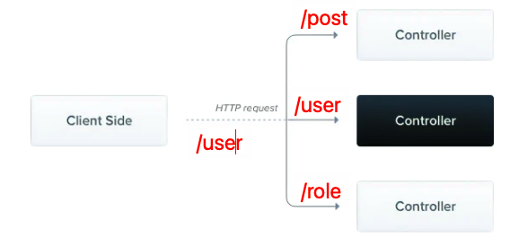

- 通过@Controller(...path...)来构造一个控制器，
- 在Module的中的@Module装饰器内放入控制器，@Module({controllers:[xxxController]})只有这样，Nest的Ioc容器才会产生出该控制器的实例，才能为你的application所用
- 常用的方法装饰器有@Get()、@Post()、@Patch()、@Delete()、等等
- 常用的方法参数装饰器有@Body()、@Query()、@Param()、@Request()/@Req()、@Response()/@Res()
- @HttpCode()、@Header()、@Redirect()等这几个可能用的比较少，反正我目前基本不用

## 二、Providers

Providers是一个很基本的概念，很多Nest中定义的类可以被视为一个Provider，我理解的Provider其实就是可以为各个模块提供服务的，这个服务范围很广，例如可以是一个操作数据库某张表的Service，还可以是一个具体的值，这些服务可以被注入依赖体系，注入相关依赖后，可以在方使用。这个和java中的@Autowired()自动装配比较类似，但是也有很多不同，

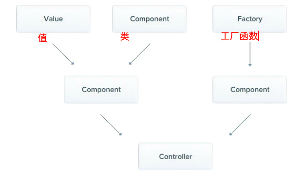

我们使用最多的还是类，下面主要以类来举例

### 1. 最常用的服务就是类！

- **服务类使用@Injectable()装饰器装饰，表明该类可以由Nest的IoC容器管理**
- **服务需要在对应的module中进行注册，如果不注册IoC容器是不会帮你创建对象的，而且还会报错**
- **在其它类中使用时（如Controller控制器中），在该类的构造函数的参数中进行注入(后面也会讲通过属性注入的方法)**

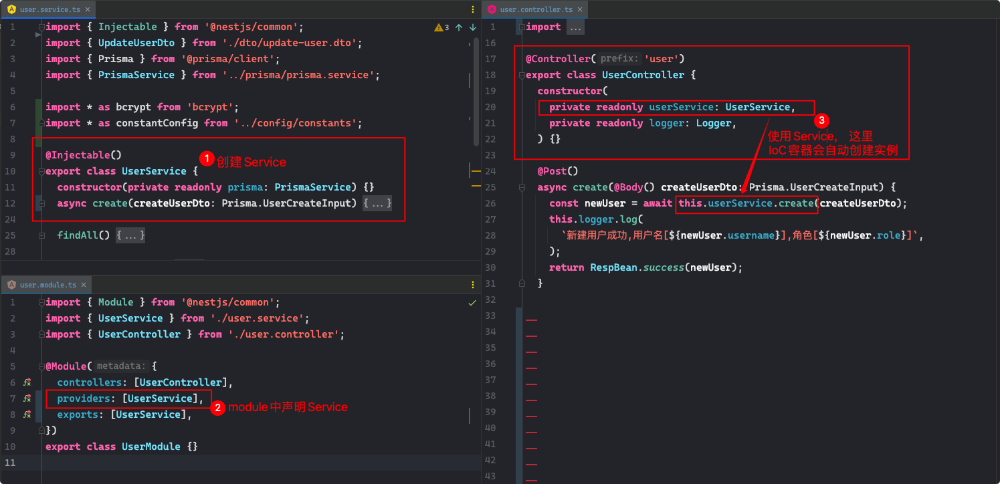

强调一下这里的依赖注入，可以看到是通过类构造函数来的， constructor(private readonly userService: UserService) {}，Nest提供了IoC容器利用Typescript自带类型的特点自动创建对象的能力，注意这里是单例模式，如果该Service在其它地方也被用过，那么会在不会重新创建对象，各个应用只会有一个该Service的对象，容器会先寻找当前有没有，如果没有再进行创建。

- **生命周期：默认情况下随着整个应用的启动而产生，随着应用的关闭而销毁，但是也可以自定义，可以随着请求的生命周期进行调整**

### 2. 自定义的provider

就如刚开始将Provider的图示所描述的，provider可以是单纯地值，可以是类，可以一个工厂函数，其实上面类的写法是一种语法糖写法

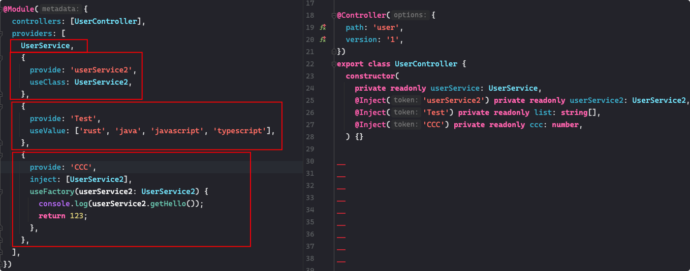

可以看出完整写法，通过给不同的provider标注不同的token，注入的时候使用@Inject(对应的token)进行注入

注意这里的provide属性，可以使用类名、strings、symbols或者enums，最佳实践中，一般把所有用到的token单独放到一个文件中，比如constants.ts，专门用来提供程序用到的所有token。

#### useFactory

关于工厂函数useFactory，多说几句。它可以提供动态的provider，由factory函数的返回值来确定，factory函数可以很简单也可以很复杂，它也可以使用其它provider，不过需要注入，在inject属性进行注入，注入的provider可以是可选的

```
const connectionProvider = {
  provide: 'CONNECTION',
  useFactory: (optionsProvider: OptionsProvider, optionalProvider?: string) => {
    const options = optionsProvider.get();
    return new DatabaseConnection(options);
  },
  inject: [OptionsProvider, { token: 'SomeOptionalProvider', optional: true }],
  //       _____________/            __________________/
  //        This provider              The provider with this
  //        is mandatory.              token can resolve to `undefined`.
};

@Module({
  providers: [
    connectionProvider,
    OptionsProvider,
    // { provide: 'SomeOptionalProvider', useValue: 'anything' },
  ],
})
export class AppModule {}
```

#### useExisting

这其实只是一个别名的使用，相当于给同一个provider多个token，如下，当我们注入的时候@Inject('AliasedLoggerService')和@Inject(LoggerService)，最终使用的是同一个LoggerService的实例

```
@Injectable()
class LoggerService {
  /* implementation details */
}

const loggerAliasProvider = {
  provide: 'AliasedLoggerService',
  useExisting: LoggerService,
};

@Module({
  providers: [LoggerService, loggerAliasProvider],
})
export class AppModule {}
```

想了解更多关于自定义provider的知识，请移步官网：https://docs.nestjs.com/fundamentals/custom-providers

### 3. 跨模块共享服务

provider具有自己的作用域，默认只在声明provider的模块内起效。如果要跨模块进行共享，前提是该服务要在在module中进行导出，也就是exports操作，exports可以填入完整的provider，也可以只填它的token(token后面会说)

```
@Module({
  controllers: [UserController],
  providers: [UserService],
  exports: [UserService],
})
export class UserModule {}
```

其它模块想使用的话可以直接在module的imports中添加该模块或者在providers中添加该服务

```
@Module({
  // 方法一
  imports: [UserModule],
  // 方法二
  providers: [UserService],
})
export class UserModule {}
```

或者也可以使用全局模块，为Module增加@Global()装饰器，比如我的数据库Orm的Module就作为了全局模块

```
import { Global, Module } from '@nestjs/common';
import { PrismaService } from './prisma.service';

@Global()
@Module({
  providers: [PrismaService],
  exports: [PrismaService],
})
export class PrismaModule {}
```

当然，咱们所有的模块都需要在根模块AppModule中的imports引入进去

### 4.可选的provider

有些时候可能不需要实例化一个服务类，可能需要根据配置文件灵活处理，这时候可以给对应的注入服务再增加一个@Optional()装饰器就行

```
constructor(@Optional() @Inject('service') private service: xxxService) {}
```

### 5. 通过属性注入

这种注入方式用的极少，一种情况是你的顶级服务类class依赖了一个或多个providers，它的后代class将一直通过super()的方式进行构造，想想也还是比较可怕的。这时可以使用属性构造的方法：

```
import { Injectable, Inject } from '@nestjs/common';

@Injectable()
export class HttpService<T> {
  @Inject('HTTP_OPTIONS')
  private readonly httpClient: T;
}
```

如果你的服务类没有继承自别的类，那请继续使用constructor构造函数来注入

## 三、Modules

可以看出，nestjs也是模块化编程的思想，一个应用由一个个拆分的模块来组成，每个模块负责自己的一部分业务，一个应用至少有一个模块，也就是根模块，使用@Module()装饰器来声明一个模块，模块也是一个类。

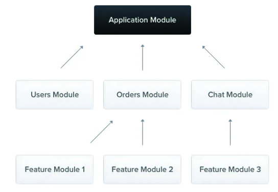

### 1. @Module()装饰器

需要一个参数，是一个对象，里面包含四个属性，用来描述这个module，上面其实已经都讲到了

```
@Module({
  imports: [OtherModule],
  controllers: [UserController],
  providers: [UserService],
  exports:[UserService]
})
export class UserModule {}
```

对于imports中导入的OtherModule，意味着OtherModule里exports的provider，可以在UserModule中使用

exports可以使用provider本身，亦可以使用provider的token

### 2. 模块共享

在Provider中已经讲过了，就是通过exports导出相应的Service，在别的模块通过imports导入该模块

### 3. 模块重导出

这个感觉还是挺有用的，可以把一些常用的，公共的模块，全部先import进一个CommonModule，然后再把它们从exprots全部导出，以后如果有那个模块想要使用其中某个模块的Service，只需要将这个CommonModule导入即可，不用再导入所有的依赖模块

```
@Module({
  imports: [Module1, Module2, Module3, Module4],
  exports: [Module1, Module2, Module3, Module4],
})
export class CommonModule {}
```

### 4. 模块类中也可以注入Service

```
import { Module } from '@nestjs/common';
import { CatsController } from './cats.controller';
import { CatsService } from './cats.service';

@Module({
  controllers: [CatsController],
  providers: [CatsService],
})
export class CatsModule {
  constructor(private catsService: CatsService) {}
}
```

### 5. 全局模块Global modules

通过@Global()装饰器声明一个全局模块，只需要在根模块imports注册该全局模块，就可以在其他所有模块内使用它导出的Service

### 6. 动态模块Dynamic modules

这是nest提供的一个强大功能，可以让我们对模块进行定制化操作，自定义模块的注册，动态提供providers，看一下官方的示例

```
import { Module, DynamicModule } from '@nestjs/common';
import { createDatabaseProviders } from './database.providers';
import { Connection } from './connection.provider';

@Module({
  providers: [Connection],
})
export class DatabaseModule {
  static forRoot(entities = [], options?): DynamicModule {
    const providers = createDatabaseProviders(options, entities);
    return {
      module: DatabaseModule,
      providers: providers,
      exports: providers,
    };
  }
}
```

原理其实很简单，就是给当前Module类提供一个forRoot方法，该方法返回一个新的Module，这个Module的类型是一个DynamicModule，在其他模块需要注册使用时，可以使用DatabaseModule.forRoot(参数)来动态的注册不同的Module，以达到提供不同providers的目的。

```
@Module({
  imports: [DatabaseModule.forRoot([User])],
})
export class AppModule {}
```

**如果想在全局作用域内注册一个动态Module，则在forRoot方法的返回值对象中加入global:true这个属性，当然一般情况下，nestjs其实不提倡搞全局模块的，我们按需使用就行。**

```
{
  global: true,
  module: DatabaseModule,
  providers: providers,
  exports: providers,
}
```

**动态模块的重导出可以省略forRoot()方法，如**

```
@Module({
  imports: [DatabaseModule.forRoot([User])],
  exports: [DatabaseModule],
})
export class AppModule {}
```

## 四、Middleware

Middleware is a function which is called **before** the route handler. Middleware functions have access to the [request](https://expressjs.com/en/4x/api.html#req) and [response](https://expressjs.com/en/4x/api.html#res) objects, and the next() middleware function in the application’s request-response cycle. The **next** middleware function is commonly denoted by a variable named next.


**中间件**，学过Express和Koa的同学，对中间件这个概念应该很熟悉了。看官方说明，中间件可以拿到Request、Response对象及next函数，其实nest默认和express的中间件是等效的

再来回忆一下中间件的功能特性：

- 可以执行任意的代码
- 对request和response对象进行改造
- 结束request-response循环
- 通过next()调用下一个中间件
- 如果当前中间件没有结束当前request-response循环，必须调用next()函数，否则请求会处于挂起状态，阻塞整个应用

构造中间件的方式有两种，一种是通过函数，一种是通过类，下面看类的方式

### 1. 创建类中间件

需要使用@Injectable()装饰器，类需要实现NestMiddleware接口(里面实现use方法)

```
import { Injectable, NestMiddleware } from '@nestjs/common';
import { Request, Response, NextFunction } from 'express';

@Injectable()
export class LoggerMiddleware implements NestMiddleware {
  use(req: Request, res: Response, next: NextFunction) {
    console.log('Request...');
    next();
  }
}
```

### 2. 应用类中间件

我们知道@Module()装饰器内没有给middleware的配置，那么怎么办呢？这时候我们需要在module类中使用config进行加载，需要让module类实现NestModule接口，实现里面configure方法进行

```
@Module({
  imports: [],
  controllers: [],
  providers: [],
})
export class AppModule implements NestModule {
  configure(consumer: MiddlewareConsumer): any {
    consumer.apply(LoggerMiddleware).forRoutes('');
  }
}
```

apply方法表名要加载的是哪个中间件，forRootes方法表名对哪个请求路径起作用，这个和app.use(路径, 中间件)如出一辙，这里还可以对forRoutes进行更详细的配置，传入一个对象针对特定的某一个请求，path可以使用正则匹配？、+、*、()等，使用fastify驱动的需要注意不能使用*，如下：

```
export class AppModule implements NestModule {
  configure(consumer: MiddlewareConsumer) {
    consumer
      .apply(LoggerMiddleware)
      .forRoutes({ path: 'ab*cd', method: RequestMethod.GET });
  }
}
```

**注意，configure方法可以是异步的，如果里面有需要异步处理的操作，可以使用async/await来等待操作完成再往下进行**

```
export class AppModule implements NestModule {
  async configure(consumer: MiddlewareConsumer) {
    await ...
    consumer
      .apply(LoggerMiddleware)
      .forRoutes({ path: 'cats', method: RequestMethod.GET });
  }
}
```

默认情况下Nestjs应用使用express驱动，会使用body-parser来解析response的数据，如果你想自定义的话，需要在NestFactory.create()时将bodyParser置为false

#### MiddlewareConsumer

- 实现链式调用
- apply可以放置多个middleware
- forRoutes可以使用单个string路径，多个string路径，RouteInfo对象，单个Controller，多个Controller

```
@Module({
  imports: [],
})
export class AppModule implements NestModule {
  configure(consumer: MiddlewareConsumer) {
    consumer
      .apply(LoggerMiddleware, xxxMiddleware,...)
      .forRoutes(CatsController,UserController,...);
  }
}
```

- exclude可以排除不使用中间件的路径

```
consumer
  .apply(LoggerMiddleware)
  .exclude(
    { path: 'cats', method: RequestMethod.GET },
    { path: 'cats', method: RequestMethod.POST },
    'cats/(.*)',
  )
  .forRoutes(CatsController);
```

### 3. 函数式中间件

```
import { Request, Response, NextFunction } from 'express';

export function logger(req: Request, res: Response, next: NextFunction) {
  console.log(`Request...`);
  next
```

使用

```
consumer
  .apply(logger)
  .forRoutes(CatsController);
```

如果你的中间件不需要依赖其它东西时，可以尽可能使用函数式中间件，较为简单

### 4. 全局中间件

在main.ts中直接使用app.use(中间件)

如经常添加的解决跨域的中间件(下面还自定义了logger日志系统，后面抽空再单独出一篇关于日志的)

```
async function bootstrap() {
  // 使用自定义winston日志
  const app = await NestFactory.create<NestExpressApplication>(AppModule, {
    logger: WinstonModule.createLogger({
      instance: logInstance,
    }),
  });
  // 跨域设置
  app.use(cors());
  await app.listen(7777);
}
bootstrap();
```

## 五、Exception filters

nest内置了一个异常处理层，如果我们没有手动处理异常，所有的异常都会进到这里，系统将给出响应的提示信息。

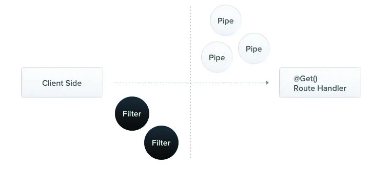

如果没有手动做处理，发生异常时，response返回给前端的信息将是如下形式：

```
{
  "statusCode": 500,
  "message": "Internal server error"
}
```

### 1. 抛出标准异常

nest内置了HttpException，可以直接抛出该异常

```
@Get()
async findAll() {
  throw new HttpException('Forbidden', HttpStatus.FORBIDDEN);
}
```

客户端请求的得到的结果如下：

```
{
  "statusCode": 403,
  "message": "Forbidden"
}
```

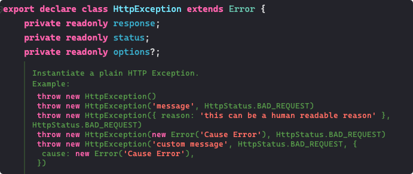

关于参数：

- 第1个参数是response，定义了返回给前端的response body，可以是一个字符串，也可以是一个对象
- 第2个参数是status，定义了HTTP的状态码，一般使用枚举来赋值，如HttpStatus.FORBIDDEN
- 第3个参数是可选的额外配置参数，提供一个cause属性，接收错误，在日志记录方面比较有用

```
getHello(@Request() req) {
  throw new HttpException(
    {
      status: HttpStatus.EXPECTATION_FAILED,
      error: 'this is a error msg',
      custom: 'this is a custom res',
    },
    HttpStatus.EXPECTATION_FAILED,
    {
      cause: new Error('实际的错误信息'),
    },
  );
  return req.user;
}
```

请求返回值将变成：

```
{
  status: HttpStatus.EXPECTATION_FAILED,
  error: 'this is a error msg',
  custom: 'this is a custom res',
},
```

### 2. 自定义异常

我们可以创建一个类继承HttpException，在里面进行一些自定义配置，然后使用的时候直接throw xxxException

官网给我们内置了很多HttpException的子类，可以直接抛出。详见官网https://docs.nestjs.com/exception-filters

如下：

```
 new BadRequestException('Something bad happened', { cause: new Error(), description: 'Some error description' })
```

返回结果如下：

```
{
  "message": "Something bad happened",
  "error": "Some error description",
  "statusCode": 400,
}
```

**这里再提示一下：如果response参数只是一个字符串，那返回体将会把status作为statusCode属性的值，会把options里的description作为error属性的值，如果response参数是一个对象，那返回体就只有这个对象里的属性**

### 3. 异常过滤器Exception filters

如果想要更加个性化的定制Exception返回数据格式，可以使用Exception filters，下面是我自定义的HttpExceptionFilter，它需要实现ExceptionFilter接口，实现里面catch方法，并使用@Catch()装饰器进行修饰，它接收一个或多个参数，表明要捕获哪些异常.

```
import {
  Catch,
  ExceptionFilter,
  ArgumentsHost,
  HttpException,
} from '@nestjs/common';
import { Request, Response } from 'express';

@Catch(HttpException)
export class httpExceptionFilter implements ExceptionFilter {
  catch(exception: HttpException, host: ArgumentsHost): any {
    // 拿到ctx对象
    const ctx = host.switchToHttp();
    const request = ctx.getRequest<Request>();
    const response = ctx.getResponse<Response>();
    const status = exception.getStatus();
    response.status(status).json({
      code: status,
      success: false,
      data: {
        requestQuery: request.query,
        requestParam: request.params,
        requestBody: request.body,
      },
      time: new Date().getTime(),
      url: request.url,
    });
  }
}
```

catch()方法的两个参数，其中host参数的类型为ArgumentHost，可以通过它拿到Request和Response对象，从而进行相应的操作。ArgumentHost是一个很丰富很复杂的接口，可以简单看一下它的定义，可以针对不同的请求协议拿到不同的host，这个以后有机会再研究。有兴趣的可以移步官网查看：https://docs.nestjs.com/fundamentals/execution-context

```
/**
 * Provides methods for retrieving the arguments being passed to a handler.
 * Allows choosing the appropriate execution context (e.g., Http, RPC, or
 * WebSockets) to retrieve the arguments from.
 *
 * @publicApi
 */
export interface ArgumentsHost {
    /**
     * Returns the array of arguments being passed to the handler.
     */
    getArgs<T extends Array<any> = any[]>(): T;
    /**
     * Returns a particular argument by index.
     * @param index index of argument to retrieve
     */
    getArgByIndex<T = any>(index: number): T;
    /**
     * Switch context to RPC.
     * @returns interface with methods to retrieve RPC arguments
     */
    switchToRpc(): RpcArgumentsHost;
    /**
     * Switch context to HTTP.
     * @returns interface with methods to retrieve HTTP arguments
     */
    switchToHttp(): HttpArgumentsHost;
    /**
     * Switch context to WebSockets.
     * @returns interface with methods to retrieve WebSockets arguments
     */
    switchToWs(): WsArgumentsHost;
    /**
     * Returns the current execution context type (string)
     */
    getType<TContext extends string = ContextType>(): TContext;
}
```

### 4. 使用filters

#### ①方法作用域

可以绑定到具体的方法上，使用@UseFilters(new HttpExceptionFilter())装饰器，可以传多个filter，**亦可以使用类名作为参数，创建实例的事就交给nest框架帮我们处理，尽可能使用类作为参数，可以减小内存开支，因为全局公用一个实例instance**

```
@Post()
@UseFilters(HttpExceptionFilter)
async create(@Body() createCatDto: CreateCatDto) {
  throw new ForbiddenException();
}
```

#### ②Controller作用域

```
@UseFilters(new HttpExceptionFilter())
export class CatsController {}
```

#### ③全局作用域

```
async function bootstrap() {
  const app = await NestFactory.create(AppModule);
  app.useGlobalFilters(new HttpExceptionFilter());
  await app.listen(3000);
}
bootstrap();
```

我试验了一下，全局使用时不能使用类作为useGlobalFilters的参数

注意：当使用全局模式的时候，如果想用依赖注入的方式，必须使用特定的方式，在任意一个模块下使用如下方法：


```
@Module({
  providers: [
    {
      provide: APP_FILTER,
      useClass: HttpExceptionFilter,
    },
  ],
})
export class AppModule {}
```

这跟后面要将的全局Guard类似

### 5. 捕获所有异常

@Catch()的参数列表为空时修饰的filter就是一个能捕获所有异常的filter，贴出官网的示例代码


```
import {
  ExceptionFilter,
  Catch,
  ArgumentsHost,
  HttpException,
  HttpStatus,
} from '@nestjs/common';
import { HttpAdapterHost } from '@nestjs/core';

@Catch()
export class AllExceptionsFilter implements ExceptionFilter {
  constructor(private readonly httpAdapterHost: HttpAdapterHost) {}

  catch(exception: unknown, host: ArgumentsHost): void {
    // In certain situations `httpAdapter` might not be available in the
    // constructor method, thus we should resolve it here.
    const { httpAdapter } = this.httpAdapterHost;

    const ctx = host.switchToHttp();

    const httpStatus =
      exception instanceof HttpException
        ? exception.getStatus()
        : HttpStatus.INTERNAL_SERVER_ERROR;

    const responseBody = {
      statusCode: httpStatus,
      timestamp: new Date().toISOString(),
      path: httpAdapter.getRequestUrl(ctx.getRequest()),
    };

    httpAdapter.reply(ctx.getResponse(), responseBody, httpStatus);
  }
}
```

使用的时候，可以给构造器传入一个httpAdapter参数


```
async function bootstrap() {
  const app = await NestFactory.create(AppModule);

  const { httpAdapter } = app.get(HttpAdapterHost);
  app.useGlobalFilters(new AllExceptionsFilter(httpAdapter));

  await app.listen(3000);
}
bootstrap();
```

### 6.继承BaseExceptionFilter

用于修改默认的内置全局异常，对于这种异常类，如果作用于方法或者Controller，则UseFilters()的参数只能使用类，让nest帮我们做剩下的事


```
import { Catch, ArgumentsHost } from '@nestjs/common';
import { BaseExceptionFilter } from '@nestjs/core';

@Catch()
export class AllExceptionsFilter extends BaseExceptionFilter {
  catch(exception: unknown, host: ArgumentsHost) {
    //....处理相关逻辑
    super.catch(exception, host);
  }
}
```

第5点和第6点其实都是全局异常，看你的业务进行相应的选择

## 六、Pipes

A pipe is a class annotated with the @Injectable() decorator, which implements the PipeTransform interface.

管道也是一个类，使用装饰器@Injectable()，并实现接口PipeTransform

管道有两个典型的应用场景

- transformation：数据转换，如将请求的输入数据从string转为integer
- validation：对请求的输入数据进行验证，验证不通过抛出异常，这一部分其实感觉也可以让前台来做

以上两种场景下，管道都是对Controller控制器中的handler处理函数的参数进行操作，这个操作发生在handler函数真正执行之前，如果在pipes中抛出异常，会直接跳到异常处理，并返回前端，Controller下的处理函数压根不会执行，这也算是一种应用保护机制。

- 如果是做validation，那么要么验证通过返回没有经过修改的value，要么验证失败，抛出错误
- 如果是transformation：那么转换为想要的类型，如果转换失败则抛出异常

### 1. 内置pipes

- ValidationPipe
- ParseIntPipe
- ParseFloatPipe
- ParseBoolPipe
- ParseArrayPipe
- ParseUUIDPipe
- ParseEnumPipe
- DefaultValuePipe
- ParseFilePipe

#### Parse*Pipe系列

- 使用类

这一系列都是转换数据用的，可以在Controller的handler方法参数上使用，如下直接给@Param()提供第二个参数，用于转换，这里提供一个类，nest会自动将其实力为一个对象


```
@Get('hello/:id')
getHello(@Param('id', ParseIntPipe) id: number, @Request() req) {
  console.log(typeof id);
  return req.user;
}
```

到请求为/hello/123时正常返回

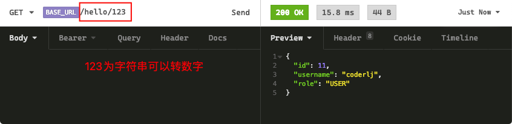

当请求为/hello/123a时，转换出错，抛出异常

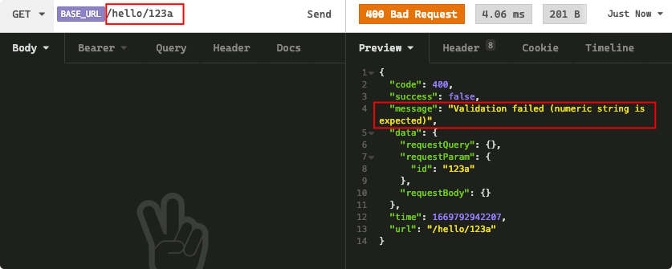

- 使用自定义的实例

如下自定义statuscode


```
  getHello(
    @Param(
      'id',
      new ParseIntPipe({
        errorHttpStatusCode: HttpStatus.NOT_ACCEPTABLE,
      }),
    )
    id: number,
    @Request() req,
  ) {
    console.log(typeof id);
    return req.user;
  }
```

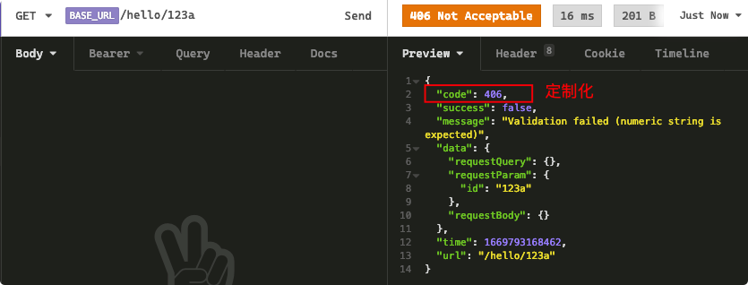

### 2. 自定义Pipes(validation为例)

不论是transformation还是validation都需要使用@Injectable()装饰器，并实现PipeTransform接口，基本实现如下：

```
import { ArgumentMetadata, Injectable, PipeTransform } from '@nestjs/common';

@Injectable()
export class CustomValidationPipe implements PipeTransform {
  transform(value: any, metadata: ArgumentMetadata): any {
    console.log('====custom-pipe-value====', value);
    console.log('====custom-pipe-metadata====', metadata);
    return value;
  }
}
```

其中value就是被CustomValidationPipe修饰的参数，metadata是该参数的meta属性，它类型如下：

```
export interface ArgumentMetadata {
  type: 'body' | 'query' | 'param' | 'custom';
  metatype?: Type<unknown>;
  data?: string;
}
```

##### 使用class validator

官网上讲了好几种不同实现，我们主要看class validator，依托于class-validator和class-transformer，先安装依赖

```
$ npm i --save class-validator class-transformer
```

对于我们新建用户来说，要校验创建用户的信息，对创建用户的Dto类使用class-validator的各种验证装饰器

```
import { IsOptional, IsString } from 'class-validator';

export class CreateUserDto {
  @IsString()
  username: string;

  @IsString()
  password: string;

  @IsString()
  @IsOptional()
  role?: string;
}
```

编写validation-pipes类

```
import {
  ArgumentMetadata,
  BadRequestException,
  Injectable,
  PipeTransform,
} from '@nestjs/common';
import { validate } from 'class-validator';
import { plainToInstance } from 'class-transformer';

@Injectable()
export class CustomValidationPipe implements PipeTransform<any> {
  async transform(value: any, metadata: ArgumentMetadata) {
    console.log('====custom-pipe-value====', value);
    console.log('====custom-pipe-metadata====', metadata);
    const { metatype } = metadata;
    // 判断传入的参数有没有类型，如果没有相当于是原生的js，则不做校验
    // 这里的类型指的就是Controller中的参数有没有指定类型，只有制定了类型的参数才需要校验
    if (!metatype || !this.toValidate(metatype)) {
      return value;
    }
    // 获取带有类型的obj对象
    const object = plainToInstance(metatype, value);
    // 校验
    const errors = await validate(object);
    // 如果校验出错，抛出异常
    if (errors.length > 0) {
      throw new BadRequestException('Validation failed');
    }
    // 如果校验通过返回value unchanged
    return value;
  }

  private toValidate(metatype: Function): boolean {
    const types: Function[] = [String, Boolean, Number, Array, Object];
    return !types.includes(metatype);
  }
}
```

使用：

```
  @Post()
  async create(@Body(new CustomValidationPipe()) createUserDto: CreateUserDto) {
    const newUser = await this.userService.create(createUserDto);
    this.logger.log(
      `新建用户成功,用户名[${newUser.username}],角色[${newUser.role}]`,
    );
    return RespBean.success(newUser);
  }
```

验证如下，将password写成了number而不是string

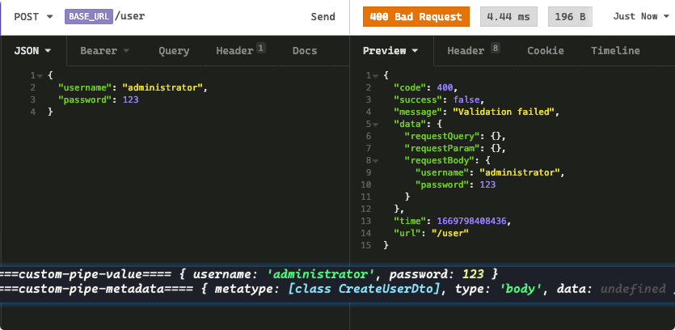

### 3. 全局作用域下的pipes

依然是两种形式

- 使用useGlobalPipes

```
  // 全局validationPipes
  app.useGlobalPipes(new CustomValidationPipe());
```

- 使用依赖注入，在任意一个模块注入都可以


```
@Module({
  providers: [
    {
      provide: APP_PIPE,
      useClass: CustomValidationPipe,
    },
  ],
})
export class AppModule {}
```

### 4. 内置validationPipe

当然讲了这么多，只是说明了原理，其实我们大可不必自己写，直接使用内置的就行，而且提供了丰富的配置自定义功能，具体详情可移步官网：https://docs.nestjs.com/techniques/validation

基本使用：

```
import { ValidationPipe } from '@nestjs/common';

app.useGlobalPipes(
  new ValidationPipe({
    disableErrorMessages: true,
  }),
);
```

### 5. transformation-pipes自定义使用场景

我们也可以自定义transformation pipes，这个很简单，就是在transform方法内返回不同的结果就行了，它会覆盖之前的value，这是对前端传值的干预，有时候也会很有用

- 比如将数据类型进行转换
- 对需要的数据如果某个属性不存在那就给它一个默认值，比如做查询操作的时候，有些查询参数没传那就使用默认值

官网示例：

```
@Injectable()
export class ParseIntPipe implements PipeTransform<string, number> {
  transform(value: string, metadata: ArgumentMetadata): number {
    const val = parseInt(value, 10);
    if (isNaN(val)) {
      throw new BadRequestException('Validation failed');
    }
    return val;
  }
}
```

注意这里PipeTransform<T, R>泛型的使用，T表示输入的类型，R表示返回的类型

使用和之前讲的一样：

```
@Get(':id')
async findOne(@Param('id', new ParseIntPipe()) id) {
  return this.catsService.findOne(id);
}
```

### 6. 实现id转user实体的transformation pipe

这里实现一下官网上的另外一个留给读者的例子，就是前端传入的是一个userId，我们需要在transformation pipe中根据这个id来返回一个用户对象，也就是将id转换为用户


```
import { ArgumentMetadata, Injectable, PipeTransform } from '@nestjs/common';
import { UserService } from '../../modules/user/user.service';

@Injectable()
export class UserByIdPipe implements PipeTransform<any> {
  constructor(private readonly userService: UserService) {}
  async transform(value: string, metadata: ArgumentMetadata) {
    const value1 = parseInt(value, 10);
    // 这里从数据库查找user，我使用的是prisma
    const user = await this.userService.findOneById(value1);
    if (user) {
      // 去除密码
      const { password, ...res } = user;
      return res;
    }
  }
}
```

使用


```
@Get('users/:id')
getUser(@Param('id', UserByIdPipe) user: User) {
  return user;
}
```

测试

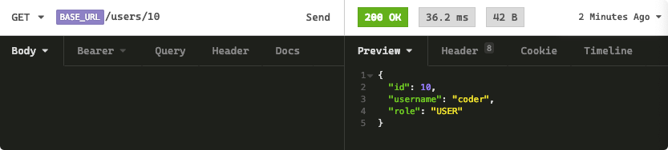

### 7. pipe提供默认值

主要用在前端传过来的数据是null或者undefined，如果我们不做处理可能会抛出异常，所以我们可以在他们转换前再加一层提供默认值的管道，较为简单，直接引用官方的示例


```
@Get()
async findAll(
  @Query('activeOnly', new DefaultValuePipe(false), ParseBoolPipe) activeOnly: boolean,
  @Query('page', new DefaultValuePipe(0), ParseIntPipe) page: number,
) {
  return this.catsService.findAll({ activeOnly, page });
}
```

## 七、Guards

A guard is a class annotated with the @Injectable() decorator, which implements the CanActivate interface.


字面理解就是守卫，它最突出的作用就是用来做鉴权，就是来决定一个请求是否被处理及怎么处理，这依赖于一定的条件，比如权限、角色等等，它和用户权限挂钩。可能有的同志回想用中间件来处理，中间件对一般的要求还可以做到，但是对一些复杂需求，比如不同权限接下去要进行的操作是不一样的，我们使用中间件仅仅靠一个next函数是没法精确控制下一步往哪里走的。

Guards的执行顺序在所有的中间件之后，但是在任何的interceptor和pipe之前

### 1. 基本示例代码

```
import { Injectable, CanActivate, ExecutionContext } from '@nestjs/common';
import { Observable } from 'rxjs';

@Injectable()
export class AuthGuard implements CanActivate {
  canActivate(
    context: ExecutionContext,
  ): boolean | Promise<boolean> | Observable<boolean> {
    const request = context.switchToHttp().getRequest();
    return validateRequest(request);
  }
}
```

- 使用@Injectable装饰器，实现CanActivate接口
- canActivate方法，重点关注context执行上下文对象，比较强大。
- 方法返回true继续执行，返回false拒绝该次请求

### 2. Execution context

继承自ArgumentHost，详情见官网：https://docs.nestjs.com/fundamentals/execution-context

Nest提供了很多实用的工具类来帮我们更轻松的编写应用，Execution context就是其一，后面单独开一篇来将ArgumentsHost和ExecutionContext。

### 3.基于Role的权限认证

这里主要讲一个东西就是@SetMetadata的使用，这是用来添加元数据的，我们想实现的功能大概如下：

在Controller或method-handler上加一个类似Roles('admin')装饰器，让只具有admin角色的用户能够访问和调用，如下表示只有admin权限的用户才有资格访问：


```
@Post()
@Roles('admin')
async create(@Body() createCatDto: CreateCatDto) {
  this.catsService.create(createCatDto);
}
```

如何做到这一点呢?先来个思路分析

我们在canActivate方法中需要做一下几个事情：

- 一是获取当前登录用户的role角色信息，这个可以通过contex拿到request，一般我们会在认证那一步就将user信息附加到request上，这样我们直接通过request.user即可拿到user信息
- 二是要获取到@Roles()装饰器的参数信息，即标示了哪些用户角色可以访问，这就需要用到两个东西：①Roles装饰器需要自定义，通过对@SetMetadata进行一层包裹，对所装饰的Controller或method添加元数据；②Nest框架给我们提供的反射类，通过反射类拿到装饰器内的参数

具体做法如下：

自定义@Roles装饰器

```
import { SetMetadata } from '@nestjs/common';

export const Roles = (...roles: string[]) => SetMetadata('roles', roles);
```

构造一个Guard

```
import { Injectable, CanActivate, ExecutionContext } from '@nestjs/common';
import { Reflector } from '@nestjs/core';

@Injectable()
export class RolesGuard implements CanActivate {
  constructor(private reflector: Reflector) {}

  canActivate(context: ExecutionContext): boolean {
    // 通过反射拿到，context.getHandler()拿到的是装饰的那个route handler
    // 而roles信息就放在Controller的元数据对象上
    const roles = this.reflector.get<string[]>('roles', context.getHandler());
    if (!roles) {
      return true;
    }
    const request = context.switchToHttp().getRequest();
    // user在这里获取，其实在用户登录的时候会把用户信息都藏到token里，每次用户登录携带token
    // 应用在认证token的同时就把用户user信息附加到request中了，认证在这之前所以这里可以拿到
    const user = request.user;
    return matchRoles(roles, user.roles);
  }
}
```

对于鉴权后的一些操作，可以根据自己的业务逻辑需要进行定制，至此，Guard基本也讲完了。

## 八、Interceptors

An interceptor is a class annotated with the @Injectable() decorator and implements the NestInterceptor interface.

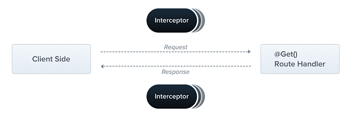

拦截器！面向切面编程，具有以下能力：

- 在某个方法执行前后增加额外逻辑
- 修改一个方法返回的结果
- 修改一个方法抛出的错误
- 扩展一个方法的功能
- 根据某些特别的条件，重写一个方法，比如为了缓存目的

### 1. 实现接口及方法参数解析

每一个拦截器都需要实现一个NestInterceptor接口，实现里面的intercept方法，接口定义如下：


```
/**
 * Interface describing implementation of an interceptor.
 *
 * @see [Interceptors](https://docs.nestjs.com/interceptors)
 *
 * @publicApi
 */
export interface NestInterceptor<T = any, R = any> {
    /**
     * Method to implement a custom interceptor.
     *
     * @param context an `ExecutionContext` object providing methods to access the
     * route handler and class about to be invoked.
     * @param next a reference to the `CallHandler`, which provides access to an
     * `Observable` representing the response stream from the route handler.
     */
    intercept(context: ExecutionContext, next: CallHandler<T>): Observable<R> | Promise<Observable<R>>;
}
```

主要看需要实现的intercept方法，它有两个参数context和next

#### ①ExecutionContext

继承自ArgumentsHost，可以获取执行上下文，有自己的扩展，可以通过反射机制使用getClass()和getHandler()拿到class和method，详情

#### ②CallHandler

CallHandler是一个接口，实现了handle方法，接口如下：


```
/**
 * Interface providing access to the response stream.
 * @see [Interceptors](https://docs.nestjs.com/interceptors)
 * @publicApi
 */
export interface CallHandler<T = any> {
    /**
     * Returns an `Observable` representing the response stream from the route
     * handler.
     */
    handle(): Observable<T>;
}
```

可以看出，该接口提供了访问Response流的能力，handle()函数的返回值就是response流，类型是一个`Observable<T>`类型（Observable这是rxjs的内容了，后面有机会单独开一个rxjs的系列，这也是一个非常强大的库，在帮我们处理异步事件的时候用处很大，有兴趣的可移步官网提前学习：https://rxjs.dev/guide/overview），你可以在合适的位置使用它来调用你的route handler，如果在intercept()方法的实现中没有调用过handle()方法，那么route handler将不会被执行。

**调用handle()方法前的处理逻辑相当与在route handler之前添加的逻辑，在handle()方法执行后的逻辑相当于在route handler之后添加的逻辑，实现了对route handler的拦截。**

### 2. 简单示例

我们做一个日志相关的拦截器，实现的目的是route handler处理前记录时间并打印一段提示信息，处理之后打印另一段提示信息并记录route handler的执行时长

#### 构建拦截器

```
@Injectable()
export class LoggingInterceptor implements NestInterceptor {
  intercept(
    context: ExecutionContext,
    next: CallHandler<any>,
  ): Observable<any> | Promise<Observable<any>> {
    // 处理route handler前的逻辑
    console.log('Before...');
    const now = Date.now();

    return next
      .handle().pipe(
        tap((value) =>
          console.log(`After...${Date.now() - now}ms, return value: ${value}`),
        ),
      );
  }
}
```

#### 绑定拦截器

和pipes和guards一样，可以绑定到Controller层、method层以及全局作用域，下面绑定到method层面，使用@UseInterceptors拦截器


```
  @UseInterceptors(LoggingInterceptor)
  @Get('interceptor/test')
  testInterceptor() {
    return 'hello interceptor';
  }
}
```

测试结果


**如果要绑定全局作用域，可以使用如下两种方式**

- useGlobalInterceptors


```
app.useGlobalInterceptors(new LoggingInterceptor());
```

- 依赖注入方式


```
@Module({
  providers: [
    {
      provide: APP_INTERCEPTOR,
      useClass: LoggingInterceptor,
    },
  ],
})
export class AppModule {}
```

**其实我们可以总结一下关于绑定的方式，我将在核心概念的最后一篇进行一个梳理，对所有涉及到的使用方式做一个总结，其实我个人比较推荐统一都使用注入的方式。**

### 3. response结果转换

由上面可知，我们通过handle()方法拿到了响应流的Observable对象，进而可以对结果进行各种修改转换操作。但是有一点要注意：当route handler中接收 @Res装饰器装饰的参数时不能使用。经过我的测试，发现这么做会阻塞整个请求

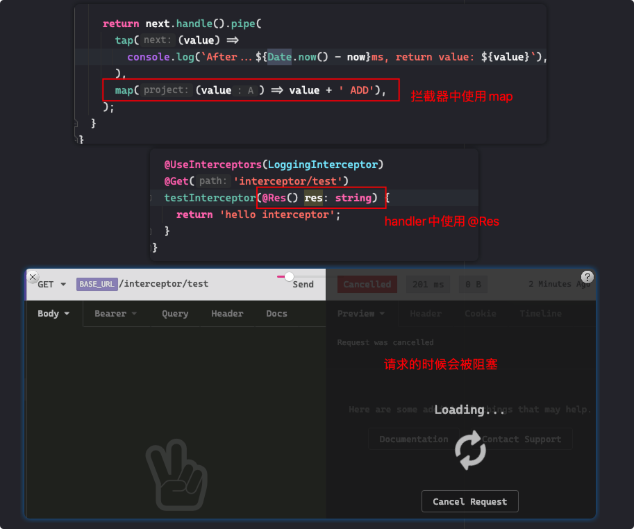

做数据转换的拦截器很简单，只需要在pipe管道中进行map操作就行，可以参考官方的示例：


```
export interface Response<T> {
  data: T;
}

@Injectable()
export class TransformInterceptor<T> implements NestInterceptor<T, Response<T>> {
  intercept(context: ExecutionContext, next: CallHandler): Observable<Response<T>> {
    return next.handle().pipe(map(data => ({ data })));
  }
}
```

提示一下，intercept方法依然可以是同步也可以是异步

map操作可以做任意转换，如：

- 将值转换成一个对象
- 将null值转换默认的空字符串
- 对Exception的转换

具体的就不做演示了，这个大家应该很熟悉，和js中的map高阶函数一个道理

### 4. 结果覆盖

说白了就是某些情况我们不在调用handle处理，为什么呢？可能有时候是多余的，比如结果已经在缓存中有，我们直接在缓存中提取就好了，不用做重复的处理，这可以大大提升性能和响应速度。伪代码逻辑大概如下：


```
const isCached = true;
if (isCached) {
  return of(缓存中的数据);
}
return next.handle();
```

### 5. 其它操作

我们可以充分利用rxjs的强大处理能力，实现更丰富的功能，官方举了一个例子，就是请求处理超时抛出错误的例子，可以参考一下代码，只截取了一部分，pipe中的操作是，超时5s就抛出异常取消该次请求


```
return next.handle().pipe(
      timeout(5000),
      catchError(err => {
        if (err instanceof TimeoutError) {
          return throwError(() => new RequestTimeoutException());
        }
        return throwError(() => err);
      }),
    );
```

## 九、Custom decorators

装饰器这个概念对JavaScript来说感觉是一次小小的革新，非常好用，其实所谓的装饰器就是一个函数，@的写法是一个语法糖，它可以修饰类、方法、属性及参数，看一下es源码

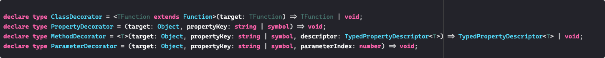

nest为我们内置了很多装饰器，各个层面的都有，我们定义类的时候用的最多的就是@Injectable了吧，哈哈，下面我们来自定义一些装饰器，非常好用！

### 1. 参数级别装饰器

我们在一个系统登录认证后，token里的user信息都会被附加到request中，我们可以做一个参数装饰器直接获取当前请求携带的user，具体做法如下：

```
import { createParamDecorator, ExecutionContext } from '@nestjs/common';
import { Request } from 'express';

export const UserDecorator = createParamDecorator(
  (data: unknown, ctx: ExecutionContext) => {
    const request = ctx.switchToHttp().getRequest<Request>();
    return request.user;
  },
);
```

使用

```
  @Get('userDec/test')
  testUserDecorator(@UserDecorator() user) {
    console.log(user);
    return `hello ${user.username}`;
  }
```

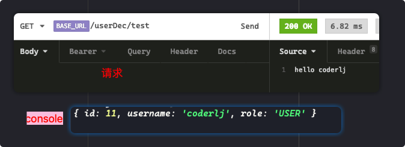

当然这个的前提是你request中得有user啊，这就涉及到认证相关的内容了

### 2. 给装饰器传参

给装饰器传参会放到factory方法的data域中，比如我们想给上面的User装饰器传一个属性名username直接获取用户的username，可以这么做：


```
export const UserDecorator = createParamDecorator(
  (data: string, ctx: ExecutionContext) => {
    const request = ctx.switchToHttp().getRequest<Request>();
    const user = request.user;
    return data ? user?.[data] : user;
  },
);
```


```
  @Get('userDec/test')
  testUserDecorator(@UserDecorator('username') user) {
    console.log(user); // coderlj
    return `hello ${user}`; // hello coderlj
  }
```

### 3. 结合pipes

可以对自定义的装饰器的参数进行校验，下面使用的是框架自带的ValidationPipe


```
@Get()
async findOne(
  @User(new ValidationPipe({ validateCustomDecorators: true }))
  user: UserEntity,
) {
  console.log(user);
}
```

### 4. 装饰器组合封装

有时候，我们对一个东西加的装饰器很多，看着代码非常复杂，可以进行抽取重构，将一些经常使用作用可以聚合的放在一起，最后实现用一个装饰器实现对好几个装饰器的封装，如下：


```
import { applyDecorators } from '@nestjs/common';

export function Auth(...roles: Role[]) {
  return applyDecorators(
    SetMetadata('roles', roles),
    UseGuards(AuthGuard, RolesGuard),
    ApiBearerAuth(),
    ApiUnauthorizedResponse({ description: 'Unauthorized' }),
  );
}
```

使用的时候只需要用一个就行

```
@Get('users')
@Auth('admin')
findAllUsers() {}
```


```
@Get('users')
@Auth('admin')
findAllUsers() {}
```