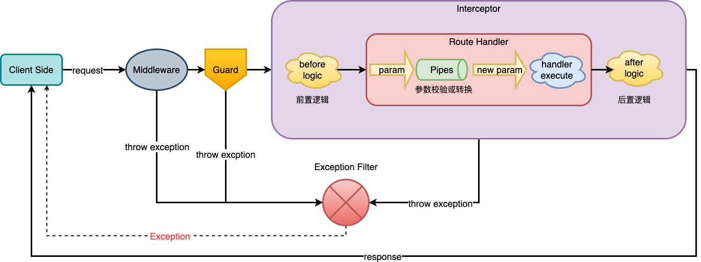
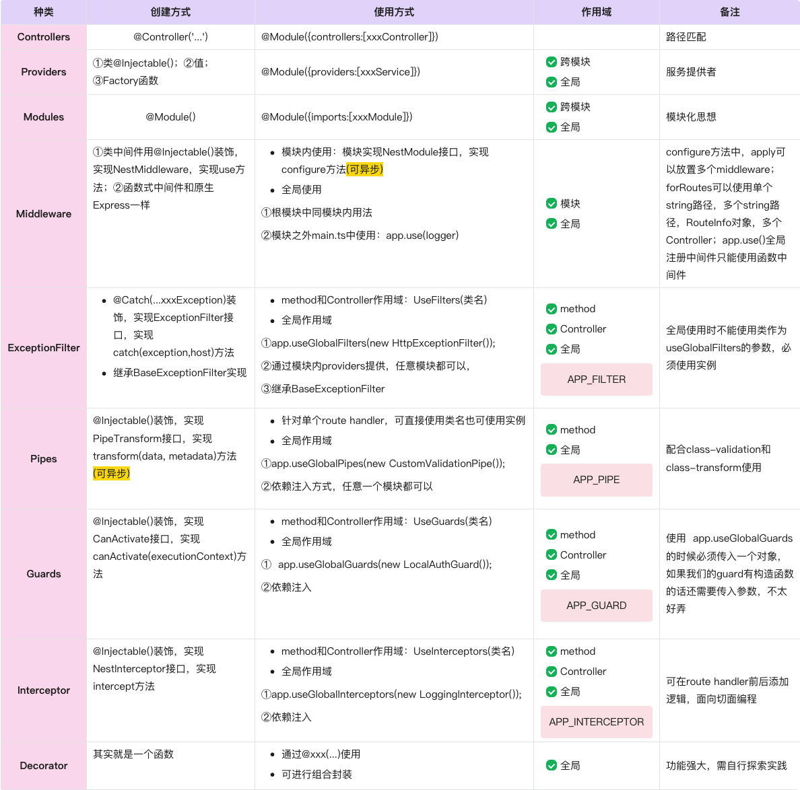
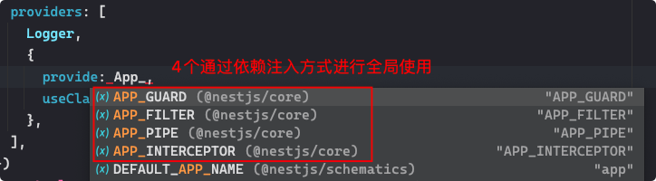

## 核心概念小结

## 一、执行顺序

我一开始就比较关心这个问题，就是一个请求来了，到底会依次经历哪些个门槛，这里主要涉及到的有：

Middleware、ExceptionFilter、Pipes、Guards、Interceptors这几个，我们不妨先做个实验来看看，我们搞一个接口把所有这些都囊括在里面

```
  @UseInterceptors(LoggingInterceptor)
  @TestDec('testGuard')
  @Get('testOrder/:id')
  testOrder(@Param('id', UserByIdPipe) user: User) {
    return 'hello world';
  }
```

在我没有认证的情况发起请求，控制打印了：

```
我是Middleware，我来了!
我是Guard，我来了!
```

当我认证后，即携带了token发起请求

```
我是Middleware，我来了!
我是Guard，我来了!
我是Interceptor，我来了!
我是Pipes，我来了!
```

**Tips：**

- 中间件Middleware最先到来，中间件是在route handler之前的，只有中间件调用了next方法才会继续执行到route handler。该层也可以抛出异常，直达ExceptionFilter
- 而后到来的是守卫Guard，主要用来做鉴权，看看当前用户有没有权限执行，如果没有权限执行，则不会放行，会在Guard这一层抛出异常。该层也可以抛出异常，直达ExceptionFilter
- 接下来到来的是拦截器Interceptor，它可以让我们实现面向切面编程，在route handler执行前后添加额外的逻辑。该层也可以抛出异常，直达ExceptionFilter
- 最后到来的是管道Pipes，意味着已经进到router handler内部了，对一些参数做验证。该层也可以抛出异常，直达ExceptionFilter



## 二、使用对比

这里的表格太大了，显示有问题，直接截图了！



总结一下，有4个可以通过依赖注入方式实现全局使用的有：GFPI（girl friend piang liang，女朋友漂亮，哈哈）



**Tips：**

- 对于Service需要跨模块使用时，一定要记得在提供Service的模块进行导出exports操作
- 对于Service需要全局共享时，可以对Service所在的模块使用@Global装饰
- 对于Guard、ExceptionFilter、Pipes、Interceptor来说，如果需要全局使用，建议使用依赖注入的方式，如上图所示
- 需要特别注意ArgumentsHost、ExecutionContex、Reflector、SetMetadata等的使用
- 对于如何选择这个问题，主要是看逻辑业务需求，按需选取，在选择的时候可以考虑以下每种方案的优缺点，选择最合适自己的方案

## 三、可异步方法有两个

### 1. 在module中配置中间件Middleware的configure方法可以是异步的

```
export class AppModule implements NestModule {
  async configure(consumer: MiddlewareConsumer) {
    ....
  }
}
```

### 2. 在Pipes中，实现接口的transform方法可以是异步的

```
export class ValidationPipe implements PipeTransform<any> {
  async transform(value: any, { metatype }: ArgumentMetadata) {
    ....
}
```

至此，核心概念已经全部梳理完成了！总共有5个篇章，跟着官网一步一步学习下来，收获还是很大的！希望我的学习笔记心得能帮助到想要学习NestJs的你。