# 一套吃透 Spring 系列

作者：cool

## 一、前置知识

知道JavaBean概念

知道互联网开发基本概念和web项目的交互模型

具备Javaweb开发的基础

对注解和xml、properties配置文件作用，可以正常使用

可以使用Maven的方式进行项目开发

知道JavaEE的三层架构 和 MVC模式

知道反射、动态代理等作用和API

熟练使用IDEA的断点调试功能

知道MyBatis的基本使用


## 二、spring系统剖析

第一部分：ioc基础容器

第二部分：aop面向切面编程

第三部分：spring整合web环境

第四部分：web层解决方案--springmvc


### 2.1、传统Javaweb开发的困惑

#### 2.1-1、传统开发困惑分析

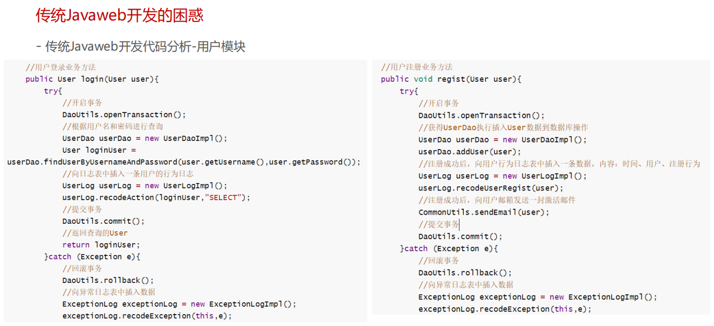

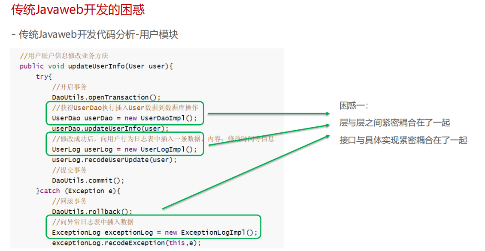

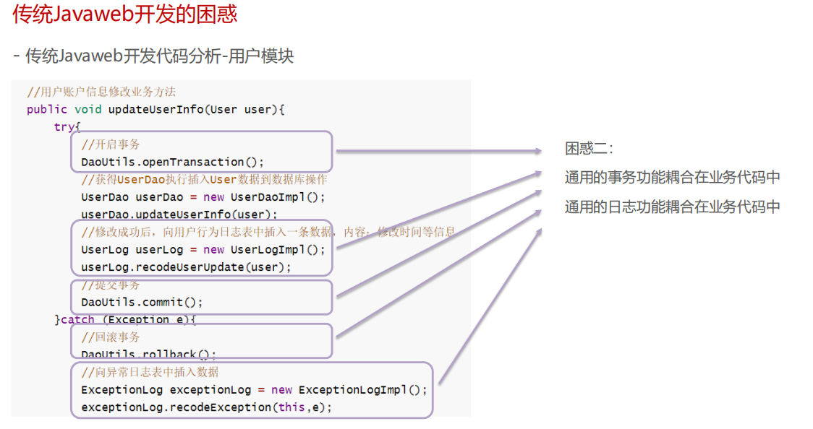


#### 2.1-2、传统javaweb开发困惑的解决方案

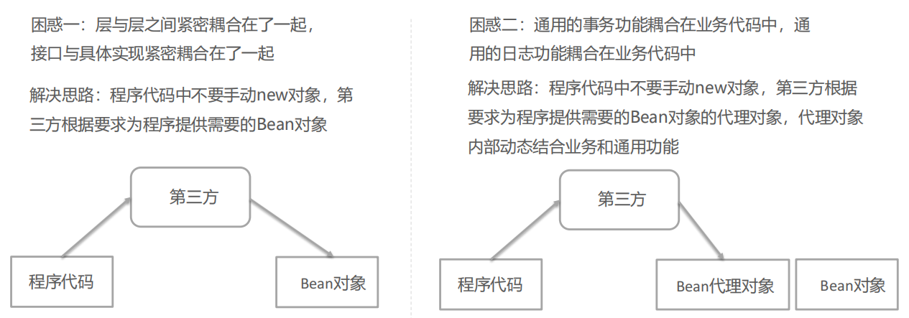


### 2.2、IoC、DI和AOP思想提出

#### 2.2-1、IoC 控制反转思想的提出

谁去充当第三方角色呢？

工厂设计模式，BeanFactory来充当第三方的角色，来产生Bean实例

BeanFactory怎么知道产生哪些Bean实例呢？

可以使用配置文件配置Bean的基本信息，BeanFactory根据配置文件来生产Bean实例


### 2.3、Spring框架的诞生

#### 2.3-1、spring框架概述

spring框架是一个开源的轻量级框架，它提供了强大的Ioc（DI）、AOP以及web的MVC功能。

#### 2.3-2、spring框架历史

1. Jsp 默默扛下所有；
2. MVC+三层架构分工明确，但开发成本及其高；
3. EJB **重**量级框架出现，走出一个困境，有进入另一个困境；
4. Spring 春天来到，随之，SSH风生水起、称霸武林；
5. Spring 稳住江湖大哥位置，SSM开始上位；
6. Spring 本着“拿来主义”的思维快速发展，生态不断健全；
7. SpringBoot 又一里程碑崛起，把“约定大于配置“思想玩儿的炉火纯青；
8. SpringCloud 打包了微服务众多解决方案，应对互联网项目更加easy！

#### 2.3-3、springframework技术栈图示

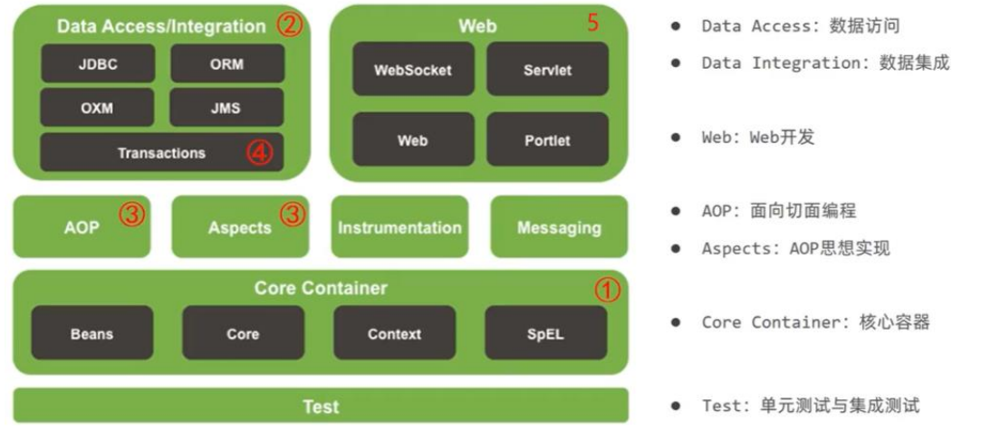

core container里面是什么？

```
core：依赖注入IoC与DI的最基本实现
beans：Bean工厂与bean的装配
context：spring的context上下文即IoC容器
SpEL：spring表达式语言
```

#### 2.3-4、BeanFactory快速入门（本质是bean工厂）

##### 使用Ioc来书写

1）导入Spring的jar包或Maven坐标 

 ==这里要注意maven的配置要配置好对应的maven才能收到合适的maven坐标和jar包==

```
<!--Spring核心-->
<dependency>
<groupId>org.springframework</groupId>
<artifactId>spring-context</artifactId>
<version>5.3.7</version>
</dependency>
```

2）定义UserService接口及其UserServiceImpl实现类

```java
//这是UserService
package service;
public interface UserService {}

//这是UserServiceImpl
package service.impl;
import service.UserService;
public class UserServiceImpl implements UserService {}
```

3）在resources中创建beans.xml配置文件，将UserServiceImpl的信息配置到该xml中

```xml
<bean id="userService" class="com.example.service.impl.UserServiceImpl"></bean>
```

4）编写测试代码，创建BeanFactory，加载配置文件，获取UserService实例对象

```java
import org.springframework.beans.factory.support.DefaultListableBeanFactory;
import org.springframework.beans.factory.xml.XmlBeanDefinitionReader;
import service.UserService;

public class BeanFactory {
    public static void main(String[] args) {
//        创建工厂对象
        DefaultListableBeanFactory beanFactory = new DefaultListableBeanFactory();
//        创建一个读取器（xml文件）
        XmlBeanDefinitionReader reader = new XmlBeanDefinitionReader(beanFactory);
//        读取器绑定工厂
        reader.loadBeanDefinitions("applicationContext.xml");
//        根据id获取Bean实例对象，可以强转类型为UserService也可以不强转默认类型为Object
        UserService userService = (UserService) beanFactory.getBean("userService");
        System.out.println(userService);
    }
}
```

上面使用BeanFactory完成了**IoC思想**的实现，下面去实现以下**DI依赖注入**：

1）定义UserDao接口及其UserDaoImpl实现类；

2）修改UserServiceImpl代码，添加一个setUserDao(UserDao userDao)用于接收注入的对象；

3）修改beans.xml配置文件，在UserDaoImpl的<bean>中嵌入<property>配置注入；

4）修改测试代码，获得UserService时，setUserService方法执行了注入操作。

##### 使用DI注入

==注意这里的业务层（Service）要调用数据访问层（Dao），使用DI思想==

1）定义UserDao接口及其UserDaoImpl实现类

```java
//定义UserDao接口
package dao;
public interface UserDao {}

//定义UserDaoImpl类
package dao.impl;
import dao.UserDao;
public class UserDaoImpl implements UserDao {
}
```

2）修改UserServiceImpl代码，添加一个setUserDao(UserDao userDao)用于接收注入的对象

```java
public class UserServiceImpl implements UserService {
	public void setUserDao(UserDao userDao) {
		System.out.println(userDao);
	}
}
```

3）定义UserDao接口及其UserDaoImpl实现类（在resources中的beans.xml中定义）

```xml
<!--    配置userServiceImpl-->
<bean id="userService" class="service.impl.UserServiceImpl">
        <property name="userDao" ref="userDao"/>
        <!-- 控制器调用setUserDao方法，将容器中的userDao bean作为传入的参数
        此处的name是决定userService类中的那个参数(setUserDao方法里面的userDao参数)
        ref是指bean配置文件中的bean名称 -->
</bean>

<!--    配置userDaoimpl -->
<bean id="userDao" class="dao.impl.UserDaoImpl"></bean>
```

4）编写测试代码，创建BeanFactory，加载配置文件，获取UserService实例对象

```java
//创建BeanFactory
DefaultListableBeanFactory beanFactory = new DefaultListableBeanFactory();
//创建读取器
XmlBeanDefinitionReader reader = new XmlBeanDefinitionReader(beanFactory);
//加载配置文件
reader.loadBeanDefinitions("beans.xml");
//获取Bean实例对象
UserDao userService = (UserService) beanFactory.getBean("userService");
```

==**spring 中property解释以及property标签里面的属性**==

> 详情参看这个文章
>
> ```
> name为属性名 为bean的id
> ref标签
> 定义对此工厂或外部工厂（父工厂或包含工厂）中的另一个bean的引用。
> ```
>
> https://blog.csdn.net/xiao1_1bing/article/details/81086116?spm=1001.2101.3001.6661.1&utm_medium=distribute.pc_relevant_t0.none-task-blog-2%7Edefault%7EBlogCommendFromBaidu%7ERate-1-81086116-blog-103433510.pc_relevant_vip_default&depth_1-utm_source=distribute.pc_relevant_t0.none-task-blog-2%7Edefault%7EBlogCommendFromBaidu%7ERate-1-81086116-blog-103433510.pc_relevant_vip_default&utm_relevant_index=1


#### 2.3-5、ApplicationContext快速入门

ApplicationContext 称为Spring容器，内部封装了BeanFactory，比BeanFactory功能更丰富更强大，使用
ApplicationContext 进行开发时，xml配置文件的名称习惯写成applicationContext.xml

```java
//创建ApplicationContext,加载配置文件，实例化容器
ApplicationContext applicationContext = new ClassPathxmlApplicationContext(“applicationContext.xml");
//根据beanName获得容器中的Bean实例
UserService userService = (UserService) applicationContext.getBean("userService");
System.out.println(userService);
```

#### 2.3-6、BeanFactory与ApplicationContext的关系

1）BeanFactory是Spring的早期接口，称为Spring的**Bean工厂**，ApplicationContext是后期更高级接口，称之为

**Spring 容器**；

```
ApplicationContext除了继承了BeanFactory外，还继承了ApplicationEventPublisher（事件发布器）、ResouresPatternResolver（资源解析器）、MessageSource（消息资源）等。但是ApplicationContext的核心功能还是BeanFactory。
```

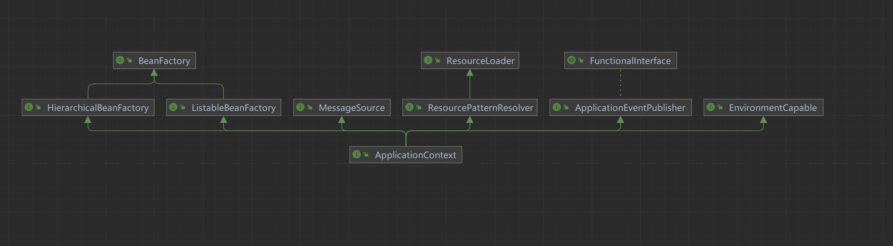

2）ApplicationContext在BeanFactory基础上对功能进行了扩展，例如：监听功能、国际化功能等。BeanFactory的API更偏向底层，ApplicationContext的API大多数是对这些底层API的封装；

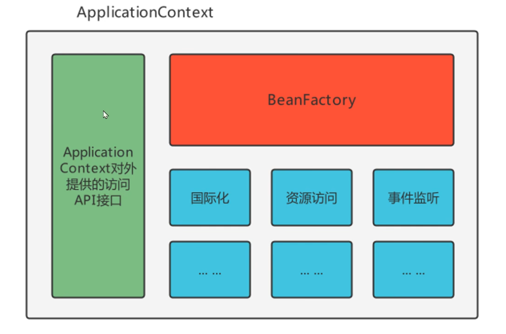

3）Bean创建的主要逻辑和功能都被封装在BeanFactory中，ApplicationContext不仅继承了BeanFactory，而且

ApplicationContext内部还维护着BeanFactory的引用，所以，ApplicationContext与BeanFactory既有继承关系，又有融合关系。

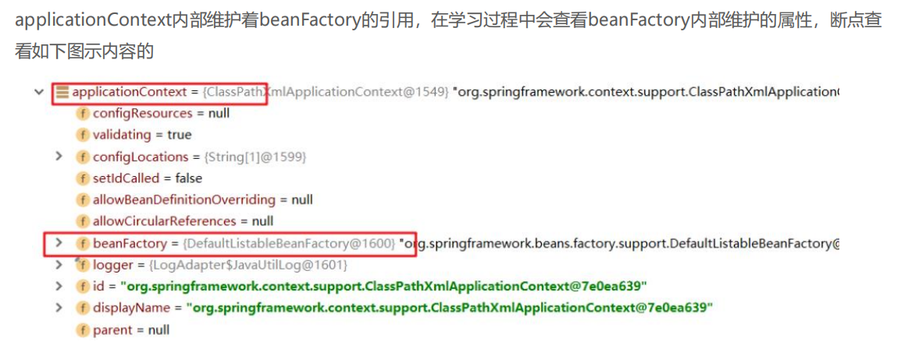

4）Bean的初始化时机不同，原始BeanFactory是在首次调用getBean时才进行Bean的创建，而ApplicationContext则是配置文件加载，容器一创建就将Bean都实例化并初始化好。

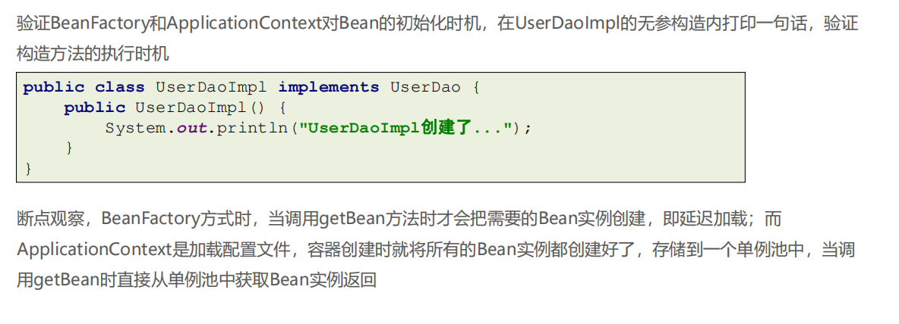

#### 2.3-7、BeanFactory的继承体系

BeanFactory是核心接口，项目运行过程中肯定有具体实现参与，这个具体实现就是**DefaultListableBeanFactory**，而ApplicationContext内部维护的Beanfactory的实现类也是它

#### 2.3-8、ApplicationContext的继承体系

##### 只在Spring基础环境下继承体系


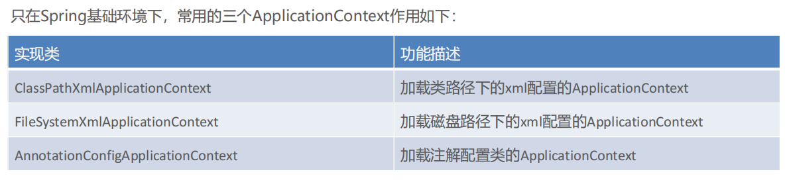

##### 在Spring基础环境中加入了其他组件解决方案继承体系

如果Spring基础环境中加入了其他组件解决方案，如web层解决方案，即导入spring-web坐标，此时

ApplicationContext的继承体系

```xml
<dependency>
<groupId>org.springframework</groupId>
<artifactId>spring-web</artifactId>
<version>5.3.7</version>
</dependency>
```

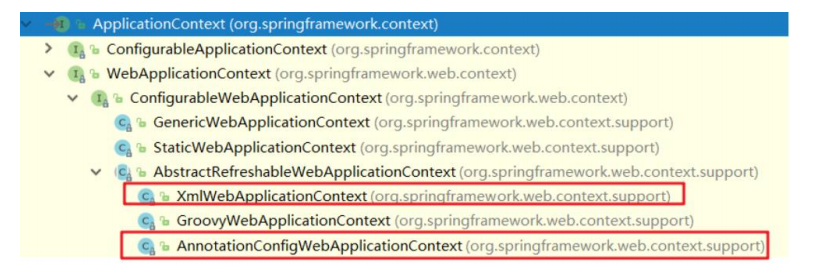


### 2.4、基于xml的Spring应用

#### 2.4-1、SpringBean的配置详解

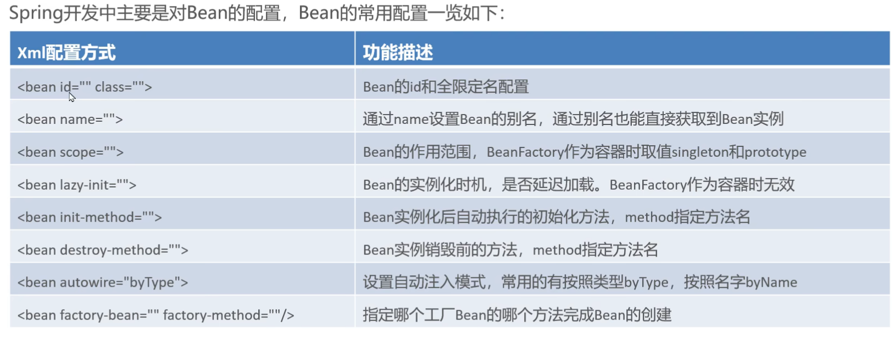

##### 1）Bean的基础配置

例如：配置UserDaoImpl由Spring容器负责管理

==可以通过debug模式找到beanfactory找到singletonObjects里面的suserService的id==

```xml
<bean id="userDao" class="com.example.dao.impl.UserDaoImpl"/>
```

此时存储到Spring容器（singleObjects单例池）中的Bean的beanName是userDao，值是UserDaoImpl对象，可

以根据beanName获取Bean实例

```java
applicationContext.getBean("userDao");
```

如果不配置id，则Spring会把当前Bean实例的全限定名作为beanName

```java
applicationContext.getBean("com.example.dao.impl.UserDaoImpl");
```

##### 2）Bean的别名配置

可以为当前Bean指定多个别名，根据别名也可以获得Bean对象

==可以通过debug模式找到beanfactory里面的aliasMap找到别名aaa和bbb==

```xml
<bean id="userDao" name="aaa,bbb" class="com.example.dao.impl.UserDaoImpl"/>
```

此时多个名称都可以获得UserDaoImpl实例对象

```xml
applicationContext.getBean("userDao");
applicationContext.getBean("aaa");
applicationContext.getBean("bbb");
```

如果你没有配置bean的id只有name，那么bean的id默认为name的第一个元素，

```xml
<bean name="aaa,bbb" class="com.example.dao.impl.UserDaoImpl"/> 
//此时的bean id为aaa
applicationContext.getBean("aaa");
```

如果不配置id和name，则Spring会把当前Bean实例的全限定名作为beanName

```xml
<bean class="com.example.dao.impl.UserDaoImpl"/> 
//此时的bean id为com.example.dao.impl.UserDaoImpl
applicationContext.getBean("com.example.dao.impl.UserDaoImpl");
```

##### 3）Bean的范围配置

默认情况下，单纯的Spring环境Bean的作用范围有两个：Singleton和Prototype

- **singleton**：单例，默认值，**Spring容器创建的时候，就会进行Bean的实例化**，并存储到容器内部的单例池中，每次getBean时都是从单例池中获取相同的Bean实例；

  >  当scope设置为singleton时，获得两次(bean)对象打印结果是一样的

  ```
  <bean id="userDao" class="com.example.dao.impl.UserDaoImpl" scope="singleton"/>
  ```

  ```java
  Object userDao = applicationContext.getBean("userDao");
  Object userDao2 = applicationContext.getBean("userDao");
  System.out.println(userDao); //com.example.dao.impl.UserDaoImpl@631330c
  System.out.println(userDao2); //com.example.dao.impl.UserDaoImpl@631330c
  ```

  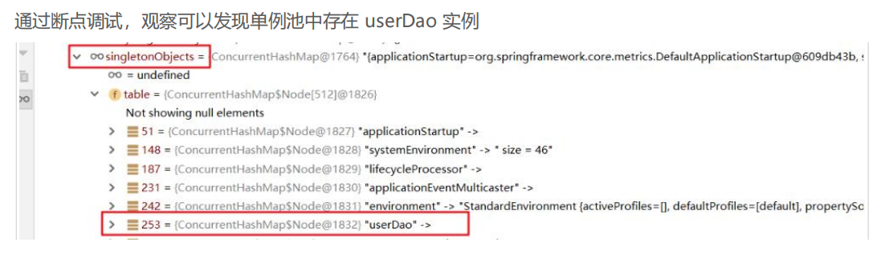

- **prototype**：原型，**Spring容器初始化时不会创建Bean实例，当调用getBean时才会实例化Bean**，每次getBean都会创建一个新的Bean实例。

  > 当scope设置为prototype时，获得两次对象打印结果是不一样的

  ```
  <bean id="userDao" class="com.example.dao.impl.UserDaoImpl" scope="prototype"/>
  ```

  ```java
  Object userDao = applicationContext.getBean("userDao");
  Object userDao2 = applicationContext.getBean("userDao");
  System.out.println(userDao); //com.itheima.dao.impl.UserDaoImpl@4d50efb8
  System.out.println(userDao2); //com.itheima.dao.impl.UserDaoImpl@7e2d773b
  ```

  通过断点调试，观察可以发现单例池中不存在 userDao 实例，但是 userDao的信息已经被存储到

  beanDefinitionMap中了

  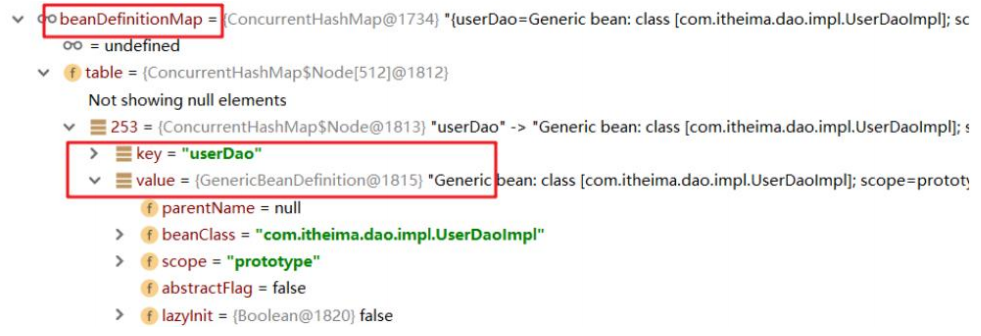

==面试题spring配置的bean中scope有哪些值？（目前有五种）==

```
在Spring 2.0之前，有singleton和prototype两种
在Spring 2.0之后，为支持web应用的ApplicationContext，增强另外三种：request，session和global session类型
分别是：
    1、singleton:一个Spring容器中只有一个Bean的实例，此为Spring的默认配置，全容器共享一个实例
    2、prototype:每次调用新建一个Bean的实例
    3、Request:Web项目中，给每一个http request新建一个Bean实例
    4、Session:Web项目中，给每一个http session新建一个Bean实例。
    5、GlobalSession:这个只在portal应用中有用，给每一个global http session新建一个Bean实例。
```

##### 4）Bean的延迟加载

当lazy-init设置为true时为延迟加载，也就是当Spring容器创建的时候，不会立即创建Bean实例，等待用到时在创

建Bean实例并存储到单例池中去，后续在使用该Bean直接从单例池获取即可，本质上该Bean还是单例的

==对ApplicationContext有效，对BeanFactory无效==

```
<bean id="userDao" class="com.example.dao.impl.UserDaoImpl" lazy-init="true"/>
```

##### 5）Bean的初始化和销毁方法配置

Bean在被实例化后，可以执行指定的初始化方法完成一些初始化的操作，Bean在销毁之前也可以执行指定的销毁

方法完成一些操作，初始化方法名称和销毁方法名称通过

```xml
<bean id="userDao" class="com.example.dao.impl.UserDaoImpl" init-method="init" 
destroy-method="destroy"/>
```

```java
public class UserDaoImpl implements UserDao {
    public UserDaoImpl() { System.out.println("UserDaoImpl创建了..."); }
    public void init(){ System.out.println("初始化方法..."); }
    public void destroy(){ System.out.println("销毁方法..."); }
}
```

扩展：除此之外，我们还可以通过实现 InitializingBean 接口，完成一些Bean的初始化操作，如下：

```java
public class UserDaoImpl implements UserDao, InitializingBean {
    public UserDaoImpl() {System.out.println("UserDaoImpl创建了...");}
    public void init(){System.out.println("初始化方法...");}
    public void destroy(){System.out.println("销毁方法...");}
    //执行时机早于init-method配置的方法
    public void afterPropertiesSet() throws Exception {
    	System.out.println("InitializingBean..."); 
    }
}
```

##### 6）Bean的实例化配置

Spring的实例化方式主要如下两种：**（构造方式实例化、工厂方式实例化）**

- 构造方式实例化：底层通过构造方法对Bean进行实例化

  构造方式实例化Bean又分为无参构造方法实例化和有参构造方法实例化，Spring中配置的<bean>几乎都是无参构造该方式，此处不在赘述。下面讲解有参构造方法实例化Bean

  ```java
  //有参构造方法
  public UserDaoImpl(String name){
  }
  ```

  有参构造在实例化Bean时，需要参数的注入，通过`<constructor-arg>`标签，嵌入在`<bean>`标签内部提供构造参数，如下：

  ```xml
  <bean id="userDao" class="com.example.dao.impl.UserDaoImpl">
  <constructor-arg name="name" value="haohao"/>
  </bean>
  ```

  

- 工厂方式实例化：底层通过调用自定义的工厂方法对Bean进行实例化

  工厂方式实例化Bean，又分为如下三种：

  **（静态工厂实例化Bean、实例工厂方法实例化Bean、实现FactoryBean规范延迟实例化Bean）**

  - 静态工厂方法实例化Bean

    静态工厂方法实例化Bean，其实就是定义一个工厂类，提供一个静态方法用于生产Bean实例，在将该工厂类及其静态方法配置给Spring即可

    ```java
    //工厂类
    public class FactoryBean1 {
    //非静态工厂方法
        public static UserService getUserService(String name){
        	//可以在此编写一些其他逻辑代码
        	return new UserServiceImpl(name);//这里执行有参构造方法
    	}
    }
    ```

    ```xml
    <bean id="userService1" class="com.example.factory.FactoryBean1" factory-method="getUserService">
    <constructor-arg name="name" value="haohao"/>
    </bean>
    ```

    PS：`<constructor-arg>`标签不仅仅是为构造方法传递参数，只要是为了实例化对象而传递的参数都可以通过`<constructor-arg>`标签完成，例如上面通过静态工厂方法实例化Bean所传递的参数也是要通过`<constructor-arg>`进行传递的

    测试代码，直接通过ApplicationContext获得userDao即可

    ```java
    ApplicationContext applicationContext = new ClassPathxmlApplicationContext("applicationContext.xml");
    Object userService = applicationContext.getBean("userService1");
    System.out.println(userService);
    ```

  - 实例工厂方法实例化Bean

    实例工厂方法，也就是非静态工厂方法产生Bean实例，与静态工厂方式比较，该方式需要先有工厂对象，在用工厂对象去调用非静态方法，所以在进行配置时，**要先配置工厂Bean，在配置目标Bean**

    ```java
    //工厂类
    public class FactoryBean2 {
    //非静态工厂方法
        public UserService getUserService(String name){
        	//可以在此编写一些其他逻辑代码
        	return new UserServiceImpl(name);//这里执行有参构造方法
    	}
    }
    ```

    ```xml
    <!-- 配置实例工厂Bean -->
    <bean id="FactoryBeanTest" class="com.example.factory.FactoryBean2"/>
    <!-- 配置实例工厂Bean的哪个方法作为工厂方法 -->
    <bean id="UserService2" factory-bean="FactoryBeanTest" factory-method="getUserService">
    <constructor-arg name="name" value="haohao"/>
    </bean>
    ```

    ```java
    public static void main(String[] args) {
            ApplicationContext applicationContext= new ClassPathXmlApplicationContext("applicationContext.xml");
            Object userService = applicationContext.getBean("UserService2");
            System.out.println(userService);
        }
    ```

  - 实现FactoryBean规范延迟实例化Bean

    上面不管是静态工厂方式还是非静态工厂方式，都是自定义的工厂方法，Spring提供了FactoryBean的接口规范，FactoryBean接口定义如下：

    ```java
    public interface FactoryBean<T> {
        String OBJECT_TYPE_ATTRIBUTE = “factoryBeanObjectType”;
        T getObject() throws Exception; //获得实例对象方法
        Class<?> getObjectType(); //获得实例对象类型方法
        default boolean isSingleton() {
        	return true;
        }
    }
    ```

    定义工厂实现FactoryBean

    ```java
    public class FactoryBean3 implements FactoryBean<UserService> {
        public UserService getObject() throws Exception {
        	return new UserServiceImpl();
        }
        public Class<?> getObjectType() {
        	return UserService.class;
    	}
    }
    ```

    配置FactoryBean交由Spring管理即可

    ```
    <bean id="UserService3" class="factory.FactoryBean3"  >
    ```

    通过Spring容器根据beanName可以正常获得UserServiceImpl

    ```java
    public static void main(String[] args) {
            ApplicationContext applicationContext= new ClassPathXmlApplicationContext("applicationContext.xml");
            Object userService = applicationContext.getBean("UserService3");
            System.out.println(userService);
        }
    ```

    通过断点观察发现Spring容器创建时，FactoryBean被实例化了，并存储到了单例池singletonObjects中，但是getObject() 方法尚未被执行，UserServiceImpl也没被实例化，当首次用到UserServiceImpl时，才调用getObject() ，此工厂方式产生的Bean实例不会存储到单例池singletonObjects中，会存储到factoryBeanObjectCache 缓存池中，并且后期每次使用到userService都从该缓存池中返回的是同一个userService实例。

    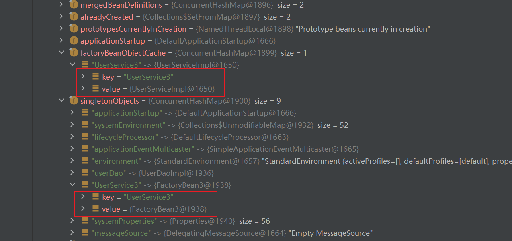

##### 7)Bean的依赖注入配置

**Bean的依赖注入有两种方式：**

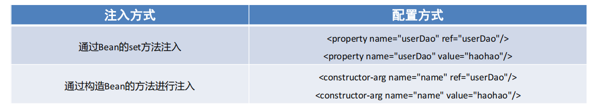

其中，ref 是 reference 的缩写形式，翻译为：涉及，参考的意思，用于引用其他Bean的id。value 用于注入普通属性值。

**依赖注入的数据类型有如下三种：**

普通数据类型，例如：String、int、boolean等，通过value属性指定。

引用数据类型，例如：UserDaoImpl、DataSource等，通过ref属性指定。

集合数据类型，例如：List、Map、Properties等。

**注入 List<T> 集合 – 普通数据**

```java
private List<String> stringList;
 
public void setStringList(List<String> stringList) {
    this.stringList = stringList;
}
public void show(){
    System.out.println(stringList);
}
```

```xml
<bean id="userService" class="com.example.service.impl.UserServiceImpl">
    <property name="stringList">
        <list>
            <value>haohao</value>
            <value>miaomiao</value>
        </list>
    </property>
</bean>
```

**注入 List<T> 集合 – 引用数据**

```java
private List<UserDao> userDaoList;
public void setUserDaoList(List<UserDao> userDaoList) {
    this.userDaoList = userDaoList;
}
public void show(){
    System.out.println(userDaoList);
}
```

```xml
<bean id="userService" class="com.example.service.impl.UserServiceImpl">
    <property name="userDaoList">
        <list>
            <bean class="com.example.dao.impl.UserDaoImpl"></bean>
            <bean class="com.example.dao.impl.UserDaoImpl"></bean>
            <bean class="com.example.dao.impl.UserDaoImpl"></bean>
        </list>
    </property>
</bean>
```

也可以直接引用容器中存在的Bean

```xml
<!--配置UserDao-->
<bean id="userDao" class="com.example.dao.impl.UserDaoImpl"/>
<bean id="userDao2" class="com.example.dao.impl.UserDaoImpl"/>
<bean id="userDao3" class="com.example.dao.impl.UserDaoImpl"/>
<!--配置UserService-->
<bean id="userService" class="com.example.service.impl.UserServiceImpl">
    <property name="userDaoList">
        <list>
            <ref bean="userDao"></ref>
            <ref bean="userDao2"></ref>
            <ref bean="userDao3"></ref>
        </list>
    </property>
</bean>
```

**注入 Set<T> 集合**

```java
//注入泛型为字符串的Set集合
public void setValueSet(Set<String> valueSet){
	valueSet.forEach(str->{
		System.out.println(str);
	});
}
//注入泛型为对象的Set集合
public void setObjSet(Set<UserDao> objSet){
	objSet.forEach(obj->{
		System.out.println(obj);
	});
}
```

```xml
<!-- 注入泛型为字符串的Set集合 -->
<property name="valueSet">
    <set>
    	<value>muzi</value>
    	<value>muran</value>
    </set>
</property>
<!-- 注入泛型为对象的Set集合 -->
<property name="objSet">
    <set>
    	<ref bean="userDao"></ref>
    	<ref bean="userDao2"></ref>
    	<ref bean="userDao3"></ref>
    </set>
</property>
```

**注入 Map<K,V> 集合**


```java
//注入值为字符串的Map集合
public void setValueMap(Map<String,String> valueMap){
	valueMap.forEach((k,v)->{
		System.out.println(k+"=="+v);
	});
}
//注入值为对象的Map集合
public void setObjMap(Map<String,UserDao> objMap){
	objMap.forEach((k,v)->{
		System.out.println(k+"=="+v);
	});
}
```

==当是引用类型时候用key-ref/value-ref==

```xml
<!--注入值为字符串的Map集合-->
<property name="valueMap">
    <map>
        <entry key="aaa" value="AAA" />
        <entry key="bbb" value="BBB" />
        <entry key="ccc" value="CCC" />
    </map>
</property>
<!--注入值为对象的Map集合-->
<property name="objMap">
    <map>
        <entry key="ud" value-ref="userDao"/>
        <entry key="ud2" value-ref="userDao2"/>
        <entry key="ud3" value-ref="userDao3"/>
    </map>
</property>
```

**注入 Properties 键值对**

```java
//注入Properties
public void setProperties(Properties properties){
	properties.forEach((k,v)->{
		System.out.println(k+"=="+v);
	});
}
```

```
<property name="properties">
    <props>
        <prop key="xxx">XXX</prop>
        <prop key="yyy">YYY</prop>
    </props>
</property>
```

**扩展：自动装配方式**

如果被注入的属性类型是Bean引用的话，那么可以在`<bean>` 标签中使用 autowire 属性去配置自动注入方式，属

性值有两个：

- byName：通过属性名自动装配，即去匹配 setXxx 与 id="xxx"（name="xxx"）是否一致；（==根据bean中的class进行装配==）
- byType：通过Bean的类型从容器中匹配，匹配出多个相同Bean类型时，报错。（==根据bean中的class进行装配==）

```xml
<bean id="userService" class="com.example.service.impl.UserServiceImpl" autowire="byType">
```


##### 8）Spring的其他配置标签

Spring 的 xml 标签大体上分为两类，一种是默认标签，一种是自定义标签

- **默认标签**：就是不用额外导入其他命名空间约束的标签，例如 `<bean> `标签

  Spring的默认标签用到的是Spring的默认命名空间

  ```xml
  <?xml version="1.0" encoding="UTF-8"?>
  <beans xmlns="http://www.springframework.org/schema/beans"
      xmlns:xsi="http://www.w3.org/2001/XMLSchema-instance"
      xsi:schemaLocation="http://www.springframework.org/schema/beans 
  http://www.springframework.org/schema/beans/spring-beans.xsd">
  </beans>
  ```

  该命名空间约束下的默认标签如下：

  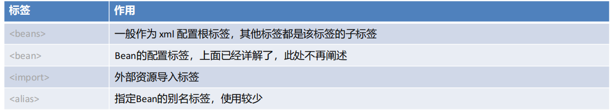

  **`<beans>`标签**，除了经常用的做为根标签外，还可以嵌套在根标签内，使用profile属性切换开发环境

  ```xml
  <!-- 配置测试环境下，需要加载的Bean实例 -->
  <beans profile="test">
  </beans>
  <!-- 配置开发环境下，需要加载的Bean实例 -->
  <beans profile="dev">
  </beans>
  ```

  可以使用以下两种方式指定被激活的环境：

  - 使用命令行动态参数，虚拟机参数位置加载 -Dspring.profiles.active=test
  - 使用代码的方式设置环境变量 System.setProperty("spring.profiles.active","test")

  **`<import>`标签**，用于导入其他配置文件，项目变大后，就会导致一个配置文件内容过多，可以将一个配置文件根据业务某块进行拆分，拆分后，最终通过`<import>`标签导入到一个主配置文件中，项目加载主配置文件就连同`<import>` 导入的文件一并加载了

  ```xml
  <!--导入用户模块配置文件-->
  <import resource="classpath:UserModuleApplicationContext.xml"/>
  <!--导入商品模块配置文件-->
  <import resource="classpath:ProductModuleApplicationContext.xml"/>
  ```

  **`<alias> `标签**是为某个Bean添加别名，与在<bean> 标签上使用name属性添加别名的方式一样，我们为UserServiceImpl指定四个别名：aaa、bbb、xxx、yyy

  ```xml
  <!--配置UserService-->
  <bean id="userService" name="aaa,bbb" class="com.example.service.impl.UserServiceImpl">
  <property name="userDao" ref="userDao"/>
  </bean>
  <!--指定别名-->
  <alias name="userService" alias="xxx"/>
  <alias name="userService" alias="yyy"/>
  ```

  断点调试，在beanFactory中维护着一个名为aliasMap的Map<String,String>集合，存储别名和beanName之间的映射关系

  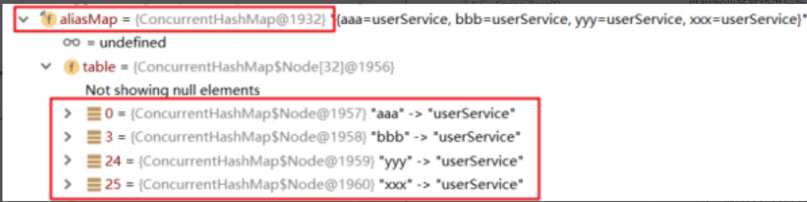

- **自定义标签**：就是需要额外引入其他命名空间约束，并通过前缀引用的标签，例如 <context:property

  -placeholder/> 标签

  ```xml
  <!--默认标签-->
  <bean id="userDao" class="com.itheima.dao.impl.UserDaoImpl"/>
  <!--自定义标签-->
  <context:property-placeholder/>
  <mvc:annotation-driven/>
  <dubbo:application name="application"/>
  ```

  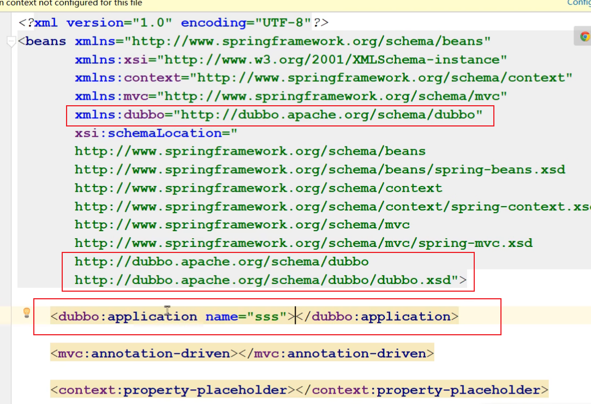

#### 2.4-2、Spring 的get方法

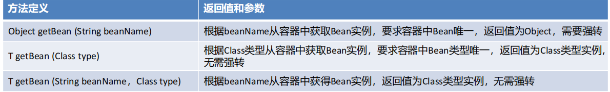

```java
//根据beanName获取容器中的Bean实例，需要手动强转
UserService userService = (UserService) applicationContext.getBean("userService");
//根据Bean类型去容器中匹配对应的Bean实例，如存在多个匹配Bean则报错
UserService userService2 = applicationContext.getBean(UserService.class);
//根据beanName获取容器中的Bean实例，指定Bean的Type类型
UserService userService3 = applicationContext.getBean("userService", 
UserService.class);
```

#### 2.4-3、Spring 配置非自定义Bean

在 xml 中配置的Bean都是自己定义的，例如：UserDaoImpl，UserServiceImpl。但是，在实际开发中有些

功能类并不是我们自己定义的，而是使用的第三方jar包中的，那么，这些Bean要想让Spring进行管理，也需要对

其进行配置

配置非自定义的Bean需要考虑如下两个问题：

- 被配置的Bean的实例化方式是什么？无参构造、有参构造、静态工厂方式还是实例工厂方式；
- 被配置的Bean是否需要注入必要属性。

##### 1）配置 Druid 数据源交由Spring管理

导入Druid坐标

```xml
<!-- mysql驱动 -->
<dependency>
    <groupId>mysql</groupId>
    <artifactId>mysql-connector-java</artifactId>
    <version>5.1.49</version>
</dependency>
<!-- druid数据源 -->
<dependency>
    <groupId>com.alibaba</groupId>
    <artifactId>druid</artifactId>
    <version>1.1.23</version>
</dependency>
```

配置 DruidDataSource

```xml
<!--配置 DruidDataSource数据源-->
<bean class="com.alibaba.druid.pool.DruidDataSource">
<!--配置必要属性-->
<property name="driverClassName" value="com.mysql.jdbc.Driver"/>
<property name="url" value="jdbc://localhost:3306/mybatis"/>
<property name="username" value="root"/>
<property name="password" value="root"/>
</bean>
```

##### 2）配置Connection交由Spring管理

> 这个是配置jdbc的操作原始代码
>
> Class.forName("com.mysql.jdbc.Driver");
>
> Connection connection = DriverManage.getConnection("url","username","password");

Connection 的产生是通过DriverManager的静态方法getConnection获取的，所以我们要用静态工厂方式配置

```xml
<bean class="java.lang.Class" factory-method="forName">
<constructor-arg name="className" value="com.mysql.jdbc.Driver"/>
</bean>
<bean id="connection" class="java.sql.DriverManager" factory-method="getConnection" 
scope="prototype">
<constructor-arg name="url" value="jdbc:mysql:///mybatis"/>
<constructor-arg name="user" value="root"/>
<constructor-arg name="password" value="root"/>
</bean>
```

##### 3）配置日期对象交由Spring管理

产生一个指定日期格式的对象，原始代码按如下

```java
String currentTimeStr = "2023-08-27 07:20:00";
SimpleDateFormat simpleDateFormat = new SimpleDateFormat("yyyy-MM-dd HH:mm:ss");
Date date = simpleDateFormat.parse(currentTimeStr);
```

可以看成是实例工厂方式，使用Spring配置方式产生Date实例

```xml
<bean id="simpleDateFormat" class="java.text.SimpleDateFormat">
	<constructor-arg name="pattern" value="yyyy-MM-dd HH:mm:ss"/>
</bean>
<bean id="date" factory-bean="simpleDateFormat" factory-method="parse">
	<constructor-arg name="source" value="2023-08-27 07:20:00"/>
</bean>
```

##### 4）配置MyBatis的SqlSessionFactory交由Spring管理

导入MyBatis的相关坐标：

```xml
<!--mybatis框架-->
<dependency>
    <groupId>org.mybatis</groupId>
    <artifactId>mybatis</artifactId>
    <version>3.5.5</version>
</dependency>
<!-- mysql驱动 -->
<dependency>
    <groupId>mysql</groupId>
    <artifactId>mysql-connector-java</artifactId>
    <version>5.1.49</version>
</dependency>
```

配置mybatis-conifg.xml

```xml
<?xml version="1.0" encoding="UTF-8" ?>
<!DOCTYPE configuration
  PUBLIC "-//mybatis.org//DTD Config 3.0//EN"
  "https://mybatis.org/dtd/mybatis-3-config.dtd">
<configuration>
    <environments default="development">
        <environment id="development">
        	<transactionManager type="JDBC"/>
            <dataSource type="POOLED">
                <property name="driver" value="com.mysql.jdbc.Driver"/>
                <property name="url" value="jdbc:mysql:///mybatis"/>
                <property name="username" value="root"/>
                <property name="password" value="root"/>
            </dataSource>
        </environment>
    </environments>
</configuration>
```

MyBatis原始获得SqlSessionFactory的方式：

```java
//加载mybatis核心配置文件，使用Spring静态工厂方式
InputStream inputStream = Resources.getResourceAsStream(“mybatis-conifg.xml”);
//创建SqlSessionFactoryBuilder对象，使用Spring无参构造方式
SqlSessionFactoryBuilder builder = new SqlSessionFactoryBuilder();
//调用SqlSessionFactoryBuilder的build方法，使用Spring实例工厂方式
SqlSessionFactory sqlSessionFactory = builder.build(inputStream);
```

SqlSessionFactory交由Spring管理配置如下：

```xml
<!--静态工厂方式产生Bean实例-->
<bean id="inputStream" class="org.apache.ibatis.io.Resources" factory-method="getResourceAsStream">
<constructor-arg name="resource" value="mybatis-config.xml"/>
</bean>
<!--无参构造方式产生Bean实例-->
<bean id="builder" class="org.apache.ibatis.session.SqlSessionFactoryBuilder"/>
<!--实例工厂方式产生Bean实例-->
<bean id="sqlSessionFactory" factory-bean="sqlSessionFactoryBuilder" factory-method="build">
<constructor-arg name="inputStream" ref="in"/>
</bean>
```

#### 2.4-4、Bean 实例化的基本流程

36

#### 2.4-5、Spring的后处理器

#### 2.4-6、Spring Bean的生命周期

#### 2.4-7、Spring IoC 整体流程总结

#### 2.4-8、Spring xml方式整合第三方框架


### 2.5、基于注解的Spring应用