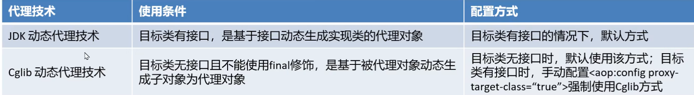

# 一套吃透 Spring 系列

作者：cool

## 一、前置知识

知道JavaBean概念

知道互联网开发基本概念和web项目的交互模型

具备Javaweb开发的基础

对注解和xml、properties配置文件作用，可以正常使用

可以使用Maven的方式进行项目开发

知道JavaEE的三层架构 和 MVC模式

知道反射、动态代理等作用和API

熟练使用IDEA的断点调试功能

知道MyBatis的基本使用


## 二、spring系统剖析

第一部分：ioc基础容器

第二部分：aop面向切面编程

第三部分：spring整合web环境

第四部分：web层解决方案--springmvc


### 2.1、传统Javaweb开发的困惑

#### 2.1-1、传统开发困惑分析


#### 2.1-2、传统javaweb开发困惑的解决方案


### 2.2、IoC、DI和AOP思想提出

#### 2.2-1、IoC 控制反转思想的提出

谁去充当第三方角色呢？

工厂设计模式，BeanFactory来充当第三方的角色，来产生Bean实例

BeanFactory怎么知道产生哪些Bean实例呢？

可以使用配置文件配置Bean的基本信息，BeanFactory根据配置文件来生产Bean实例


### 2.3、Spring框架的诞生

#### 2.3-1、spring框架概述

spring框架是一个开源的轻量级框架，它提供了强大的Ioc（DI）、AOP以及web的MVC功能。

#### 2.3-2、spring框架历史

1. Jsp 默默扛下所有；
2. MVC+三层架构分工明确，但开发成本及其高；
3. EJB **重**量级框架出现，走出一个困境，有进入另一个困境；
4. Spring 春天来到，随之，SSH风生水起、称霸武林；
5. Spring 稳住江湖大哥位置，SSM开始上位；
6. Spring 本着“拿来主义”的思维快速发展，生态不断健全；
7. SpringBoot 又一里程碑崛起，把“约定大于配置“思想玩儿的炉火纯青；
8. SpringCloud 打包了微服务众多解决方案，应对互联网项目更加easy！

#### 2.3-3、springframework技术栈图示


core container里面是什么？

```
core：依赖注入IoC与DI的最基本实现
beans：Bean工厂与bean的装配
context：spring的context上下文即IoC容器
SpEL：spring表达式语言
```

#### 2.3-4、BeanFactory快速入门（本质是bean工厂）

##### 使用Ioc来书写

1）导入Spring的jar包或Maven坐标 

 ==这里要注意maven的配置要配置好对应的maven才能收到合适的maven坐标和jar包==

```
<!--Spring核心-->
<dependency>
<groupId>org.springframework</groupId>
<artifactId>spring-context</artifactId>
<version>5.3.7</version>
</dependency>
```

2）定义UserService接口及其UserServiceImpl实现类

```java
//这是UserService
package service;
public interface UserService {}

//这是UserServiceImpl
package service.impl;
import service.UserService;
public class UserServiceImpl implements UserService {}
```

3）在resources中创建beans.xml配置文件，将UserServiceImpl的信息配置到该xml中

```xml
<bean id="userService" class="com.example.service.impl.UserServiceImpl"></bean>
```

4）编写测试代码，创建BeanFactory，加载配置文件，获取UserService实例对象

```java
import org.springframework.beans.factory.support.DefaultListableBeanFactory;
import org.springframework.beans.factory.xml.XmlBeanDefinitionReader;
import service.UserService;

public class BeanFactory {
    public static void main(String[] args) {
//        创建工厂对象
        DefaultListableBeanFactory beanFactory = new DefaultListableBeanFactory();
//        创建一个读取器（xml文件）
        XmlBeanDefinitionReader reader = new XmlBeanDefinitionReader(beanFactory);
//        读取器绑定工厂
        reader.loadBeanDefinitions("applicationContext.xml");
//        根据id获取Bean实例对象，可以强转类型为UserService也可以不强转默认类型为Object
        UserService userService = (UserService) beanFactory.getBean("userService");
        System.out.println(userService);
    }
}
```

上面使用BeanFactory完成了**IoC思想**的实现，下面去实现以下**DI依赖注入**：

1）定义UserDao接口及其UserDaoImpl实现类；

2）修改UserServiceImpl代码，添加一个setUserDao(UserDao userDao)用于接收注入的对象；

3）修改beans.xml配置文件，在UserDaoImpl的<bean>中嵌入<property>配置注入；

4）修改测试代码，获得UserService时，setUserService方法执行了注入操作。

##### 使用DI注入

==注意这里的业务层（Service）要调用数据访问层（Dao），使用DI思想==

1）定义UserDao接口及其UserDaoImpl实现类

```java
//定义UserDao接口
package dao;
public interface UserDao {}

//定义UserDaoImpl类
package dao.impl;
import dao.UserDao;
public class UserDaoImpl implements UserDao {
}
```

2）修改UserServiceImpl代码，添加一个setUserDao(UserDao userDao)用于接收注入的对象

```java
public class UserServiceImpl implements UserService {
	public void setUserDao(UserDao userDao) {
		System.out.println(userDao);
	}
}
```

3）定义UserDao接口及其UserDaoImpl实现类（在resources中的beans.xml中定义）

```xml
<!--    配置userServiceImpl-->
<bean id="userService" class="service.impl.UserServiceImpl">
        <property name="userDao" ref="userDao"/>
        <!-- 控制器调用setUserDao方法，将容器中的userDao bean作为传入的参数
        此处的name是决定userService类中的那个参数(setUserDao方法里面的userDao参数)
        ref是指bean配置文件中的bean名称 -->
</bean>

<!--    配置userDaoimpl -->
<bean id="userDao" class="dao.impl.UserDaoImpl"></bean>
```

4）编写测试代码，创建BeanFactory，加载配置文件，获取UserService实例对象

```java
//创建BeanFactory
DefaultListableBeanFactory beanFactory = new DefaultListableBeanFactory();
//创建读取器
XmlBeanDefinitionReader reader = new XmlBeanDefinitionReader(beanFactory);
//加载配置文件
reader.loadBeanDefinitions("beans.xml");
//获取Bean实例对象
UserDao userService = (UserService) beanFactory.getBean("userService");
```

==**spring 中property解释以及property标签里面的属性**==

> 详情参看这个文章
>
> ```
> name为属性名 为bean的id
> ref标签
> 定义对此工厂或外部工厂（父工厂或包含工厂）中的另一个bean的引用。
> ```
>
> https://blog.csdn.net/xiao1_1bing/article/details/81086116?spm=1001.2101.3001.6661.1&utm_medium=distribute.pc_relevant_t0.none-task-blog-2%7Edefault%7EBlogCommendFromBaidu%7ERate-1-81086116-blog-103433510.pc_relevant_vip_default&depth_1-utm_source=distribute.pc_relevant_t0.none-task-blog-2%7Edefault%7EBlogCommendFromBaidu%7ERate-1-81086116-blog-103433510.pc_relevant_vip_default&utm_relevant_index=1


#### 2.3-5、ApplicationContext快速入门

ApplicationContext 称为Spring容器，内部封装了BeanFactory，比BeanFactory功能更丰富更强大，使用
ApplicationContext 进行开发时，xml配置文件的名称习惯写成applicationContext.xml

```java
//创建ApplicationContext,加载配置文件，实例化容器
ApplicationContext applicationContext = new ClassPathxmlApplicationContext(“applicationContext.xml");
//根据beanName获得容器中的Bean实例
UserService userService = (UserService) applicationContext.getBean("userService");
System.out.println(userService);
```

#### 2.3-6、BeanFactory与ApplicationContext的关系

1）BeanFactory是Spring的早期接口，称为Spring的**Bean工厂**，ApplicationContext是后期更高级接口，称之为

**Spring 容器**；

```
ApplicationContext除了继承了BeanFactory外，还继承了ApplicationEventPublisher（事件发布器）、ResouresPatternResolver（资源解析器）、MessageSource（消息资源）等。但是ApplicationContext的核心功能还是BeanFactory。
```


2）ApplicationContext在BeanFactory基础上对功能进行了扩展，例如：监听功能、国际化功能等。BeanFactory的API更偏向底层，ApplicationContext的API大多数是对这些底层API的封装；


3）Bean创建的主要逻辑和功能都被封装在BeanFactory中，ApplicationContext不仅继承了BeanFactory，而且

ApplicationContext内部还维护着BeanFactory的引用，所以，ApplicationContext与BeanFactory既有继承关系，又有融合关系。


4）Bean的初始化时机不同，原始BeanFactory是在首次调用getBean时才进行Bean的创建，而ApplicationContext则是配置文件加载，容器一创建就将Bean都实例化并初始化好。


#### 2.3-7、BeanFactory的继承体系

BeanFactory是核心接口，项目运行过程中肯定有具体实现参与，这个具体实现就是**DefaultListableBeanFactory**，而ApplicationContext内部维护的Beanfactory的实现类也是它

#### 2.3-8、ApplicationContext的继承体系

##### 只在Spring基础环境下继承体系


##### 在Spring基础环境中加入了其他组件解决方案继承体系

如果Spring基础环境中加入了其他组件解决方案，如web层解决方案，即导入spring-web坐标，此时

ApplicationContext的继承体系

```xml
<dependency>
<groupId>org.springframework</groupId>
<artifactId>spring-web</artifactId>
<version>5.3.7</version>
</dependency>
```


### 2.4、基于xml的Spring应用

#### 2.4-1、SpringBean的配置详解


##### 1）Bean的基础配置

例如：配置UserDaoImpl由Spring容器负责管理

==可以通过debug模式找到beanfactory找到singletonObjects里面的suserService的id==

```xml
<bean id="userDao" class="com.example.dao.impl.UserDaoImpl"/>
```

此时存储到Spring容器（singleObjects单例池）中的Bean的beanName是userDao，值是UserDaoImpl对象，可

以根据beanName获取Bean实例

```java
applicationContext.getBean("userDao");
```

如果不配置id，则Spring会把当前Bean实例的全限定名作为beanName

```java
applicationContext.getBean("com.example.dao.impl.UserDaoImpl");
```

##### 2）Bean的别名配置

可以为当前Bean指定多个别名，根据别名也可以获得Bean对象

==可以通过debug模式找到beanfactory里面的aliasMap找到别名aaa和bbb==

```xml
<bean id="userDao" name="aaa,bbb" class="com.example.dao.impl.UserDaoImpl"/>
```

此时多个名称都可以获得UserDaoImpl实例对象

```xml
applicationContext.getBean("userDao");
applicationContext.getBean("aaa");
applicationContext.getBean("bbb");
```

如果你没有配置bean的id只有name，那么bean的id默认为name的第一个元素，

```xml
<bean name="aaa,bbb" class="com.example.dao.impl.UserDaoImpl"/> 
//此时的bean id为aaa
applicationContext.getBean("aaa");
```

如果不配置id和name，则Spring会把当前Bean实例的全限定名作为beanName

```xml
<bean class="com.example.dao.impl.UserDaoImpl"/> 
//此时的bean id为com.example.dao.impl.UserDaoImpl
applicationContext.getBean("com.example.dao.impl.UserDaoImpl");
```

##### 3）Bean的范围配置

默认情况下，单纯的Spring环境Bean的作用范围有两个：Singleton和Prototype

- **singleton**：单例，默认值，**Spring容器创建的时候，就会进行Bean的实例化**，并存储到容器内部的单例池中，每次getBean时都是从单例池中获取相同的Bean实例；

  >  当scope设置为singleton时，获得两次(bean)对象打印结果是一样的

  ```
  <bean id="userDao" class="com.example.dao.impl.UserDaoImpl" scope="singleton"/>
  ```

  ```java
  Object userDao = applicationContext.getBean("userDao");
  Object userDao2 = applicationContext.getBean("userDao");
  System.out.println(userDao); //com.example.dao.impl.UserDaoImpl@631330c
  System.out.println(userDao2); //com.example.dao.impl.UserDaoImpl@631330c
  ```

  

- **prototype**：原型，**Spring容器初始化时不会创建Bean实例，当调用getBean时才会实例化Bean**，每次getBean都会创建一个新的Bean实例。

  > 当scope设置为prototype时，获得两次对象打印结果是不一样的

  ```
  <bean id="userDao" class="com.example.dao.impl.UserDaoImpl" scope="prototype"/>
  ```

  ```java
  Object userDao = applicationContext.getBean("userDao");
  Object userDao2 = applicationContext.getBean("userDao");
  System.out.println(userDao); //com.itheima.dao.impl.UserDaoImpl@4d50efb8
  System.out.println(userDao2); //com.itheima.dao.impl.UserDaoImpl@7e2d773b
  ```

  通过断点调试，观察可以发现单例池中不存在 userDao 实例，但是 userDao的信息已经被存储到

  beanDefinitionMap中了

  

==面试题spring配置的bean中scope有哪些值？（目前有五种）==

```
在Spring 2.0之前，有singleton和prototype两种
在Spring 2.0之后，为支持web应用的ApplicationContext，增强另外三种：request，session和global session类型
分别是：
    1、singleton:一个Spring容器中只有一个Bean的实例，此为Spring的默认配置，全容器共享一个实例
    2、prototype:每次调用新建一个Bean的实例
    3、Request:Web项目中，给每一个http request新建一个Bean实例
    4、Session:Web项目中，给每一个http session新建一个Bean实例。
    5、GlobalSession:这个只在portal应用中有用，给每一个global http session新建一个Bean实例。
```

##### 4）Bean的延迟加载

当lazy-init设置为true时为延迟加载，也就是当Spring容器创建的时候，不会立即创建Bean实例，等待用到时在创

建Bean实例并存储到单例池中去，后续在使用该Bean直接从单例池获取即可，本质上该Bean还是单例的

==对ApplicationContext有效，对BeanFactory无效==

```
<bean id="userDao" class="com.example.dao.impl.UserDaoImpl" lazy-init="true"/>
```

##### 5）Bean的初始化和销毁方法配置

Bean在被实例化后，可以执行指定的初始化方法完成一些初始化的操作，Bean在销毁之前也可以执行指定的销毁

方法完成一些操作，初始化方法名称和销毁方法名称通过

```xml
<bean id="userDao" class="com.example.dao.impl.UserDaoImpl" init-method="init" 
destroy-method="destroy"/>
```

```java
public class UserDaoImpl implements UserDao {
    public UserDaoImpl() { System.out.println("UserDaoImpl创建了..."); }
    public void init(){ System.out.println("初始化方法..."); }
    public void destroy(){ System.out.println("销毁方法..."); }
}
```

扩展：除此之外，我们还可以通过实现 InitializingBean 接口，完成一些Bean的初始化操作，如下：

```java
public class UserDaoImpl implements UserDao, InitializingBean {
    public UserDaoImpl() {System.out.println("UserDaoImpl创建了...");}
    public void init(){System.out.println("初始化方法...");}
    public void destroy(){System.out.println("销毁方法...");}
    //执行时机早于init-method配置的方法
    public void afterPropertiesSet() throws Exception {
    	System.out.println("InitializingBean..."); 
    }
}
```

##### 6）Bean的实例化配置

Spring的实例化方式主要如下两种：**（构造方式实例化、工厂方式实例化）**

- 构造方式实例化：底层通过构造方法对Bean进行实例化

  构造方式实例化Bean又分为无参构造方法实例化和有参构造方法实例化，Spring中配置的<bean>几乎都是无参构造该方式，此处不在赘述。下面讲解有参构造方法实例化Bean

  ```java
  //有参构造方法
  public UserDaoImpl(String name){
  }
  ```

  有参构造在实例化Bean时，需要参数的注入，通过`<constructor-arg>`标签，嵌入在`<bean>`标签内部提供构造参数，如下：

  ```xml
  <bean id="userDao" class="com.example.dao.impl.UserDaoImpl">
  <constructor-arg name="name" value="haohao"/>
  </bean>
  ```

  

- 工厂方式实例化：底层通过调用自定义的工厂方法对Bean进行实例化

  工厂方式实例化Bean，又分为如下三种：

  **（静态工厂实例化Bean、实例工厂方法实例化Bean、实现FactoryBean规范延迟实例化Bean）**

  - 静态工厂方法实例化Bean

    静态工厂方法实例化Bean，其实就是定义一个工厂类，提供一个静态方法用于生产Bean实例，在将该工厂类及其静态方法配置给Spring即可

    ```java
    //工厂类
    public class FactoryBean1 {
    //非静态工厂方法
        public static UserService getUserService(String name){
        	//可以在此编写一些其他逻辑代码
        	return new UserServiceImpl(name);//这里执行有参构造方法
    	}
    }
    ```

    ```xml
    <bean id="userService1" class="com.example.factory.FactoryBean1" factory-method="getUserService">
    <constructor-arg name="name" value="haohao"/>
    </bean>
    ```

    PS：`<constructor-arg>`标签不仅仅是为构造方法传递参数，只要是为了实例化对象而传递的参数都可以通过`<constructor-arg>`标签完成，例如上面通过静态工厂方法实例化Bean所传递的参数也是要通过`<constructor-arg>`进行传递的

    测试代码，直接通过ApplicationContext获得userDao即可

    ```java
    ApplicationContext applicationContext = new ClassPathxmlApplicationContext("applicationContext.xml");
    Object userService = applicationContext.getBean("userService1");
    System.out.println(userService);
    ```

  - 实例工厂方法实例化Bean

    实例工厂方法，也就是非静态工厂方法产生Bean实例，与静态工厂方式比较，该方式需要先有工厂对象，在用工厂对象去调用非静态方法，所以在进行配置时，**要先配置工厂Bean，在配置目标Bean**

    ```java
    //工厂类
    public class FactoryBean2 {
    //非静态工厂方法
        public UserService getUserService(String name){
        	//可以在此编写一些其他逻辑代码
        	return new UserServiceImpl(name);//这里执行有参构造方法
    	}
    }
    ```

    ```xml
    <!-- 配置实例工厂Bean -->
    <bean id="FactoryBeanTest" class="com.example.factory.FactoryBean2"/>
    <!-- 配置实例工厂Bean的哪个方法作为工厂方法 -->
    <bean id="UserService2" factory-bean="FactoryBeanTest" factory-method="getUserService">
    <constructor-arg name="name" value="haohao"/>
    </bean>
    ```

    ```java
    public static void main(String[] args) {
            ApplicationContext applicationContext= new ClassPathXmlApplicationContext("applicationContext.xml");
            Object userService = applicationContext.getBean("UserService2");
            System.out.println(userService);
        }
    ```

  - 实现FactoryBean规范延迟实例化Bean

    上面不管是静态工厂方式还是非静态工厂方式，都是自定义的工厂方法，Spring提供了FactoryBean的接口规范，FactoryBean接口定义如下：

    ```java
    public interface FactoryBean<T> {
        String OBJECT_TYPE_ATTRIBUTE = “factoryBeanObjectType”;
        T getObject() throws Exception; //获得实例对象方法
        Class<?> getObjectType(); //获得实例对象类型方法
        default boolean isSingleton() {
        	return true;
        }
    }
    ```

    定义工厂实现FactoryBean

    ```java
    public class FactoryBean3 implements FactoryBean<UserService> {
        public UserService getObject() throws Exception {
        	return new UserServiceImpl();
        }
        public Class<?> getObjectType() {
        	return UserService.class;
    	}
    }
    ```

    配置FactoryBean交由Spring管理即可

    ```
    <bean id="UserService3" class="factory.FactoryBean3"  >
    ```

    通过Spring容器根据beanName可以正常获得UserServiceImpl

    ```java
    public static void main(String[] args) {
            ApplicationContext applicationContext= new ClassPathXmlApplicationContext("applicationContext.xml");
            Object userService = applicationContext.getBean("UserService3");
            System.out.println(userService);
        }
    ```

    通过断点观察发现Spring容器创建时，FactoryBean被实例化了，并存储到了单例池singletonObjects中，但是getObject() 方法尚未被执行，UserServiceImpl也没被实例化，当首次用到UserServiceImpl时，才调用getObject() ，此工厂方式产生的Bean实例不会存储到单例池singletonObjects中，会存储到factoryBeanObjectCache 缓存池中，并且后期每次使用到userService都从该缓存池中返回的是同一个userService实例。

    

##### 7)Bean的依赖注入配置

**Bean的依赖注入有两种方式：**


其中，ref 是 reference 的缩写形式，翻译为：涉及，参考的意思，用于引用其他Bean的id。value 用于注入普通属性值。

**依赖注入的数据类型有如下三种：**

普通数据类型，例如：String、int、boolean等，通过value属性指定。

引用数据类型，例如：UserDaoImpl、DataSource等，通过ref属性指定。

集合数据类型，例如：List、Map、Properties等。

**注入 List<T> 集合 – 普通数据**

```java
private List<String> stringList;
 
public void setStringList(List<String> stringList) {
    this.stringList = stringList;
}
public void show(){
    System.out.println(stringList);
}
```

```xml
<bean id="userService" class="com.example.service.impl.UserServiceImpl">
    <property name="stringList">
        <list>
            <value>haohao</value>
            <value>miaomiao</value>
        </list>
    </property>
</bean>
```

**注入 List<T> 集合 – 引用数据**

```java
private List<UserDao> userDaoList;
public void setUserDaoList(List<UserDao> userDaoList) {
    this.userDaoList = userDaoList;
}
public void show(){
    System.out.println(userDaoList);
}
```

```xml
<bean id="userService" class="com.example.service.impl.UserServiceImpl">
    <property name="userDaoList">
        <list>
            <bean class="com.example.dao.impl.UserDaoImpl"></bean>
            <bean class="com.example.dao.impl.UserDaoImpl"></bean>
            <bean class="com.example.dao.impl.UserDaoImpl"></bean>
        </list>
    </property>
</bean>
```

也可以直接引用容器中存在的Bean

```xml
<!--配置UserDao-->
<bean id="userDao" class="com.example.dao.impl.UserDaoImpl"/>
<bean id="userDao2" class="com.example.dao.impl.UserDaoImpl"/>
<bean id="userDao3" class="com.example.dao.impl.UserDaoImpl"/>
<!--配置UserService-->
<bean id="userService" class="com.example.service.impl.UserServiceImpl">
    <property name="userDaoList">
        <list>
            <ref bean="userDao"></ref>
            <ref bean="userDao2"></ref>
            <ref bean="userDao3"></ref>
        </list>
    </property>
</bean>
```

**注入 Set<T> 集合**

```java
//注入泛型为字符串的Set集合
public void setValueSet(Set<String> valueSet){
	valueSet.forEach(str->{
		System.out.println(str);
	});
}
//注入泛型为对象的Set集合
public void setObjSet(Set<UserDao> objSet){
	objSet.forEach(obj->{
		System.out.println(obj);
	});
}
```

```xml
<!-- 注入泛型为字符串的Set集合 -->
<property name="valueSet">
    <set>
    	<value>muzi</value>
    	<value>muran</value>
    </set>
</property>
<!-- 注入泛型为对象的Set集合 -->
<property name="objSet">
    <set>
    	<ref bean="userDao"></ref>
    	<ref bean="userDao2"></ref>
    	<ref bean="userDao3"></ref>
    </set>
</property>
```

**注入 Map<K,V> 集合**


```java
//注入值为字符串的Map集合
public void setValueMap(Map<String,String> valueMap){
	valueMap.forEach((k,v)->{
		System.out.println(k+"=="+v);
	});
}
//注入值为对象的Map集合
public void setObjMap(Map<String,UserDao> objMap){
	objMap.forEach((k,v)->{
		System.out.println(k+"=="+v);
	});
}
```

==当是引用类型时候用key-ref/value-ref==

```xml
<!--注入值为字符串的Map集合-->
<property name="valueMap">
    <map>
        <entry key="aaa" value="AAA" />
        <entry key="bbb" value="BBB" />
        <entry key="ccc" value="CCC" />
    </map>
</property>
<!--注入值为对象的Map集合-->
<property name="objMap">
    <map>
        <entry key="ud" value-ref="userDao"/>
        <entry key="ud2" value-ref="userDao2"/>
        <entry key="ud3" value-ref="userDao3"/>
    </map>
</property>
```

**注入 Properties 键值对**

```java
//注入Properties
public void setProperties(Properties properties){
	properties.forEach((k,v)->{
		System.out.println(k+"=="+v);
	});
}
```

```
<property name="properties">
    <props>
        <prop key="xxx">XXX</prop>
        <prop key="yyy">YYY</prop>
    </props>
</property>
```

**扩展：自动装配方式**

如果被注入的属性类型是Bean引用的话，那么可以在`<bean>` 标签中使用 autowire 属性去配置自动注入方式，属

性值有两个：

- byName：通过属性名自动装配，即去匹配 setXxx 与 id="xxx"（name="xxx"）是否一致；（==根据bean中的class进行装配==）
- byType：通过Bean的类型从容器中匹配，匹配出多个相同Bean类型时，报错。（==根据bean中的class进行装配==）

```xml
<bean id="userService" class="com.example.service.impl.UserServiceImpl" autowire="byType">
```


##### 8）Spring的其他配置标签

Spring 的 xml 标签大体上分为两类，一种是默认标签，一种是自定义标签

- **默认标签**：就是不用额外导入其他命名空间约束的标签，例如 `<bean> `标签

  Spring的默认标签用到的是Spring的默认命名空间

  ```xml
  <?xml version="1.0" encoding="UTF-8"?>
  <beans xmlns="http://www.springframework.org/schema/beans"
      xmlns:xsi="http://www.w3.org/2001/XMLSchema-instance"
      xsi:schemaLocation="http://www.springframework.org/schema/beans 
  http://www.springframework.org/schema/beans/spring-beans.xsd">
  </beans>
  ```

  该命名空间约束下的默认标签如下：

  

  **`<beans>`标签**，除了经常用的做为根标签外，还可以嵌套在根标签内，使用profile属性切换开发环境

  ```xml
  <!-- 配置测试环境下，需要加载的Bean实例 -->
  <beans profile="test">
  </beans>
  <!-- 配置开发环境下，需要加载的Bean实例 -->
  <beans profile="dev">
  </beans>
  ```

  可以使用以下两种方式指定被激活的环境：

  - 使用命令行动态参数，虚拟机参数位置加载 -Dspring.profiles.active=test
  - 使用代码的方式设置环境变量 System.setProperty("spring.profiles.active","test")

  **`<import>`标签**，用于导入其他配置文件，项目变大后，就会导致一个配置文件内容过多，可以将一个配置文件根据业务某块进行拆分，拆分后，最终通过`<import>`标签导入到一个主配置文件中，项目加载主配置文件就连同`<import>` 导入的文件一并加载了

  ```xml
  <!--导入用户模块配置文件-->
  <import resource="classpath:UserModuleApplicationContext.xml"/>
  <!--导入商品模块配置文件-->
  <import resource="classpath:ProductModuleApplicationContext.xml"/>
  ```

  **`<alias> `标签**是为某个Bean添加别名，与在<bean> 标签上使用name属性添加别名的方式一样，我们为UserServiceImpl指定四个别名：aaa、bbb、xxx、yyy

  ```xml
  <!--配置UserService-->
  <bean id="userService" name="aaa,bbb" class="com.example.service.impl.UserServiceImpl">
  <property name="userDao" ref="userDao"/>
  </bean>
  <!--指定别名-->
  <alias name="userService" alias="xxx"/>
  <alias name="userService" alias="yyy"/>
  ```

  断点调试，在beanFactory中维护着一个名为aliasMap的Map<String,String>集合，存储别名和beanName之间的映射关系

  

- **自定义标签**：就是需要额外引入其他命名空间约束，并通过前缀引用的标签，例如 <context:property

  -placeholder/> 标签

  ```xml
  <!--默认标签-->
  <bean id="userDao" class="com.itheima.dao.impl.UserDaoImpl"/>
  <!--自定义标签-->
  <context:property-placeholder/>
  <mvc:annotation-driven/>
  <dubbo:application name="application"/>
  ```

  

#### 2.4-2、Spring 的get方法


```java
//根据beanName获取容器中的Bean实例，需要手动强转
UserService userService = (UserService) applicationContext.getBean("userService");
//根据Bean类型去容器中匹配对应的Bean实例，如存在多个匹配Bean则报错
UserService userService2 = applicationContext.getBean(UserService.class);
//根据beanName获取容器中的Bean实例，指定Bean的Type类型
UserService userService3 = applicationContext.getBean("userService", 
UserService.class);
```

#### 2.4-3、Spring 配置非自定义Bean

在 xml 中配置的Bean都是自己定义的，例如：UserDaoImpl，UserServiceImpl。但是，在实际开发中有些

功能类并不是我们自己定义的，而是使用的第三方jar包中的，那么，这些Bean要想让Spring进行管理，也需要对

其进行配置

配置非自定义的Bean需要考虑如下两个问题：

- 被配置的Bean的实例化方式是什么？无参构造、有参构造、静态工厂方式还是实例工厂方式；
- 被配置的Bean是否需要注入必要属性。

##### 1）配置 Druid 数据源交由Spring管理

导入Druid坐标

```xml
<!-- mysql驱动 -->
<dependency>
    <groupId>mysql</groupId>
    <artifactId>mysql-connector-java</artifactId>
    <version>5.1.49</version>
</dependency>
<!-- druid数据源 -->
<dependency>
    <groupId>com.alibaba</groupId>
    <artifactId>druid</artifactId>
    <version>1.1.23</version>
</dependency>
```

配置 DruidDataSource

```xml
<!--配置 DruidDataSource数据源-->
<bean class="com.alibaba.druid.pool.DruidDataSource">
<!--配置必要属性-->
<property name="driverClassName" value="com.mysql.jdbc.Driver"/>
<property name="url" value="jdbc://localhost:3306/mybatis"/>
<property name="username" value="root"/>
<property name="password" value="root"/>
</bean>
```

##### 2）配置Connection交由Spring管理

> 这个是配置jdbc的操作原始代码
>
> Class.forName("com.mysql.jdbc.Driver");
>
> Connection connection = DriverManage.getConnection("url","username","password");

Connection 的产生是通过DriverManager的静态方法getConnection获取的，所以我们要用静态工厂方式配置

```xml
<bean class="java.lang.Class" factory-method="forName">
<constructor-arg name="className" value="com.mysql.jdbc.Driver"/>
</bean>
<bean id="connection" class="java.sql.DriverManager" factory-method="getConnection" 
scope="prototype">
<constructor-arg name="url" value="jdbc:mysql:///mybatis"/>
<constructor-arg name="user" value="root"/>
<constructor-arg name="password" value="root"/>
</bean>
```

##### 3）配置日期对象交由Spring管理

产生一个指定日期格式的对象，原始代码按如下

```java
String currentTimeStr = "2023-08-27 07:20:00";
SimpleDateFormat simpleDateFormat = new SimpleDateFormat("yyyy-MM-dd HH:mm:ss");
Date date = simpleDateFormat.parse(currentTimeStr);
```

可以看成是实例工厂方式，使用Spring配置方式产生Date实例

```xml
<bean id="simpleDateFormat" class="java.text.SimpleDateFormat">
	<constructor-arg name="pattern" value="yyyy-MM-dd HH:mm:ss"/>
</bean>
<bean id="date" factory-bean="simpleDateFormat" factory-method="parse">
	<constructor-arg name="source" value="2023-08-27 07:20:00"/>
</bean>
```

##### 4）配置MyBatis的SqlSessionFactory交由Spring管理

导入MyBatis的相关坐标：

```xml
<!--mybatis框架-->
<dependency>
    <groupId>org.mybatis</groupId>
    <artifactId>mybatis</artifactId>
    <version>3.5.5</version>
</dependency>
<!-- mysql驱动 -->
<dependency>
    <groupId>mysql</groupId>
    <artifactId>mysql-connector-java</artifactId>
    <version>5.1.49</version>
</dependency>
```

配置mybatis-conifg.xml

```xml
<?xml version="1.0" encoding="UTF-8" ?>
<!DOCTYPE configuration
  PUBLIC "-//mybatis.org//DTD Config 3.0//EN"
  "https://mybatis.org/dtd/mybatis-3-config.dtd">
<configuration>
    <environments default="development">
        <environment id="development">
        	<transactionManager type="JDBC"/>
            <dataSource type="POOLED">
                <property name="driver" value="com.mysql.jdbc.Driver"/>
                <property name="url" value="jdbc:mysql:///mybatis"/>
                <property name="username" value="root"/>
                <property name="password" value="root"/>
            </dataSource>
        </environment>
    </environments>
</configuration>
```

MyBatis原始获得SqlSessionFactory的方式：

```java
//加载mybatis核心配置文件，使用Spring静态工厂方式
InputStream inputStream = Resources.getResourceAsStream(“mybatis-conifg.xml”);
//创建SqlSessionFactoryBuilder对象，使用Spring无参构造方式
SqlSessionFactoryBuilder builder = new SqlSessionFactoryBuilder();
//调用SqlSessionFactoryBuilder的build方法，使用Spring实例工厂方式
SqlSessionFactory sqlSessionFactory = builder.build(inputStream);
```

SqlSessionFactory交由Spring管理配置如下：

```xml
<!--静态工厂方式产生Bean实例-->
<bean id="inputStream" class="org.apache.ibatis.io.Resources" factory-method="getResourceAsStream">
<constructor-arg name="resource" value="mybatis-config.xml"/>
</bean>
<!--无参构造方式产生Bean实例-->
<bean id="builder" class="org.apache.ibatis.session.SqlSessionFactoryBuilder"/>
<!--实例工厂方式产生Bean实例-->
<bean id="sqlSessionFactory" factory-bean="sqlSessionFactoryBuilder" factory-method="build">
<constructor-arg name="inputStream" ref="in"/>
</bean>
```

#### 2.4-4、Bean 实例化的基本流程

Spring容器在进行初始化时，会将xml配置的`<bean>`的信息封装成一个BeanDefinition对象，所有的BeanDefinition存储到一个名为**beanDefinitionMap**的Map集合中去，Spring框架在对该Map进行遍历，**使用反射创建Bean实例对象**，创建好的Bean对象存储在一个名为**singletonObjects**的Map集合中，当**调用getBean方法时则最终从该Map集合中取出Bean实例对象返回**。

Bean信息定义对象-BeanDefinition

```xml
<bean id="" class="" name="" lazy-init="" scope="" init-method="" destroy-method="" factory-bean="" factory-method="" abstract="" depends-on="" parent="">
    <property name="" ref=""/>
    <property name="" ref=""/>
    <property name="" value=""/>
</bean>
```

信息封装


DefaultListableBeanFactory对象内部维护着一个Map用于存储封装好的BeanDefinitionMap

```java
public class DefaultListableBeanFactory extends ... implements ... {
	//存储<bean>标签对应的BeanDefinition对象
	//key:是Bean的beanName，value:是Bean定义对象BeanDefinition
	private final Map<String, BeanDefinition> beanDefinitionMap;
}
```

Spring框架会取出beanDefinitionMap中的每个BeanDefinition信息，反射构造方法或调用指定的工厂方法

生成Bean实例对象，所以==**只要将BeanDefinition注册到beanDefinitionMap这个Map中，Spring就会进行对应的Bean的实例化操作**==

Bean实例及单例池singletonObjects， beanDefinitionMap中的BeanDefinition会被转化成对应的Bean实例对象，存储到单例池singletonObjects中去，在DefaultListableBeanFactory的上四级父类DefaultSingletonBeanRegistry中，维护着singletonObjects，源码如下：

```java
public class DefaultSingletonBeanRegistry extends ... implements ... {
	//存储Bean实例的单例池
	////key:是Bean的beanName，value:是Bean的实例对象
	private final Map<String, Object> singletonObjects = new ConcurrentHashMap(256);
}
```

==Bean 实例化的基本流程==（五步）

1. 加载xml配置文件，解析获取配置中的每个<bean>的信息，封装成一个个的BeanDefinition对象;
2. 将BeanDefinition存储在一个名为beanDefinitionMap的Map<String,BeanDefinition>中;
3. ApplicationContext底层遍历beanDefinitionMap，创建Bean实例对象;
4. 创建好的Bean实例对象，被存储到一个名为singletonObjects的Map<String,Object>中;
5. 当执行applicationContext.getBean(beanName)时，从singletonObjects去匹配Bean实例返回。


#### 2.4-5、Spring的后处理器

Spring的后处理器是Spring对外开发的重要扩展点，允许我们介入到Bean的整个实例化流程中来，以达到动态注册BeanDefinition，动态修改BeanDefinition，以及动态修改Bean的作用。Spring主要有两种后处理器：

- BeanFactoryPostProcessor：Bean工厂后处理器，在BeanDefinitionMap填充完毕，Bean实例化之前执行；

  BeanFactoryPostProcessor是一个接口规范，实现了该接口的类只要交由Spring容器管理的话，那么Spring就会回调该接口的方法，用于对BeanDefinition注册和修改的功能。

  BeanFactoryPostProcessor 定义如下：

  ```java
  public interface BeanFactoryPostProcessor {
  	void postProcessBeanFactory(ConfigurableListableBeanFactory beanFactory);
  }
  ```

  编写BeanFactoryPostProcessor

  ```java
  public class MyBeanFactoryPostProcessor implements BeanFactoryPostProcessor {
  	@Override
  	public void postProcessBeanFactory(ConfigurableListableBeanFactory beanFactory)throws BeansException{
  		System.out.println("MyBeanFactoryPostProcessor执行了...");
  	}
  }
  ```

  配置BeanFactoryPostProcessor

  ```xml
  <bean class="com.example.processor.MyBeanFactoryPostProcessor"/>
  ```

  postProcessBeanFactory 参数本质就是 DefaultListableBeanFactory，拿到BeanFactory的引用，自然就可以对beanDefinitionMap中的BeanDefinition进行操作了 ，例如对UserDaoImpl的BeanDefinition进行修改操作

  ```java
  public class MyBeanFactoryPostProcessor implements BeanFactoryPostProcessor {
  	public void postProcessBeanFactory(ConfigurableListableBeanFactory beanFactory)throws BeansException {
  		BeanDefinition userDaoBD = beanFactory.getBeanDefinition(“userDao”);//获得UserDao定义对象
  		userDaoBD.setBeanClassName("com.example.dao.impl.UserDaoImpl"); //修改class
  		//userDaoBD.setInitMethodName(methodName); //修改初始化方法
  		//userDaoBD.setLazyInit(true); //修改是否懒加载
  		//... 省略其他的设置方式 ...
  	}
  }
  ```

  上面已经对指定的BeanDefinition进行了修改操作，下面对BeanDefiition进行注册操作

  - 注册一个PersonDao和PersonDaoImpl

  ```java
  //PersonDao
  package dao;
  public interface PersonDao {}
  
  //PersonDaoImpl
  package dao.impl;
  import dao.PersonDao;
  public class PersonDaoImpl implements PersonDao {}
  ```

  - 注册BeanDefinition操作

  ```java
  public class MyBeanFactoryPostProcessor implements BeanFactoryPostProcessor {
      @Override
      public void postProcessBeanFactory(ConfigurableListableBeanFactory beanFactory)throws BeansException {
          System.out.println("MyBeanFactoryPostProcessor执行了...");
  
          //注册BeanDefinition
          BeanDefinition beanDefinition = new RootBeanDefinition();
          beanDefinition.setBeanClassName("com.example.dao.impl.PersonDaoImpl");
          //强转成DefaultListableBeanFactory
          DefaultListableBeanFactory defaultListableBeanFactory = (DefaultListableBeanFactory) beanFactory;
          defaultListableBeanFactory.registerBeanDefinition("personDao",beanDefinition);
      }
  }
  ```

  Spring 提供了一个BeanFactoryPostProcessor的子接口BeanDefinitionRegistryPostProcessor专门用于注册BeanDefinition操作

  ```java
  public class MyBeanDefinitionRegistryPostProcessor implements BeanDefinitionRegistryPostProcessor {
      @Override
      public void postProcessBeanDefinitionRegistry(BeanDefinitionRegistry beanDefinitionRegistry) throws BeansException {
          //注册BeanDefinition
          BeanDefinition beanDefinition = new RootBeanDefinition();
          beanDefinition.setBeanClassName("dao.impl.PersonDaoImpl");
          beanDefinitionRegistry.registerBeanDefinition("personDao",beanDefinition);
      }
  
      @Override
      public void postProcessBeanFactory(ConfigurableListableBeanFactory configurableListableBeanFactory) throws BeansException {
  
      }
  }
  ```

  配置MyBeanDefinitionRegistryPostProcessor的bean

  ```xml
  <bean class="processor.MyBeanDefinitionRegistryPostProcessor"></bean>
  ```

  ==BeanFactoryPostProcessor 在SpringBean的实例化过程中的体现==

  

  案例：**使用Spring的BeanFactoryPostProcessor扩展点完成自定义注解扫描**

  要求如下：

  - 自定义@MyComponent注解，使用在类上；
  - 使用资料中提供好的包扫描器工具BaseClassScanUtils 完成指定包的类扫描；
  - 自定义BeanFactoryPostProcessor完成注解@MyComponent的解析，解析后最终被Spring管理。

  

  > 详情看这个
  >
  > https://blog.csdn.net/qq_36602071/article/details/127690796

- BeanPostProcessor：Bean后处理器，一般在Bean实例化之后，填充到单例池singletonObjects之前执行。

  

  Bean被实例化后，到最终缓存到名为singletonObjects单例池之前，中间会经过Bean的初始化过程，例如：属性的填充、初始方法init的执行等，其中有一个对外进行扩展的点BeanPostProcessor，我们称为Bean后处理。跟上面的Bean工厂后处理器相似，它也是一个接口，实现了该接口并被容器管理的BeanPostProcessor，会在流程节点上被Spring自动调用。

  BeanPos

  自定义MyBeanPostProcessor，完成快速入门测试

  ```java
  public class MyBeanPostProcessor implements BeanPostProcessor {
  /* 参数： bean是当前被实例化的Bean，beanName是当前Bean实例在容器中的名称
  返回值：当前Bean实例对象 */
  	public Object postProcessBeforeInitialization(Object bean, String beanName) throws BeansException {
  		System.out.println("BeanPostProcessor的before方法...");
  		return bean;
  	}
  /* 参数： bean是当前被实例化的Bean，beanName是当前Bean实例在容器中的名称
  返回值：当前Bean实例对象 */
  	public Object postProcessAfterInitialization(Object bean, String beanName) throws BeansException {
  		System.out.println("BeanPostProcessor的after方法...");
  		return bean;
  	}
  }
  ```

  配置MyBeanPostProcessor

  ```
  <bean class="com.example.processors.MyBeanPostProcessor"></bean>
  ```

  

  案例：==对Bean方法进行执行时间日志增强==(p45)

  要求如下：

  1. Bean的方法执行之前控制台打印当前时间；
  2. Bean的方法执行之后控制台打印当前时间。

  分析：

  - 对方法进行增强主要就是代理设计模式和包装设计模式；
  - 由于Bean方法不确定，所以使用动态代理在运行期间执行增强操作；
  - 在Bean实例创建完毕后，进入到单例池之前，使用Proxy代替真是的目标Bean

  

  编写BeanPostProcessor，增强逻辑编写在 after方法中

  ```java
  public Object postProcessAfterInitialization(Object bean, String beanName) throws BeansException {
  	//对Bean进行动态代理，返回的是Proxy代理对象
  	Object proxyBean = Proxy.newProxyInstance(bean.getClass().getClassLoader(),
  	bean.getClass().getInterfaces(),
  	(Object proxy, Method method, Object[] args) -> {
  		long start = System.currentTimeMillis();
  		System.out.println("开始时间：" + new Date(start));
          //执行目标方法
          Object result = method.invoke(bean, args);
          long end = System.currentTimeMillis();
          System.out.println("结束时间：" + new Date(end));
          return result;
  	});
  	//返回代理对象
  	return proxyBean;
  }
  ```

  BeanPostProcessor 在 SpringBean的实例化过程中的体现

  

#### 2.4-6、Spring Bean的生命周期

Spring Bean的生命周期是从 **Bean 实例化之后**，即通过反射创建出对象之后，到Bean成为一个完整对象，**最终存储到单例池中**，这个过程被称为Spring Bean的生命周期。Spring Bean的生命周期大体上分为三个阶段：

1. Bean的实例化阶段：Spring框架会取出BeanDefinition的信息进行判断当前Bean的范围是否是singleton的，是否不是延迟加载的，是否不是FactoryBean等，最终将一个普通的singleton的Bean通过反射进行实例化；
2. Bean的初始化阶段：Bean创建之后还仅仅是个"半成品"，还需要对Bean实例的属性进行填充、执行一些Aware接口方法、执行BeanPostProcessor方法、执行InitializingBean接口的初始化方法、执行自定义初始化init方法等。该阶段是Spring最具技术含量和复杂度的阶段，Aop增强功能，后面要学习的Spring的注解功能等、spring高频面试题Bean的循环引用问题都是在这个阶段体现的；
3. Bean的完成阶段：经过初始化阶段，Bean就成为了一个完整的Spring Bean，被存储到单例池singletonObjects中去了，即完成了Spring Bean的整个生命周期。

由于Bean的初始化阶段的步骤比较复杂，所以着重研究Bean的初始化阶段Spring Bean的初始化过程涉及如下几个过程：

1. Bean实例的属性填充
2. Aware接口属性注入
3. BeanPostProcessor的before()方法回调
4. InitializingBean接口的初始化方法回调
5. 自定义初始化方法init回调
6. BeanPostProcessor的after()方法回调

##### 1、Bean实例属性填充

BeanDefinition 中有对当前Bean实体的注入信息通过属性propertyValues进行了存储，例如UserService的属性信息如下:


Spring在进行属性注入时，会分为如下几种情况：

- 注入普通属性，String、int或存储基本类型的集合时，直接通过set方法的反射设置进去；

- 注入单向对象引用属性时，从容器中getBean获取后通过set方法反射设置进去，如果容器中没有，则先创建被注入对象Bean实例（完成整个生命周期）后，在进行注入操作；

- 注入双向对象引用属性时，就比较复杂了，涉及了循环引用（循环依赖）问题，下面会详细阐述解决方案。

  

  

  多个实体之间相互依赖并形成闭环的情况就叫做"循环依赖"，也叫做"循环引用"

  ```java
  public class UserServiceImpl implements UserService{
  	public void setUserDao(UserDao userDao) {}
  }
  public class UserDaoImpl implements UserDao{
  	public void setUserService(UserService userService){}
  }
  ```

  ```xml
  <bean id="userService" class="com.itheima.service.impl.UserServiceImpl">
  	<property name="userDao" ref="userDao"/>
  </bean>
  <bean id="userDao" class="com.itheima.dao.impl.UserDaoImpl">
  	<property name="userService" ref="userService"/>
  </bean>
  ```

  

  

  Spring提供了**三级缓存**存储 完整Bean实例 和 半成品Bean实例 ，用于解决循环引用问题

  
  
  在DefaultListableBeanFactory的上四级父类DefaultSingletonBeanRegistry中提供如下三个Map：
  
  ```java
  public class DefaultSingletonBeanRegistry ... {
  	//1、最终存储单例Bean成品的容器，即实例化和初始化都完成的Bean，称之为"一级缓存"
      Map<String, Object> singletonObjects = new ConcurrentHashMap(256);
      //2、早期Bean单例池，缓存半成品对象，且当前对象已经被其他对象引用了，称之为"二级缓存"
      Map<String, Object> earlySingletonObjects = new ConcurrentHashMap(16);
      //3、单例Bean的工厂池，缓存半成品对象，对象未被引用，使用时在通过工厂创建Bean，称之为"三级缓存"
      Map<String, ObjectFactory<?>> singletonFactories = new HashMap(16);
  }
  ```

  UserService和UserDao循环依赖的过程结合上述三级缓存描述一下
  
  - UserService 实例化对象，但尚未初始化，将UserService存储到三级缓存；
  - UserService 属性注入，需要UserDao，从缓存中获取，没有UserDao；
  - UserDao实例化对象，但尚未初始化，将UserDao存储到到三级缓存；
  - UserDao属性注入，需要UserService，从三级缓存获取UserService，UserService从三级缓存移入二级缓存；
  - UserDao执行其他生命周期过程，最终成为一个完成Bean，存储到一级缓存，删除二三级缓存；
  - UserService 注入UserDao；
  - UserService执行其他生命周期过程，最终成为一个完成Bean，存储到一级缓存，删除二三级缓存。
  
  ==三级缓存流程图==
  
  

##### 2、常用的Aware接口

Aware接口是一种框架辅助属性注入的一种思想，其他框架中也可以看到类似的接口。框架具备高度封装性，我们接触到的一般都是业务代码，一个底层功能API不能轻易的获取到，但是这不意味着永远用不到这些对象，如果用到了，就可以使用框架提供的类似Aware的接口，让框架给我们注入该对象。


#### 2.4-7、Spring IoC 整体流程总结


#### 2.4-8、Spring xml方式整合第三方框架

xml整合第三方框架有两种整合方案：

- 不需要自定义名空间，不需要使用Spring的配置文件配置第三方框架本身内容，例如：MyBatis；
- 需要引入第三方框架命名空间，需要使用Spring的配置文件配置第三方框架本身内容，例如：Dubbo。

##### 1、Spring整合MyBatis

之前的代码（比较繁琐）

> https://www.yuque.com/icu0/wevy7f/rv1ollrqgyrpgnvb?singleDoc# 《原始spring整合SqlSessionFactory代码(旧版)》

之前已经在Spring中简单的配置了SqlSessionFactory，但是这不是正规的整合方式，MyBatis提供了mybatis-spring.jar专门用于两大框架的整合。

Spring整合MyBatis的步骤如下：

- 导入MyBatis整合Spring的相关坐标；

  ```xml
  <!-- mysql驱动 -->
  <dependency>
      <groupId>mysql</groupId>
      <artifactId>mysql-connector-java</artifactId>
      <version>5.1.49</version>
  </dependency>
  
  <!-- spring整合jdbc-->
  <dependency>
      <groupId>org.springframework</groupId>
      <artifactId>spring-jdbc</artifactId>
      <version>5.2.13.RELEASE</version>
  </dependency>
  
  <!-- druid数据源 -->
  <dependency>
      <groupId>com.alibaba</groupId>
      <artifactId>druid</artifactId>
      <version>1.1.23</version>
  </dependency>
  
  <!--mybatis框架-->
  <dependency>
      <groupId>org.mybatis</groupId>
      <artifactId>mybatis</artifactId>
      <version>3.5.5</version>
  </dependency>
  
  <!-- mybatis整合spring-->
  <dependency>
      <groupId>org.mybatis</groupId>
      <artifactId>mybatis-spring</artifactId>
      <version>2.0.5</version>
  </dependency>
  ```

- 编写Mapper和Mapper.xml；

  ```java
  public interface UserMapper {
  	List<User> findAll();
  }
  ```

  ```xml
  <?xml version="1.0" encoding="UTF-8" ?>
  <!DOCTYPE mapper
  PUBLIC "-//mybatis.org//DTD Mapper 3.0//EN"
  "http://mybatis.org/dtd/mybatis-3-mapper.dtd">
  <mapper namespace="com.example.mapper.UserMapper">
  	<select id="findAll" resultType="com.example.pojo.User">
  		select * from tb_user
  	</select>
  </mapper>
  ```

- 配置SqlSessionFactoryBean和MapperScannerConfigurer；

  ```xml
  <!--配置数据源-->
  <bean id="dataSource" class="com.alibaba.druid.pool.DruidDataSource">
      <property name="url" value="jdbc:mysql://localhost:3306/mybatis"></property>
      <property name="username" value="root"></property>
      <property name="password" value="root"></property>
  </bean>
  <!--配置SqlSessionFactoryBean,作用是将SqlSessionFactoryBean存储到spring容器-->
  <bean class="org.mybatis.spring.SqlSessionFactoryBean">
  	<property name="dataSource" ref="dataSource"></property>
  </bean>
  <!--配置Mapper包扫描，作用是扫描指定的包，产生Mapper对象存储到spring容器-->
  <bean class="org.mybatis.spring.mapper.MapperScannerConfigurer">
  	<property name="basePackage" value="mapper"></property>
  </bean>
  ```

- 编写测试代码

  ```java
  ClassPathxmlApplicationContext applicationContext = new ClassPathxmlApplicationContext("applicationContext.xml");
  UserMapper userMapper = applicationContext.getBean(UserMapper.class);
  List<User> all = userMapper.findAll();
  System.out.println(all);
  ```

==Spring整合MyBatis的原理剖析==

整合包里提供了一个SqlSessionFactoryBean和一个扫描Mapper的配置对象，SqlSessionFactoryBean一旦被实例化，就开始扫描Mapper并通过动态代理产生Mapper的实现类存储到Spring容器中。相关的有如下四个类：

- SqlSessionFactoryBean：需要进行配置，用于提供SqlSessionFactory；

- MapperFactoryBean：Mapper的FactoryBean，获得指定Mapper时调用getObject方法；

  - 配置SqlSessionFactoryBean作用是向容器中提供SqlSessionFactory，SqlSessionFactoryBean实现了FactoryBean和InitializingBean两个接口，所以会自动执行getObject() 和afterPropertiesSet()方法

    ```java
    SqlSessionFactoryBean implements FactoryBean<SqlSessionFactory>, InitializingBean{
    	public void afterPropertiesSet() throws Exception {
    		//创建SqlSessionFactory对象
    		this.sqlSessionFactory = this.buildSqlSessionFactory();
    	}
    	public SqlSessionFactory getObject() throws Exception {
    		return this.sqlSessionFactory;
    	}
    }
    ```

- MapperScannerConfigurer：需要进行配置，用于扫描指定mapper注册BeanDefinition；

- ClassPathMapperScanner：definition.setAutowireMode(2) 修改了自动注入状态，所以MapperFactoryBean中的setSqlSessionFactory会自动注入进去。

  - 配置MapperScannerConfigurer作用是扫描Mapper，向容器中注册Mapper对应的MapperFactoryBean，MapperScannerConfigurer实现了BeanDefinitionRegistryPostProcessor和InitializingBean两个接口，会在postProcessBeanDefinitionRegistry方法中向容器中注册MapperFactoryBean

    ```java
    class MapperScannerConfigurer implements BeanDefinitionRegistryPostProcessor, InitializingBean{
    	public void postProcessBeanDefinitionRegistry(BeanDefinitionRegistry registry) {
    		ClassPathMapperScanner scanner = new ClassPathMapperScanner(registry);
    		scanner.scan(StringUtils.tokenizeToStringArray(this.basePackage, ",; \t\n"));
    	}
    }
    ```

    ```java
    class ClassPathMapperScanner extends ClassPathBeanDefinitionScanner {
    	public Set<BeanDefinitionHolder> doScan(String... basePackages) {
    		Set<BeanDefinitionHolder> beanDefinitions = super.doScan(basePackages);
    		if (beanDefinitions.isEmpty()) {
    		} else {
    			this.processBeanDefinitions(beanDefinitions);
    		}
    	}
    	private void processBeanDefinitions(Set<BeanDefinitionHolder> beanDefinitions) {
    		//设置Mapper的beanClass是org.mybatis.spring.mapper.MapperFactoryBean
    		definition.setBeanClass(this.mapperFactoryBeanClass);
    		definition.setAutowireMode(2); //设置MapperBeanFactory 进行自动注入
    	}
    }
    ```

    PS：autowireMode取值：1是根据名称自动装配，2是根据类型自动装配

    ```java
    class ClassPathBeanDefinitionScanner{
    	public int scan(String... basePackages) {
    		this.doScan(basePackages);
    	}
    	protected Set<BeanDefinitionHolder> doScan(String... basePackages) {
    		//将扫描到的类注册到beanDefinitionMap中，此时beanClass是当前类全限定名
    		this.registerBeanDefinition(definitionHolder, this.registry);
    		return beanDefinitions;
    	}
    }
    ```

    ```java
    UserMapper userMapper = applicationContext.getBean(UserMapper.class);
    ```

    ```java
    public class MapperFactoryBean<T> extends SqlSessionDaoSupport implements FactoryBean<T> {
    	public MapperFactoryBean(Class<T> mapperInterface) {
    		this.mapperInterface = mapperInterface;
    	}
    	public void setSqlSessionFactory(SqlSessionFactory sqlSessionFactory) {
    		this.sqlSessionTemplate = this.createSqlSessionTemplate(sqlSessionFactory);
    	}
    	public T getObject() throws Exception {
    		return this.getSqlSession().getMapper(this.mapperInterface);
    	}
    }
    ```

##### 2、Spring整合其他框架（命名空间）

Spring 整合其他组件时就不像MyBatis这么简单了，例如Dubbo框架在于Spring进行整合时，要使用Dubbo提供的命名空间的扩展方式，自定义了一些Dubbo的标签，如下图


为了降低我们此处的学习成本，不在引入Dubbo第三方框架了，以Spring的 context 命名空间去进行讲解，该方式也是命名空间扩展方式。

需求：加载外部properties文件，将键值对存储在Spring容器中

```
jdbc.driver=com.mysql.jdbc.Driver
jdbc.url=jdbc:mysql://localhost:3306/heima_test
jdbc.username=root
jdbc.password=root
```

引入context命名空间，在使用context命名空间的标签，使用**SpEL表达式**在xml或注解中根据key获得value

```xml
<beans xmlns="http://www.springframework.org/schema/beans"
	xmlns:context="http://www.springframework.org/schema/context"
	xmlns:xsi="http://www.w3.org/2001/XMLSchema-instance"
	xsi:schemaLocation="http://www.springframework.org/schema/beans 
http://www.springframework.org/schema/beans/spring-beans.xsd
                        
http://www.springframework.org/schema/context 
http://www.springframework.org/schema/context/spring-context.xsd">
<!--加载properties文件-->    
<context:property-placeholder location="classpath:jdbc.properties" />
<!--配置数据源-->   
<bean id="dataSource" class="com.alibaba.druid.pool.DruidDataSource">
	<property name="driverClassName" value="${jdbc.driver}"></property>
	<property name="url" value="${jdbc.url}"></property>
	<property name="username" value="${jdbc.username}"></property>
	<property name="password" value="${jdbc.password}"></property>
</bean>
<beans>
```

其实，加载的properties文件中的属性最终通过Spring解析后会被存储到了Spring容器的environment中去，不仅自己定义的属性会进行存储，Spring也会把环境相关的一些属性进行存储


原理剖析解析过程，只能从源头ClassPathXmlApplicationContext入手，经历复杂的源码追踪，找到如下两个点：

1. 在创建DefaultNamespaceHandlerResolver时，为处理器映射地址handlerMappingsLocation属性赋值，并加载命名空间处理器到Map<String, Object> handlerMappings 中去

   ```java
   this.handlerMappingsLocation = "META-INF/spring.handlers";
   ```

   

   第一点完成后，Map集合handlerMappings就被填充了很多XxxNamespaceHandler，继续往下追代码

2. 在DefaultBeanDefinitionDocumentReader的parseBeanDefinitions方法中，发现如下逻辑：

   

   如果是默认命名空间，则执行parseDefaultElement方法

   

   如果是自定义命名空间，则执行parseCustomElement方法

   

   在执行resovle方法时，就是从Map<String, Object> handlerMappings中根据命名空间名称获得对应的处理器对象，此处是ContextNamespaceHandler，最终执行NamespaceHandler的parse方法

   

   ContextNamespaceHandler源码如下，间接实现了NamespaceHandler接口，初始化方法**init**会被自动调用。由于context命名空间下有多个标签，所以每个标签又单独注册了对应的解析器，注册到了其父类NamespaceHandlerSupport的Map<String, BeanDefinitionParser> **parsers**中去了

   

Spring xml方式整合第三方框架

通过上述分析，我们清楚的了解了外部命名空间标签的执行流程，如下：

- 将自定义标签的约束 与 物理约束文件与网络约束名称的约束 以键值对形式存储到一个spring.schemas文件里，该文件存储在类加载路径的 META-INF里，Spring会自动加载到;
- 将自定义命名空间的名称 与 自定义命名空间的处理器映射关系 以键值对形式存在到一个叫spring.handlers文件里，该文件存储在类加载路径的 META-INF里，Spring会自动加载到;
- 准备好NamespaceHandler，如果命名空间只有一个标签，那么直接在**parse**方法中进行解析即可，一般解析结果就是注册该标签对应的BeanDefinition。如果命名空间里有多个标签，那么可以在init方法中为每个标签都注册一个BeanDefinitionParser，在执行NamespaceHandler的parse方法时在分流给不同的BeanDefinitionParser进行解析(重写doParse方法即可)。

##### 3、手写自定义命名空间标签与Spring整合

> 设想自己是一名架构师，进行某一个框架与Spring的集成开发，效果是通过一个指示标签，向Spring容器中自动注入一个BeanPostProcessor，这样可以在创建bean的生命周期中对自定义框架中的bean进行增强处理

步骤分析：

1. 确定命名空间名称、schema虚拟路径、标签名称；
2. 编写schema约束文件haohao-annotation.xsd
3. 在类加载路径下创建META目录，编写约束映射文件spring.schemas和处理器映射文件spring.handlers
4. 编写命名空间处理器 HaohaoNamespaceHandler，在init方法中注册HaohaoBeanDefinitionParser
5. 编写标签的解析器 HaohaoBeanDefinitionParser，在parse方法中注册HaohaoBeanPostProcessor
6. 编写HaohaoBeanPostProcessor

==以上五步是框架开发者写的，以下是框架使用者写的==

1. 在applicationContext.xml配置文件中引入命名空间
2. 在applicationContext.xml配置文件中使用自定义的标签


编写schema约束文件haohao-annotation.xsd

```xml
<?xml version="1.0" encoding="UTF-8"?>

<xsd:schema xmlns="http://www.xxx.com/haohao"
            xmlns:xsd="http://www.w3.org/2001/XMLSchema"
            targetNamespace="http://www.xxx.com/haohao">

    <xsd:element name="annotation-driven"></xsd:element>

</xsd:schema>
```

在类加载路径下创建META目录，编写约束映射文件spring.schemas和处理器映射文件spring.handlers

```
http\://www.xxx.com/haohao =
handler.HaohaoNamespaceHandler
```

```
http\://www.xxx.com/haohao/haohao-annotation.xsd =
 haohao/config/haohao-annotation.xsd
```

编写命名空间处理器 HaohaoNamespaceHandler，在init方法中注册HaohaoBeanDefinitionParser

```java
public class HaohaoNamespaceHandler extends NamespaceHandlerSupport {
	@Override
	public void init() {
		this.registerBeanDefinitionParser("annotation-driven",new HaohaoBeanDefinitionParser());
	}
}
```

编写标签的解析器 HaohaoBeanDefinitionParser，在parse方法中注册HaohaoBeanPostProcessor

```java
public class HaohaoBeanDefinitionParser implements BeanDefinitionParser {
	public BeanDefinition parse(Element element, ParserContext parserContext) {
		//创建HaohaoBeanPostProcessor的BeanDefinition
		RootBeanDefinition beanDefinition = new RootBeanDefinition();
		beanDefinition.setBeanClass(HaohaoBeanPostProcessor.class);
        //注册HaohaoBeanPostProcessor
		parserContext.getRegistry().registerBeanDefinition("haohaoBeanPostProcessor",beanDefinition);
		return beanDefinition;
	}
}
```

编写HaohaoBeanPostProcessor

```java
public class HaohaoBeanPostProcessor implements BeanPostProcessor {
	@Override
	public Object postProcessBeforeInitialization(Object bean, String beanName) throws 
BeansException {
		System.out.println("自动注入HaohaoBeanPostProcessor成功");
		return bean;
	}
}
```

在applicationContext.xml配置文件中引入命名空间

```xml
<?xml version="1.0" encoding="UTF-8"?>
<beans xmlns="http://www.springframework.org/schema/beans"
       xmlns:xsi="http://www.w3.org/2001/XMLSchema-instance"
       
       xmlns:haohao="http://www.xxx.com/haohao"
       
       xsi:schemaLocation="
       http://www.springframework.org/schema/beans
       http://www.springframework.org/schema/beans/spring-beans.xsd

       http://www.xxx.com/haohao
       http://www.xxx.com/haohao/haohao-annotation.xsd
       ">
```

在applicationContext.xml配置文件中使用自定义的标签

```xml
<haohao:annotation-driven/>
```

### 2.5、基于注解的Spring应用

#### 2.5-1、Bean基本注解开发

Spring提供的注解有三个版本：

- 2.0时代，Spring开始出现注解
- 2.5时代，Spring的Bean配置可以使用注解完成
- 3.0时代，Spring其他配置也可以使用注解完成，我们进入全注解时代

基本Bean注解，主要是使用注解的方式替代原有xml的 `<bean>` 标签及其标签属性的配置

```xml
<bean id="" name="" class="" scope="" lazy-init="" init-method="" destroy-method="" 
abstract="" autowire="" factory-bean="" factory-method=""></bean>
```

使用@Component 注解替代`<bean>`标签


可以通过@Component注解的value属性指定当前Bean实例的beanName，也可以省略不写，不写的情况下为当前类名首字母小写

```java
//获取方式：applicationContext.getBean("userDao");
@Component("userDao")
public class UserDaoImpl implements UserDao {}

//获取方式：applicationContext.getBean("userDaoImpl");
@Component
public class UserDaoImpl implements UserDao {}
```

使用注解对需要被Spring实例化的Bean进行标注，但是需要告诉Spring去哪找这些Bean，要配置组件扫描路径

```xml
<?xml version="1.0" encoding="UTF-8"?>
<beans xmlns="http://www.springframework.org/schema/beans"
	xmlns:xsi="http://www.w3.org/2001/xmlSchema-instance"
	xmlns:context="http://www.springframework.org/schema/context"
	xsi:schemaLocation="
	http://www.springframework.org/schema/beans 
	http://www.springframework.org/schema/beans/spring-beans.xsd
	http://www.springframework.org/schema/context 
	http://www.springframework.org/schema/context/spring-context.xsd">
<!-- 告知Spring框架去example包及其子包下去扫描使用了注解的类 -->
<context:component-scan base-package="com.example"/>
</beans>
```

Spring 是通过注解方式去配置的之前 `<bean>` 标签中的那些属性


使用上述注解完成UserDaoImpl的基本配置

```java
@Component("userDao")
@Scope("singleton")
@Lazy(true)
public class UserDaoImpl implements UserDao{
	@PostConstruct
	public void init(){}
	@PreDestroy
	public void destroy(){}
}
```

由于JavaEE开发是分层的，为了每层Bean标识的注解语义化更加明确，@Component又衍生出如下三个注解：


```java
@Repository("userDao")
public class UserDaoImpl implements UserDao{}
@Service("userService")
public class UserServiceImpl implements UserService{}
@Controller("userService")
public class UserController {}
```

#### 2.5-2、Bean依赖注入注解开发

Bean依赖注入的注解，主要是使用注解的方式替代xml的 <property> 标签完成属性的注入操作

```xml
<bean id="" class="">
	<property name="" value=""/>
	<property name="" ref=""/>
</bean>
```

Spring主要提供如下注解，用于在Bean内部进行属性注入的：


##### 1、通过@Value 直接注入普通属性

```java
@Value("haohao")
private String username;
//或者
@Value("haohao")
public void setUsername(String username){
System.out.println(username);//haohao
}
```

##### 2、通过@Value 注入properties文件中的属性

```java
@Value("${jdbc.username}")
private String username;
@Value("${jdbc.username}")
public void setUsername(String username){
System.out.println(username);
}
```

加载properties文件

```xml
<context:property-placeholder location="classpath:jdbc.properties"/>
```

##### 3、@Autowired注解，用于根据类型进行注入

> @Autowired 是根据 类型 （byType）注入的 ， 然后当找到type类型的bean时，如果发现有异常（不唯一等），会再去根据name去找bean注入。

```java
//使用在属性上直接注入
@Autowired
private UserDao userDao;
//使用在方法上直接注入
@Autowired
public void setUserDao(UserDao userDao){
System.out.println(userDao);
}
```

当容器中同一类型的Bean实例有多个时，会尝试自动根据名字进行匹配：

```java
//匹配当前Bean
@Repository("userDao")
public class UserDaoImpl implements UserDao{}
@Repository("userDao2")
public class UserDaoImpl2 implements UserDao{}
```

当容器中同一类型的Bean实例有多个时，且名字与被注入Bean名称不匹配时会报错

##### 4、@Qualifier配合@Autowired

@Autowired注入Bean实例，使用@Qualifier指定名称

```java
@Autowired
@Qualifier("userDao2")
private UserDao userDao;
@Autowired
@Qualifier("userDao2")
public void setUserDao(UserDao userDao){
	System.out.println(userDao);
}
```

##### 5、@Resource注解

@Resource注解既可以根据类型注入，也可以根据名称注入，**无参就是根据类型注入，有参数就是根据名称注入**

```java
@Resource
private UserDao userDao;
@Resource(name = "userDao2")
public void setUserDao(UserDao userDao){
	System.out.println(userDao);
}
```

PS：@Resource注解存在与 javax.annotation 包中，Spring对其进行了解析

#### 2.5-3、非自定义Bean注解开发

非自定义Bean不能像自定义Bean一样使用@Component进行管理，非自定义Bean要通过工厂的方式进行实例化，使用@Bean标注方法即可，@Bean的属性为beanName，如不指定为当前工厂方法名称

```java
//将方法返回值Bean实例以@Bean注解指定的名称存储到Spring容器中
@Bean("dataSource")
public DataSource dataSource(){
	DruidDataSource dataSource = new DruidDataSource();
    dataSource.setDriverClassName("com.mysql.jdbc.Driver");
    dataSource.setUrl("jdbc:mysql://localhost:3306/mybatis");
    dataSource.setUsername("root");
    dataSource.setPassword("root");
    return dataSource;
}
```

> 工厂方法所在类必须要被Spring管理

如果@Bean工厂方法需要**参数**的话，则有如下几种注入方式：

- 使用@Autowired 根据**类型**自动进行Bean的匹配，@Autowired可以省略 ；
- 使用@Qualifier 根据名称进行**Bean的匹配**；
- 使用@Value 根据名称进行**普通数据类型匹配**。

```java
@Bean
@Autowired //根据类型匹配参数
public Object objectDemo01(UserDao userDao){
	System.out.println(userDao);
	return new Object();
}
@Bean
public Object objectDemo02(@Qualifier("userDao") UserDao userDao,
@Value("${jdbc.username}") String username){
	System.out.println(userDao);
	System.out.println(username);
	return new Object();
}
```

#### 2.5-4、Bean配置类的注解开发

@Component等注解替代了`<bean>`标签，但是像`<import>`、<context:componentScan> 等非`<bean> `标签怎样去使用注解替代呢？

```xml
<!-- 加载properties文件 -->
<context:property-placeholder location="classpath:jdbc.properties"/>
<!-- 组件扫描 -->
<context:component-scan base-package="com.example"/>
<!-- 引入其他xml文件 -->
<import resource="classpath:beans.xml"/>
```

定义一个配置类替代原有的xml配置文件，`<bean>`标签以外的标签，一般都是在配置类上使用注解完成的

@Configuration注解标识的类为配置类，替代原有xml配置文件，该注解**第一个作用是标识该类是一个配置类，第二个作用是具备@Component作用**

```java
@Configuration
public class ApplicationContextConfig {}
```

@ComponentScan 组件扫描配置，替代原有xml文件中的<context:component-scan  base-package=""/>

```java
@Configuration
@ComponentScan({"com.itheima.service","com.example.dao"})
public class ApplicationContextConfig {}
```

base-package的配置方式：

- 指定一个或多个包名：扫描指定包及其子包下使用注解的类
- 不配置包名：扫描当前@componentScan注解配置类所在包及其子包下的类

@PropertySource 注解用于加载外部properties资源配置，替代原有xml中的 <context:propertyplaceholder location=""/> 配置

```java
@Configuration
@ComponentScan
@PropertySource({"classpath:jdbc.properties","classpath:xxx.properties"})
public class ApplicationContextConfig {}
```

@Import 用于加载其他配置类，替代原有xml中的`<import resource="classpath:beans.xml"/>`配置

```java
@Configuration
@ComponentScan
@PropertySource("classpath:jdbc.properties")
@Import(OtherConfig.class)
public class ApplicationContextConfig {}
```

#### 2.5-5、Spring 配置其他注解

扩展：@Primary注解用于标注相同类型的Bean优先被使用权，@Primary 是Spring3.0引入的，与@Component和@Bean一起使用，标注该Bean的优先级更高，则在通过类型获取Bean或通过@Autowired根据类型进行注入时，会选用优先级更高的

```java
@Repository("userDao")
public class UserDaoImpl implements UserDao{}
@Repository("userDao2")
@Primary
public class UserDaoImpl2 implements UserDao{}
```

```java
@Bean
public UserDao userDao01(){return new UserDaoImpl();}
@Bean
@Primary
public UserDao userDao02(){return new UserDaoImpl2();}
```

扩展：@Profile 注解的作用同于xml配置时学习profile属性，是进行环境切换使用的

```xml
<beans profile="test">
```

注解 @Profile 标注在类或方法上，标注当前产生的Bean从属于哪个环境，只有激活了当前环境，被标注的Bean才能被注册到Spring容器里，不指定环境的Bean，任何环境下都能注册到Spring容器里

```java
@Repository("userDao")
@Profile("test")
public class UserDaoImpl implements UserDao{}
@Repository("userDao2")
public class UserDaoImpl2 implements UserDao{}
```

可以使用以下两种方式指定被激活的环境：

- 使用命令行动态参数，虚拟机参数位置加载 -Dspring.profiles.active=test
- 使用代码的方式设置环境变量 System.setProperty("spring.profiles.active","test");

#### 2.5-6、Spring注解的解析原理


使用@Component等注解配置完毕后，要配置组件扫描才能使注解生效

- xml配置组件扫描：

  ```xml
  <context:component-scan base-package="com.example"/>
  ```

- 配置类配置组件扫描：

  ```java
  @Configuration
  @ComponentScan("com.example")
  public class AppConfig {
  }
  ```

使用xml方式配置组件扫描，而component-scan是一个context命名空间下的自定义标签，所以要找到对应的命名空间处理器NamespaceHandler 和 解析器，查看spring-context包下的spring.handlers文件

```
http\://www.springframework.org/schema/context=org.springframework.context.config.ContextNamespaceHandler
```

查看 ContextNamespaceHandler 类

```
public void init() {
	this.registerBeanDefinitionParser("component-scan", new ComponentScanBeanDefinitionParser());
}
```

将ComponentScanBeanDefinitionParser进行了注册，对其源码进行跟踪，最终将标注的@Component的类，生成对应的BeanDefiition进行了注册

```java
Set<BeanDefinitionHolder> beanDefinitions = scanner.doScan(pasePackages)
```

使用配置类配置组件扫描，使用AnnotationConfigApplicationContext容器在进行创建时，内部调用了如下代码，该工具注册了几个Bean后处理器：

```
AnnotationConfigUtils.registerAnnotationConfigProcessors(this.registry);
```


#### 2.5-7、Spring注解方式整合第三方框架

第三方框架整合，依然使用MyBatis作为整合对象，之前我们已经使用xml方式整合了MyBatis，现在使用注解方式无非就是将xml标签替换为注解，将xml配置文件替换为配置类而已，原有xml方式整合配置如下：

```xml
<!--配置数据源-->
<bean id="dataSource" class="com.alibaba.druid.pool.DruidDataSource">
    <property name="url" value="jdbc:mysql://localhost:3306/mybatis"></property>
    <property name="username" value="root"></property>
    <property name="password" value="root"></property>
</bean>
<!--配置SqlSessionFactoryBean-->
<bean class="org.mybatis.spring.SqlSessionFactoryBean">
	<property name="dataSource" ref="dataSource"></property>
</bean>
<!--配置Mapper包扫描-->
<bean class="org.mybatis.spring.mapper.MapperScannerConfigurer">
	<property name="basePackage" value="com.itheima.dao"></property>
</bean>
```

使用@Bean将DataSource和SqlSessionFactoryBean存储到Spring容器中，而MapperScannerConfigurer使用注解@MapperScan进行指明需要扫描的Mapper在哪个包下，使用注解整合MyBatis配置方式如下：

```java
@Configuration //声明该类是核心配置类
@ComponentScan("com.example")    //开启spring注解扫描
@PropertySource("classpath:jdbc.properties")    //引入properties文件

@MapperScan("com.example.mapper")   //MyBatis扫描dao接口
public class ApplicationConfig {

    //定义属性 为属性注入数据（数据的来源上面引入的jdbc.properties文件）
    @Value("${jdbc.driver}")
    private String driver;
    @Value("${jdbc.url}")
    private String url;
    @Value("${jdbc.username}")
    private String username;
    @Value("${jdbc.password}")
    private String password;

    //创建数据源返回数据源，Spring会自动调用该方法，并将该对象交给IOC容器管理
    @Bean
    public DataSource dataSource(){
        DruidDataSource dataSource = new DruidDataSource();
        dataSource.setDriverClassName(driver);
        dataSource.setUrl(url);
        dataSource.setUsername(username);
        dataSource.setPassword(password);
        return dataSource;
    }
    //创建SqlSessionFactoryBean对象,设置形参，Spring会自动去调用IOC容器中已有的数据源
    @Bean
    public SqlSessionFactoryBean sqlSessionFactoryBean(DataSource dataSource){
        SqlSessionFactoryBean sqlSessionFactoryBean = new SqlSessionFactoryBean();
        sqlSessionFactoryBean.setDataSource(dataSource);
        return sqlSessionFactoryBean;
    }
}
```

注解方式，Spring整合MyBatis的原理，关键在于@MapperScan，@MapperScan不是Spring提供的注解，是MyBatis为了整合Spring，在整合包org.mybatis.spring.annotation中提供的注解，源码如下：

```java
@Retention(RetentionPolicy.RUNTIME)
@Target({ElementType.TYPE})
@Documented
@Import({MapperScannerRegistrar.class})
@Repeatable(MapperScans.class)
public @interface MapperScan {
    String[] value() default {};
    String[] basePackages() default {};
    Class<?>[] basePackageClasses() default {};
    Class<? extends Annotation> annotationClass() default Annotation.class;
// ... ...
}
```

重点关注一下@Import({MapperScannerRegistrar.class})，当@MapperScan被扫描加载时，会解析@Import注解，从而加载指定的类，此处就是加载了MapperScannerRegistrar


MapperScannerRegistrar实现了ImportBeanDefinitionRegistrar接口，Spring会自动调用registerBeanDefinitions方法，该方法中又注册MapperScannerConfigurer类，而MapperScannerConfigurer类作用是扫描Mapper，向容器中注册Mapper对应的MapperFactoryBean，前面讲过，此处不在赘述了：

```java
public class MapperScannerRegistrar implements ImportBeanDefinitionRegistrar, ResourceLoaderAware {
    //默认执行registerBeanDefinitions方法
    void registerBeanDefinitions(AnnotationMetadata annoMeta, AnnotationAttributes annoAttrs, BeanDefinitionRegistry registry, String beanName) {
        BeanDefinitionBuilder builder = 
        BeanDefinitionBuilder.genericBeanDefinition(MapperScannerConfigurer.class);
        //... 省略其他代码 ...
        //注册BeanDefinition
        registry.registerBeanDefinition(beanName, builder.getBeanDefinition());
    }
}
```

Spring与MyBatis注解方式整合有个重要的技术点就是@Import，第三方框架与Spring整合xml方式很多是凭借自

定义标签完成的，而第三方框架与Spring整合注解方式很多是靠@Import注解完成的。

@Import可以导入如下三种类：

- 普通的配置类
- 实现ImportSelector接口的类
- 实现ImportBeanDefinitionRegistrar接口的类

@Import导入实现了ImportSelector接口的类

```
@Configuration
@ComponentScan("com.example")
@Import({MyImportSelector.class})
public class ApplicationContextConfig {
}
```

```java
public class MyImportSelector implements ImportSelector {
@Override
    public String[] selectImports(AnnotationMetadata annotationMetadata) {
    //返回要进行注册的Bean的全限定名数组
    	return new String[]{User2.class.getName()};
    }
}
```

ImportSelector接口selectImports方法的参数AnnotationMetadata代表注解的媒体数据，可以获得当前注解修饰的类的元信息，例如：获得组件扫描的包名

```
public class MyImportSelector implements ImportSelector {
	@Override
    public String[] selectImports(AnnotationMetadata annotationMetadata) {
        //获得指定类型注解的全部信息
        Map<String, Object> annotationAttributes = 
        annotationMetadata.getAnnotationAttributes(ComponentScan.class.getName());
        //获得全部信息中basePackages信息
        String[] basePackages = (String[]) annotationAttributes.get("basePackages");
        //打印结果是com.itheima
        System.out.println(basePackages[0]);
        return new String[]{User2.class.getName()};
	}
}
```

@Import导入实现ImportBeanDefinitionRegistrar接口的类，实现了该接口的类的registerBeanDefinitions方法会被自动调用，在该方法内可以注册BeanDefinition

```
public class MyImportBeanDefinitionRegistrar implements ImportBeanDefinitionRegistrar {
    @Override
    public void registerBeanDefinitions(AnnotationMetadata importingClassMetadata, 
    BeanDefinitionRegistry registry) {
    //使用给定的BeanDefinitionRegistry参数，手动注册BeanDefinition
        BeanDefinition beanDefinition = new RootBeanDefinition();
        beanDefinition.setBeanClassName("com.itheima.pojo.User2");
        registry.registerBeanDefinition("user2",beanDefinition);
    }
}
```

## 三、SpringAOP的开发

### 3.1、AOP简介

#### 3.1-1、AOP的概念

AOP，（Aspect Oriented Programming）面向切面编程，是对面向对象编程OOP的升华。OOP是纵向对一个事物的抽象，一个对象包括静态的属性信心，包括动态的方法信息等。而AOP是横向的对不同事物的抽象，属性与属性、方法与方法、对象与对象点后可以组成一个切面，而用这种思维去设计编程的方式叫做面向切面编程。


#### 3.1-2、AOP思想的实现方案

动态代理技术，在运行期间，对目标对象的方法进行增强，代理对象同名方法内可以执行原有逻辑的同时嵌入执行其他增强逻辑或其他对象方法


#### 3.1-3、模拟AOP基础代码


UserService接口与UserServiceImpl实现类

```

public interface UserService {
    void show();
    void show2();
}


public class UserServiceImpl implements UserService {
    public void show() {
        System.out.println("show1");
    }

    public void show2() {
        System.out.println("show2");
    }
}
```


MyAdvice增强类

```
package com.example.advice;

//增强类，内部提供增强方法
public class Myadvice {
    public void beforeAdvice(){
        System.out.println("前置的增强");
    }
    public void afterAdvice(){
        System.out.println("后置的增强");
    }
}

```

xml配置bean

```xml
<bean id="userService" class="com.example.service.impl.UserServiceImpl"></bean>

<bean id="myadvice" class="com.example.advice.Myadvice"></bean>

<bean class="com.example.mock.MockAopBeanPOSTProcessor"></bean>
```


```java
public class MockAopBeanPOSTProcessor implements BeanPostProcessor, ApplicationContextAware {

    private ApplicationContext applicationContext;

    @Override
    public Object postProcessAfterInitialization(Object bean, String beanName) throws BeansException {
        //目的:  对UserServiceImpl中的show1和show2方法进行增强，增强方法存在于MyAdvice中
        //问题1: 筛选service.impl包下的所有类的所有方法都可以进行增强   解决方案，if-else
        //问题2: MyAdvice怎样获取
        if (bean.getClass().getPackage().getName().equals("com.example.service.impl")){
            //生成当前bean的Proxy对象
            Object beanProxy = Proxy.newProxyInstance(
                    bean.getClass().getClassLoader(),
                    bean.getClass().getInterfaces(),
                    (Object proxy, Method method, Object[] args)->{
                        // proxy: 表示代理对象
                        // method:表示要执行的方法
                        // args: 表示要执行的方法的参数列表

                        //执行增强对象的before方法
                        Myadvice myAdvice = applicationContext.getBean(Myadvice.class);
                        myAdvice.beforeAdvice();
                        //执行目标对象的目标方法
                        Object result = method.invoke(bean, args);
                        //执行增强对象的after方法
                        myAdvice.afterAdvice();
                        return result;
                    }
            );
            return beanProxy;
        }
        return bean;
    }

    @Override
    public void setApplicationContext(ApplicationContext applicationContext) throws BeansException {
        this.applicationContext = applicationContext;
    }
}
```

#### 3.1-4、AOP相关概念


### 3.2、基于XML配置的AOP

#### 3.2-1、xml方式AOP快速入门

前面我们自己编写的AOP基础代码还是存在一些问题，主要如下

- 被增强的包名在代码写死了
- 通知对象的方法在代码中写死了

我们可以通过配置文件的方式去解决上述问题

- 配置哪些包、哪些类、哪些方法需要增强
- 配置目标方法要被哪些通知方法所增强，在目标方法执行之前还是执行之后增强

配置方式的设计、配置文件（注解）的解析工作，Spring已经帮我们封装好了

##### xml方式配置aop步骤

1. 导入aop相关坐标

   ```xml
   <!--aop相关坐标-->
   <dependency>
       <groupId>org.aspectj</groupId>
       <artifactId>aspectjweaver</artifactId>
       <version>1.9.6</version>
   </dependency>
   ```

2. 准备目标类、准备增强类、并配置给Spring管理；

   ```xml
   <!--配置目标类-->
   <bean id="userService" class="com.example.service.impl.UserServiceImpl"></bean>
   <!--配置通知类-->
   <bean id="myadvice" class="com.example.advice.Myadvice"></bean>
   ```

3. 配置切点表达式（哪些方法被增强）

4. 配置织入（切点被哪些通知方法增强，是前置增强还是后置增强）

   

   第三步和第四部的代码

   ```xml
   <?xml version="1.0" encoding="UTF-8"?>
   <beans xmlns="http://www.springframework.org/schema/beans"
          xmlns:xsi="http://www.w3.org/2001/XMLSchema-instance"
          xmlns:aop="http://www.springframework.org/schema/aop"
          xsi:schemaLocation="
          http://www.springframework.org/schema/aop
          http://www.springframework.org/schema/aop/spring-aop.xsd
          http://www.springframework.org/schema/beans
          http://www.springframework.org/schema/beans/spring-beans.xsd
          ">
       <!--配置目标类-->
       <bean id="userService" class="com.example.service.impl.UserServiceImpl"></bean>
       <!--配置通知类-->
       <bean id="myadvice" class="com.example.advice.Myadvice"></bean>
       <!--aop配置-->
       <aop:config>
           <!--配置切面表达式 ，目的是要指定哪些方法被增强-->
           <aop:pointcut id="myPointcut" expression="execution(void com.example.service.impl.UserServiceImpl.show())"/>
           <!--配置织入 目的是要执行哪些切点与那些通知进行结合-->
           <aop:aspect ref="myadvice">
               <aop:before method="beforeAdvice" pointcut-ref="myPointcut"/>
           </aop:aspect>
       </aop:config>
   </beans>
   ```

#### 3.2-2、xml方式AOP配置详解

##### 切点表达式配置方式

> 切点表达式的配置方式有两种，直接将切点表达式配置在通知上，也可以将切点表达式抽取到外面，在通知上进行引用


##### 切点表达式的配置语法

```
execution([访问修饰符]返回值类型 包名.类名.方法名(参数))
```

其中，

1. 访问修饰符可以省略不写；
2. 返回值类型，某一级包名、类名、方法名 可以使用*表示任意；
3. 包名与类名之间使用单点.表示该包下的类，使用双点..表示该包及其子包下的类；
4. 参数列表可以使用两个点..表示任意参数。


##### 通知的类型


环绕通知相关案例

```
public Object around(ProceedingJoinPoint proceedingJoinPoint) throws Throwable {
    System.out.println("环绕前的增强");
    Object res = proceedingJoinPoint.proceed();//执行目标方法
    System.out.println("环绕后的增强");
    return res;
}
```

```
<aop:around method="around" pointcut-ref="myPointcut"/>
```

##### 五种通知的执行顺序


##### AOP配置的两种方式

AOP的xml有两种配置方式，如下

1. 使用`<advisor>`配置切面
2. 使用`<aspect>`配置切面

Spring定义了一个Advice接口，实现了改接口的类都可以作为通知类出现

```
public interface Advice{}
```


使用advisor配置切面

```xml
<aop:config>
    <!--配置切面表达式 ，目的是要指定哪些方法被增强-->
    <aop:pointcut id="myPointcut"
                  expression="execution(* com.example.service.impl.*.*(..))"/>
    <!--配置织入 目的是要执行哪些切点与那些通知进行结合-->
    <aop:advisor  advice-ref="myAdvice2" pointcut-ref="myPointcut"/>
</aop:config>
```

前置通知和后置通知

```java
public class MyAdvice2 implements MethodBeforeAdvice , AfterReturningAdvice {
    @Override
    public void before(Method method, Object[] objects, Object o) throws Throwable {
        System.out.println("前置通知。。。。。");
    }

    @Override
    public void afterReturning(Object o, Method method, Object[] objects, Object o1) throws Throwable {
        System.out.println("后置通知。。。。。");
    }
}
```

环绕通知

aspect与advisor的区别

1. 可以配置的切面数量不同
   - 一个advisor只能配置**一个固定通知和一个切点表达式**；
   - 一个aspect可以配置多个通知和多个切点表达式任意组合；
2. 使用场景不同
   - 允许随意搭配情况下使用aspect进行配置；
   - 如果通知类型单一、切面单一的情况可以使用advisor进行配置；
   - 在通知类型已经固定，不用人为指定通知类型时，可以使用advisor进行配置，例如后面要学习的Spring事务控制的配置；

#### 3.2-3、xml方式AOP原理剖析

动态代理的实现选择，在调用getProxy()方法时，我们可选用的AopProxy接口有两个实现类，如下图，这两种都是动态生成代理对象的方式，一种就是基于JDK的，一种是基于Cglib的




Cglib基于超类的动态代理


CgAdvice增强（通知）类

```java
public class CgAdvice {
    public void before(){
        System.out.println("前置的通知...before");
    }
    public void afterReturning(){
        System.out.println("最终的通知 ... after");
    }
}
```

Target目标类

```java
public class Target{
    public void show() {
        System.out.println("执行的目标方法");
    }
}
```

（测试方法）

```java
public class CglibTest {
    public static void main(String[] args) {
        //CGlib基于父类（目标类）生成Proxy对象

        //目标对象
        Target target = new Target();
        //通知对象（增强对象）
        CgAdvice cgAdvice = new CgAdvice();
        //编写Cglib的代码
        Enhancer enhancer = new Enhancer();
        //设置父类
        enhancer.setSuperclass(Target.class);//生成的代理帝乡就是Target的子类
        enhancer.setCallback((MethodInterceptor)(o ,method,objects,methodProxy)->{
            cgAdvice.before();
            Object result = method.invoke(target, objects);
            cgAdvice.afterReturning();
            return result;
        });
        //生成代理对象
        Target proxy =(Target) enhancer.create();
        proxy.show();
    }
}
```

### 3.3、基于注解配置的AOP

#### 3.3-1、注解方式AOP基本使用

目标类被Spring容器管理、通知类被Spring管理、通知与切点的织入（切面）


#### 3.3-2、注解方式AOP配置详解

##### 1、配置五种通知的AOP


##### 2、切点表达式的抽取


##### 3、全注解开发

全注解开发使用==@EnableAspectJAutoProxy==     替代 `<aop:aspectj-autoproxy/>`

```java
@Configuration
@ComponentScan("com.example")
@EnableAspectJAutoProxy //替代 <aop:aspectj-autoproxy/>
public class SpringConfig {}
```

#### 3.3-3、注解方式AOP原理剖析


### 3.4、基于AOP的声明式事务控制

#### 3.4-1、Spring事务编程概述

##### 1、事务概述

事务是开发中必不可少的东西，使用JDBC开发时，我们使用connection对事务进行控制，使用Mybatis时，我们使用SqlSession对事务进行控制，缺点显而易见，当我们切换数据库访问技术时，事务控制的方式总会改变，Spring就讲这些技术基础上提供了统一的控制事务的接口。Spring的事务分为编程式事务控制和声明式事务控制


##### 2、Spring事务控制相关类

主要有如下三个


#### 3.4-2、搭建测试环境

搭建一个转账的环境，dao层一个转出钱的方法，一个转入钱的方法，service层一个转账业务方法，内部分别调用dao层转出钱和转入钱的方法，准备工作如下：

- 数据库准备一个账户表tb_account

  

- mapper层准备一个AccountMapper，包括incrMoney和decrMoney两个方法

  ```java
  public interface AccountMapper {
      //加钱方法
      @Update("update tb_account set money=money+#{money} where account_name=#{accountName}")
      void incrMoney(@Param("accountName") String accountName , @Param("money") Integer money);
      //减钱方法
      @Update("update tb_account set money=money-#{money} where account_name=#{accountName}")
      void decrMoney(@Param("accountName") String accountName , @Param("money") Integer money);
  }
  ```

  

- service层准备一个transferMoney方法，分别调用incrMoney和decrMoney方法

  ```java
  public interface AccountService {
      void transferMoney(String outAccount,String inAccount ,Integer money);
  }
  ```

  ```java
  @Service("accountService")
  public class AccountServiceImpl implements AccountService {
      @Resource
      private AccountMapper accountMapper;
      @Override
      public void transferMoney(String outAccount, String inAccount, Integer money) {
          accountMapper.decrMoney(outAccount,money);
          accountMapper.incrMoney(inAccount,money);
  
      }
  }
  ```

- 在SpringConfig类中进行Bean的管理配置

  ```java
  
  @Configuration
  @ComponentScan("com.cool")
  @PropertySource("classpath:jdbc.properties")
  @MapperScan("com.cool.mapper")
  public class SpringConfig {
  
      @Value("${jdbc.driver}")
      private String driver;
      @Value("${jdbc.url}")
      private String url;
      @Value("${jdbc.username}")
      private String username;
      @Value("${jdbc.password}")
      private String password;
  
      @Bean
      public DataSource dataSource(){
          DruidDataSource dataSource = new DruidDataSource();
          dataSource.setDriverClassName(driver);
          dataSource.setUrl(url);
          dataSource.setUsername(username);
          dataSource.setPassword(password);
          return dataSource;
      }
  
      @Bean
      public SqlSessionFactoryBean sqlSessionFactoryBean(DataSource dataSource){
          SqlSessionFactoryBean sqlSessionFactoryBean = new SqlSessionFactoryBean();
          sqlSessionFactoryBean.setDataSource(dataSource);
          return sqlSessionFactoryBean;
      }
  }
  ```

- 测试正常装账和异常转账

  ```
  public class AccountTest {
      public static void main(String[] args) {
          AnnotationConfigApplicationContext applicationContext = new AnnotationConfigApplicationContext(SpringConfig.class);
          AccountService accountService = applicationContext.getBean(AccountService.class);
          accountService.transferMoney("tom","lucy",500);
      }
  }
  ```

#### 3.4-3、基于xml声明式事务控制

结合上面我们学习的AOP技术，很容易就可以想到，可以使用AOP对Service的方法进行事务的增强。

1. 目标类：自定义的AccountServiceImpl，内部自豪的方法是切点
2. 通知类：Spring提供的，通知方法已经定义好，只需要配置即可

我们分析：

1. 通知类是Spring提供的，需要导入Spring事务相关的坐标
2. 配置目标类AccountServiceImpl
3. 使用advisor标签配置切面

```
 <!--配置平台事务管理器-->
    <bean id="transsactionManager" class="org.springframework.jdbc.datasource.DataSourceTransactionManager" >
        <property name="dataSource" ref="dataSource"/>
    </bean>
    <!--配置Spring提供好的Advice-->
    <tx:advice id="txAdvice" transaction-manager="transsactionManager">
        <tx:attributes>
            <tx:method name="*"/>
        </tx:attributes>
    </tx:advice>
    <!--事务增强的aop-->
    <aop:config>
        <!--配置切点表达式-->
        <aop:pointcut id="txPointcut" expression="execution(* com.cool.service.impl.*.*(..))"/>
        <!--配置织入关系 通知advice-ref引入Spring提供好的-->
        <aop:advisor advice-ref="txAdvice" pointcut-ref="txPointcut"/>
    </aop:config>
```

其中

```
<!--配置Spring提供好的Advice-->
    <tx:advice id="txAdvice" transaction-manager="transsactionManager">
        <tx:attributes>
            <!--
            	配置不同的方法的事务属性
            	name:方法名称  *代表通配符   添加操作addUser、addAccount、=>add*
            	isolation:事务的隔离级别，解决事务的并发问题
            	timeout：超时时间，默认-1 单位是秒
            	read-only：是否只读
            	propagation：事务的传播行为，解决业务方法调用业务方法（事务嵌套问题）
            -->
            <tx:method name="*"/>
        </tx:attributes>
    </tx:advice>
```


#### 3.4-4、基于注解声明式事务控制


使用事务的自动代理（注解驱动）

第一步：

```
配置平台事务管理器
<bean id="transsactionManager" class="org.springframework.jdbc.datasource.DataSourceTransactionManager" >
    <property name="dataSource" ref="dataSource"/>
</bean>
```

第二步：

默认这边是事务管理器为transsactionManager，实际上需要指定，否则为默认值

```
<tx:annotation-driven/> 
```

```
<tx:annotation-driven transaction-manager="transsactionManager"/>
```


全注解形式：

第一步：

```
//事务管理器
@Bean
public DataSourceTransactionManager transactionManager(DataSource dataSource){
    DataSourceTransactionManager dataSourceTransactionManager = new DataSourceTransactionManager();
    dataSourceTransactionManager.setDataSource(dataSource);
    return dataSourceTransactionManager;
}
```

第二步：

开启`@EnableTransactionManagement`

全代码：

```java
@Configuration
@ComponentScan("com.cool")
@PropertySource("classpath:jdbc.properties")
@MapperScan("com.cool.mapper")
@EnableTransactionManagement
public class SpringConfig {

    @Value("${jdbc.driver}")
    private String driver;
    @Value("${jdbc.url}")
    private String url;
    @Value("${jdbc.username}")
    private String username;
    @Value("${jdbc.password}")
    private String password;

    @Bean
    public DataSource dataSource(){
        DruidDataSource dataSource = new DruidDataSource();
        dataSource.setDriverClassName(driver);
        dataSource.setUrl(url);
        dataSource.setUsername(username);
        dataSource.setPassword(password);
        return dataSource;
    }

    @Bean
    public SqlSessionFactoryBean sqlSessionFactoryBean(DataSource dataSource){
        SqlSessionFactoryBean sqlSessionFactoryBean = new SqlSessionFactoryBean();
        sqlSessionFactoryBean.setDataSource(dataSource);
        return sqlSessionFactoryBean;
    }

    @Bean
    public DataSourceTransactionManager transactionManager(DataSource dataSource){
        DataSourceTransactionManager dataSourceTransactionManager = new DataSourceTransactionManager();
        dataSourceTransactionManager.setDataSource(dataSource);
        return dataSourceTransactionManager;
    }
}
```


其中name属性名称指定哪个方法要进行哪些事务属性配置，此处需要区分的是切点表达式指定的方法与此处指定的方法的区别？切点表达式，是过滤哪些方法可以进行事务增强；事务属性信息的name，是指定哪个方法要进行哪些事务属性的配置


